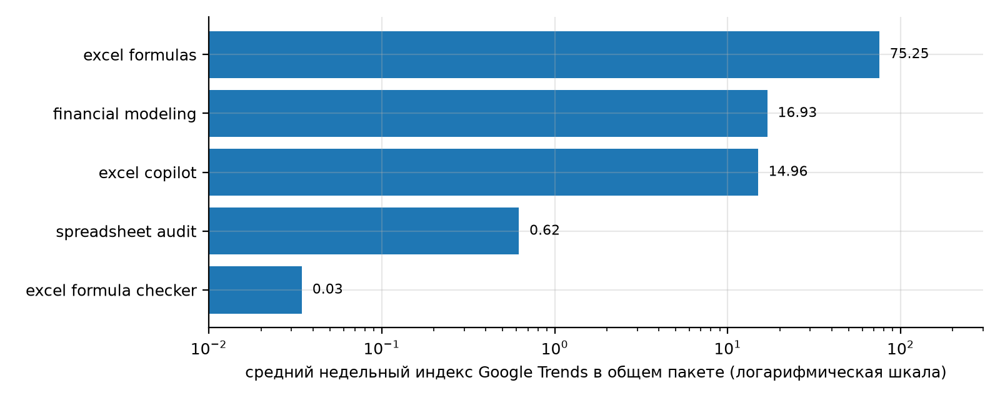
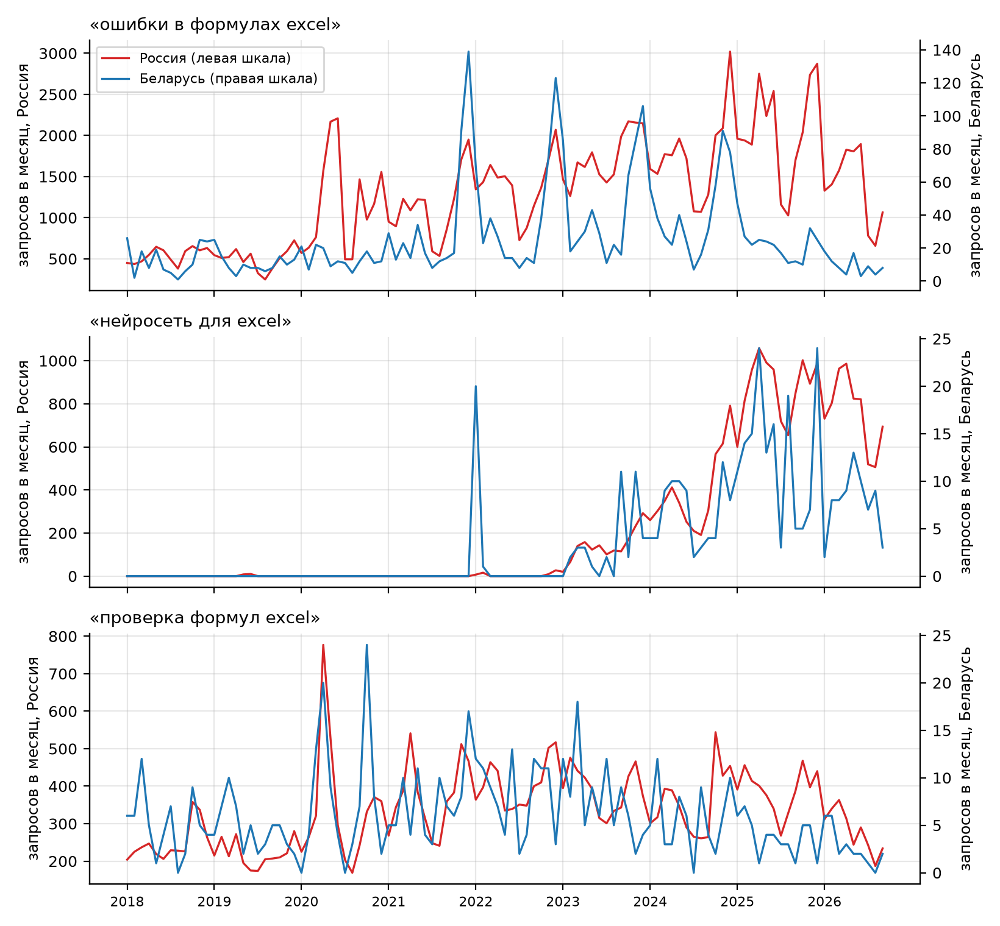
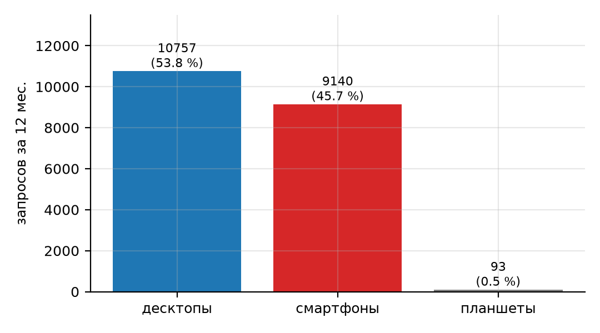
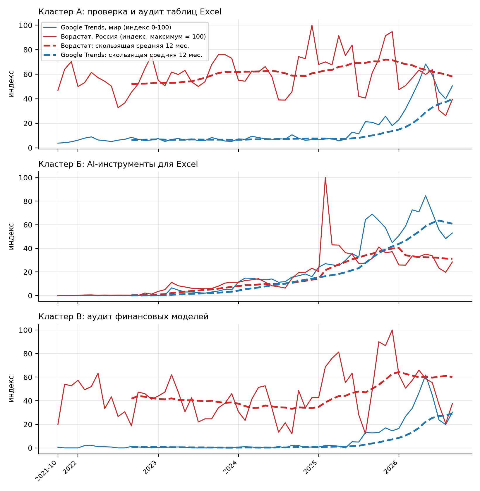
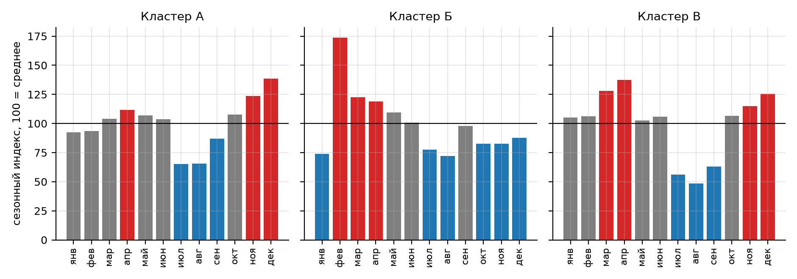
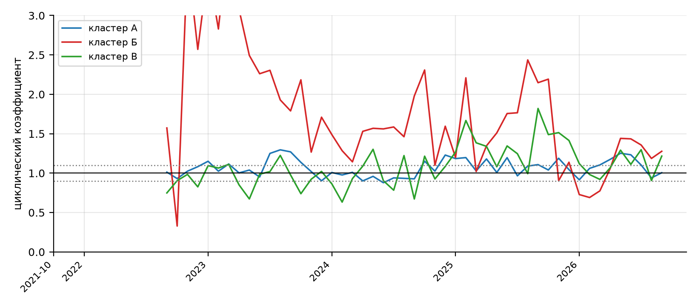

## 1 Цель работы

Цель работы: проверить по данным Google Trends [1] и Яндекс Вордстат [4] наличие и характер поискового интереса аудитории к бизнес-идее проекта TableMind (облачный AI-сервис независимой проверки таблиц Excel), оценить тренд, сезонность и признаки циклических колебаний этого интереса, зафиксировать границы рынка и обосновать территорию дальнейшего анализа.

Для достижения цели решены следующие задачи: сформулирована бизнес-идея как коммерческое предложение и составлен паспорт гипотезы; составлено и очищено семантическое ядро; выгружены и проверены данные Google Trends и Яндекс Вордстат при единых настройках; ряды приведены к месячной периодичности; выполнена оценка тренда, сезонности и деловых циклов по Excel-шаблону и по методике в формате Word; сопоставлены результаты двух инструментов; зафиксированы границы рынка и составлен их паспорт; подготовлена аргументация выбора идеи и территории и сформулирован переход к оценке объема рынка (ЛР2-3).

Все показатели отражают поисковое поведение пользователей и не являются размером рынка или числом клиентов. Исходные факты о проекте (продукт, тарифы, сроки, бюджет) взяты из документа «Концепция проекта TableMind» [7] и собраны в файле фактов проекта репозитория.

## 2 Ход работы

Работа выполнена в порядке, заданном навигатором методики [6]: идея и гипотеза, семантическое ядро, данные двух сервисов, выгрузки, тренд, сезонность и циклы, сопоставление источников, границы рынка, аргументация и переход к следующему этапу.

### 2.1 Бизнес-идея и паспорт гипотезы

Бизнес-идея сформулирована как коммерческое предложение, а не как профессиональная компетенция: проект TableMind продает финансовым специалистам не «знание Excel», а проверенный результат - найденные и доказанные ошибки в таблице, исправления, каждое из которых подтверждено вычислением, и сверку чисел отчета с ячейками таблицы. Паспорт гипотезы заполнен до сбора данных, чтобы не подгонять вывод под полученные показатели (таблица 1).

Таблица 1 – Паспорт бизнес-гипотезы

| Поле | Содержание |
|---|---|
| Название бизнес-идеи | TableMind - облачный AI-сервис независимой проверки (аудита) таблиц Excel |
| Компетенция-основание | построение и проверка финансовых моделей, программная верификация вычислений (принцип «LLM предлагает, движок доказывает») |
| Описание продукта | веб-аудит xlsx-файла (правила и инварианты, объяснения, исправления, сверка текста отчета с ячейками) и надстройка Excel с проверкой при каждой правке; тарифы: Free, разовый аудит 9 EUR, Pro 19 EUR в месяц, Team 29 EUR за место (со следующего релиза) |
| Проблема клиента | скрытые ошибки в формулах и расхождение чисел отчета с таблицей; по оценке ПЗ1 ошибки есть в 86-94 % реальных таблиц, а результат AI-помощников сам требует проверки |
| Целевая аудитория | финансовые аналитики и FP&A малого и среднего бизнеса, консультанты и инвестиционные аналитики, бухгалтеры и аутсорсинговые фирмы, основатели и операционные менеджеры |
| Предполагаемая территория рынка | основная: англоязычные страны и ЕС (онлайн-рынок); контрольная: Беларусь и русскоязычный сегмент |
| Причина выбора территории до анализа | стартовая география проекта в ПЗ1 - англоязычный онлайн и ЕС; доля табличного ПО, приходящаяся на Северную Америку и Европу, около двух третей; оплата и хостинг в ЕС; Беларусь - домашний рынок команды и контрольный сегмент |
| Ключевые запросы для проверки | excel audit, spreadsheet audit, excel formula checker, financial model audit, excel copilot, chatgpt excel; проверка формул excel, ошибки в формулах excel, аудит excel, нейросеть для excel |
| Ожидаемые признаки интереса | устойчивый или растущий индекс по запросам об аудите и проверке таблиц; растущий интерес к AI-инструментам для Excel; коммерческие формулировки (заказать аудит, цена); концентрация в англоязычных странах |
| Ожидаемый результат для клиента | найденные и подтвержденные ошибки до отправки модели или отчета заказчику, инвестору или аудитору, экономия времени ручной проверки |

Паспорт фиксирует гипотезу до обращения к сервисам статистики. Территория и ожидаемые признаки интереса записаны заранее, поэтому дальнейший анализ проверяет заявленные ожидания, а не подбирает их под результат. Нужная для выбора территории проверка выполняется в разделах 2.3, 2.4 и 2.8.

Клиентские задачи и сегменты, из которых выведены формулировки запросов, показаны в таблице 2.

Таблица 2 – Клиентские задачи и сегменты

| Клиентская задача | Ситуация возникновения | Сегмент | Альтернатива клиента |
|---|---|---|---|
| Найти скрытые ошибки в формулах перед отправкой модели | закрытие периода, подготовка бюджета и прогноза | FP&A малого и среднего бизнеса | ручная проверка коллегой, встроенные проверки Excel |
| Убедиться, что числа в тексте отчета совпадают с таблицей | подготовка отчета для руководителя или инвестора | консультанты, инвестиционные аналитики | выборочная сверка вручную |
| Проверить результат, который выдал AI-помощник | работа с Copilot, ChatGPT и другими ассистентами в Excel | аналитики, основатели | доверие результату без проверки, повторный запрос к ассистенту |
| Подготовить модель к внешнему аудиту или due diligence | привлечение финансирования, продажа бизнеса | основатели, консультанты | услуги консалтинговой фирмы по аудиту моделей |
| Проверить таблицы клиентов в массовом порядке | аутсорсинг учета и отчетности | бухгалтеры и аутсорсинговые фирмы | ручной контроль качества силами старшего специалиста |

Клиентские задачи сформулированы языком клиента: «найти ошибку», «проверить результат ассистента», «подготовить к аудиту». Эти формулировки использованы при составлении запросов в разделе 2.2 и при определении продуктовых границ рынка в разделе 2.8.

### 2.2 Семантическое ядро

Семантическое ядро составлено по схеме методики [6]: сформулирована гипотеза, собран стартовый список запросов семи типов, проверены данные в двух сервисах, список очищен от нерелевантных формулировок, запросы сгруппированы по намерению и кластерам. Поскольку основная территория проекта англоязычная, а Яндекс Вордстат отражает только русскоязычную аудиторию Яндекса, ядро состоит из двух частей: английские формулировки проверялись в Google Trends, русские - в Вордстате (и, для контроля, в Google Trends по Беларуси, России и Казахстану).

Стартовый список запросов, сгруппированный по типам намерения, приведен в таблице 3.

Таблица 3 – Карта запросов по типам намерения

| Тип запроса | Назначение | Английские формулировки (Google Trends) | Русские формулировки (Вордстат) |
|---|---|---|---|
| Базовый | общий интерес к направлению | excel formulas, financial modeling, spreadsheet | excel формулы, финансовая модель excel |
| Проблемный | боль клиента | excel errors, excel formula errors, spreadsheet errors, fix excel formula | ошибки в excel, ошибки в формулах excel, проверить excel на ошибки |
| Услуговый и инструментальный | поиск средства проверки | excel formula checker, excel error checker, excel auditing tool, spreadsheet review, financial model review | проверка формул excel, проверка таблиц excel, проверка финансовой модели |
| Коммерческий | готовность заказать услугу | excel audit, spreadsheet audit, financial model audit, excel model audit | аудит excel, аудит финансовой модели, аудит excel заказать |
| AI-альтернативы | замена проверки ассистентом | excel copilot, chatgpt excel, excel ai, claude for excel | нейросеть для excel, excel искусственный интеллект, excel copilot, chatgpt excel |
| Брендовый (конкуренты) | известность независимых инструментов | perfectxl | perfectxl |
| Региональный | привязка к территории | проверялась географией Google Trends (США, Великобритания, Германия, Франция, Нидерланды, Беларусь, Россия, Казахстан) | регион Вордстата: Россия, Беларусь, все регионы |

Карта показывает, что русскоязычная часть ядра покрывает проблемные и инструментальные формулировки, а английская - дополнительно коммерческие и брендовые. Региональный тип проверялся не запросами с названием города, а фильтром территории сервиса, поскольку для онлайн-продукта привязка к городу не имеет смысла.

Перечень формулировок, исключенных из расчета или замененных при очистке ядра, дан в таблице 4.

Таблица 4 – Исключаемые и переопределенные формулировки

| Формулировка | Источник | Причина исключения или замены |
|---|---|---|
| spell checker (связанный запрос к «excel formula checker») | Google Trends | омоним: проверка орфографии, не проверка формул |
| budget spreadsheet, aliexpress spreadsheet, small business accounting spreadsheet (связанные запросы к «spreadsheet audit») | Google Trends | шаблоны и таблицы расходов, не аудит таблиц |
| audit meaning, spreadsheet meaning | Google Trends | учебный интерес к определениям |
| excel проверка данных формулой, проверка данных в таблице excel, excel проверка данных список из таблицы | Вордстат | омоним: встроенная функция Excel «Проверка данных» (Data Validation), а не аудит |
| эксель в ворд, из пдф в эксель, файл эксель, функции эксель (вкладка «Похожие») | Вордстат | смежные операции с файлами, не связаны с проверкой формул |
| perfectxl | Google Trends, Вордстат | запрос не удалось использовать для оценки: значимых данных нет (ненулевых недель 2 из 262, в Вордстате данных нет) |
| excel auditing tool | Google Trends | объем недостаточен: индекс 0 почти во всех неделях (максимум 1) |
| проверка таблиц excel | Вордстат | вкладка «Динамика» не отображает данных по формулировке в обоих регионах; частично заменена формулировкой «проверка таблиц в excel» из топов |

Исключения объясняют, почему часть формулировок не вошла в расчет кластеров. Основная проблема русскоязычного ядра - омонимия с функцией «Проверка данных»: эти фразы нельзя считать спросом на аудит таблиц, и в показателях кластеров они не используются.

Проверенные формулировки ядра с показателями интереса сведены в рабочую таблицу ядра (таблица 5).

Таблица 5 – Рабочая таблица семантического ядра

| № | Запрос (кластер) | Источник, регион | Намерение | Показатель интереса | Вывод |
|---|---|---|---|---|---|
| 1 | excel audit (А) | Google Trends, мир | услуговое | средний индекс 19,0; ненулевых недель 100 %; последние 52 нед. 47,3 против 14,8 | единственный узкий запрос, присутствующий в каждой неделе; рост |
| 2 | spreadsheet audit (А) | Google Trends, мир | услуговое | средний индекс 8,8; ненулевых недель 54 %; 31,7 против 5,3 | рост с 2025 г., объем мал (около 0,8 % от общего интереса к формулам) |
| 3 | excel formula checker (А) | Google Trends, мир | инструментальное | средний индекс 11,5; ненулевых недель 17 % | почти нет объема; топ связанных запросов - spell checker (омоним) |
| 4 | financial model audit (В) | Google Trends, мир | услуговое | средний индекс 6,8; ненулевых недель 46 %; 29,0 против 3,7 | нишевый запрос, выраженный рост за последний год |
| 5 | financial model review (В) | Google Trends, мир | услуговое | индекс в пакете 12,1; 52,5 против 7,2 | самый заметный запрос кластера В; рост |
| 6 | excel copilot (Б) | Google Trends, мир | инструментальное (AI) | средний индекс 21,1; 62,1 против 30,8 | рост интереса к ассистенту платформы |
| 7 | chatgpt excel (Б) | Google Trends, мир | инструментальное (AI) | индекс в пакете 14,8; 26,9 против 25,6 | высокий стабильный интерес |
| 8 | excel ai (Б) | Google Trends, мир | инструментальное (AI) | индекс в пакете 22,6; 64,0 против 28,4 | самый массовый AI-запрос ядра |
| 9 | ошибки в формулах excel (А) | Яндекс Вордстат, Россия (Беларусь: 150) | проблемное | 19 990 запросов за 12 мес.; изменение -18 % | массовый информационный интерес: исправить ошибку самому |
| 10 | проверка формул excel (А) | Яндекс Вордстат, Россия (Беларусь: 35) | инструментальное | 3 832 запросов за 12 мес.; изменение -20 % | часть фраз относится к функции «Проверка данных» |
| 11 | аудит excel (А) | Яндекс Вордстат, Россия (Беларусь: 12) | услуговое | 609 запросов за 12 мес.; изменение +1 % | единичные запросы, стабильно около 50 в месяц |
| 12 | проверить excel на ошибки (А) | Яндекс Вордстат, Россия (Беларусь: 9) | проблемное | 593 запросов за 12 мес.; изменение -15 % | малый объем, снижение |
| 13 | нейросеть для excel (Б) | Яндекс Вордстат, Россия (Беларусь: 105) | инструментальное (AI) | 9 729 запросов за 12 мес.; изменение +2 % | крупнейший AI-запрос, стабилен после пика 2025 г. |
| 14 | excel искусственный интеллект (Б) | Яндекс Вордстат, Россия (Беларусь: 51) | инструментальное (AI) | 2 498 запросов за 12 мес.; изменение +15 % | умеренный рост |
| 15 | excel copilot (Б) | Яндекс Вордстат, Россия (Беларусь: 64) | инструментальное (AI) | 4 403 запросов за 12 мес.; изменение +104 % | рост вдвое за последний год |
| 16 | chatgpt excel (Б) | Яндекс Вордстат, Россия (Беларусь: 60) | инструментальное (AI) | 4 438 запросов за 12 мес.; изменение -56 % | пик в феврале 2025 г. (4 388 запросов за месяц), затем спад |
| 17 | проверка финансовой модели (В) | Яндекс Вордстат, Россия (Беларусь: 5) | услуговое | 1 669 запросов за 12 мес.; изменение +170 % | 1 037 из 1 669 приходятся на 09.2026 (разовый выброс) |
| 18 | аудит финансовой модели (В) | Яндекс Вордстат, Россия (Беларусь: 3) | коммерческое | 426 запросов за 12 мес.; изменение +50 % | нишевый запрос, около 35 в месяц |
| 19 | аудит excel заказать (А) | Яндекс Вордстат, Россия, Беларусь | транзакционное | данных нет в обоих регионах | коммерческая формулировка в поиске не проявлена |

Таблица объединяет проверенные формулировки ядра. По английским запросам показатели Google Trends относительные и сравнимы только внутри одного пакета, по русским - абсолютные числа запросов в Вордстате за последние 12 месяцев (10.2025-09.2026). Главный вывод: интерес к проверке таблиц выражен в основном проблемными запросами «ошибки в формулах», коммерческие формулировки («аудит excel заказать») не проявлены, а запросы об AI-инструментах более массовые, чем запросы об аудите.

Запросы объединены в кластеры, смысл которых и рыночный вывод по каждому показаны в таблице 6.

Таблица 6 – Кластеры запросов и рыночный вывод

| Кластер | Содержание | Запросы кластера | Рыночный вывод |
|---|---|---|---|
| А. Проверка и аудит таблиц Excel | прямой интерес к проверке формул, поиску ошибок и аудиту таблиц | excel audit, spreadsheet audit; проверка формул excel, ошибки в формулах excel, аудит excel, проверить excel на ошибки | есть масса пользователей с проблемой ошибок; спрос выражен как «исправить», а не «заказать проверку»; продукт должен перехватывать проблемные запросы |
| Б. AI-инструменты для Excel | интерес к ассистентам, меняющим привычный способ работы с таблицами | excel copilot, chatgpt excel, excel ai; нейросеть для excel, excel искусственный интеллект, excel copilot, chatgpt excel | массовый и быстро растущий интерес: рынок смещается к AI, что поддерживает тезис ПЗ1 о растущей потребности в независимой проверке результата ассистентов |
| В. Аудит финансовых моделей | профессиональная проверка финансовой модели | financial model audit; проверка финансовой модели, аудит финансовой модели | нишевый, но растущий профессиональный сегмент; объем малый, платежеспособность выше |
| Региональные формулировки | территориальная привязка запросов | не использовались | для онлайн-продукта территория проверяется фильтром сервиса, а не городом в запросе |

Три рабочих кластера выбраны для расчета тренда, сезонности и циклов. Региональные формулировки не включены в ядро, поскольку продукт распространяется онлайн, и распределение интереса по странам оценено отдельно в разделах 2.3 и 2.4.

Уровень интереса по кластерам оценен по пяти критериям рабочей шкалы ядра (таблица 7).

Таблица 7 – Уровень интереса по кластерам (рабочая шкала ядра)

| Критерий | Кластер А | Кластер Б | Кластер В |
|---|---|---|---|
| Частотность | Вордстат: высокая (25 024 запросов за 12 мес.); Google Trends: низкая (доли процента от интереса к формулам) | Вордстат: высокая (21 068 за 12 мес.); Google Trends: средняя | Вордстат: низкая (1 082 за 12 мес., без выброса); Google Trends: низкая |
| Динамика | Google Trends: рост (+296 % за год); Вордстат: снижение (-18 % за год) | Google Trends: рост (+90 %); Вордстат: снижение после пика (-12 %) | Google Trends: рост (+666 %); Вордстат: рост (+20 %) |
| Региональная выраженность | Россия: центр и Москва; Беларусь около 1 % от России (0,7-2,0 % по запросам); по странам Google Trends данных нет | Россия: центр и Москва; Google Trends: Сингапур, Гонконг, Австралия, США, Великобритания | данных по странам почти нет |
| Коммерческое намерение | низкое: «аудит excel» около 50 запросов в месяц, «заказать» не проявлено | низкое: преобладают «бесплатно», «скачать», «как установить» | низкое: единичные услуговые формулировки |
| Согласованность сервисов | противоречие: Google Trends растет, Вордстат снижается | частичная: растут оба по длинному горизонту, за последний год расходятся | согласованная, но на малых объемах |
| Итоговый уровень | умеренный интерес, преимущественно проблемный | высокий и развивающийся интерес | слабый нишевый интерес |

Рабочая шкала ядра [6] применена к трем кластерам. Наибольший объем и рост показывает кластер Б, кластер А имеет объем, но без коммерческих формулировок, кластер В мал. Итог используется при оценке уровня интереса по шкалам сервисов в разделах 2.3 и 2.4 и при аргументации в разделе 2.9.

Составленное семантическое ядро показывает, что интерес аудитории к направлению «проверка таблиц Excel» выражен через три группы поисковых запросов: проблемные запросы об ошибках в формулах, инструментальные запросы об AI-помощниках и нишевые запросы об аудите моделей. Наличие запросов проблемного и инструментального характера при почти полном отсутствии транзакционных позволяет сделать вывод, что аудитория знакомится с темой и ищет способ решить задачу самостоятельно или с помощью ассистента, но готовность заказывать независимую проверку в поиске пока не проявлена. Данные создают основание для перехода к исследованию рынка: оценке объема, конкурентов, цен и каналов привлечения клиентов.

### 2.3 Google Trends

Google Trends используется для оценки относительной динамики интереса и сравнения запросов; индекс нормирован внутри выбранного набора условий и не равен числу запросов [1], [2].

#### 2.3.1 Настройки и протокол

Данные Google Trends выгружены 02.10.2026 со страницы сервиса под учетной записью владельца проекта. Настройки зафиксированы единые для всех пакетов (таблица 8); в каждом пакете сравнивалось не более пяти запросов [2]; правила выгрузки и цитирования данных сервиса описаны в справке [3]. Значения получены из ответов интерфейса сервиса (те же данные, что отображаются на графиках); файлы CSV через кнопку скачивания не сохранялись, источник данных и контрольные суммы рядов приведены в журнале выгрузки (таблица 25).

Таблица 8 – Настройки выгрузки Google Trends

| Параметр | Значение | Обоснование |
|---|---|---|
| Территория | весь мир (основной срез); страны для контроля: США, Великобритания, Германия, Франция, Нидерланды, Беларусь, Россия, Казахстан | территория проекта задана заранее: англоязычные страны и ЕС; контрольные страны добавлены для проверки территориальной гипотезы |
| Период | 5 лет (недельные данные с 26.09.2021) и 12 месяцев | 5 лет нужны для сезонности и тренда, 12 месяцев - для текущего состояния |
| Категория | все категории | категория не уточнялась: узкие запросы не дают данных при сужении; ограничение зафиксировано в чек-листе |
| Тип поиска | веб-поиск Google | основной канал поиска средств проверки таблиц |
| Единица анализа | поисковый запрос (точная фраза) | темы Google могут объединять лишние значения |
| Пакеты | пять английских пакетов по 5 запросов (P1-P5), один русский пакет (R1); одиночные запросы для шести ключевых фраз | нормирование в Google Trends идет внутри пакета, поэтому важные запросы повторены одиночно |
| Дата выгрузки | 02.10.2026 | последняя неделя 27.09-03.10.2026 неполная и исключена из расчетов |

Единые настройки обеспечивают сопоставимость значений внутри пакета. Значения разных пакетов напрямую не сравниваются: в каждом из них максимум нормирован отдельно. Для оценки масштаба использован общий пакет P5, в котором узкие запросы сопоставлены с широким запросом «excel formulas».

#### 2.3.2 Показатели по запросам

Показатели Google Trends по запросам всех пакетов приведены в таблице 9.

Таблица 9 – Показатели Google Trends по запросам пакетов (мир, 5 лет, недельные данные)

| Пакет и запрос | Средний индекс | Максимум | Недель с ненулевым значением | Среднее: последние / предыдущие 52 нед. | Изменение |
|---|---|---|---|---|---|
| P1: excel formula checker | 1,0 | 8 | 17 % | 1,1 / 0,3 | +241 % |
| P1: spreadsheet audit | 8,8 | 100 | 54 % | 31,7 / 5,3 | +499 % |
| P1: excel error checker | 0,1 | 6 | 1 % | 0,1 / 0,0 | н/д (база 0) |
| P1: excel model audit | 2,0 | 28 | 18 % | 9,5 / 0,6 | +1490 % |
| P1: check excel formulas | 8,8 | 25 | 93 % | 11,6 / 8,2 | +42 % |
| P2: excel audit | 9,3 | 49 | 100 % | 23,3 / 7,3 | +220 % |
| P2: financial model audit | 1,7 | 24 | 43 % | 7,0 / 1,0 | +618 % |
| P2: financial model review | 12,1 | 100 | 58 % | 52,5 / 7,2 | +628 % |
| P2: spreadsheet review | 8,3 | 59 | 100 % | 31,2 / 5,4 | +477 % |
| P2: excel auditing tool | 0,0 | 1 | 0 % | 0,0 / 0,0 | н/д (база 0) |
| P3: excel copilot | 5,5 | 26 | 70 % | 16,2 / 7,9 | +105 % |
| P3: chatgpt excel | 14,8 | 38 | 76 % | 26,9 / 25,6 | +5 % |
| P3: excel ai | 22,6 | 100 | 100 % | 64,0 / 28,4 | +125 % |
| P3: perfectxl | 0,0 | 0 | 0 % | 0,0 / 0,0 | н/д (база 0) |
| P3: claude for excel | 1,0 | 9 | 25 % | 4,8 / 0,2 | +1838 % |
| P4: spreadsheet errors | 3,5 | 17 | 64 % | 9,1 / 3,0 | +203 % |
| P4: excel formula errors | 4,1 | 12 | 92 % | 5,0 / 3,7 | +36 % |
| P4: spreadsheet risk | 11,9 | 76 | 90 % | 41,0 / 8,9 | +360 % |
| P4: excel errors | 33,6 | 100 | 100 % | 49,8 / 29,3 | +70 % |
| P4: fix excel formula | 15,0 | 31 | 100 % | 18,5 / 15,0 | +23 % |
| P5: excel formula checker | 0,0 | 1 | 3 % | 0,0 / 0,0 | н/д (база 0) |
| P5: excel formulas | 75,3 | 100 | 100 % | 64,7 / 70,8 | -9 % |
| P5: financial modeling | 16,9 | 76 | 100 % | 44,5 / 16,6 | +168 % |
| P5: spreadsheet audit | 0,6 | 7 | 34 % | 2,4 / 0,4 | +464 % |
| P5: excel copilot | 15,0 | 71 | 71 % | 44,0 / 21,8 | +102 % |

Почти все узкие запросы показывают рост последних 52 недель к предыдущим (в ряде случаев в разы), но от очень низкой базы: средний индекс «excel formula checker» 0,98, «spreadsheet audit» 8,8, «excel error checker» 0,06. Запросы «excel audit», «excel errors», «fix excel formula», «excel ai» и «spreadsheet review» присутствуют в каждой неделе (доля ненулевых недель 100 %), «check excel formulas» - в 93 % недель, поэтому именно они пригодны для оценки динамики. Запрос «perfectxl» данных не дает, то есть бренд ближайшего независимого конкурента практически не ищут.

#### 2.3.3 Масштаб интереса

Масштаб узких запросов относительно общего интереса к формулам Excel показан в таблице 10 и на рисунке 1.

Таблица 10 – Масштаб запросов относительно общего интереса к формулам Excel (пакет P5)

| Запрос | Средний индекс в пакете | Доля от запроса «excel formulas», % | Изменение (52 нед. к предыдущим) |
|---|---|---|---|
| excel formulas | 75,25 | 100,0 | -9 % |
| financial modeling | 16,93 | 22,5 | +168 % |
| excel copilot | 14,96 | 19,9 | +102 % |
| spreadsheet audit | 0,62 | 0,8 | +464 % |
| excel formula checker | 0,03 | 0,0 | н/д |

Общий пакет показывает порядок величин. Интерес к запросу об аудите таблиц составляет около 0,8 % от интереса к формулам Excel, запрос «excel formula checker» - сотые доли процента, тогда как «financial modeling» и «excel copilot» - 20-22 % от базы. Узкая тема проверки таблиц существует, но является нишей внутри массового интереса к работе с Excel и существенно уступает теме AI-помощников.

Рисунок 1 – Масштаб запросов в общем пакете Google Trends (логарифмическая шкала)

На рисунке видно, что разброс между широким запросом «excel formulas» и узкими запросами о проверке достигает двух-трех порядков. По этой причине выводы по узким запросам требуют осторожности и подтверждения вторым источником.

#### 2.3.4 География интереса

Распределение интереса по странам для одиночных запросов приведено в таблице 11.

Таблица 11 – Интерес по странам: одиночные запросы (мир, 5 лет)

| Запрос | Стран с ненулевым индексом | Лидеры (код страны, индекс) |
|---|---|---|
| excel formula checker | 0 | данных по странам нет |
| spreadsheet audit | 1 | SH 100 (единичный всплеск) |
| excel audit | 49 | SH 100, ZW 81, ET 62, SG 62, AE 50, NP 43, KE 43, QA 43, IN 43, GH 37, MY 37, HK 37, ZA 31, UG 31 |
| financial model audit | 8 | SZ 100, SH 17, NZ 11, SG 5, ET 5, KR 5, LB 5, PH 5 |
| excel copilot | 60 | SG 100, HK 64, AU 51, CN 48, DK 41, NL 41, CH 41, NZ 41, JP 41, CA 38, NO 35, GB 35, AE 35, US 35 |
| perfectxl | 1 | MR 100 (единичный всплеск, не отражает спрос) |

По узким запросам территориального распределения почти нет: Google Trends не показывает страны либо показывает единичные всплески. Только «excel audit» и «excel copilot» имеют значимую географию. «Excel audit» сильнее в Сингапуре, ОАЭ, Индии, Малайзии, Гонконге и африканских странах, «excel copilot» - в Сингапуре, Гонконге, Австралии, скандинавских странах, Нидерландах, Швейцарии, Великобритании и США. Это подтверждает английский язык как рабочий, но не указывает на ЕС как отдельный центр интереса.

Структура пакетов запросов по странам показана в таблице 12.

Таблица 12 – Структура пакетов по странам: доля запроса внутри пакета, % (порядок запросов как в пакете)

| Пакет | Страна | Доли запросов пакета, % |
|---|---|---|
| P1: excel formula checker / spreadsheet audit / excel error checker / excel model audit / check excel formulas | США | 12 / 39 / 3 / 7 / 39 |
| P1 | Великобритания | 19 / 40 / 3 / 5 / 33 |
| P1 | Австралия | 14 / 36 / 0 / 4 / 46 |
| P1 | Канада | 14 / 27 / 4 / 5 / 50 |
| P1 | Германия | 11 / 43 / 0 / 13 / 33 |
| P1 | Франция | 11 / 44 / 0 / 19 / 26 |
| P1 | Нидерланды | 10 / 39 / 0 / 10 / 41 |
| P2: excel audit / financial model audit / financial model review / spreadsheet review / excel auditing tool | США | 25 / 6 / 36 / 33 / 0 |
| P2 | Австралия | 31 / 4 / 34 / 31 / 0 |
| P2 | Сингапур | 27 / 5 / 50 / 18 / 0 |
| P3: excel copilot / chatgpt excel / excel ai / perfectxl / claude for excel | США | 14 / 25 / 57 / 0 / 4 |
| P3 | Великобритания | 19 / 31 / 47 / 0 / 3 |
| P3 | Германия | 17 / 41 / 40 / 0 / 2 |

Доли показывают, что в англоязычных странах (США, Великобритания, Австралия, Канада) и в странах ЕС (Германия, Франция, Нидерланды) структура поисковых формулировок схожа: заметную часть занимают «spreadsheet audit», «financial model review», «spreadsheet review» и AI-запросы. Структурное сходство означает, что английские формулировки используются и в ЕС, однако абсолютные объемы по ЕС остаются ниже порога отображения (см. ниже).

Контрольные пакеты по странам подтверждают тонкость данных. За 5 лет в пакете P1 по Великобритании, Германии, Франции и Нидерландам значимые значения встречаются в единичных неделях (суммы недельных индексов 0-224 при 262 неделях), по США данные есть (суммы 57-1795). Для русских запросов (пакет R1) по Беларуси, России и Казахстану значимые значения также единичны, а за последние 12 месяцев по Беларуси данных нет вовсе. Следовательно, Google Trends пригоден для оценки динамики на уровне всего мира и США, но не для сравнения отдельных стран ЕС и тем более Беларуси.

#### 2.3.5 Связанные запросы

Связанные запросы, которые показал сервис, собраны в таблице 13.

Таблица 13 – Связанные запросы Google Trends (мир, 5 лет)

| Запрос | Топ связанных запросов (индекс) | Растущие связанные запросы |
|---|---|---|
| excel formula checker | spell checker (100) | нет данных |
| spreadsheet audit | excel spreadsheet (100); google spreadsheet (65); spreadsheet software (40); budget spreadsheet (26); spreadsheet app (24); audit meaning (22) | create a budget spreadsheet; small business accounting spreadsheet (Breakout); budget spreadsheet (+500 %); how to create a spreadsheet in excel (+400 %) |
| financial model audit | financial model audit checklist (100) | нет данных |
| excel copilot | microsoft excel copilot (100); microsoft copilot (96) | microsoft copilot (Breakout); microsoft excel copilot (+140 %) |
| excel audit; perfectxl | нет данных | нет данных |

Связанные запросы подтверждают, что вокруг «spreadsheet audit» преобладают смежные темы (шаблоны, бюджетные таблицы, общие определения), а не покупка услуги аудита. Единственный осмысленный сигнал около финансовых моделей - «financial model audit checklist», то есть пользователи ищут чек-лист для самостоятельной проверки. Для AI-запросов связанные запросы относятся к продуктам Microsoft.

#### 2.3.6 Уровень интереса по шкалам Google Trends

Уровень интереса определен по двум шкалам Google Trends (таблица 14).

Таблица 14 – Уровень интереса по двум шкалам Google Trends (средний индекс в пакете)

| Запрос | Пакет | Средний индекс | Шкала 1 (методика GT) | Шкала 2 (шаблон аргументации) |
|---|---|---|---|---|
| excel formulas | P5 | 75,3 | высокий (60-100) | высокая выраженность (70-100) |
| excel errors | P4 | 33,6 | средний (30-59) | нишевый (20-39) |
| fix excel formula | P4 | 15,0 | низкий (10-29) | низкий или недостаточно данных (0-19) |
| excel ai | P3 | 22,6 | низкий (10-29) | нишевый (20-39) |
| chatgpt excel | P3 | 14,8 | низкий (10-29) | низкий или недостаточно данных (0-19) |
| financial modeling | P5 | 16,9 | низкий (10-29) | низкий или недостаточно данных (0-19) |
| excel copilot | P5 | 15,0 | низкий (10-29) | низкий или недостаточно данных (0-19) |
| financial model review | P2 | 12,1 | низкий (10-29) | низкий или недостаточно данных (0-19) |
| spreadsheet risk | P4 | 11,9 | низкий (10-29) | низкий или недостаточно данных (0-19) |
| excel audit | P2 | 9,3 | недостаточный (0-9) | низкий или недостаточно данных (0-19) |
| check excel formulas | P1 | 8,8 | недостаточный (0-9) | низкий или недостаточно данных (0-19) |
| spreadsheet audit | P1 | 8,8 | недостаточный (0-9) | низкий или недостаточно данных (0-19) |
| excel formula checker | P1 | 1,0 | недостаточный (0-9) | низкий или недостаточно данных (0-19) |
| perfectxl | P3 | 0,0 | недостаточный (0-9) | низкий или недостаточно данных (0-19) |

Обе шкалы дают согласованный результат: высокий уровень только у широкого запроса «excel formulas». Проблемные запросы («excel errors») находятся на границе среднего уровня, AI-запросы и «financial modeling» - низкий или средний уровень, запросы об аудите и проверке таблиц - низкий или недостаточный. Индексы разных пакетов в строках таблицы нормированы по разным максимумам, поэтому таблица характеризует положение запроса внутри своего пакета, а не точный объем.

#### 2.3.7 Балльная оценка направлений

Направления бизнеса сопоставлены по пяти критериям балльной модели (таблица 15).

Таблица 15 – Балльная оценка направлений по Google Trends (1/3/5)

| Критерий | Д1. Проверка формул, поиск ошибок | Д2. Аудит таблиц | Д3. AI-инструменты для Excel | Д4. Аудит финансовых моделей | Д5. Бренды конкурентов |
|---|---|---|---|---|---|
| Уровень интереса | 3 (индекс 34 и 15) | 1 (индекс 9) | 3 (индекс 15-23) | 1 (индекс 12) | 1 |
| Динамика | 5 (+70 %, +23 %) | 5 (+220 %, +499 %) | 5 (+105 %, +5 %, +125 %) | 5 (+618 %, +628 %) | 1 (данных нет) |
| Коммерческое намерение | 1 (информационные запросы) | 3 (слова audit, review) | 1 (инструментальные) | 3 (услуговые формулировки) | 1 |
| Соответствие компетенции | 3 (клиент ищет, как исправить) | 5 (прямое соответствие) | 3 (смежное направление) | 3 (сегмент клиентов) | 3 |
| Конкурентная реализуемость* | 3 | 3 | 1 (сильные платформы) | 3 | 3 |
| Сумма | 15 | 17 | 13 | 15 | 9 |
| Решение | доработка | приоритет для проверки | контекст рынка | доработка | не использовать |

Направления: Д1 - excel errors, fix excel formula; Д2 - excel audit, spreadsheet audit, spreadsheet review; Д3 - excel copilot, chatgpt excel, excel ai; Д4 - financial model audit, financial model review; Д5 - perfectxl. Шкала методики: 20-25 баллов - приоритетное направление, 14-19 - требует доработки позиционирования, ниже 14 - не запускать без дополнительных подтверждений. Ни одно направление не достигло приоритетного уровня. Наибольшую сумму (17) дает аудит таблиц, при этом коммерческое намерение подтверждено лишь словами audit и review, а не запросами о цене и заказе. *Оценка конкурентной реализуемости предварительная (экспертная): она будет проверена анализом конкурентов в ЛР4 и ЛР5.

#### 2.3.8 Чек-лист настройки и управленческий вывод

Корректность настройки сервиса проверена по чек-листу методики (таблица 16).

Таблица 16 – Чек-лист корректной настройки Google Trends

| Проверка | Да / Нет | Комментарий |
|---|---|---|
| География установлена и зафиксирована | да | мир и контрольные страны; для узких запросов страны не дают данных |
| Период указан и одинаков внутри пакета | да | 5 лет и 12 месяцев |
| Категория выбрана или сознательно оставлена общей | да | все категории; ограничение указано |
| Тип поиска указан | да | веб-поиск Google |
| Запросы разделены по смысловым группам | да | пять пакетов по группам запросов |
| Коммерческие, образовательные и информационные запросы не смешаны в одном выводе | да | проблемные, услуговые и AI-запросы оценены раздельно |
| Данные выгружены и сохранены | частично | данные сохранены из ответов интерфейса с контрольными суммами; файлы CSV кнопкой «Скачать» не сохранялись |
| Связанные запросы и темы зафиксированы | да | связанные запросы шести ключевых фраз; связанные темы не фиксировались |
| Вывод проверен дополнительными источниками | да | Яндекс Вордстат |
| Ограничения метода указаны | да | малые объемы, относительный индекс |

Чек-лист показывает, что настройки сервиса выдержаны, а ограничения относятся к объему данных, а не к методике сбора. Управленческий вывод по Google Trends: интерес к аудиту и проверке таблиц растет, но от очень низкой базы и без выраженной географии; интерес к AI-инструментам для Excel более массовый и растет быстрее. Решение по методике: тестировать и доработать позиционирование, окончательный вывод - только после сопоставления с Вордстатом и анализа конкурентов.

### 2.4 Яндекс Вордстат

Яндекс Вордстат показывает число запросов к Яндексу, их динамику, региональное распределение и реальные формулировки; аудитория сервиса ограничена русскоязычными регионами [4], [5].

#### 2.4.1 Настройки

Данные Яндекс Вордстат получены 02.10.2026 со страницы сервиса под аккаунтом владельца проекта [4]. Вкладка «Динамика» выгружена по месяцам за максимальный доступный период (01.2018-09.2026, 105 месяцев), вкладки «Топы запросов» и «Регионы» показывают скользящее окно последнего месяца (01.09.2026-30.09.2026). Операторы уточнения не применялись: запросы вводились как свободные фразы, поэтому показатели включают словоформы и дополнения; это учтено при очистке (таблица 4).

Настройки выгрузки Яндекс Вордстат сведены в таблицу 17.

Таблица 17 – Настройки выгрузки Яндекс Вордстат

| Параметр | Значение |
|---|---|
| Регионы | Россия (код 225), Беларусь (код 149), «все регионы» |
| Период динамики | 01.2018 - 09.2026, по месяцам |
| Окно «Топов» и «Регионов» | 01.09.2026 - 30.09.2026 (скользящее) |
| Устройства | все (десктопы, смартфоны, планшеты); разбивка снята для одного запроса |
| Операторы | не применялись |
| Показатель | число запросов, содержащих фразу (в том числе словоформы и дополнения) |
| Число запросов ядра | 16 формулировок, из них по 13 есть данные в Беларуси или России |
| Дата выгрузки | 02.10.2026 |

Настройки фиксируются, чтобы не сравнивать между собой широкие и точные запросы как одинаковые показатели [6]. Ограничение метода: Вордстат отражает только аудиторию Яндекса и охватывает русскоязычные регионы, поэтому для основной территории проекта (англоязычные страны и ЕС) он служит контрольным источником.

#### 2.4.2 Топы запросов

Формулировки, которыми аудитория описывает проблему, показаны в таблице 18.

Таблица 18 – Популярные формулировки (вкладка «Топы запросов», Россия, 09.2026)

| Запрос ядра | Формулировки и число запросов | Беларусь |
|---|---|---|
| проверка формул excel | проверка формулы excel 263; excel формула проверки значения 71; excel проверка данных формулой 60; проверка формул в excel на ошибки 11 | проверка формулы excel 2 |
| ошибки в формулах excel | формула ошибки в excel 1 142; ошибка в формуле excel знач 109; сообщение ошибки в формулах excel 93; в формуле обнаружена ошибка excel 88; excel выдает ошибку в формуле 82; как убрать ошибку в формуле в excel 77; как найти ошибку в формуле excel 31 | формула ошибки в excel 10; в формуле обнаружена ошибка excel 3 |
| аудит excel | аудит excel 71 | аудит excel 1 |
| нейросеть для excel | нейросеть для excel 762; нейросеть для excel таблиц 280; нейросеть для работы с excel 230; нейросеть для создания excel 136; лучшие нейросети для excel 83; нейросеть для excel бесплатно 78 | нейросеть для excel 3 |
| excel copilot | copilot в excel 127; microsoft copilot в excel 35; как использовать copilot в excel 13; как включить copilot в excel 10 | copilot в excel 2 |
| chatgpt excel | chatgpt for excel 187; надстройка chatgpt для excel 22; chatgpt for excel скачать 18; chatgpt for excel как установить 11 | chatgpt for excel 2 |
| проверка финансовой модели | проверка финансовой модели 1 114 (разовый выброс месяца) | проверка финансовой модели 3 |
| аудит финансовой модели | аудит финансовой модели 35 | данных нет |

Топы показывают реальный язык аудитории. Спрос на проверку выражается как «ошибка в формуле»: пользователь сталкивается с сообщением об ошибке (#ЗНАЧ!, #ДЕЛ/0!) и ищет способ ее убрать. Формулировки со словом «заказать», «услуги», «цена» в топах отсутствуют. Запросы об AI содержат маркеры выбора («лучшие», «бесплатно», «как установить»), то есть интерес находится на стадии выбора инструмента, но не оплаты.

#### 2.4.3 Динамика и показатели

Показатели динамики запросов в России и Беларуси за последние два года приведены в таблице 19, ряды - на рисунке 2.

Таблица 19 – Показатели динамики Яндекс Вордстат (10.2025-09.2026 к 10.2024-09.2025)

| Запрос | Россия: последние 12 мес. | Россия: предыдущие 12 мес. | Изменение | Максимум (месяц, число) | Беларусь: последние 12 мес. | Доля Беларуси от России |
|---|---|---|---|---|---|---|
| ошибки в excel | 68 970 | 85 988 | -20 % | 2024-12 (9 005) | 807 | 1,2 % |
| ошибки в формулах excel | 19 990 | 24 316 | -18 % | 2024-12 (3 021) | 150 | 0,8 % |
| проверка формул excel | 3 832 | 4 787 | -20 % | 2020-04 (777) | 35 | 0,9 % |
| проверить excel на ошибки | 593 | 697 | -15 % | 2026-04 (88) | 9 | 1,5 % |
| аудит excel | 609 | 603 | +1 % | 2022-04 (80) | 12 | 2,0 % |
| нейросеть для excel | 9 729 | 9 572 | +2 % | 2025-04 (1 058) | 105 | 1,1 % |
| excel искусственный интеллект | 2 498 | 2 172 | +15 % | 2026-05 (380) | 51 | 2,0 % |
| excel copilot | 4 403 | 2 157 | +104 % | 2025-10 (601) | 64 | 1,5 % |
| chatgpt excel | 4 438 | 10 145 | -56 % | 2025-02 (4 388) | 60 | 1,4 % |
| финансовая модель excel | 7 516 | 11 448 | -34 % | 2021-11 (1 475) | 118 | 1,6 % |
| проверка финансовой модели | 1 669 | 618 | +170 % | 2026-09 (1 037) | 5 | 0,3 % |
| аудит финансовой модели | 426 | 284 | +50 % | 2020-10 (80) | 3 | 0,7 % |
| excel формулы | 1 378 711 | 1 862 668 | -26 % | 2022-03 (187 067) | 18 050 | 1,3 % |

Масштаб русскоязычного спроса различается на порядки: «excel формулы» - 1,4 млн запросов за год, «ошибки в excel» - 69 тыс., «ошибки в формулах excel» - 20 тыс., «проверка формул excel» - 3,8 тыс., «аудит excel» - 609. Для большинства запросов последний год слабее предыдущего (от минус 15 до минус 56 %), включая весь базовый интерес к формулам Excel (минус 26 %); растут запросы о Copilot (плюс 104 %), «excel искусственный интеллект» (плюс 15 %) и «аудит финансовой модели» (плюс 50 %), «нейросеть для excel» и «аудит excel» остаются на прежнем уровне (плюс 2 и плюс 1 %), а рост «проверки финансовой модели» вызван разовым выбросом. Доля Беларуси составляет 0,3-2,0 % от России, то есть белорусская аудитория по этим формулировкам пренебрежимо мала.

Рисунок 2 – Динамика запросов в Вордстате: Россия и Беларусь (по месяцам, 2018-2026)

На графике видно, что сезонные пики в России и Беларуси совпадают (декабрь, март-апрель), а белорусский ряд на два порядка ниже и шумнее. «Нейросеть для excel» практически отсутствует до 2023 г. и затем выходит на уровень около 800-1000 запросов в месяц в России.

#### 2.4.4 Региональный срез

Региональный срез за последний месяц представлен в таблице 20.

Таблица 20 – Региональное распределение запросов (вкладка «Регионы», 09.2026)

| Запрос | Россия | Центр (Москва и область) | Поволжье | Сибирь | Беларусь (Минск) |
|---|---|---|---|---|---|
| проверка формул excel | 235 (индекс 107) | 111 (150) / 91 (206) | 35 (85) | 29 (128) | 2 (43) / 2 (145) |
| ошибки в формулах excel | см. динамику: 1 064 | 413 (120) / 326 (159) | 225 (118) | 123 (117) | 5 (37) / 3 (47) |
| нейросеть для excel | 694 (104) | 264 (117) / 206 (153) | 132 (106) | 49 (71) | 3 (21) / не выделен |
| аудит excel | 63 (105) | 22 (107) / 16 (130) | 18 (158) | не в топе | 1 (77) / 1 (260) |

В скобках указан индекс интереса региона (100 - регион не выделяется). Повышенный индекс (выше 100) имеют Москва и область и Центр, а по «аудит excel» - Поволжье и Пермский край (867 при 8 запросах). Это крупнейшие деловые территории России; в Беларуси значения единичны, поэтому индекс интереса по ним статистически не значим.

#### 2.4.5 Устройства

Разбивка проблемного запроса по устройствам приведена в таблице 21 и на рисунке 3.

Таблица 21 – Разбивка по устройствам для запроса «ошибки в формулах excel» (Россия, 10.2025-09.2026)

| Устройство | Запросов за 12 мес. | Доля, % |
|---|---|---|
| Десктопы | 10 757 | 53,8 |
| Смартфоны | 9 140 | 45,7 |
| Планшеты | 93 | 0,5 |
| Итого | 19 990 | 100 |

Для проблемного запроса вклад смартфонов почти равен вкладу компьютеров: человек ищет решение и с телефона (увидел ошибку в файле на ходу). Это учитывается при проектировании: страница с объяснением ошибок и вход в веб-аудит должны корректно работать на мобильных устройствах, тогда как сама работа с файлом остается десктопной. Разбивка снята для одного запроса, по остальным - не снималась.

Рисунок 3 – Структура запросов по устройствам (Россия, «ошибки в формулах excel»)

Рисунок иллюстрирует таблицу устройств: доли десктопов и смартфонов близки, доля планшетов незначительна.

#### 2.4.6 Структура намерений

Намерения, стоящие за запросами, выделены в таблице 22.

Таблица 22 – Структура намерений по выборке фраз из топов (Россия, 09.2026)

| Намерение | Примеры фраз | Число запросов в выборке | Доля выборки, % | Бизнес-ценность |
|---|---|---|---|---|
| Проблемное (исправить ошибку) | формула ошибки в excel; ошибка в формуле excel знач; в формуле обнаружена ошибка; как убрать ошибку в формуле | 1 675 | 36,6 | основа входящего трафика и контента; не равно заказу проверки |
| Инструментальное (проверить формулу или файл) | проверка формулы excel; excel формула проверки значения; проверка формул в excel на ошибки; как проверить excel на ошибки | 394 | 8,6 | прямое соответствие продукту, но малый объем |
| Инструментальное AI | нейросеть для excel; нейросеть для работы с excel; copilot в excel; chatgpt for excel; искусственный интеллект для excel | 2 072 | 45,3 | стадия выбора инструмента; конкурент и источник потребности в проверке |
| Сравнительное | лучшие нейросети для excel | 83 | 1,8 | стадия выбора; нужны доказательства качества |
| Ценовое (бесплатно, скачать) | нейросеть для excel бесплатно; chatgpt for excel скачать | 96 | 2,1 | чувствительность к цене; согласуется с моделью freemium |
| Услуговое (аудит) | аудит excel; аудит финансовой модели | 106 | 2,3 | небольшая профессиональная ниша |
| Транзакционное (заказать) | аудит excel заказать | 0 | 0,0 | формулировка в поиске не проявлена |
| Омоним (функция «Проверка данных») | excel проверка данных формулой; проверка данных в таблице excel; excel проверка данных список из таблицы | 152 | 3,3 | исключается из расчета спроса на аудит |

Классификация выполнена по 4 578 запросам из фраз, которые показал сервис в окне 09.2026 (по строкам таблицы топов, без выбросов). Подсчитан объем выборки, а не всего рынка. Доля проблемных и AI-запросов превышает 80 %, запросы с услуговым намерением составляют около 2 %, а транзакционные отсутствуют. Интерес носит информационный и инструментальный характер, что согласуется с выводами по Google Trends.

#### 2.4.7 Уровень интереса и балльная оценка

Уровень интереса по шести критериям методики оценен в таблице 23.

Таблица 23 – Балльная оценка уровня интереса по Вордстату (0-3)

| Критерий | Кластер А, Россия | Кластер Б, Россия | Кластер В, Россия | Кластер А, Беларусь (контроль) |
|---|---|---|---|---|
| Объем релевантных запросов | 3 (25 024 за 12 мес.) | 3 (21 068) | 2 (1 082, без выброса) | 1 (206) |
| Динамика | 1 (за год -18 %, к первому году +12 %) | 1 (-12 % после пика) | 2 (+20 % при малом объеме) | 0 (-59 %) |
| Коммерческое намерение | 1 (единичные: «аудит excel») | 1 (ценовые фразы, без заказа) | 1 (единичные услуговые) | 0 |
| Региональная пригодность | 3 (Москва, Центр) | 3 (Москва, Центр) | 2 | 1 (около 1 % от России) |
| Сезонность | 3 (пик повторяется в 4 из 4 лет) | 1 (история короче трех лет) | 2 (пик повторяется в 3 из 4 лет) | 2 |
| Разнообразие запросов | 2 (четыре формулировки, один тип намерения) | 3 (широкая карта AI-запросов) | 1 (два узких запроса) | 1 |
| Сумма (из 18) | 13 | 12 | 10 | 5 |
| Интерпретация | рабочая ниша (11-14) | рабочая ниша (11-14) | осторожная проверка (6-10) | слабый интерес (0-5) |
| Уровень интереса (пять уровней) | устойчивый, без коммерческих формулировок | развивающийся | слабый | слабый |

Числовые пороги объема в методике не заданы, поэтому принято допущение: 0 - менее 100 запросов за год, 1 - 100-999, 2 - 1 000-9 999, 3 - 10 000 и более. Остальные критерии оценены по правилам таблицы методики. Оценки показывают: в России интерес рабочий, но без коммерческих формулировок и со снижением объема за последний год; в Беларуси интерес слабый и статистически шумный; кластер В требует проверки на более длинном и крупном ряду.

Результаты по Вордстату сведены в минимальный шаблон анализа (таблица 24).

Таблица 24 – Минимальный шаблон анализа Вордстата

| Блок | Показатель | Источник | Результат | Вывод |
|---|---|---|---|---|
| Спрос | Количество релевантных запросов | Динамика, Топы | 25 024 (кластер А) и 21 068 (кластер Б) за 12 мес. в России | объем есть, но в основном проблемные и AI-запросы |
| Динамика | Рост, спад, сезонность | Динамика | спад за последний год (-12...-18 %) при повторяющейся сезонности | интерес снижается, возможно из-за перехода части поиска к AI-ассистентам |
| Регион | Число запросов, доля, индекс | Регионы | Центр и Москва выше 100 %, Беларусь около 1 % от России | территория Вордстата не совпадает с территорией проекта |
| Коммерческое намерение | Запросы цена, заказать, услуги | Топы | не проявлено | рынок услуг аудита в поиске не сформирован |
| Информационный интерес | Запросы как, что такое | Топы | основная часть | контент и SEO как канал привлечения |
| Устройства | Доля смартфонов и десктопов | Фильтр устройств | 54 % и 46 % для проблемного запроса | мобильная версия страниц обязательна |
| Решение | Уровень интереса и действие | Сводная оценка | устойчивый информационный интерес, коммерческий слабый | проверять платежеспособный спрос в ЛР2-3 |

Минимальный шаблон сводит результаты Вордстата в одну таблицу для сопоставления с Google Trends. Итоговая формулировка по Вордстату: в России наблюдается умеренный поисковый интерес к теме проверки таблиц Excel, наиболее выражены запросы группы «ошибки в формулах», что указывает на проблемный информационный характер интереса; динамика за год показывает снижение при повторяющейся сезонности; региональный анализ выявляет повышенный интерес в Москве и Центральном округе. Для бизнеса это означает целесообразность подготовки контента под проблемные запросы и тестовой рекламы, но не крупного запуска только по данным поиска.

### 2.5 Выгрузки и контроль качества

Каждая выгрузка записана в журнал с параметрами выборки (таблица 25). Минимальный набор из пяти выгрузок по методике [6] выполнен: динамика Google Trends, регионы Google Trends, динамика Вордстата, топы Вордстата, регионы Вордстата (таблица 26).

Таблица 25 – Журнал выгрузки данных (все выгрузки выполнены 02.10.2026)

| № | Сервис | Запросы | Территория и период | Файл (папка Материалы_собранные) | Назначение |
|---|---|---|---|---|---|
| 1 | Google Trends | P1: excel formula checker; spreadsheet audit; excel error checker; excel model audit; check excel formulas | мир, 5 лет, недели | GT/W_P1_5y.txt | динамика, география |
| 2 | Google Trends | P2: excel audit; financial model audit; financial model review; spreadsheet review; excel auditing tool | мир, 5 лет | GT/W_P2_5y.txt | динамика, география |
| 3 | Google Trends | P3: excel copilot; chatgpt excel; excel ai; perfectxl; claude for excel | мир, 5 лет | GT/W_P3_5y.txt | AI-запросы |
| 4 | Google Trends | P4: spreadsheet errors; excel formula errors; spreadsheet risk; excel errors; fix excel formula | мир, 5 лет | GT/W_P4_5y.txt | проблемные запросы |
| 5 | Google Trends | P5: excel formula checker; excel formulas; financial modeling; spreadsheet audit; excel copilot | мир, 5 лет | GT/W_P5_5y.txt | масштаб |
| 6 | Google Trends | P1 (англ.) по странам US, GB, DE, FR, NL | 5 лет | GT/US_P1_5y.txt и др. | территория |
| 7 | Google Trends | R1: проверка формул excel; ошибки в формулах excel; аудит excel; нейросеть для excel; excel искусственный интеллект | BY, RU, KZ, 5 лет и 12 мес. | GT/BY_R1_5y.txt и др. | контрольные страны |
| 8 | Google Trends | одиночные ряды шести ключевых запросов | мир, 5 лет | GT/S_*_5y.txt | динамика отдельных запросов |
| 9 | Google Trends | P1 и P3 за 12 месяцев | мир, 12 мес. | GT/W_P1_12m.txt, W_P3_12m.txt | текущий период |
| 10 | Google Trends | география и связанные запросы шести запросов | мир, 5 лет | GT/GT_география_и_связанные_запросы_2026-10-02.md | география, связанные запросы |
| 11 | Яндекс Вордстат | 16 запросов, вкладка «Динамика» | Россия, Беларусь, 01.2018-09.2026, по месяцам | Wordstat/YW_динамика_месяцы_2018-01_2026-09.csv и .json | динамика, сезонность |
| 12 | Яндекс Вордстат | 16 запросов, вкладки «Топы» и «Регионы» | Россия, Беларусь, окно 09.2026 | Wordstat/YW_топы_и_регионы_2026-10-02.md | формулировки, регионы |
| 13 | Яндекс Вордстат | ошибки в формулах excel, разбивка по устройствам | Россия, 10.2025-09.2026 | (в отчете, таблица устройств) | устройства |

Журнал позволяет воспроизвести выгрузки. Файлы Google Trends хранятся в сжатом текстовом виде (кодировка base62 и сжатие серий нулей), читаются декодером из папки Python; для каждого ряда записана контрольная сумма, совпадение которой после переноса проверено. Данные Вордстата сохранены в CSV и JSON с контрольными суммами рядов.

Таблица 26 – Минимальный набор выгрузок

| № | Сервис и запрос | Настройки | Что получено | Цель |
|---|---|---|---|---|
| 1 | Google Trends: пакеты P1-P5 | мир, 5 лет | интерес во времени | долгосрочная динамика |
| 2 | Google Trends: excel audit, excel copilot и др. | мир, 5 лет | интерес по странам | территориальная концентрация |
| 3 | Яндекс Вордстат: 13 запросов | Россия и Беларусь, все устройства | динамика по месяцам | сезонность и устойчивость |
| 4 | Яндекс Вордстат: те же запросы | Россия и Беларусь, 09.2026 | топы запросов | реальные формулировки |
| 5 | Яндекс Вордстат: четыре запроса | все регионы, 09.2026 | регионы | география |

Минимальный набор выполнен полностью. Дополнительно сняты связанные запросы Google Trends и разбивка по устройствам.

Качество выгрузки проверено по контрольным вопросам методики (таблица 27).

Таблица 27 – Контроль качества выгрузки

| Контрольный вопрос | Да / нет | Комментарий |
|---|---|---|
| Зафиксированы дата выгрузки, запрос, территория, период и источник | да | журнал выгрузки |
| Скачаны отдельные файлы для динамики, регионов и связанных запросов | частично | данные получены и сохранены отдельными файлами; кнопка «Скачать» не использовалась |
| Исходные файлы сохранены без ручного редактирования | да | контрольные суммы совпадают с данными сервисов |
| Проверена кодировка | да | UTF-8 |
| Разделены информационные и коммерческие запросы | да | таблица намерений |
| Не сравниваются данные с разными настройками | да | пакеты Google Trends не сравниваются между собой |
| Проверены региональные показатели в двух источниках | частично | Google Trends по узким запросам не дает стран; Вордстат - только Россия и Беларусь |
| Есть пояснение ограничений каждого сервиса | да | разделы 2.3 и 2.4 |
| Подготовлены диаграммы динамики и регионов | да | рисунки 1-6 |
| Итоговый вывод опирается на таблицы | да | раздел 2.9 |

Контроль качества показал два ограничения: данные получены не через кнопку скачивания сервисов и региональная проверка по двум источникам неполная. Оба ограничения вынесены в приложение Б.

### 2.6 Тренд, сезонность и деловые циклы

Оценка устойчивой динамики, сезонности и циклов выполняется по месячным рядам: для кластеров запросов определяются тренд, повторяющиеся месячные пики и отклонения от трендово-сезонного уровня.

#### 2.6.1 Подготовка рядов

Для оценки динамики недельные ряды Google Trends приведены к месячным, ряды Вордстата сведены в кластеры. Работа выполнена двумя способами: по Excel-шаблону «тренд, сезонность, деловые циклы» [6] (заполненные рабочие копии лежат в папке Excel) и по расчетной методике в формате Word. Правила подготовки и принятые допущения приведены в таблице 28.

Таблица 28 – Правила подготовки рядов и допущения

| Операция | Правило | Допущение или ограничение |
|---|---|---|
| Недели в месяцы | значение месяца - простое среднее недель, начало которых приходится на этот месяц | неделя на стыке месяцев относится к месяцу начала |
| Неполные периоды | исключены первый месяц ряда (ряд начинается 26.09.2021) и последняя неполная неделя | ряд для расчета: 10.2021-09.2026, 60 месяцев (предел шаблона) |
| Кластер Google Trends | кластер А - среднее индексов «excel audit» и «spreadsheet audit»; кластер Б - индекс «excel copilot»; кластер В - индекс «financial model audit» | индексы одиночных запросов нормированы каждый по своему максимуму; кластер усреднен без весов |
| Кластер Вордстата | сумма запросов кластера по месяцам, Россия: А - проверка формул excel, ошибки в формулах excel, аудит excel, проверить excel на ошибки; Б - нейросеть для excel, excel искусственный интеллект, excel copilot, chatgpt excel; В - проверка финансовой модели, аудит финансовой модели | фразы запросов частично пересекаются по словоформам, суммирование может давать небольшое двойное счета |
| Нормирование Вордстата | значение месяца / максимум ряда x 100 (формула шаблона) | максимум определяется выбросами, поэтому выбросы обработаны заранее |
| Разовые выбросы | значение, превышающее втрое второе по величине значение ряда, заменяется средним трех предыдущих месяцев; применено один раз: кластер В, 09.2026 (1 069 запросов заменены на 56) | исходное значение сохранено в журнале выгрузки; всплеск в феврале 2025 г. по «chatgpt excel» (4 388) выбросом не признан (менее чем втрое выше следующего значения кластера Б) и оставлен как событие |
| Территории рядов | Google Trends - весь мир, Вордстат - Россия | территории рядов различаются; для проверки построены варианты «только Google Trends» и «только Вордстат» |
| Веса сводного индекса | 0,5 и 0,5 (значение шаблона по умолчанию) | вес не обоснован отдельно; влияние проверено вариантами с одним источником |

Таблица фиксирует, какие преобразования выполнены над исходными рядами. Основное ограничение: ряды двух сервисов относятся к разным территориям, поэтому сводный индекс интерпретируется как индекс интереса двух аудиторий (мировой англоязычной и русскоязычной Яндекса), а не как единая территория рынка.

#### 2.6.2 Расчет по Excel-шаблону

Результаты расчета по рабочим копиям Excel-шаблона сведены в таблицу 29.

Таблица 29 – Результаты расчета по Excel-шаблону (листы «Панель», «Оценка_тренда», «Сезонность», «Деловые_циклы»)

| Показатель | А, оба источника | А, только Google Trends | А, только Вордстат | Б, оба источника | В, оба источника |
|---|---|---|---|---|---|
| Месяцев в ряду | 60 | 60 | 60 | 60 | 60 |
| Среднее, первые 12 мес. | 29,0 | 6,2 | 51,8 | 0,1 | 21,3 |
| Среднее, последние 12 мес. | 48,9 | 39,8 | 58,1 | 46,0 | 44,6 |
| Изменение | +69 % | +539 % | +12 % | рост от нулевой базы (первые 12 мес. 0,1) | +110 % |
| Тренд | растущий тренд | растущий тренд | стабильный тренд | растущий тренд | растущий тренд |
| Наклон за месяц | 0,35 | 0,61 | 0,10 | 1,00 | 0,39 |
| Сезонность | выраженная сезонность, амплитуда 0,55 | выраженная сезонность, амплитуда 0,40 | выраженная сезонность, амплитуда 0,74 | выраженная сезонность, амплитуда 1,03 | выраженная сезонность, амплитуда 0,87 |
| Максимум / минимум | декабрь / июль | сентябрь / декабрь | декабрь / август | март / июль | апрель / август |
| Текущий коэффициент | 1,01 | 1,07 | 0,79 | 1,28 | 1,22 |
| Фаза | норма | норма | ниже тренда | выше тренда | выше тренда |

Сводный индекс кластеров А, Б и В классифицирован как растущий; по кластеру А тренд определяется Google Trends (плюс 539 % при росте с очень низкого уровня), тогда как по Вордстату тренд стабильный (плюс 12 % к первому году). Сезонность во всех книгах выраженная (амплитуда выше порога 0,30). Текущий месяц (09.2026) по кластеру А находится в норме при обоих источниках (коэффициент 1,01) и ниже тренда по одному Вордстату (0,79); по кластерам Б и В - выше тренда, но для кластера В это следствие малых значений ряда.

Сезонные индексы по месяцам из листа «Сезонность» приведены в таблице 30 и на рисунке 5.

Таблица 30 – Сезонные индексы по месяцам (лист «Сезонность», 1,00 - средний уровень)

| Месяц | Кластер А (оба) | А: только Google Trends | А: только Вордстат | Кластер Б | Кластер В |
|---|---|---|---|---|---|
| январь | 0,91 | 0,92 | 0,92 | 1,25 | 0,96 |
| февраль | 0,91 | 0,92 | 0,92 | 1,52 | 1,07 |
| март | 1,03 | 1,12 | 1,02 | 1,64 | 1,33 |
| апрель | 1,12 | 1,08 | 1,11 | 1,13 | 1,37 |
| май | 1,10 | 1,06 | 1,07 | 0,91 | 1,13 |
| июнь | 1,05 | 1,09 | 1,03 | 0,77 | 1,06 |
| июль | 0,72 | 0,92 | 0,66 | 0,61 | 0,53 |
| август | 0,72 | 1,05 | 0,65 | 0,61 | 0,50 |
| сентябрь | 0,92 | 1,18 | 0,87 | 0,69 | 0,63 |
| октябрь | 1,08 | 0,97 | 1,13 | 0,65 | 1,19 |
| ноябрь | 1,17 | 0,91 | 1,24 | 1,33 | 1,07 |
| декабрь | 1,27 | 0,79 | 1,39 | 0,88 | 1,16 |

Сезонность по Вордстату (Россия) однозначна: максимум в октябре-декабре (индекс 1,13-1,39), второй подъем в апреле-мае (1,07-1,11), глубокий спад в июле-августе (0,65-0,66), сентябрь переходный (0,87). Сезонные индексы по Google Trends для кластера А другие (максимум в сентябре-марте, минимум в ноябре-декабре), но ряд Google Trends имеет рост на последнем году, который искажает оценку сезонности. Для кластера Б сезонные индексы ненадежны: история ряда короче трех лет, интерес начался в 2023 г. [6].

Динамика кластеров и скользящие средние показаны на рисунке 4.

Рисунок 4 – Динамика кластеров: Google Trends (мир) и Вордстат (Россия), месячные ряды 10.2021-09.2026

На рисунке показаны месячные значения и скользящая средняя за 12 месяцев. В кластере А интерес Google Trends вырос с 7 до 40-68 пунктов за последние полтора года, а скользящая средняя Вордстата росла до конца 2025 г. и затем снижается. В кластере Б обе средние растут до 2025 г., после чего Вордстат снижается, а Google Trends продолжает рост. Разовый всплеск «chatgpt excel» в феврале 2025 г. виден в кластере Б.

Рисунок 5 – Сезонные индексы кластеров по Вордстату (Россия), 100 - среднее значение

Красные столбцы отмечают месяцы с индексом 110 и выше, синие - ниже 90. Для кластеров А и В хорошо видно двойной подъем (осень и весна) и летний спад, который соответствует календарю деловой отчетности и учебного года; причинная связь с календарем является гипотезой и данными поиска не доказывается.

Отклонения от трендово-сезонного уровня показаны на рисунке 6.

Рисунок 6 – Циклический коэффициент кластеров по Excel-шаблону (отклонение от тренда с учетом сезонности)

Коэффициент ниже 0,9 означает спрос ниже трендового уровня, выше 1,1 - выше. Кластер А колеблется в узком коридоре 0,88-1,30, кластеры Б и В имеют большие отклонения из-за малой базы начала ряда и выбросов. Коэффициент, рассчитанный по шаблону, использует трейлинговую среднюю за 12 месяцев, поэтому в растущих рядах он систематически выше 1.

#### 2.6.3 Расчет по методике в формате Word

Устойчивая динамика оценена по рабочей таблице методики (таблица 31).

Таблица 31 – Рабочая таблица оценки устойчивой динамики (среднемесячное значение)

| Кластер | Источник | Среднее предыдущих 12 мес. | Среднее последних 12 мес. | Изменение | Доля месяцев роста | Тип динамики |
|---|---|---|---|---|---|---|
| кластер А | Google Trends, мир | 10,0 | 39,8 | +296 % | 54 % | рост |
| кластер А | Вордстат, Россия | 2 533,6 | 2 085,3 | -18 % | 54 % | снижение |
| кластер А | Вордстат, Беларусь | 42,1 | 17,2 | -59 % | 46 % | снижение |
| кластер Б | Google Trends, мир | 32,0 | 60,9 | +90 % | 41 % | рост |
| кластер Б | Вордстат, Россия | 2 003,8 | 1 755,7 | -12 % | 47 % | стабильность |
| кластер Б | Вордстат, Беларусь | 34,0 | 23,3 | -31 % | 41 % | снижение |
| кластер В | Google Trends, мир | 3,8 | 29,0 | +666 % | 42 % | рост |
| кластер В | Вордстат, Россия | 75,2 | 90,2 | +20 % | 53 % | рост |
| кластер В | Вордстат, Беларусь | 0,8 | 0,7 | -20 % | 25 % | снижение |

Сравнение последнего года с предыдущим дает иную картину, чем сравнение с первым годом: по Google Trends интерес растет (в кластере А почти в четыре раза, в кластере В в семь-восемь раз), по Вордстату в России в кластерах А и Б снижается на 12-18 % (для кластера Б это в пределах порога стабильности ±15 %, поэтому в таблице 31 он отмечен как стабильность), в Беларуси снижается на 20-59 %. Доля месяцев роста составляет 25-54 %, то есть монотонного тренда нет: рост идет скачками, а в кластерах Вордстата преобладают месяцы снижения.

Скользящие средние на конец ряда приведены в таблице 32.

Таблица 32 – Скользящие средние на 09.2026

| Кластер | Источник | Средняя за 3 мес. | Средняя за 12 мес. | Максимум средней за 12 мес. | Текущая 12-мес. средняя к максимуму |
|---|---|---|---|---|---|
| кластер А | Google Trends | 45,4 | 39,8 | 39,8 | 100 % |
| кластер А | Вордстат, Россия | 1 152,7 | 2 085,3 | 2 583,8 | 81 % |
| кластер Б | Google Trends | 52,3 | 60,9 | 63,6 | 96 % |
| кластер Б | Вордстат, Россия | 1 344,3 | 1 755,7 | 2 277,2 | 77 % |
| кластер В | Google Trends | 24,6 | 29,0 | 29,0 | 100 % |
| кластер В | Вордстат, Россия | 47,4 | 90,2 | 96,5 | 93 % |

Скользящая средняя за 3 месяца выше средней за 12 месяцев только в кластере А по Google Trends (45,4 против 39,8): краткосрочно интерес растет. В кластерах Б и В по Google Trends она ниже годовой (после пика весны 2026 г.), а по Вордстату во всех кластерах ниже годовой, в том числе из-за летнего сезонного спада, поэтому сопоставление с учетом сезонности выполнено в таблице фаз.

Показатели сезонности по методике Word приведены в таблице 33.

Таблица 33 – Показатели сезонности (метод Word, сезонный индекс = среднее месяца / среднее всех месяцев x 100)

| Кластер | Источник | Месяц пика | Месяц минимума | Амплитуда, пункты | Повторяемость пика: лет из 4 (2022-2025), когда месяц пика входит в тройку лучших месяцев года | Решение для бизнеса |
|---|---|---|---|---|---|---|
| кластер А | Google Trends | сентябрь | декабрь | 82 | 4 из 4 | запуск продвижения за 1-3 мес. до сентября |
| кластер А | Вордстат, Россия | декабрь | июль | 73 | 4 из 4 | запуск продвижения за 1-3 мес. до декабря |
| кластер А | Вордстат, Беларусь | декабрь | июль | 206 | 3 из 4 | запуск продвижения за 1-3 мес. до декабря |
| кластер Б | Google Trends | сентябрь | декабрь | 71 | 1 из 4 | ряд короче трех лет, вывод не делается |
| кластер Б | Вордстат, Россия | февраль | август | 102 | 1 из 4 | повторяемость пика не подтверждена |
| кластер Б | Вордстат, Беларусь | февраль | октябрь | 118 | 1 из 4 | повторяемость пика не подтверждена |
| кластер В | Google Trends | май | декабрь | 141 | 1 из 4 | повторяемость пика не подтверждена |
| кластер В | Вордстат, Россия | апрель | август | 89 | 3 из 4 | запуск продвижения за 1-3 мес. до апреля |
| кластер В | Вордстат, Беларусь | апрель | июль | 234 | 1 из 4 | повторяемость пика не подтверждена |

Сезонность подтверждается только там, где пик повторяется несколько лет подряд [6]. По Вордстату в России для кластера А пик (декабрь) повторяется в четырех годах из четырех, минимум приходится на июль, кластер В показывает пик в апреле с повторением в трех годах. Для Google Trends по кластеру А сентябрь входит в тройку лучших месяцев во всех четырех годах, но абсолютный максимум ряда сместился на 2025-2026 гг. из-за роста (ноябрь 2025, май 2026), а по кластерам Б и В пики не повторяются; поэтому сезонное планирование строится по Вордстату, а сентябрьский подъем Google Trends используется как дополнительный сигнал.

Сезонный профиль основного кластера представлен в таблице 34.

Таблица 34 – Рабочая таблица сезонности: кластер А, Вордстат, Россия (среднемесячное число запросов за 5 лет)

| Месяц | Среднее значение | Сезонный индекс | Оценка месяца | Решение для бизнеса |
|---|---|---|---|---|
| Январь | 1 979 | 92 | умеренный спрос | поддерживать присутствие, собирать аудиторию |
| Февраль | 2 002 | 93 | умеренный спрос | поддерживать присутствие, собирать аудиторию |
| Март | 2 230 | 104 | средний уровень | базовый период для сравнения |
| Апрель | 2 396 | 112 | повышенный интерес | усиливать продажи, публиковать коммерческие предложения |
| Май | 2 288 | 107 | повышенный интерес | усиливать продажи, публиковать коммерческие предложения |
| Июнь | 2 224 | 104 | средний уровень | базовый период для сравнения |
| Июль | 1 395 | 65 | низкий сезон | сокращать рекламный бюджет, вести подготовительные коммуникации |
| Август | 1 409 | 66 | низкий сезон | сокращать рекламный бюджет, вести подготовительные коммуникации |
| Сентябрь | 1 862 | 87 | умеренный спрос | поддерживать присутствие, собирать аудиторию |
| Октябрь | 2 309 | 108 | повышенный интерес | усиливать продажи, публиковать коммерческие предложения |
| Ноябрь | 2 647 | 124 | пик сезона | заранее готовить рекламу, посадочные страницы и поддержку |
| Декабрь | 2 969 | 139 | пик сезона | заранее готовить рекламу, посадочные страницы и поддержку |

Сезонный профиль кластера А выражен: пик сезона (индекс выше 120) - ноябрь, декабрь; повышенный интерес (105-120) - апрель, май, октябрь; средний уровень - март, июнь; умеренный спрос (80-95) - январь, февраль, сентябрь; низкий сезон (ниже 80) - июль, август. Следовательно, запуск продвижения, тестовой рекламы и публикации контента целесообразно начинать за один-три месяца до осеннего подъема, то есть в августе-сентябре, а июль-август использовать для разработки продукта.

Фаза цикла определена по сглаженному и сезонно очищенному ряду (таблица 35).

Таблица 35 – Фаза цикла по 12-месячной средней сезонно очищенного ряда

| Кластер | Источник | Изменение средней за 6 мес. | Изменение средней за 12 мес. | Средняя к максимуму | Фаза |
|---|---|---|---|---|---|
| кластер А | Google Trends | +70,6 % | +283,1 % | 100 % | рост |
| кластер А | Вордстат, Россия | -15,4 % | -19,8 % | 79 % | спад |
| кластер А | Вордстат, Беларусь | -38,8 % | -57,1 % | 32 % | спад |
| кластер Б | Google Trends | +18,2 % | +102,6 % | 97 % | рост |
| кластер Б | Вордстат, Россия | -7,0 % | -2,5 % | 83 % | спад |
| кластер Б | Вордстат, Беларусь | -16,5 % | -25,1 % | 72 % | спад |
| кластер В | Google Trends | +62,1 % | +661,9 % | 100 % | рост |
| кластер В | Вордстат, Россия | +0,0 % | +19,6 % | 96 % | пик |
| кластер В | Вордстат, Беларусь | +62,7 % | -14,2 % | 57 % | восстановление |

Фаза определена по рабочему правилу (допущение): рост - средняя за 12 месяцев выросла за полгода и за год более чем на 5 %; пик - средняя составляет не менее 95 % максимума и не растет; спад - снизилась за полгода более чем на 5 %; замедление и восстановление - промежуточные состояния. По результатам: Google Trends (мир): кластеры A - рост, B - рост, C - рост; Вордстат (Россия): A - спад, B - спад, C - пик; Вордстат (Беларусь): A - спад, B - спад, C - восстановление. Поисковые данные указывают на признаки циклического изменения интереса; деловой цикл рынка такими данными не доказывается и требует подтверждения внешними показателями [6].

#### 2.6.4 Сверка Python и Excel, особенности шаблона

Результаты независимого расчета на Python сверены с результатами Excel (таблица 36).

Таблица 36 – Сверка независимого расчета на Python с результатами Excel

| Книга | Макс. расхождение сводного индекса | Макс. расхождение циклического коэффициента | Макс. расхождение сезонных индексов | Расхождение изменения | Метки (тренд, сезонность, фаза) совпали |
|---|---|---|---|---|---|
| A_проверка_таблиц | 0,0025 | 0,0001 | 0,00004 | 0,00003 | да |
| A_только_GT | 0,0050 | 0,0009 | 0,00024 | 0,00122 | да |
| A_только_YW | 0,0000 | 0,0000 | 0,00000 | 0,00000 | да |
| B_AI_для_Excel | 0,0000 | 0,0000 | 0,00000 | 0,00000 | да |
| C_финмодели | 0,0028 | 0,0001 | 0,00001 | 0,00001 | да |

Расчет шаблона повторен на Python по тем же формулам. Максимальные расхождения не превышают 0,005 пункта индекса и объясняются округлением входных значений до двух знаков при вводе в Excel, классификации тренда, силы сезонности, месяцев максимума и минимума и фазы совпали во всех пяти книгах.

Особенности шаблона, учтенные при расчете: максимум нормирования Вордстата определяется по всему ряду, поэтому единичные выбросы сжимают остальные значения (выброс кластера В заменен заранее); тренд в листе «Расчет» - трейлинговая средняя за 12 месяцев, которая отстает от ряда и в растущем ряду дает коэффициент выше 1; сезонные индексы рассчитываются только по месяцам с положительным отношением к тренду, поэтому при нулевых значениях в начале ряда (кластер Б) они определяются меньшим числом лет; шаблон рассчитан на 60 месяцев. Исходные файлы шаблона не изменялись; рабочие копии сохранены в папке Excel.

Итоговые выводы по расчету. Тренд: по Google Trends интерес к темам проверки таблиц, аудита моделей и AI-инструментов для Excel растет, по Вордстату в России он за последний год снижается (кластеры А и Б), поэтому однозначный вывод о росте интереса сделать нельзя. Сезонность: по Вордстату выражена и повторяется (пик в ноябре-декабре, подъем в марте-апреле, спад в июне-августе), по Google Trends не подтверждена из-за роста ряда. Циклы: поисковые данные указывают на фазу роста в мировом англоязычном поиске и на фазу спада после пика в русскоязычном поиске (кластеры А и Б), кластер В в русскоязычном поиске находится вблизи максимума при малых объемах; вывод о деловом цикле рынка требует внешних данных (продажи, рекламные бюджеты, отраслевая статистика) и будет проверен в ЛР2-3.

### 2.7 Сопоставление Google Trends и Яндекс Вордстат

Сопоставление выполнено по смыслу, а не сложением показателей: сервисы имеют разную методику и разные территории [6]. Для каждого кластера сравнивались направление динамики, уровень, коммерческий характер и территориальная выраженность (таблица 37).

Таблица 37 – Сопоставление источников по кластерам

| Критерий | Кластер А | Кластер Б | Кластер В |
|---|---|---|---|
| Сигнал Google Trends | рост (+296 % за год), низкая база | рост (+90 %), средняя база | рост (+666 %), очень низкая база |
| Сигнал Вордстата (Россия) | снижение (-18 %), заметный объем | умеренное снижение (-12 %, в пределах порога стабильности ±15 %) после пика 2025 г. | рост (+20 %) на малом объеме |
| Корреляция месячных рядов | -0,17 (скользящие средние: 0,18) | 0,68 (0,88) | 0,26 (0,79) |
| Устойчивость | в Вордстате устойчивый сезонный ряд, в Google Trends рост на последнем году | по обоим сервисам рост до 2025 г., затем расхождение | оба сервиса растут, ряды короткие и шумные |
| Коммерческий характер | информационный и проблемный | инструментальный, выбор инструмента | услуговый, единичный |
| Территориальная выраженность | Google Trends: нет данных по странам; Вордстат: Центр и Москва | Google Trends: Сингапур, Австралия, США, Великобритания; Вордстат: Центр и Москва | данных почти нет |
| Ситуация по методике | источники противоречат друг другу | оба растут на длинном горизонте, расходятся за последний год | оба растут на малом объеме |
| Решение | окончательный вывод не делать; проверять семантику, регионы и платежеспособный спрос | использовать как контекст рынка и аргумент о потребности в проверке результатов AI | проверять через конкурентов и цены (ЛР4-ЛР5) |

Для кластера А сигналы разнонаправленны: Google Trends растет, Вордстат снижается. По методике в этой ситуации нельзя делать окончательный вывод без проверки семантики, периода и регионов. Возможные причины расхождения - переход пользователей Яндекса к AI-ассистентам, разная аудитория сервисов и разные формулировки на английском и русском языках; эти причины в ЛР1 не проверяются. Наиболее согласованный и сильный сигнал дает кластер Б.

Сопоставление показывает, что поисковый интерес к направлению TableMind подтвержден частично: общий интерес к теме работы с таблицами и AI велик, интерес к проверке таблиц есть и сохраняется, но источники расходятся по динамике, а коммерческие формулировки не проявлены. Эти выводы используются в разделах границ рынка и аргументации.

### 2.8 Границы рынка

Границы рынка зафиксированы по 12 шагам методики [6], [8], [9]: рынок задается не названием идеи, а совокупностью клиентской задачи, способа ее решения, территории, цифрового канала и набора реальных альтернатив клиента. Выполнение шагов показано в таблице 38.

Таблица 38 – Двенадцать шагов фиксации границ рынка

| Шаг | Действие | Что сделано | Результат |
|---|---|---|---|
| 1 | Сформулировать бизнес-гипотезу | паспорт гипотезы (таблица 1) | TableMind - независимая проверка таблиц Excel |
| 2 | Определить клиентскую проблему | таблица клиентских задач | пять клиентских задач |
| 3 | Установить продуктовые границы | включения и исключения (таблица 39) | рынок онлайн-сервисов проверки таблиц |
| 4 | Выявить заменители | матрица заменителей с данными поиска | шесть типов альтернатив |
| 5 | Описать целевых клиентов | четыре сегмента ПЗ1 | FP&A, консультанты, бухгалтеры, основатели |
| 6 | Разделить типы спроса | структура намерений Вордстата | проблемный и AI-интерес, коммерческий не проявлен |
| 7 | Проверить семантические границы | ядро из 19 формулировок, три кластера | ядро проверено в двух сервисах |
| 8 | Зафиксировать географию | отбор территорий (таблица 41) | основная территория - англоязычный онлайн-рынок, контрольная - Беларусь и Россия |
| 9 | Определить цифровые каналы | канальная карта | поиск, AppSource, сообщества, партнеры |
| 10 | Проверить многосторонность | оценка по определению платформы | односторонний рынок (клиент - пользователь продукта) |
| 11 | Исключить нерелевантные области | список исключений | обучение Excel, функция «Проверка данных», консалтинг под ключ |
| 12 | Сформировать паспорт границ | паспорт (таблица 43) | итоговая формулировка рынка |

Все 12 шагов выполнены; каждый шаг привязан к таблице отчета и итоговому паспорту. Особенность проекта: рынок односторонний, поскольку клиент сам является пользователем продукта, а внешние участники (разработчики движка, партнеры-бухгалтеры) не образуют второй стороны сети.

Таблица 39 – Продуктовые границы рынка

| Поле | Содержание |
|---|---|
| Исходная идея | облачный сервис проверки таблиц Excel с доказательством каждой находки вычислением |
| Клиентская задача | перед отправкой модели или отчета найти скрытые ошибки в формулах и убедиться, что числа в тексте совпадают с таблицей |
| Основные решения (включаются) | веб-аудит файла xlsx, проверка правилами и инвариантами, объяснение и исправление ошибок, сверка текста с ячейками, надстройка Excel с проверкой при правке |
| Дополнительные решения | история версий и сравнение, палитра команд, пользовательские инварианты (Should и Could в ПЗ1) |
| Смежные решения (анализируются отдельно) | AI-ассистенты для Excel (Copilot, ChatGPT), обучение работе с Excel, консалтинг по аудиту финансовых моделей |
| Исключения | исполнение макросов VBA, замена Excel, ручная экспертная проверка моделей, коннекторы к базам данных и Google Sheets, сертификация SOC 2 |

Формулировка продуктовых границ. Рынок определяется как рынок онлайн-сервисов самостоятельной проверки таблиц Excel для специалистов, чьи решения о деньгах зависят от таблиц; в границы включаются веб-аудит, объяснение и исправление ошибок, сверка текста отчета с таблицей и надстройка Excel, а AI-ассистенты, обучение и экспертный консалтинг рассматриваются как смежные области и заменители.

Прямые и косвенные альтернативы клиента сведены в матрицу заменителей (таблица 40).

Таблица 40 – Матрица заменителей и альтернативных решений

| Тип альтернативы | Примеры для TableMind | Данные ЛР1 о спросе | Влияние на границы |
|---|---|---|---|
| Прямой конкурент | независимые инструменты аудита таблиц (PerfectXL, Arixcel, Operis; уровень близости уточняется в ЛР4-ЛР5) | Google Trends: «perfectxl» - значимых данных нет (2 ненулевые недели из 262), Вордстат - нет данных | бренды почти не ищут; конкуренты определяются в ЛР4-ЛР5 по сайтам, а не по поиску |
| Частичный заменитель | встроенные в Excel средства проверки ошибок и трассировки формул | Вордстат: 394 запроса в выборке топов на проверку формул и файлов | входит как конкурентная альтернатива для простых случаев |
| Внутренний заменитель | проверка коллегой или старшим аналитиком, штатный контролер | в поисковых данных ЛР1 не измеряется | учитывается при оценке платежеспособности (ЛР2-3) |
| Самостоятельное решение | самостоятельное исправление ошибки по справке и форумам | Вордстат: 1 675 запросов в выборке «как убрать ошибку в формуле»; Google Trends: «fix excel formula» индекс 15 в пакете | самый массовый заменитель; определяет информационный канал привлечения |
| Цифровой сервис и AI | Microsoft 365 Copilot, ChatGPT for Excel, Claude for Excel | Вордстат: 2 072 запроса в выборке; Google Trends: «excel copilot» около 20 % от «excel formulas» | главный косвенный заменитель и источник потребности в проверке |
| Обучающее решение и консалтинг | курсы Excel, консультанты по аудиту финансовых моделей | Google Trends: «financial model review» индекс 12 в пакете, рост примерно в 7 раз; Вордстат: «аудит финансовой модели» около 35 запросов в месяц | смежный сегмент; консалтинг входит как премиальный канал, обучение исключено |

Проверочный вопрос методики: если цена предложения вырастет, куда перейдет клиент? Для TableMind - к самостоятельному исправлению ошибок, к ассистентам платформы и к ручной проверке. Это определяет границы: самые массовые альтернативы бесплатны, поэтому продукт должен демонстрировать доказанную ценность (проверку, а не генерацию), иначе клиент останется на бесплатном заменителе.

Таблица 41 – Отбор территорий

| Территория | Данные Google Trends | Данные Яндекс Вордстат | Операционная реализуемость | Решение |
|---|---|---|---|---|
| США | пакет P1: сумма недельных индексов 57-1795 за 5 лет (данные есть); доля «spreadsheet audit» 39 %; «excel copilot» индекс 35 | не применимо | онлайн-оказание, оплата картой (Stripe), англоязычный интерфейс | основная территория |
| Великобритания, Канада, Австралия, Ирландия | доля «spreadsheet audit» 27-40 % (по Ирландии структура пакета другая); «excel copilot» индекс 35-51 (GB 35, CA 38, AU 51); значения по узким запросам единичные | не применимо | онлайн-оказание, англоязычный интерфейс | основная территория (требует проверки объема) |
| Страны ЕС (Германия, Франция, Нидерланды) | единичные недели по английским запросам; доля «spreadsheet audit» 39-44 %; «excel copilot» индекс 41 (NL) | не применимо | хостинг и юридическое лицо в ЕС, GDPR; локальные языки не проверены | расширение, проверить дополнительно |
| Сингапур, ОАЭ, Индия | «excel audit» индекс 62, 50, 43; «excel copilot» в Сингапуре 100 | не применимо | англоязычный деловой рынок; платежеспособность не проверена | проверить дополнительно |
| Россия | единичные недели по русским запросам | кластер А: 25 024 запроса за 12 мес.; Центр и Москва выше 100 % | вне стартовой географии проекта (ПЗ1) | контрольная территория (оценка спроса) |
| Беларусь | за 12 месяцев данных нет | около 1 % от России (206 запросов за 12 мес. по кластеру А), снижение | домашний рынок команды, но объем статистически шумный | контрольная территория, не приоритетная |
| Казахстан | единичные недели по русским запросам | не снимался | не определена | исключить на данном этапе |

Таблица отбора территорий показывает, что подтвержденный измеряемый интерес по узким запросам есть только у США и мира в целом; для остальных англоязычных стран и ЕС данные тонкие, но структура формулировок такая же. Россия и Беларусь имеют ограниченный объем в Вордстате и не входят в стратегическую территорию проекта. Решение: рабочей территорией принять англоязычные страны (США, Великобритания, Канада, Австралия, Ирландия) с расширением на ЕС, а Беларусь и Россию использовать как контрольные.

Географическая граница рынка выбирается как пересечение трех условий: подтвержденный поисковый интерес, наличие коммерческих или продуктовых запросов и способность бизнеса обслуживать клиентов на территории с приемлемыми затратами [6]. Для выбранной территории выполнены первое условие (частично: интерес подтвержден на уровне всего мира и США, по странам данные тонкие) и третье условие (продукт онлайн, платежи и хостинг в ЕС); второе условие (коммерческие запросы) не выполнено ни в одном из сервисов. Следовательно, территория принимается как рабочая гипотеза, а не как подтвержденный факт, и должна быть подтверждена данными платежеспособности и каналов в ЛР2-3.

Каналы, через которые формируется спрос и происходит выбор решения, показаны в таблице 42.

Таблица 42 – Цифровые каналы рынка

| Канал | Роль в рынке | Источник данных | Что показывает ЛР1 |
|---|---|---|---|
| Поисковые системы (Google, Яндекс) | клиент формулирует проблему и ищет средство проверки | Google Trends, Вордстат | проблемные и AI-запросы массовые, коммерческих мало |
| Магазин надстроек (Microsoft AppSource) | клиент находит надстройку Excel внутри Excel | данные площадки (ЛР2-3) | не измерялся в ЛР1 |
| Сообщества и форумы Excel и FP&A | рекомендации и ответы на проблемные вопросы | поисковая выдача, сообщества | не измерялся в ЛР1 |
| Product Hunt и профильные издания | узнаваемость при запуске | ПЗ1 | не измерялся в ЛР1 |
| Партнеры (бухгалтерские и консалтинговые фирмы, преподаватели Excel) | канал продаж и доверия | ПЗ1 | не измерялся в ЛР1 |
| Контент и SEO по проблемным запросам | перехват массового информационного интереса | Вордстат, Google Trends | основной измеримый канал входящего спроса |

Канальная карта опирается на план проекта и данные поиска. В ЛР1 измерен только канал поиска; остальные каналы будут оценены при расчете воронки и оценке платформенных каналов в ЛР2-3, а их конкурентная насыщенность - в ЛР4.

Таблица 43 – Паспорт границ рынка

| Поле паспорта | Значение | Источник данных | Статус |
|---|---|---|---|
| Название рынка | рынок онлайн-сервисов независимой проверки (аудита) Excel-моделей и финансовых таблиц для аналитиков, консультантов и бухгалтеров | итог анализа границ | заполнено |
| Клиентская задача | найти и подтвердить ошибки в формулах, сверить числа отчета с таблицей, проверить результат AI-ассистента | ПЗ1, запросы | заполнено |
| Целевой клиент | FP&A малого и среднего бизнеса, консультанты и инвестиционные аналитики, бухгалтеры и аутсорсинговые фирмы, основатели | ПЗ1 | заполнено |
| Включаемые решения | веб-аудит, объяснение и исправление ошибок, сверка текста с таблицей, надстройка Excel | ПЗ1 | заполнено |
| Исключаемые решения | обучение Excel, VBA-макросы, ручной экспертный консалтинг под ключ, коннекторы к БД | критерии заменяемости | заполнено |
| Прямые заменители | независимые инструменты аудита таблиц | ПЗ1, ЛР4-ЛР5 | уточняется в ЛР4-ЛР5 |
| Косвенные заменители | AI-ассистенты, самостоятельное исправление, проверка коллегой, встроенные средства Excel | Вордстат, Google Trends | заполнено |
| География | основная: англоязычные страны (США, Великобритания, Канада, Австралия, Ирландия) и ЕС как расширение; контрольная: Беларусь, Россия | Google Trends, Вордстат, ПЗ1 | рабочая гипотеза |
| Цифровые каналы | поиск, магазин надстроек AppSource, сообщества Excel, партнеры, контент по проблемным запросам | ПЗ1, Google Trends, Вордстат | частично измерено |
| Семантическое ядро | три кластера: проверка и аудит таблиц, AI-инструменты для Excel, аудит финансовых моделей | Google Trends, Вордстат | заполнено |
| Тип спроса | информационный и проблемный; инструментальный AI; коммерческий слабый | классификация запросов | заполнено |
| Ограничения | узкие запросы дают малые объемы; расхождение Google Trends и Вордстата; нет данных по странам ЕС; коммерческие запросы не проявлены | журнал данных | заполнено |
| Итоговый вывод | рынок определен как цифровой, односторонний; границы пригодны для оценки объема в ЛР2-3, территория - рабочая гипотеза | сводные результаты | заполнено |

Паспорт собирает результаты всех шагов в единое определение рынка. Итоговая формулировка: рынок определяется как рынок онлайн-сервисов независимой проверки Excel-моделей и финансовых таблиц для финансовых аналитиков, консультантов и бухгалтеров, включающий веб-аудит, объяснение и исправление ошибок, сверку текста отчета с таблицей и надстройку Excel; географически - англоязычные страны с расширением на ЕС. Данные характеризуют уровень интереса, но не размер рынка, который оценивается в ЛР2-3.

Источники данных для границ рынка записаны в журнал (таблица 44).

Таблица 44 – Журнал источников данных для границ рынка

| Дата | Источник | Показатель | Параметры выборки | Вывод для границ рынка |
|---|---|---|---|---|
| 02.10.2026 | Google Trends | динамика, страны, связанные запросы | мир, 5 лет, веб-поиск, 26 запросов | узкие запросы малы; география только у «excel audit» и «excel copilot» |
| 02.10.2026 | Яндекс Вордстат | динамика, топы, регионы, устройства | Россия, Беларусь, 01.2018-09.2026 | проблемный и AI-интерес; коммерческого нет; Беларусь около 1 % от России |
| 02.10.2026 | Документы проекта (ПЗ1, ПЗ4) | клиенты, тарифы, каналы, исключения | версия октября 2026 г. | продуктовые и клиентские границы |
| - | Статистика территории (Eurostat, DataReportal) | численность целевых специалистов, цифровая доступность | не выполнено в ЛР1 | перенесено в ЛР2-3 (оценка числа потенциальных клиентов) |
| - | Сайты конкурентов и каталоги | ассортимент, цены | не выполнено в ЛР1 | перенесено в ЛР4-ЛР5 |

Журнал показывает, откуда получен каждый элемент паспорта. Статистика территории и данные о конкурентах в ЛР1 не собирались: по плану проекта они относятся к оценке числа клиентов (ЛР2-3) и анализу конкурентов (ЛР4-ЛР5). Это ограничение отражено в паспорте.

Полнота фиксации границ проверена по чек-листу методики (таблица 45).

Таблица 45 – Контрольный чек-лист границ рынка

| Контрольный вопрос | Да / нет | Комментарий |
|---|---|---|
| Сформулирована клиентская задача, а не только название компетенции | да | таблица клиентских задач |
| Определены продуктовые границы | да | таблица продуктовых границ |
| Показано, какие решения включаются | да | паспорт границ |
| Показано, какие решения исключаются | да | паспорт границ |
| Выявлены прямые и косвенные заменители | да | матрица заменителей |
| Отделены информационные запросы от коммерческих | да | структура намерений |
| Зафиксированы географические границы | да | отбор территорий |
| Проверены региональные различия интереса | частично | Россия и Беларусь в Вордстате; страны в Google Trends для узких запросов не различимы |
| Указаны цифровые каналы формирования спроса | да | канальная карта |
| Есть список источников данных | да | журнал источников границ |
| Сформулирован итоговый паспорт границ | да | паспорт границ |

Контроль показывает один пробел: региональные различия по странам ЕС не подтверждены данными, поскольку по узким запросам Google Trends не дает значений. Ограничение вынесено в приложение Б.

### 2.9 Аргументация выбора идеи и территории

Аргументация построена по шаблону [6] и опирается на листы данных. Лист данных Google Trends для ключевых запросов приведен в таблице 46, данные Вордстата - в таблицах 19 и 18, сопоставление источников - в таблице 37; обоснование территории - в таблице 41.

Таблица 46 – Рабочий лист данных Google Trends (мир, 5 лет, месячные значения)

| Показатель | excel audit | spreadsheet audit | excel formula checker | financial model audit | excel copilot |
|---|---|---|---|---|---|
| Средний индекс 0-100 | 19,1 | 8,9 | 11,4 | 6,9 | 21,2 |
| Пик интереса (месяц, индекс) | май 2026 (80) | май 2026 (56) | ноябрь 2023 (64) | май 2026 (62) | май 2026 (85) |
| Тренд (последние 52 к предыдущим) | рост (+220 %) | рост (+499 %) | рост от нуля (+255 %) | рост (+682 %) | рост (+102 %) |
| Сезонность | не подтверждена | не подтверждена | не подтверждена | не подтверждена | ряд короче трех лет |
| География интереса | SG, AE, IN, MY, HK, ZA (49 стран) | нет | нет | нет (8 стран, единичные) | SG, HK, AU, CN, DK, NL (60 стран) |
| Связанные запросы | нет | excel spreadsheet; budget spreadsheet | spell checker | financial model audit checklist | microsoft excel copilot |
| Вывод для идеи | в формулировке слово audit; спрос на услугу не проявлен | связанные запросы - шаблоны таблиц; спроса на услугу нет | омоним (проверка орфографии), объема нет | ищут чек-лист; нишевая услуга | выбор инструмента платформы |

Лист показывает, что пики интереса по всем запросам приходятся на 2025-2026 гг., то есть интерес молод; сезонность в Google Trends не подтверждается, связанные запросы указывают на смежные темы. Для идеи это означает, что рост интереса к теме реален, но его коммерческий характер Google Trends не подтверждает.

Сопоставление сигналов двух источников по шести критериям приведено в таблице 47.

Таблица 47 – Рабочий лист сопоставления источников

| Критерий | Сигнал Google Trends | Сигнал Яндекс Вордстат | Итоговая интерпретация |
|---|---|---|---|
| Наличие интереса | рост узких запросов от низкой базы; AI-запросы массовые | до 20 тыс. запросов в год по ошибкам в формулах, до 10 тыс. по AI | интерес есть, преимущественно проблемный и инструментальный |
| Устойчивость интереса | рост 2025-2026 гг., сезонность не подтверждена | устойчивая сезонность, снижение за последний год | сезонный в Яндексе, растущий в мировом поиске; источники расходятся |
| Коммерческий характер | связанные запросы про шаблоны и определения | топы без «заказать», «цена» | информационный и инструментальный |
| Территориальная выраженность | США есть; страны ЕС и Беларусь не различимы | Центр и Москва; Беларусь около 1 % | онлайн-рынок без выраженной локализации |
| Специализация услуги | растут аудит таблиц и аудит финансовых моделей | самый массовый кластер - проблемные запросы об ошибках | первой услугой выбрать проверку и объяснение ошибок, консалтинг - позже |
| Ограничения данных | малые индексы, нормирование по пакету | словоформы, омонимы, только аудитория Яндекса | требуются данные платежеспособности, рекламных кабинетов и конкурентов |

Сопоставление источников соответствует ситуации «Google Trends растет, Вордстат стабилен или снижается»: по методике нужно проверить аудиторию, формулировки и регионы и дополнить поиск другими источниками. Это определяет содержание ЛР2-3 и ЛР4.

Перспективность идеи оценена по матрице из шести критериев (таблица 48).

Таблица 48 – Оценочная матрица перспективности бизнес-идеи (0-3)

| Критерий | Кластер А | Кластер Б | Кластер В | Обоснование |
|---|---|---|---|---|
| Выраженность интереса | 2 | 3 | 1 | объем Вордстата и масштаб в Google Trends |
| Динамика | 1 | 2 | 2 | расхождение источников в А; длинный рост в Б и В |
| Коммерческое намерение | 1 | 1 | 2 | услуговые формулировки есть только в кластере В |
| Географическая ясность | 1 | 2 | 1 | в Б есть страны Google Trends и Россия; в А и В территория не определяется данными |
| Соответствие компетенции | 3 | 2 | 2 | кластер А соответствует продукту прямо, Б - смежный, В - сегмент клиентов |
| Операционная реализуемость | 3 | 2 | 2 | продукт онлайн; Б требует конкуренции с платформами, В - профессионального канала |
| Сумма (из 18) | 11 | 12 | 10 | все три кластера в диапазоне 10-14 |
| Рекомендация | перспективна, уточнить сегмент и коммерческую часть | контекст рынка, не основной продукт | перспективна как сегмент консультантов | требуется проверка платежеспособного спроса |

Все три кластера набрали 10-14 баллов: идея перспективна, но требует уточнения сегмента, услуги или территории [6]. Сильного предварительного обоснования (15-18 баллов) ни один кластер не получил главным образом из-за отсутствия коммерческих запросов и неопределенности территории. Матрица является внутренней методической шкалой и не заменяет финансовый расчет и анализ конкурентов.

На основании анализа поискового интереса аудитории в Google Trends и Яндекс Вордстат выбрана бизнес-идея: TableMind - облачный сервис независимой проверки таблиц Excel с доказательством каждой находки. Идея основана на компетенции построения и верификации финансовых моделей и ориентирована на финансовых аналитиков, консультантов, бухгалтеров и основателей малого и среднего бизнеса.

Выбор идеи обоснован тем, что по группам запросов о проверке формул, об ошибках в таблицах, об AI-инструментах для Excel и об аудите финансовых моделей выявлены следующие признаки интереса: рост узких запросов в Google Trends (за последний год аудит таблиц вырос почти в шесть раз к предыдущему году, при очень низкой базе); массовые проблемные запросы в Вордстате (около 20 тысяч запросов в год по ошибкам в формулах в России); быстро растущий интерес к AI-ассистентам для Excel. Это свидетельствует о наличии поискового спроса на решение задачи «найти и исправить ошибку в таблице» и о смещении рынка к AI-инструментам.

В качестве первичной географической границы рынка выбраны англоязычные страны (США, Великобритания, Канада, Австралия, Ирландия) с расширением на ЕС. Данный выбор объясняется тем, что именно в англоязычном поиске интерес к аудиту таблиц и AI-инструментам подтвержден данными Google Trends, а продукт оказывается онлайн; Беларусь и Россия оставлены контрольными территориями, поскольку их объем в Вордстате ограничен, а доля Беларуси составляет около одного процента от России.

Таким образом, бизнес-идея является предварительно обоснованной лишь частично: подтверждены интерес аудитории и соответствие компетенции, но не подтверждены коммерческие поисковые намерения и территория на уровне отдельных стран. Дополнительно требуется проверить конкурентов, цены, каналы продаж, финансовую модель и готовность клиентов платить за проверку.

Итоговый текст аргументации разложен на фрагменты в таблице 49.

Таблица 49 – Фрагменты итоговой аргументации

| Фрагмент | Содержание |
|---|---|
| Выбрана бизнес-идея | TableMind - независимая проверка таблиц Excel как онлайн-сервис |
| Идея основана на компетенции | верификация вычислений и финансовых моделей (принцип «LLM предлагает, движок доказывает») |
| Целевая аудитория | FP&A малого и среднего бизнеса, консультанты, бухгалтеры, основатели |
| Данные Google Trends показывают | рост узких запросов и AI-запросов за последний год от низкой базы; сезонность не подтверждена |
| Данные Яндекс Вордстат подтверждают | массовый проблемный интерес и интерес к AI; сезонность; снижение за последний год; коммерческих формулировок нет |
| Географические границы выбраны | англоязычные страны с расширением на ЕС; Беларусь и Россия - контрольные |
| Ограничения анализа | поисковый интерес не равен продажам; малые объемы узких запросов; расхождение источников |
| Итоговое решение | принять идею как гипотезу, сузить фокус на проблемные запросы и профессиональный сегмент, территорию подтвердить в ЛР2-3 |

Таблица фрагментов дублирует итоговый текст в виде структуры для бизнес-плана. Итоговое решение: принять идею как предварительно обоснованную гипотезу и перейти к оценке объема рынка.

Качество итогового вывода проверено по чек-листу (таблица 50).

Таблица 50 – Чек-лист качества итогового вывода

| Проверочный вопрос | Да / нет | Комментарий |
|---|---|---|
| Бизнес-идея сформулирована конкретно | да | TableMind - проверка таблиц Excel |
| Компетенция связана с конкретной услугой | да | верификация вычислений |
| Использованы разные группы запросов | да | проблемные, услуговые, AI, брендовые, смежные |
| В Google Trends зафиксированы территория, период, категория и тип поиска | да | таблица настроек |
| В Яндекс Вордстат зафиксированы регион, частотность, динамика и похожие запросы | да | таблицы настроек, динамики, топов |
| Сделано сопоставление двух источников | да | раздел 2.7 |
| Географические границы обоснованы данными и операционной возможностью | частично | данные по странам тонкие |
| В выводе указаны ограничения метода и необходимость дополнительной проверки | да | итоговый текст |

Чек-лист подтверждает полноту итогового вывода; частичное выполнение относится к обоснованию территории данными отдельных стран.

### 2.10 Переход к анализу рынка

Результаты первичного анализа поискового интереса показывают наличие аудитории, интересующейся проверкой таблиц Excel и AI-инструментами для работы с ними. Это создает основание для дальнейшего изучения рынка, но сам факт поискового интереса не является достаточным основанием для запуска бизнеса: он не отражает платежеспособность, цены и конкурентную среду. Следующий этап - перейти к оценке объема рынка в выбранных границах (ЛР2-3): оценить число потенциальных клиентов в англоязычных странах и ЕС, цифровую воронку от визита до оплаты по тарифам Free, разовый аудит 9 EUR, Pro 19 EUR и Team 29 EUR, платежеспособность сегментов и платформенный канал Microsoft AppSource. После этого - уровень конкуренции и барьеры входа (ЛР4) и анализ конкурентов по сайтам (ЛР5).

## 3 Ответы на контрольные вопросы

Ответы даны по контрольным вопросам навигатора методики [6].

1. Сформулирована ли бизнес-идея как коммерческое предложение, а не только как профессиональная компетенция? Да. Идея сформулирована как продаваемый результат: найденные и подтвержденные ошибки в таблице (таблицы 1 и 2).

2. Составлено ли семантическое ядро с разделением на информационные, коммерческие, проблемные, инструментальные и региональные запросы? Да. Ядро состоит из 19 формулировок, разделено по семи типам и по трем кластерам (таблицы 3-7); региональный тип проверялся фильтром территории сервисов.

3. Проверены ли ключевые запросы в Google Trends при единых настройках территории, периода и категории? Да. Пять пакетов по пять запросов, одиночные ряды ключевых запросов; категория не уточнялась (ограничение указано).

4. Проверены ли те же или сопоставимые запросы в Яндекс Вордстат? Да. 16 русских формулировок, из них 13 дали данные; английские формулировки проверялись только в Google Trends.

5. Сохранены ли данные выгрузки и зафиксированы ли настройки анализа? Да, частично: данные и настройки сохранены в журнале и файлах с контрольными суммами; файлы кнопкой «Скачать» не сохранялись.

6. Построен ли временной ряд, пригодный для оценки тренда и сезонности? Да. Месячные ряды 10.2021-09.2026 (60 месяцев) и ряд Вордстата с 2018 г.

7. Отделен ли устойчивый тренд от сезонных пиков и разовых всплесков? Да. Выброс кластера В заменен, всплеск «chatgpt excel» помечен как событие, сезонные индексы рассчитаны отдельно.

8. Проверены ли циклические отклонения через сравнение фактического интереса с трендово-сезонным уровнем? Да. Циклический коэффициент по шаблону и фазы по Word-методике; вывод о деловом цикле рынка не делается.

9. Сделано ли различие между относительным интересом, частотностью запросов и реальным размером рынка? Да. Google Trends трактуется как относительный индекс, Вордстат - как число запросов аудитории Яндекса, размер рынка отложен до ЛР2-3.

10. Обоснованы ли географические границы рынка? Частично. Рабочая территория обоснована данными Google Trends и ограничениями Вордстата, но данные по странам ЕС тонкие.

11. Зафиксированы ли продуктовые, клиентские, географические, канальные, семантические и конкурентные границы рынка? Да. Все шесть границ вошли в паспорт границ рынка.

12. Составлен ли паспорт границ рынка, пригодный для анализа конкурентов, целевой аудитории и модели дохода? Да. Паспорт содержит 13 полей, неподтвержденные поля помечены.

13. Сформулирован ли корректный переход к дальнейшему изучению рынка, конкурентов и целевой аудитории? Да. Раздел 2.10 определяет задачи ЛР2-3, ЛР4 и ЛР5.

## Выводы

В ходе работы по данным Google Trends и Яндекс Вордстат проверен поисковый интерес к бизнес-идее TableMind. Интерес подтвержден частично: тема работы с таблицами и AI-помощниками массовая и растет, интерес к проверке и аудиту таблиц существует, но узкие запросы дают малые объемы, коммерческие формулировки (заказать, цена) в поиске не проявлены, а сервисы расходятся по динамике: Google Trends показывает рост (аудит таблиц за последний год вырос в 3-6 раз от низкой базы), Вордстат по России - снижение на 12-18 % за год при сохранении устойчивой сезонности.

Тренд, сезонность и циклы оценены по Excel-шаблону и по Word-методике; результаты совпали в классификации. Сезонность по Вордстату повторяется: пик в ноябре-декабре, второй подъем в апреле-мае, спад в июле-августе, поэтому продвижение следует запускать в августе-сентябре. Признаки цикла указывают на фазу роста в мировом англоязычном поиске и фазу спада после пика 2024-2025 гг. в русскоязычном (кластеры А и Б), вывод о деловом цикле рынка требует внешних данных.

Границы рынка зафиксированы: онлайн-рынок независимых сервисов проверки таблиц Excel для финансовых специалистов; территория - англоязычные страны с расширением на ЕС, Беларусь и Россия - контрольные (доля Беларуси около 1 % от России). Территория принята как рабочая гипотеза: подтвержденный интерес есть на уровне мира и США, по странам данные тонкие. Оценочная матрица дала 10-12 баллов из 18 по трем кластерам: идея перспективна, но требует уточнения сегмента, услуги и территории. Следующий этап - оценка объема рынка, платежеспособности и конкурентов (ЛР2-3, ЛР4, ЛР5).

## Список использованных источников

1. Google Trends [Электронный ресурс]. – Режим доступа: https://trends.google.com/trends/. – Дата доступа: 02.10.2026.

2. Google Trends Help. FAQ about Google Trends data [Электронный ресурс]. – Режим доступа: https://support.google.com/trends/answer/4365533. – Дата доступа: 02.10.2026.

3. Google Trends Help. Export, embed, and cite Trends data [Электронный ресурс]. – Режим доступа: https://support.google.com/trends/answer/4365538. – Дата доступа: 02.10.2026.

4. Яндекс Вордстат [Электронный ресурс]. – Режим доступа: https://wordstat.yandex.ru/. – Дата доступа: 02.10.2026.

5. Яндекс Директ. Яндекс Вордстат: статистика по запросам, динамика, регионы, скачивание данных, операторы [Электронный ресурс]. – Режим доступа: https://direct.yandex.ru/base/articles/wordstat-statistika-klyuchevyh-slov. – Дата доступа: 02.10.2026.

6. Методические материалы дисциплины «Электронный бизнес» к лабораторной работе № 1: навигатор изучения файлов, инструкции по семантическому ядру, Google Trends, Яндекс Вордстат, выгрузке данных, оценке тренда, сезонности и деловых циклов, фиксации границ рынка, шаблон аргументации, Excel-шаблон «тренд, сезонность, деловые циклы». – Минск : БГУИР, 2026.

7. Земляник, Р. В. Концепция проекта TableMind: отчет по практическому занятию по дисциплине «Управление проектами» / Р. В. Земляник. – Минск : БГУИР, 2026.

8. European Commission. Revised Market Definition Notice, 2024 [Электронный ресурс]. – Режим доступа: https://ec.europa.eu/commission/presscorner/detail/en/qanda_23_6002. – Дата доступа: 02.10.2026.

9. OECD. Market Definition in Multi-Sided Markets, 2017 [Электронный ресурс]. – Режим доступа: https://one.oecd.org/document/DAF/COMP/WD(2017)33/FINAL/en/pdf. – Дата доступа: 02.10.2026.

## Приложение А (обязательное) Допущения и параметры расчета

В приложении собраны допущения работы. Каждое допущение указывает значение, обоснование и влияние на результат.

Допущения, принятые в работе, собраны в таблице 51.

Таблица 51 – Журнал допущений ЛР1

| № | Параметр | Значение | Обоснование | Влияние на результат | Как проверить |
|---|---|---|---|---|---|
| Д-01 | Правило выбросов | значение > 3 x второго по величине заменяется средним трех предыдущих месяцев | методика требует маркировать разовые события | кластер В, 09.2026: 1 069 заменено на 56 | повторить расчет без замены; без замены индекс Вордстата кластера В искажается |
| Д-02 | Усреднение Google Trends в кластере А | среднее индексов excel audit и spreadsheet audit | кластер А объединяет два близких запроса | ряд А выше, чем у каждого запроса по отдельности в редкие месяцы | расчет по каждому запросу отдельно (одиночные ряды сохранены) |
| Д-03 | Суммирование фраз Вордстата в кластере | простая сумма запросов кластера | кластер - совокупность формулировок | возможное небольшое двойное счета из-за пересечения словоформ | проверка по топам запросов |
| Д-04 | Пороги объема Вордстата для балльной оценки | 0: менее 100; 1: 100-999; 2: 1 000-9 999; 3: от 10 000 запросов за 12 мес. | методика не задает числовых порогов | влияет на балл объема и сумму | изменить пороги и пересчитать |
| Д-05 | Правило фаз цикла | изменение 12-месячной средней за 6 и 12 месяцев: порог 5 %; пик - не менее 95 % максимума | методика описывает фазы качественно | определяет фазу роста или спада | изменить порог 5 % на 3 и 10 % |
| Д-06 | Веса сводного индекса | 0,5 и 0,5 | значение шаблона по умолчанию | сводный индекс кластеров А, Б, В | варианты «только Google Trends» и «только Вордстат» |
| Д-07 | Конкурентная реализуемость в балльной оценке | экспертная оценка | данных о конкурентах в ЛР1 нет | влияет на сумму баллов Google Trends | заменить после ЛР4-ЛР5 |
| Д-08 | Территория рынка | англоязычные страны и ЕС как рабочая гипотеза | стартовая география ПЗ1; данные по странам тонкие | определяет границы ЛР2-3 | платежеспособность и каналы в ЛР2-3 |

Допущения перенесены в общий журнал допущений проекта. Изменение значения и повторный запуск скриптов пересчитывает книги Excel и отчет.

## Приложение Б (обязательное) Принятые решения по недостающим данным

Ниже для каждого элемента, которого нет в открытом доступе или который недоступен без платного сервиса, зафиксировано принятое решение: расчетные данные, альтернативный источник или допущение.

Данные, которые не удалось получить в ходе работы, перечислены в таблице 52.

Таблица 52 – Принятые решения по данным, которых нет в открытом доступе

| № | Данные | Источник или метод | Принятое решение | Где использовано |
|---|---|---|---|---|
| 1 | Выгрузки Google Trends и Вордстата | интерфейсы сервисов | данные получены из ответов интерфейсов и проверены контрольными суммами; файлы CSV методикой не требуются | приложение А |
| 2 | Графики и таблицы сервисов | те же сервисы | заменены таблицами и рисунками отчета, построенными по выгруженным рядам | разделы 2.2-2.6 |
| 3 | Разбивка Вордстата по устройствам | Вордстат | принята разбивка по запросу «ошибки в формулах excel» (53,8 % десктопы) как показательная для кластера | таблица устройств |
| 4 | Статистика территории | Eurostat, ONS, BLS | получена в ЛР2-3 (приложение Д) | ЛР2-3 |
| 5 | Локальные запросы на языках ЕС | Google Trends | проверены для DE, FR, NL (приложение В) | таблица отбора территорий |
| 6 | Показатели рекламных кабинетов | Google Ads, Яндекс Директ недоступны без оплаты | заменены моделью поисково-рекламных показателей (ЛР4, приложение Д, допущение Д-33) | ЛР2-3, ЛР4 |
| 7 | Методические вопросы | образец работ и лекция 05.05.2026 | приняты решения Р-22: основной навигатор - первый (границы до аргументации); данные из интерфейса допустимы; недели усредняются в месяцы без неполных периодов; территория - Р-1 | журнал решений |

Перечень фиксирует принятые решения; выводы работы опираются на данные сервисов и допущения журнала допущений.

## Приложение В (справочное) Формулировки на языках ЕС в Google Trends

Формулировки проверки и аудита Excel на немецком, французском и голландском языках проверены в Google Trends 03.10.2026 (5 лет, индекс нормирован внутри пакета запросов; сырые значения - в файле Материалы_собранные/GT/GT_языки_ЕС_2026-10-03.md).

В таблице 53 представлено: интерес к формулировкам на языках ЕС (среднее за 52 недели, индекс 0-100).

Таблица 53 – Интерес к формулировкам на языках ЕС (среднее за 52 недели, индекс 0-100)

| Страна | Запрос проверки или ошибки | Индекс | Запрос «excel audit» | Запрос про AI в Excel | Индекс |
|---|---|---|---|---|---|
| Германия | excel formeln prüfen | 0,0 | 4,7 | excel ki | 57,6 |
| Франция | vérifier formules excel | 0,0 | 5,2 | excel ia | 60,8 |
| Нидерланды | excel formules controleren | 0,0 | 0,3 | excel ai | 31,4 |

Запросы проверки формул на местных языках практически не ищут (индекс 0,0-0,2), тогда как запросы про AI в Excel дают 31-61, а англоязычный «excel audit» растет до 4-5 в Германии и Франции. Для ЕС спрос приходит через AI-запросы и англоязычные термины аудита, а не через местные формулировки проверки.

Вывод для территории: в ЕС стоит продвигаться англоязычными терминами аудита и AI-подсказками, а локализованные страницы на немецком, французском и голландском на старте не оправданы; в Нидерландах интерес наименьший. Это подтверждает решение Р-1 о приоритете англоязычных стран и вторичной роли ЕС.

