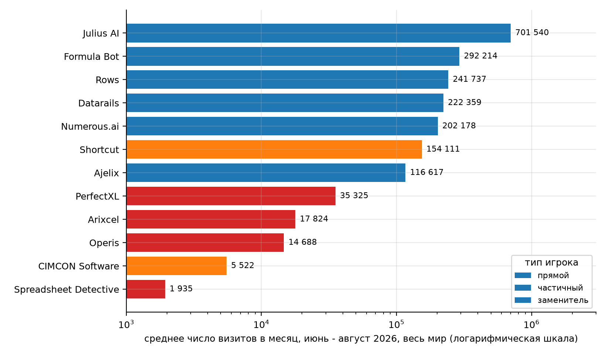
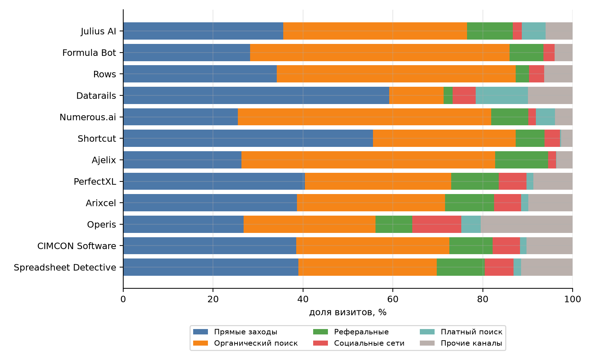
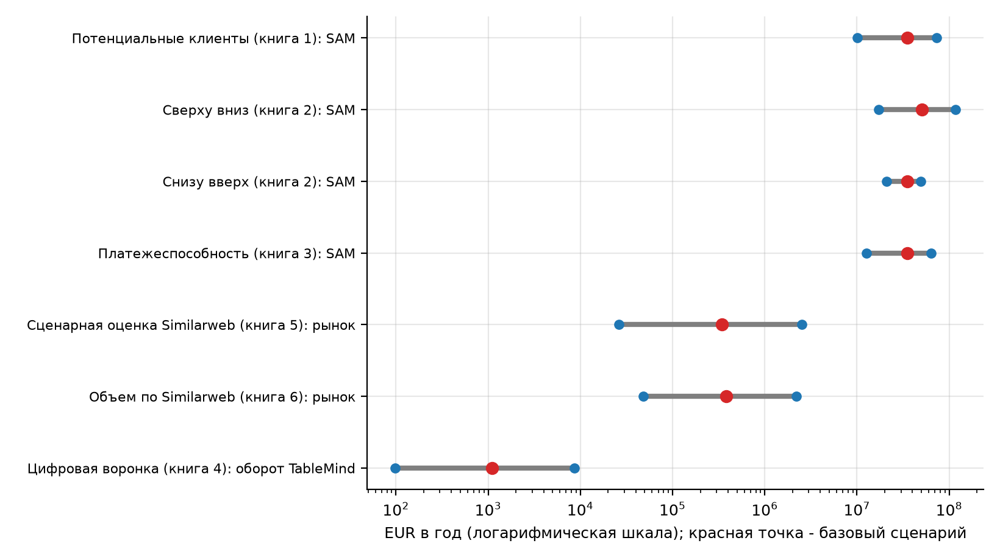
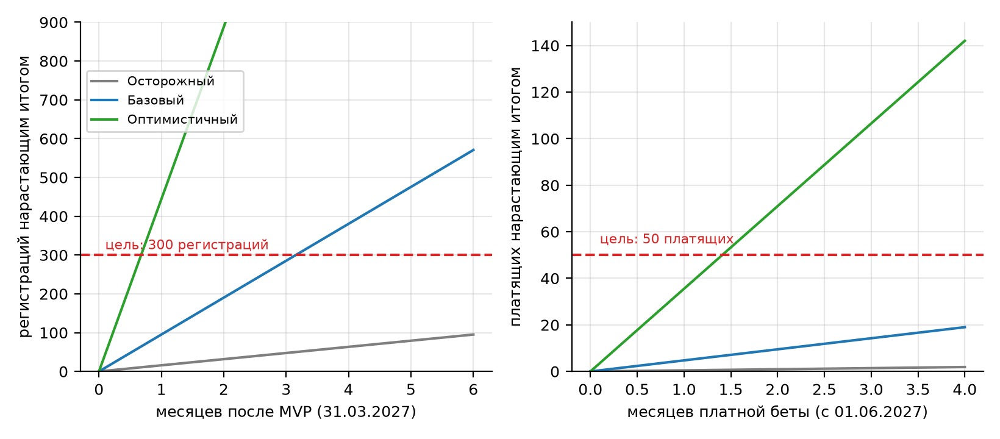
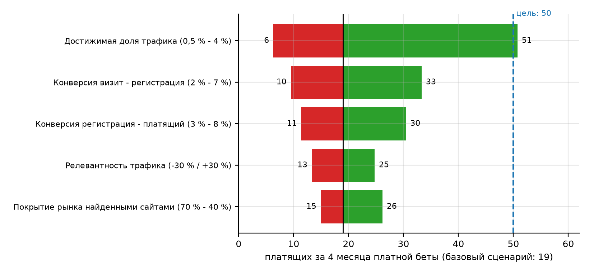

## 1 Цель работы

Цель работы: оценить объем рынка онлайн-сервисов независимой проверки (аудита) Excel-моделей для проекта TableMind несколькими взаимодополняющими методами и получить согласованный диапазон TAM, SAM и SOM, пригодный для сопоставления с целями проекта (300 регистраций и 50 платящих пользователей к 30.09.2027) и с его бюджетом (517 000 BYN). Работа продолжает ЛР1, где зафиксированы границы рынка и подтвержден частичный поисковый интерес [1].

Для достижения цели решены задачи: зафиксированы единицы расчета и границы; снят единый снимок Similarweb по 12 сайтам одной датой; рассчитаны семь Excel-книг по методикам инструкции [2] (потенциальные клиенты, сверху вниз и снизу вверх, платежеспособность, цифровая воронка по тарифам, сценарная оценка Similarweb, объем по Similarweb, поисковый спрос); выполнены независимый пересчет на Python и сверка с Excel; результаты сведены по правилам согласования; итог сопоставлен с целями проекта; выполнена проверка чувствительности.

Все денежные значения приведены в EUR за год, если не сказано иное. Курсы НБРБ на 03.10.2026: 1 EUR = 3,3860 BYN, 1 USD = 3,0051 BYN [3]. Исходные факты проекта (тарифы, сроки, цели, бюджет) взяты из ПЗ1 и ПЗ4 [4]. Данные опроса респондентов не использовались: платежеспособность оценена по открытым ценам и модельным допущениям, которые так названы в тексте.

## 2 Ход работы

Работа выполнена в порядке, заданном инструкцией [2]: границы рынка, цифровые следы конкурентов (Similarweb), расчетные методики, проверочные методики (сценарии и платежеспособность), сводная оценка. Каждая методика реализована в отдельной книге Excel, а ее результат независимо пересчитан скриптом на Python.

### 2.1 Границы рынка, единицы и состав расчетов

Границы рынка перенесены из ЛР1 без изменений: односторонний цифровой рынок, продукт - онлайн-проверка Excel-моделей и финансовых таблиц (веб-аудит и надстройка), территория - англоязычные страны (США, Великобритания, Канада, Австралия, Ирландия) и ЕС-27, контрольная территория - Беларусь и русскоязычный сегмент. Из рынка исключены обучающие курсы по Excel и универсальные AI-ассистенты без функции проверки как отдельные продукты; они учитываются как заменители.

В таблице 1 представлено: состав расчетных книг и методик ЛР2-3.

Таблица 1 – Состав расчетных книг и методик ЛР2-3

| № | Книга Excel | Методика | Что дает |
|---|---|---|---|
| 1 | ЛР2-3_1_потенциальные_клиенты | Число потенциальных клиентов | TAM, SAM, SOM по четырем сегментам и трем сценариям |
| 2 | ЛР2-3_2_сверху_вниз_снизу_вверх | Сверху вниз, снизу вверх, Similarweb | Три независимые оценки и сверка |
| 3 | ЛР2-3_3_платежеспособность | Проверка платежеспособности | Ценовой коридор, индекс бюджета, ROI клиента |
| 4 | ЛР2-3_4_цифровая_воронка | Цифровая воронка по тарифам | Визиты, регистрации, платящие, выручка, канал AppSource |
| 5 | ЛР2-3_5_сценарная_оценка_Similarweb | Сценарная оценка с Similarweb | Рыночный трафик, воронка, платформенная модель |
| 6 | ЛР2-3_6_объем_рынка_Similarweb | Оценка объема рынка по Similarweb | Каналы, география, запросы, три сценария |
| 7 | ЛР2-3_7_поисковый_спрос | Оценка через поисковый спрос | Контрольный русскоязычный сегмент по Вордстату |

Таблица определяет, какая книга отвечает за какую методику. Книги заполнены копированием шаблонов через COM, формулы шаблонов сохранены; изменения шаблонов описаны в приложении В. Первые пять методик дают оценку для основной территории, седьмая служит контролем на русскоязычном сегменте.

Дата снимка внешних данных - 03.10.2026. Заполнение книг, независимый пересчет и рисунки воспроизводятся расчетными скриптами, которые хранятся вместе с работой в репозитории проекта.

### 2.2 Снимок Similarweb

Данные Similarweb сняты одной датой (03.10.2026) в сервисе Similarweb Pro (пробный доступ студентки) за три последних месяца, июнь - август 2026, по всему миру и по всему трафику [5]. Список из 12 доменов сформирован по ПЗ1 (PerfectXL, Shortcut) и по разделу «похожие сайты» сервиса: специализированный аудит таблиц, AI-помощники и FP&A-платформы. Данные Similarweb являются оценочными и для малых сайтов менее надежны.

В таблице 2 представлено: снимок Similarweb, 06-08.2026, весь мир.

Таблица 2 – Снимок Similarweb, 06-08.2026, весь мир

| Сайт | Тип | Визитов в месяц | Доля целевых стран (топ-5) | Первая страна | Мировой ранг |
|---|---|---|---|---|---|
| Julius AI (julius.ai) | заменитель | 701 540 | 8 % | IN 23 % | 64 597 |
| Formula Bot (formulabot.com) | заменитель | 292 214 | 10 % | VE 17 % | 200 286 |
| Rows (rows.com) | заменитель | 241 737 | 11 % | US 7 % | 217 372 |
| Datarails (datarails.com) | заменитель | 222 359 | 76 % | US 69 % | 208 570 |
| Numerous.ai (numerous.ai) | заменитель | 202 178 | 16 % | IN 15 % | 234 333 |
| Shortcut (shortcut.ai) | частичный | 154 111 | 27 % | US 22 % | 278 471 |
| Ajelix (ajelix.com) | заменитель | 116 617 | 18 % | IN 14 % | 351 914 |
| PerfectXL (perfectxl.com) | прямой | 35 325 | 44 % | US 16 % | 835 662 |
| Arixcel (arixcel.com) | прямой | 17 824 | 59 % | US 28 % | 1 588 798 |
| Operis (operis.com) | прямой | 14 688 | 96 % | GB 59 % | 2 346 862 |
| CIMCON Software (cimcon.com) | частичный | 5 522 | 48 % | IN 52 % | 2 987 634 |
| Spreadsheet Detective (spreadsheetdetective.com) | прямой | 1 935 | 89 % | US 56 % | 5 012 222 |

Всего 12 сайтов дают 2 006 050 визитов в месяц. Самые крупные - Julius AI, Formula Bot и Datarails, но это AI-помощники и FP&A-платформа, а специализированные инструменты аудита (PerfectXL, Arixcel, Operis) на один-два порядка меньше. Доля целевых стран посчитана только по пяти крупнейшим странам каждого сайта, поэтому это нижняя оценка. Наименьшие сайты (Spreadsheet Detective, CIMCON) ненадежны по оценке Similarweb.

На рисунке 1 показано: среднемесячные визиты сайтов, июнь - август 2026 (логарифмическая шкала).

Рисунок 1 – Среднемесячные визиты сайтов, июнь - август 2026 (логарифмическая шкала)

Разброс визитов - от 2 тысяч до 700 тысяч в месяц. Специализированные инструменты проверки таблиц собирают в сумме около 75 тысяч визитов в месяц против примерно 1,9 миллиона у заменителей, что показывает, что внимание аудитории сосредоточено на AI-помощниках, а не на независимой проверке.

В таблице 3 представлено: средневзвешенная структура каналов трафика 12 сайтов.

Таблица 3 – Средневзвешенная структура каналов трафика 12 сайтов

| Канал | Доля | Оценка трафика, визитов в месяц | Уровень |
|---|---|---|---|
| Direct | 42,8 % | 67 899 | высокий |
| Organic search | 33,6 % | 53 323 | высокий |
| Referral | 6,9 % | 10 940 | низкий |
| Social | 4,5 % | 7 189 | низкий |
| Paid search | 4,4 % | 6 979 | низкий |
| Display | 2,3 % | 3 714 | низкий |

Прямые заходы (43 %) и органический поиск (34 %) дают около трех четвертей трафика, рефералы - 7 %, платная реклама и соцсети - менее 9 % вместе. Для TableMind это означает, что основной канал привлечения - поиск и прямое узнавание, а платная реклама конкурентами почти не используется.

На рисунке 2 показано: структура каналов трафика по сайтам, % визитов.

Рисунок 2 – Структура каналов трафика по сайтам, % визитов

Специализированные сайты (PerfectXL, Arixcel, CIMCON) получают заметную долю из рефералов и социальных сетей, AI-помощники живут в основном за счет поиска. Datarails выделяется долей прямых заходов, что типично для платформы с готовой клиентской базой.

Покрытие рынка найденными сайтами оценено допущением Д-13: 12 сайтов дают около 55 % трафика сегмента, поэтому оценка полного рыночного трафика равна наблюдаемому релевантному трафику, деленному на 0,55 (в сценариях 0,70 и 0,40).

### 2.3 Релевантный трафик и оценка объема по Similarweb

Методика оценки объема рынка по Similarweb требует разделять общий трафик, трафик целевых стран и релевантный трафик [2]. Для каждого сайта введены три коэффициента: доля целевой географии (нижняя оценка по топ-5 стран), доля релевантного содержания (допущение Д-15: для PerfectXL 0,80, для общих AI-инструментов 0,10-0,35) и коэффициент качества данных (0,60-0,90). Их произведение дает релевантные визиты.

В таблице 4 представлено: релевантный трафик по сайтам.

Таблица 4 – Релевантный трафик по сайтам

| Сайт | Визитов в месяц | Доля целевых стран | Доля релевантного содержания | Коэффициент качества | Релевантных визитов в месяц |
|---|---|---|---|---|---|
| Datarails | 222 359 | 76 % | 15 % | 90 % | 22 922 |
| Shortcut | 154 111 | 27 % | 35 % | 85 % | 12 168 |
| PerfectXL | 35 325 | 44 % | 80 % | 85 % | 10 557 |
| Numerous.ai | 202 178 | 16 % | 30 % | 85 % | 8 362 |
| Formula Bot | 292 214 | 10 % | 30 % | 80 % | 6 768 |
| Arixcel | 17 824 | 59 % | 80 % | 80 % | 6 697 |
| Operis | 14 688 | 96 % | 50 % | 80 % | 5 639 |
| Julius AI | 701 540 | 8 % | 10 % | 85 % | 4 890 |
| Ajelix | 116 617 | 18 % | 25 % | 85 % | 4 518 |
| Rows | 241 737 | 11 % | 15 % | 85 % | 3 363 |
| Spreadsheet Detective | 1 935 | 89 % | 80 % | 60 % | 831 |
| CIMCON Software | 5 522 | 48 % | 30 % | 60 % | 472 |

Релевантный трафик 12 сайтов - 87 230 визитов в месяц (1 046 765 в год), то есть около 4,3 % общего трафика. Больше всех дают Shortcut, PerfectXL и Datarails; именно эти сайты формируют конкурентное поле TableMind. Коэффициенты - допущения аналитика, их влияние показано в разделе 2.12.

С учетом покрытия 0,55 оценка полного релевантного трафика сегмента составляет 158 601 визитов в месяц (1 903 208 в год). Расчет через цифровую воронку в книге 6 дает годовой объем рынка по трафику: осторожный 48 345 EUR, базовый 382 736 EUR, оптимистичный 2 185 478 EUR. SOM нового бизнеса (0,5 %, 1,5 % и 4 % рынка) равен соответственно 242 EUR, 5 741 EUR и 87 419 EUR в год.

В таблице 5 представлено: география визитов 12 сайтов (по топ-5 стран каждого сайта).

Таблица 5 – География визитов 12 сайтов (по топ-5 стран каждого сайта)

| Территория | Доля визитов | Оценка трафика, визитов в месяц | Приоритет |
|---|---|---|---|
| США | 16,7 % | 26 534 | средний |
| Великобритания | 1,7 % | 2 744 | низкий |
| ЕС-27 и Канада, Австралия (из топ-5 стран сайтов) | 2,5 % | 4 028 | низкий |
| Вне границ проекта или не раскрыто (Индия, Бразилия, остальные страны) | 79,0 % | 125 295 | высокий |

Из-за ограничения топ-5 доля целевых стран занижена, но структура ясна: заметная часть визитов приходится на США, а Индия, Бразилия и другие страны вне границ проекта составляют большинство. Это подтверждает решение Р-1 о фокусе на США и англоязычных странах и указывает, что трафик конкурентов нельзя целиком относить к целевому рынку.

В таблице 6 представлено: структура поисковых намерений и релевантность.

Таблица 6 – Структура поисковых намерений и релевантность

| Группа запросов | Доля | Оценка трафика, визитов в месяц | Коммерческий вес | Индекс коммерческого интереса |
|---|---|---|---|---|
| запросы о проверке и аудите (инструментальные и услуговые) | 10,9 % | 17 287 | 1,00 | 17 287 |
| проблемные запросы (ошибки в формулах) | 36,6 % | 58 048 | 0,60 | 34 829 |
| AI-запросы (Copilot, ChatGPT, нейросети для Excel) | 45,3 % | 71 846 | 0,25 | 17 962 |
| прочие запросы выборки | 7,2 % | 11 419 | 0,10 | 1 142 |

Доли групп запросов взяты из структуры намерений ЛР1 (выборка топов Вордстата из 4 578 запросов), поскольку ключевые слова Similarweb не снимались. Прямой спрос (проверить и заказать аудит) - около одной десятой; большая часть - AI-запросы и проблемные запросы, где нужна дополнительная работа по переводу интереса в покупку.

### 2.4 Сценарная оценка Similarweb

Сценарная книга пересчитывает наблюдаемый релевантный трафик в рыночный с учетом охвата неучтенных конкурентов, надежности данных и недоступного спроса, а затем переводит трафик в продажи и выручку. Параметры сценариев (допущения Д-12, Д-13): охват неучтенных игроков 1,30; 1,82; 2,50, надежность данных 0,75; 0,90; 1,00, конверсия визита в регистрацию 2; 4; 7 %, конверсия регистрации в платящего 3; 5; 8 %.

В таблице 7 представлено: сценарная оценка рынка по трафику Similarweb.

Таблица 7 – Сценарная оценка рынка по трафику Similarweb

| Показатель | Осторожный | Базовый | Оптимистичный |
|---|---|---|---|
| Рыночный трафик, визитов в год | 816 069 | 1 711 861 | 3 007 945 |
| Платящих клиентов рынка в год | 490 | 3 424 | 16 844 |
| Выручка рынка (новые платящие), EUR в год | 0 | 0 | 0 |
| Достижимая доля нового бизнеса | 0,5 % | 1,5 % | 4,0 % |
| SOM, EUR в год | 132 | 5 164 | 100 466 |

Базовая выручка новых платящих по цифровому каналу составляет около 0 EUR в год, а SOM TableMind при доле 1,5 % - около 5 164 EUR. Размах от осторожного до оптимистичного сценария - почти три порядка, что типично для рынка, где основной параметр (конверсия) пока не измерен на собственном продукте.

Платформенная модель использована как канал AppSource: при комиссии магазина 3 % (допущение Д-14, условия Microsoft требуют проверки) оборот через магазин надстроек в базовом сценарии - 898 059 EUR в год, комиссия - 26 942 EUR в год. Эти значения характеризуют канал, а не выручку нового бизнеса, поэтому в сведении итогов они не участвуют.

### 2.5 Число потенциальных клиентов

Клиентская база строится по профессиональным сегментам и по малому бизнесу. Для США использованы данные Бюро статистики труда (BLS) за 2025 год: 443 100 финансовых аналитиков, 1 595 200 бухгалтеров и аудиторов, 1 077 100 аналитиков по управлению [6]. Для малого бизнеса использованы 6 395 635 американских фирм с наемными работниками (SBA, 2025) [7], около 1,42 миллиона британских работодателей [8] и около 34 миллионов МСП ЕС по отчету Европейской комиссии 2025/2026 [9].

Данных Eurostat по профессиям в открытом виде получить не удалось, поэтому занятость за пределами США оценена масштабом по числу занятых: 0,45 для Великобритании, Канады, Австралии и Ирландии и 1,30 для ЕС-27 (допущение Д-10, ДОСНЯТЬ: Eurostat, ISCO 241). Доля МСП ЕС с наемными работниками принята 25 %.

В таблице 8 представлено: клиентские сегменты и коэффициенты сужения.

Таблица 8 – Клиентские сегменты и коэффициенты сужения

| Сегмент | Всего клиентов | В границах рынка | С потребностью | Готовы покупать онлайн | Платежеспособны |
|---|---|---|---|---|---|
| Финансовые аналитики и FP&A | 1 218 525 | 70 % | 30 % | 60 % | 35 % |
| Бухгалтеры и аудиторы | 4 386 800 | 35 % | 20 % | 60 % | 30 % |
| Консультанты по управлению | 2 962 025 | 40 % | 30 % | 70 % | 40 % |
| МСП с финансовой функцией | 17 415 635 | 3 % | 30 % | 60 % | 30 % |

Сегменты и доли сужения заданы по цепочке методики: границы, потребность, цифровая готовность, платежеспособность. Коэффициенты - допущения Д-10, опирающиеся на ПЗ1 (ошибки в 86-94 % таблиц) и на результаты ЛР1; численность профессий США взята у BLS, для остальных территорий оценена масштабом по занятости.

В таблице 9 представлено: адресуемые клиенты, SAM и SOM по сегментам.

Таблица 9 – Адресуемые клиенты, SAM и SOM по сегментам

| Сегмент | Адресуемые клиенты | Чек, EUR в год | SAM, EUR | Доля SOM | SOM, EUR |
|---|---|---|---|---|---|
| Финансовые аналитики и FP&A | 53 737 | 120 | 6 448 434 | 0,15 % | 9 673 |
| Бухгалтеры и аудиторы | 55 274 | 70 | 3 869 158 | 0,10 % | 3 869 |
| Консультанты по управлению | 99 524 | 180 | 17 914 327 | 0,15 % | 26 871 |
| МСП с финансовой функцией | 28 213 | 240 | 6 771 199 | 0,05 % | 3 386 |

Всего в границах проекта 4 095 627 потенциальных клиентов, из них адресуемых 236 748, то есть 5,8 %. SAM равен 35 003 118 EUR, наибольший вклад дают консультанты (17 914 327 EUR) из-за высокого чека; SOM по сегментам - 43 799 EUR в год.

В таблице 10 представлено: TAM, SAM и SOM по сценариям.

Таблица 10 – TAM, SAM и SOM по сценариям

| Сценарий | TAM, EUR | SAM, EUR | SOM, EUR |
|---|---|---|---|
| Осторожный | 3 306 378 176 | 10 080 898 | 5 040 |
| Базовый | 5 166 215 900 | 35 003 118 | 45 504 |
| Оптимистичный | 6 535 263 114 | 73 325 932 | 219 978 |

TAM - теоретический потолок до сужения (5 166 215 900 EUR в базовом сценарии): он на порядок выше оценки ПЗ1 для табличного ПО в Северной Америке и Европе, поскольку включает всех специалистов без учета потребности, и служит только верхней границей. SAM в диапазоне 10 080 898 EUR - 73 325 932 EUR; SOM в базовом сценарии - 45 504 EUR. Доля SOM в SAM - 0,13 %.

Сопоставление с цифровым ориентиром: оценочная годовая выручка 12 сайтов по их трафику и воронке TableMind составляет 210 452 EUR, SOM базового сценария равен 22 % этой величины. Это означает, что при заданных допущениях TableMind должен занять сопоставимую с одним небольшим игроком долю цифрового пула, а не доминирующую.

### 2.6 Методики «сверху вниз» и «снизу вверх»

Методика «сверху вниз» начинается с общего ориентира и последовательно сужается. Общий ориентир - 25,98 миллиона потенциальных пользователей (специалисты трех профессиональных сегментов и по одному лицу, принимающему решения, в каждом МСП с наемными работниками), с коэффициентом неопределенности статистической базы 0,85; 1,00; 1,15. Далее применены доля пользователей, для которых ошибка в таблице критична (7; 10; 13 %), цифровая доступность (55; 65; 75 %) и доля с потребностью (20; 30; 40 %). Методика «снизу вверх» использует те же сегменты, что и книга 1, но в другой упаковке: потенциальные клиенты в границах и с платежеспособностью умножаются на потребность, цифровую доступность и чек.

В таблице 11 представлено: сверху вниз и снизу вверх.

Таблица 11 – Сверху вниз и снизу вверх

| Показатель | Осторожный | Базовый | Оптимистичный |
|---|---|---|---|
| Сверху вниз: расчетное число клиентов | 170 059 | 506 668 | 1 165 337 |
| Сверху вниз: объем рынка, EUR в год | 17 104 497 | 50 960 688 | 117 209 584 |
| Снизу вверх: объем рынка, EUR в год | 21 001 883 | 35 003 138 | 49 004 394 |
| Similarweb и воронка, EUR в год | 81 213 | 335 702 | 967 788 |

Оценки сверху вниз (50 960 688 EUR) и снизу вверх (35 003 138 EUR) в базовом сценарии отличаются в 1,5 раза, что в пределах допустимого: по правилу согласования расхождение более чем в два-три раза требовало бы проверки коэффициентов. Оценка через трафик Similarweb на два порядка меньше, потому что измеряет не потенциал, а уже реализованный цифровой пул конкурентов; это обсуждается в разделе 2.10.

### 2.7 Цифровая воронка по тарифам и канал AppSource

Воронка TableMind построена по пути пользователя: визит на сайт, регистрация в тарифе Free, первый аудит, затем переход в платящие тарифы: разовый аудит 9 EUR, Pro 19 EUR в месяц, Team 29 EUR за место (со следующего релиза). Исходный трафик - полный релевантный трафик сегмента из раздела 2.3; достижимая доля трафика для нового сайта принята 0,5 %, 1,5 % и 4 % (допущение Д-12) с учетом того, что канал строится с нуля.

В таблице 12 представлено: платящие и выручка по тарифам, базовый сценарий, в месяц.

Таблица 12 – Платящие и выручка по тарифам, базовый сценарий, в месяц

| Тариф | Доля | Платящих в месяц | Платежей в год | Выручка первого года на платящего, EUR | Выручка в месяц, EUR |
|---|---|---|---|---|---|
| Разовый аудит (9 EUR) | 45 % | 2,14 | 1,5 | 13,5 | 28,9 |
| Pro (19 EUR) | 45 % | 2,14 | 8,0 | 152,0 | 325,3 |
| Team (место) (29 EUR) | 10 % | 0,48 | 9,0 | 261,0 | 124,1 |
| Итого | 100 % | 4,76 | 5,17 | 100,58 | 478,3 |

В базовом сценарии воронка дает 4,8 платящих в месяц при 95 регистрациях в месяц; средняя выручка первого года на платящего - 100,6 EUR (осторожный 53,9 EUR, оптимистичный 149,2 EUR). Структура платящих и число платежей - допущение Д-09: доля Pro и Team задает основную выручку, разовые аудиты дают мало.

В таблице 13 представлено: цифровая воронка TableMind по сценариям, в месяц.

Таблица 13 – Цифровая воронка TableMind по сценариям, в месяц

| Этап | Осторожный | Базовый | Оптимистичный |
|---|---|---|---|
| Полный релевантный трафик сегмента, визитов | 158 521 | 158 521 | 158 521 |
| Достижимая доля трафика | 0,5 % | 1,5 % | 4,0 % |
| Визитов на сайт TableMind | 793 | 2 378 | 6 341 |
| Регистраций Free | 15,9 | 95,1 | 443,9 |
| Новых платящих | 0,48 | 4,76 | 35,51 |
| Годовая выручка новых платящих (по шаблону, EUR) | 99 | 1 109 | 8 646 |
| Годовая выручка с платежами в течение года (LTV-лист, EUR) | 307 | 5 738 | 63 546 |

Воронка показывает, что рост ограничен верхней частью: даже при 2 378 визитах в месяц в базовом сценарии платящих менее пяти в месяц. Лист шаблона, где выручка равна продажам на единичный чек, занижает результат, поэтому для сопоставления использован лист повторных платежей: 5 738 EUR в год против 1 109 EUR по простой формуле.

Канал AppSource оценен листом платформенной модели: при 2, 8 и 20 оплатах в месяц и комиссии магазина 3 % (допущение Д-14, условия Microsoft ДОСНЯТЬ) оборот через магазин равен 12 EUR, 56 EUR и 146 EUR в год, комиссия - 56 EUR в базовом сценарии. Канал дешевый по комиссии, но не заменяет основной трафик: его вклад зависит от видимости надстройки в магазине, которой пока нет. Данные об AppSource (число надстроек, отзывы) в этой работе не собирались и вынесены в приложение Б.

### 2.8 Поисковый спрос: контрольный русскоязычный сегмент

Поисковая методика требует единых данных Google Trends и Яндекс Вордстат за 12 месяцев. Вордстат охватывает Россию и Беларусь, поэтому методика применена к контрольному русскоязычному сегменту, а не к основной территории. Для основной территории абсолютные частотности недоступны (Google Trends дает только индекс), и ее поисковый канал оценен по органическому трафику сайтов конкурентов из Similarweb.

В таблице 14 представлено: семантическое ядро расчета и показатели спроса.

Таблица 14 – Семантическое ядро расчета и показатели спроса

| Запрос | Вордстат, РФ+РБ, среднее за мес. | Индекс Google Trends (аналог) | Взвешенный спрос |
|---|---|---|---|
| проверка формул excel | 322 | 13,2 | 225,4 |
| проверить excel на ошибки | 50 | 13,2 | 35,0 |
| аудит excel | 52 | 47,6 | 46,8 |
| проверка финансовой модели | 140 | 29,0 | 113,4 |
| аудит финансовой модели | 36 | 29,0 | 29,2 |
| ошибки в формулах excel | 1 678 | 32,0 | 469,8 |
| ошибки в excel | 5 815 | 32,0 | 1 221,1 |
| excel copilot | 372 | 13,2 | 46,5 |
| нейросеть для excel | 820 | 13,2 | 102,5 |
| chatgpt excel | 375 | 13,2 | 46,9 |

Крупнейшие запросы - проблемные («ошибки в excel» и «ошибки в формулах excel»), а запросы об аудите и проверке модели исчисляются десятками в месяц. Взвешенный спрос (частотность x вес релевантности x коммерческая близость) в среднем 1 067 запросов в месяц.

Воронка контрольного сегмента с теми же конверсиями, что и в основной, дает базовую выручку 17,2 EUR в месяц и 206 EUR в год (диапазон 17 EUR - 1 283 EUR). Русскоязычный поисковый канал при ценах в EUR и в текущих условиях оплаты не может быть источником выручки проекта, что подтверждает решение Р-1 о выборе основной территории. Для основной территории поисковый канал по данным Similarweb (органический поиск, релевантная часть) дает порядка 29 317 релевантных визитов в месяц, из них SOM в базовом сценарии - около 1 930 EUR в год (оценка по доле достижимого трафика 1,5 %).

### 2.9 Проверка платежеспособности

Платежеспособность проверена по трем признакам: цена TableMind относительно рыночного коридора, соотношение доступного бюджета сегмента и цены, окупаемость покупки для клиента. Цены конкурентов взяты со страниц цен на 03.10.2026 и переведены в EUR по кросс-курсу 1,1267 [10]-[14].

В таблице 15 представлено: ценовой коридор, EUR.

Таблица 15 – Ценовой коридор, EUR

| Предложение | Минимум | Медиана | Максимум | Цена TableMind | Индекс к медиане |
|---|---|---|---|---|---|
| Разовая проверка файла | 7,10 | 8,88 | 19,17 | 9 | 1,01 |
| Подписка Pro (в месяц) | 7,10 | 19,17 | 88,76 | 19 | 0,99 |
| Team (за место в месяц) | 7,10 | 22,37 | 88,76 | 29 | 1,30 |
| Специализированный аудит (класс PerfectXL) | 69,00 | 69,00 | 69,00 | 19 | 0,28 |

Pro по 19 EUR стоит почти ровно на медиане персональных подписок (индекс 0,99), Team по 29 EUR на 30 % выше медианы, но втрое дешевле командного места Shortcut. Специализированные аналоги класса PerfectXL (от 69 EUR в месяц) в 3,6 раза дороже Pro: это ценовая ниша TableMind. Цены Arixcel, Operis и Julius не опубликованы, их нужно доснять.

В таблице 16 представлено: индекс платежеспособности сегментов.

Таблица 16 – Индекс платежеспособности сегментов

| Сегмент | Бюджет, EUR в месяц | Цена, EUR в месяц | Индекс | Статус |
|---|---|---|---|---|
| Финансовые аналитики и FP&A | 45 | 19 | 2,37 | высокая |
| Бухгалтеры и аудиторы | 25 | 19 | 1,32 | достаточная |
| Консультанты по управлению | 80 | 19 | 4,21 | высокая |
| МСП с финансовой функцией | 90 | 58 | 1,55 | высокая |

Во всех сегментах бюджет выше цены предложения, средний индекс 2,36; наименее запас у бухгалтеров и аудиторов (индекс 1,32), у консультантов запас самый большой. Бюджеты сегментов - допущения; реальный опрос не проводился, поэтому это модельные данные, а не результат опроса респондентов.

В таблице 17 представлено: окупаемость покупки для клиента.

Таблица 17 – Окупаемость покупки для клиента

| Сегмент | Экономия, EUR в месяц | Окупаемость, мес. | ROI за год | Вывод |
|---|---|---|---|---|
| Финансовые аналитики и FP&A | 297 | 0,06 | 14,6 | экономически оправдано |
| Бухгалтеры и аудиторы | 180 | 0,11 | 8,5 | экономически оправдано |
| Консультанты по управлению | 382 | 0,05 | 19,1 | экономически оправдано |
| МСП с финансовой функцией | 162 | 0,36 | 1,8 | экономически оправдано |

Покупка окупается за время менее месяца во всех сегментах; средний ROI за год - 11,0. Эффект рассчитан по экономии времени проверки (допущение Д-11: 20 % рабочего времени на проверку и поиск ошибок, из них 45 % экономится) и не включает стоимость пропущенной ошибки, которая выше.

Платежеспособный объем рынка по книге 3 равен 35 003 121 EUR в год при 236 748 платежеспособных клиентах; в сценариях SOM - 6 301 EUR, 45 504 EUR и 191 285 EUR. Вывод: интерес аудитории превращается в платежеспособный спрос при цене 9-29 EUR; слабое место - не цена, а готовность вводить платеж без пробного использования и канал привлечения.

### 2.10 Сведение методов и итоговый диапазон

Методики дают две принципиально разные группы оценок. Первая - потенциальные оценки (потенциальные клиенты, сверху вниз, снизу вверх, платежеспособность): они измеряют, сколько денег может быть в сегменте при заданных долях потребности и платежеспособности. Вторая - трафиковые оценки (Similarweb, воронка, поиск): они измеряют цифровой пул, который реально конвертируется в платежи по текущим конверсиям. Правила согласования [2] требуют сравнивать их с пониманием этой разницы.

В таблице 18 представлено: сводная матрица оценок, EUR в год.

Таблица 18 – Сводная матрица оценок, EUR в год

| Метод | Осторожный | Базовый | Оптимистичный |
|---|---|---|---|
| Потенциальные клиенты (книга 1) | 10 080 898 | 35 003 118 | 73 325 932 |
| Сверху вниз (книга 2) | 17 104 497 | 50 960 688 | 117 209 584 |
| Снизу вверх (книга 2) | 21 001 883 | 35 003 138 | 49 004 394 |
| Платежеспособность (книга 3) | 12 601 124 | 35 003 121 | 63 761 685 |
| Медиана четырех методов (SAM) | 14 852 811 | 35 003 130 | 68 543 809 |
| Сценарная оценка Similarweb (книга 5): рынок | 26 382 | 344 341 | 2 512 356 |
| Объем по Similarweb (книга 6): рынок | 48 318 | 382 639 | 2 184 658 |
| Цифровая воронка (книга 4): оборот новых платящих за год | 99 | 1 109 | 8 646 |
| Поиск РФ+РБ (книга 7): выручка | 17 | 206 | 1 283 |

Четыре потенциальные оценки согласуются: базовый SAM от 35 003 118 EUR до 50 960 688 EUR, медиана 35 003 130 EUR. Они не независимы (книги 1, 3 и снизу вверх используют одни и те же сегменты), поэтому реальное число независимых оценок - два: клиентская и «сверху вниз». Трафиковые оценки меньше на два порядка: рыночный пул по Similarweb в базовом сценарии - от 344 341 EUR до 382 639 EUR в год.

На рисунке 3 показано: диапазоны оценок по методам, EUR в год (логарифмическая шкала).

Рисунок 3 – Диапазоны оценок по методам, EUR в год (логарифмическая шкала)

Рисунок показывает два кластера: потенциальные оценки в десятках миллионов EUR и трафиковые оценки в сотнях тысяч EUR и ниже. Расхождение объяснимо и не является ошибкой расчета: трафик измеряет реализованный сегодня платный пул малой доли профессионалов, а клиентская база - потенциал при формировании привычки платить за проверку.

Правила согласования применены так (инструкция [2], раздел 11).

В таблице 19 представлено: применение правил согласования.

Таблица 19 – Применение правил согласования

| Правило | Что наблюдается | Решение |
|---|---|---|
| 1. Сверху вниз много больше снизу вверх | Расхождение в 1,5 раза в базовом сценарии | Коэффициенты проверены, расхождение допустимо; для SAM принята медиана |
| 2. Поисковый спрос высокий, платежеспособность низкая | Платежеспособность высокая (индекс 2,4), поисковый спрос на услугу малый | Идею не меняем; коммерческие запросы - узкое место канала |
| 3. Трафик конкурентов высокий, поисковый спрос низкий | Трафик AI-помощников большой, спрос на аудит малый | Аудитория приходит за генерацией формул, не за проверкой; конкурентное поле заменителей широкое |
| 4. Воронка дает малый объем при большом рынке | Воронка: 4,8 платящих в месяц при SAM 35 003 130 EUR | Проблема в канале и конверсии, а не в емкости; нужны партнеры и AppSource |
| 5. Сценарии сильно различаются | Разброс трафиковых оценок - три порядка | Нужны измеренные конверсии MVP; до этого результат дается диапазоном |
| 6. Итог - диапазон | Диапазон SAM и SOM с ограничениями | Итог ниже оформлен диапазоном |

Главный вывод согласования: рынок по потенциалу достаточен, но достижимая выручка определяется каналом привлечения, а не емкостью сегмента. Поэтому в итоговый диапазон SAM включены потенциальные оценки, а SOM определяется отдельно по каналу.

На рисунке 4 показано: TAM, SAM и SOM, базовый сценарий (логарифмическая шкала).

Рисунок 4 – TAM, SAM и SOM, базовый сценарий (логарифмическая шкала)

Разрыв между TAM (5 166 215 900 EUR) и SAM (35 003 130 EUR) - около двух порядков; он показывает, что большинство специалистов не работает со сложными моделями или не готово платить. Для сравнения, оценка ПЗ1 по табличному ПО в Северной Америке и Европе составляет около 6 508 387 478 EUR в год при совсем другом определении рынка.

Итоговая формулировка (шаблон инструкции [2], раздел 12). Рынок определен как онлайн-сервисы независимой проверки Excel-моделей для финансовых аналитиков, бухгалтеров, консультантов и МСП англоязычных стран и ЕС. Поисковый интерес подтвержден частично (ЛР1), конкурентное поле по Similarweb состоит из малых специализированных сайтов (около 75 тысяч визитов в месяц у PerfectXL, Operis, Arixcel, Spreadsheet Detective и CIMCON) и больших AI-помощников. Доступный рынок (SAM) оценен диапазоном 14 852 811 EUR - 68 543 809 EUR в год, базовая оценка 35 003 130 EUR; достижимая часть (SOM) в первый год - 7 426 EUR - 205 631 EUR по клиентской оценке и 132 EUR - 100 494 EUR по трафику, базовое значение по трафику 5 165 EUR. Платежеспособность сегментов достаточная, цена 9-29 EUR находится в рыночном коридоре. Результат требует проверки конверсий на MVP и данных опроса.

### 2.11 Сопоставление с целями и бюджетом проекта

Цели проекта - не менее 300 регистраций и 50 платящих пользователей к 30.09.2027 при бюджете 517 000 BYN, то есть 152 688 EUR по курсу НБРБ [3], [4]. Сроки ПЗ1: MVP веб-аудита 31.03.2027, открытая бета с оплатой 01.06.2027. Поэтому регистрации считаются за 6 месяцев после MVP, а платящие - за 4 месяца платной беты.

В таблице 20 представлено: ожидаемые регистрации и платящие против целей проекта.

Таблица 20 – Ожидаемые регистрации и платящие против целей проекта

| Показатель | Цель | Осторожный | Базовый | Оптимистичный |
|---|---|---|---|---|
| Регистраций в месяц |  | 15,9 | 95,1 | 443,9 |
| Регистраций за 6 месяцев после MVP | 300 | 95 | 571 | 2 663 |
| Платящих в месяц |  | 0,48 | 4,76 | 35,51 |
| Платящих за 4 месяца платной беты | 50 | 1,9 | 19,0 | 142,0 |
| Платящих за 12 месяцев работы канала |  | 5,7 | 57,1 | 426,1 |
| Платящих по SOM (Similarweb, сценарная книга) |  | 2,4 | 51,4 | 673,8 |

Цель по регистрациям (300) достигается в базовом и оптимистичном сценариях (571 и 2 663) и не достигается в осторожном (95). Цель по платящим (50) в базовом сценарии при четырех месяцах платной беты не достигается: 19,0 платящих. За 12 месяцев работы канала базовый сценарий дает 57 платящих, что близко к цели, и SOM по книге 5 (51 платящих) тоже ее подтверждает на годовом горизонте.

На рисунке 5 показано: накопление регистраций и платящих по сценариям против целей (оптимистичная линия правой части выходит за шкалу).

Рисунок 5 – Накопление регистраций и платящих по сценариям против целей (оптимистичная линия правой части выходит за шкалу)

Рисунок наглядно показывает, что цель по регистрациям достигается уже в базовом сценарии к третьему-четвертому месяцу после MVP, а цель по платящим - только в оптимистичном. Чтобы получить 50 платящих за 4 месяца в базовых конверсиях, достижимая доля трафика должна быть около 3,9 % вместо 1,5 %; либо конверсия регистрации в платящего должна быть около 13 % вместо 5 %.

Выручка при 50 платящих составляет около 5 029 EUR в год, то есть 3,3 % бюджета проекта (152 688 EUR); SOM базового сценария по клиентской оценке (45 504 EUR) покрывает 30 % бюджета. Это означает, что первый год проекта не окупается, а его экономика зависит от роста после 30.09.2027. Рекомендации: добавить каналы вне наблюдаемого трафика (AppSource, партнеры из бухгалтерских и консалтинговых фирм, Product Hunt), заложить измерение конверсий уже на MVP и пересмотреть срок или формулировку цели по платящим в реестре рисков.

### 2.12 Чувствительность и проверка расчетов

Чувствительность измерена на показателе «платящие за 4 месяца платной беты» в базовом сценарии воронки: каждый параметр по очереди переводится в осторожное и оптимистичное значение при остальных базовых.

На рисунке 6 показано: чувствительность числа платящих за 4 месяца к параметрам воронки.

Рисунок 6 – Чувствительность числа платящих за 4 месяца к параметрам воронки

Наибольшее влияние оказывает достижимая доля трафика (от 6 до 51 платящих), затем две конверсии. Цель в 50 платящих достигается только при оптимистичной доле трафика (около 51), конверсии по отдельности ее не обеспечивают. Покрытие и релевантность трафика сдвигают результат слабее.

Независимый пересчет выполнен отдельным скриптом на Python без использования Excel: пересчитаны TAM, SAM, SOM, сценарии, сверху вниз и снизу вверх, воронки Similarweb, платежеспособность, цифровая воронка, поисковая воронка. Из 52 контрольных величин расхождений выше допуска нет (52 из 52). Допуск фиксировался до расчета: относительная погрешность 1e-6 для прямых формул и 5e-3 там, где в Excel вводились округленные значения (чек до двух знаков), а также для листов с цепочкой округленных промежуточных величин. Ошибок формул (#ЗНАЧ!, #ДЕЛ/0!, #ССЫЛКА!) в итоговых книгах нет.

### 2.13 Ограничения оценки

Ограничения влияют на интерпретацию так: оценки Similarweb приблизительны, а для малых сайтов (Spreadsheet Detective, CIMCON) особенно; география взята по топ-5 стран, поэтому доля целевых стран занижена; коэффициенты релевантности, конверсий и платежеспособности - допущения без измерений на собственном продукте; опрос респондентов не проводился; данные Eurostat по профессиям не получены и заменены масштабом по занятости США; поисковая методика применена к русскоязычному сегменту. Все эти допущения перечислены в приложении А, а недостающие данные - в приложении Б.

## 3 Ответы на контрольные вопросы

Ответы даны по контрольным вопросам методики оценки объема рынка по данным Similarweb [2] (раздел «Контроль качества оценки») и по контрольному списку инструкции [2] (раздел 13).

1. Совпадает ли список конкурентов с ранее зафиксированными границами рынка? Да. Прямые игроки (PerfectXL, Operis, Arixcel) и заменители (AI-помощники, FP&A-платформа) соответствуют границам ЛР1; тип игрока указан в таблице 2.

2. Не включены ли в расчет сайты, которые обслуживают другую клиентскую задачу? Частично. Julius AI и Rows решают общую аналитику; их вклад ограничен долей релевантного содержания 10-15 %.

3. Одинаковы ли период, страна, устройство и тип трафика для всех конкурентов? Да. Период 06-08.2026, весь мир, весь трафик, один снимок 03.10.2026.

4. Разделены ли общий трафик, трафик целевой страны и трафик релевантных каналов? Да, но география по топ-5 стран (нижняя оценка); три доли показаны в таблице 4.

5. Не подменяется ли доля трафика долей выручки без дополнительных допущений? Нет. Переход от трафика к выручке выполнен через конверсии и чек с допущениями Д-09 и Д-12.

6. Проверены ли выбросы, сезонность и разовые всплески? Выбросы Вордстата обработаны правилом ЛР1; у Similarweb использован трехмесячный период, сезонность вынесена в ЛР1.

7. Отделены ли информационные поисковые запросы от коммерческих? Да. Структура намерений дана в таблице 6, коммерческий коэффициент 0,109 взят из ЛР1.

8. Есть ли три сценария расчета, а не одно точное число? Да. Во всех книгах осторожный, базовый и оптимистичный сценарии.

9. Сопоставлены ли выводы Similarweb с Google Trends, Яндекс Вордстат, статистикой, ценами конкурентов и рекламными кабинетами? Частично. Сопоставлены с ЛР1, статистикой BLS, SBA, Европейской комиссии и ценами конкурентов; рекламных кабинетов нет.

10. Указаны ли ограничения Similarweb и уровень надежности данных по небольшим сайтам? Да. Раздел 2.13 и коэффициент качества 0,60 для малых сайтов.

Контрольный список инструкции [2] выполнен: границы зафиксированы (ЛР1); ядро и данные Google Trends и Вордстата получены (ЛР1, книга 7); тренд, сезонность и циклы оценены (ЛР1); список конкурентов собран; данные Similarweb сняты; расчет выполнен пятью методами (сверху вниз, снизу вверх, потенциальные клиенты, воронка, поиск); построена цифровая воронка; сделаны три сценария; проверена платежеспособность; итог оформлен диапазоном с ограничениями.

## Выводы

В ходе работы рынок онлайн-проверки Excel-моделей оценен семью методами. Доступный рынок (SAM) в границах проекта - 14 852 811 EUR - 68 543 809 EUR в год, базовая оценка 35 003 130 EUR; адресуемая клиентская база - около 236 748 человек и компаний. Теоретический потолок (TAM) - около 5,2 млрд EUR и служит только верхней границей.

Достижимая выручка нового бизнеса (SOM) в первый год - от 132 EUR до 100 494 EUR по каналу, с базовым значением 5 165 EUR; клиентская оценка выше (45 504 EUR), так как не ограничена каналом. Цифровое поле состоит из малых специализированных сайтов (около 75 тысяч визитов в месяц) и крупных AI-помощников (около 1,9 миллиона). Цена тарифов находится в рыночном коридоре, платежеспособность сегментов достаточная (средний индекс 2,4).

Цель проекта по регистрациям (300) достижима в базовом сценарии (571 за 6 месяцев). Цель по платящим (50) за 4 месяца платной беты в базовом сценарии не достигается (19) и требует либо оптимистичной доли трафика (около 3,9 %), либо дополнительных каналов, либо более длинного горизонта; на 12 месяцев канал дает около 57 платящих. Рекомендуется перейти к ЛР4 и ЛР5 и использовать снимок Similarweb для анализа пяти сил и конкурентов, а в реестре рисков отразить риск недостижения цели по платящим.

## Список использованных источников

1. Земляник, Р. В. Отчет по лабораторной работе № 1 «Анализ поискового спроса и фиксация границ рынка» по дисциплине «Электронный бизнес» / Р. В. Земляник. – Минск : БГУИР, 2026.

2. Методические материалы дисциплины «Электронный бизнес» к лабораторным работам № 2–3: инструкция по применению методик оценки рынка электронного бизнеса и методики оценки рынка (поисковый спрос, Similarweb, сверху вниз и снизу вверх, потенциальные клиенты, цифровая воронка, платежеспособность). – Минск : БГУИР, 2026.

3. Национальный банк Республики Беларусь. Официальные курсы белорусского рубля [Электронный ресурс]. – Режим доступа: https://www.nbrb.by/api/exrates/rates/EUR?parammode=2. – Дата доступа: 03.10.2026.

4. Земляник, Р. В. Концепция проекта TableMind; WBS, сетевой график и диаграмма Ганта TableMind: отчеты по практическим занятиям по дисциплине «Управление проектами» / Р. В. Земляник. – Минск : БГУИР, 2026.

5. Similarweb. Website Analysis (Similarweb Pro) [Электронный ресурс]. – Режим доступа: https://pro.similarweb.com/. – Дата доступа: 03.10.2026.

6. U.S. Bureau of Labor Statistics. Occupational Outlook Handbook: Accountants and Auditors; Financial Analysts; Management Analysts [Электронный ресурс]. – Режим доступа: https://www.bls.gov/ooh/business-and-financial/. – Дата доступа: 03.10.2026.

7. U.S. Small Business Administration, Office of Advocacy. 2025 Small Business Profile [Электронный ресурс]. – Режим доступа: https://advocacy.sba.gov/2025/06/30/new-advocacy-report-shows-the-number-of-small-businesses-in-the-u-s-exceeds-36-million/. – Дата доступа: 03.10.2026.

8. UK Department for Business and Trade. Business population estimates 2025 [Электронный ресурс]. – Режим доступа: https://www.gov.uk/government/statistics/business-population-estimates-2025. – Дата доступа: 03.10.2026 (значения по сводке поисковой выдачи).

9. European Commission. Annual Report on European SMEs 2025/2026 [Электронный ресурс]. – Режим доступа: https://single-market-economy.ec.europa.eu/publications/annual-report-european-smes-20252026_en. – Дата доступа: 03.10.2026.

10. PerfectXL. Pricing [Электронный ресурс]. – Режим доступа: https://www.perfectxl.com/pricing/. – Дата доступа: 03.10.2026.

11. Numerous.ai. Pricing [Электронный ресурс]. – Режим доступа: https://www.numerous.ai/pricing. – Дата доступа: 03.10.2026.

12. Rows. Pricing [Электронный ресурс]. – Режим доступа: https://rows.com/pricing. – Дата доступа: 03.10.2026.

13. Shortcut. Pricing [Электронный ресурс]. – Режим доступа: https://www.shortcut.ai/pricing. – Дата доступа: 03.10.2026.

14. Microsoft. Microsoft 365 Copilot plans and pricing [Электронный ресурс]. – Режим доступа: https://www.microsoft.com/en-us/microsoft-365-copilot/pricing. – Дата доступа: 03.10.2026.

15. Microsoft. Microsoft Marketplace transact capabilities [Электронный ресурс]. – Режим доступа: https://learn.microsoft.com/en-us/partner-center/marketplace-offers/marketplace-commercial-transaction-capabilities-and-considerations. – Дата доступа: 03.10.2026.

16. Eurostat. Employed persons by detailed occupation (ISCO-08 two digit level), lfsa_egai2d [Электронный ресурс]. – Режим доступа: https://ec.europa.eu/eurostat/api/dissemination/statistics/1.0/data/lfsa_egai2d. – Дата доступа: 03.10.2026.

17. Arixcel. Download Arixcel Explorer: Licensing, Pricing [Электронный ресурс]. – Режим доступа: https://www.arixcel.com/explorer/download. – Дата доступа: 03.10.2026.

18. Operis Analysis Kit. Financial Modelling Fees | Excel Add-In Package | OAK [Электронный ресурс]. – Режим доступа: https://www.operisanalysiskit.com/oak-price/. – Дата доступа: 03.10.2026.

19. Software Finder. How Much Does DataSnipper Cost (2026 Pricing Guide) [Электронный ресурс]. – Режим доступа: https://softwarefinder.com/resources/how-much-does-datasnipper-cost. – Дата доступа: 03.10.2026.

20. Coefficient. Datarails Pricing 2026: Complete Guide to Plans, Features and Reviews [Электронный ресурс]. – Режим доступа: https://coefficient.io/datarails-pricing. – Дата доступа: 03.10.2026.

21. Office for National Statistics. Annual Population Survey: employment by occupation (SOC 2020), NM_218_1 [Электронный ресурс]. – Режим доступа: https://www.nomisweb.co.uk/datasets/aps218. – Дата доступа: 03.10.2026.

## Приложение А (обязательное) Допущения и параметры расчета

В приложении собраны допущения, добавленные в ЛР2-3 к допущениям Д-01...Д-08 из ЛР1. Каждое допущение указывает значение, обоснование и влияние на результат.

В таблице 21 представлено: журнал допущений ЛР2-3.

Таблица 21 – Журнал допущений ЛР2-3

| № | Параметр | Значение | Обоснование | Влияние на результат | Как проверить |
|---|---|---|---|---|---|
| Д-09 | Структура платящих и платежей | разовый/Pro/Team: 60/37/3, 45/45/10, 35/50/15 %; платежей 1,2/6/6; 1,5/8/9; 2/10/11 | тарифы ПЗ1, типичная сезонность подписок | чек первого года 54/101/149 EUR | реальные данные оплат после MVP |
| Д-10 | Коэффициенты сегментов и масштаб занятости | граница 3-70 %, потребность 20-30 %, онлайн 60-70 %, платежеспособность 30-40 %; масштаб 0,45 и 1,30 | ПЗ1 (ошибки в 86-94 % таблиц), ЛР1; Eurostat недоступен | определяет SAM | Eurostat ISCO 241; опрос |
| Д-11 | Себестоимость, часы, экономия | себестоимость 1,5-4,5 EUR, 20 % времени на проверку, экономия 45 % | оценка вычислений и LLM; практика FP&A | ROI и маржа | учет затрат MVP, хронометраж |
| Д-12 | Конверсии воронки и доля трафика | визит-регистрация 2/4/7 %, регистрация-платящий 3/5/8 %, доля трафика 0,5/1,5/4 % | практика freemium SaaS, допущение | главный драйвер SOM | тест на MVP, рекламные кампании |
| Д-13 | Покрытие рынка найденными сайтами | 0,70/0,55/0,40 | 12 сайтов из десятков | множитель полного трафика | расширить список (похожие сайты) |
| Д-14 | Канал AppSource | 2/8/20 оплат в месяц, комиссия 3 % | условия магазина Microsoft (3 % подтверждено 03.10.2026, приложение Д) | оборот канала | данные AppSource |
| Д-15 | Релевантность и качество по сайтам | релевантность 0,10-0,80, качество 0,60-0,90 | профиль сайта; ненадежность малых сайтов | релевантный трафик 87 тыс. в месяц | поисковые запросы сайтов в Similarweb |
| Д-16 | География по топ-5 стран | учтены только пять крупнейших стран сайта | ограничение бесплатного режима | доля целевых стран занижена | полный список стран в Similarweb Pro |

Допущения Д-09...Д-16 перенесены в общий журнал допущений проекта. Изменение значения и повторный запуск расчетных скриптов пересчитывает книги Excel и числа отчета.

## Приложение Б (обязательное) Данные, которые необходимо доснять

Ниже перечислены элементы, которые не удалось получить или которые требуют личного участия. Для каждого указано, что, где и как нужно сделать.

В таблице 22 представлено: перечень данных, требующих получения или уточнения.

Таблица 22 – Перечень данных, требующих получения или уточнения

| № | Что доснять | Где | Как | Куда внести |
|---|---|---|---|---|
| 1 | Страны сайтов полностью (не только топ-5) и данные по AppSource и четырем доменам, не снятым из-за суточного лимита | Similarweb Pro (пробный доступ до 09.10.2026) | снимок выполнен 03.10.2026 для appsource.microsoft.com, sheetai.app, f1f9.com (приложение Д); excelformulabot.com и macabacus.com в Similarweb отсутствуют (нет совпадений); полный список стран остается открытым | книги 5 и 6, таблица 3 |
| 2 | Численность профессий в ЕС и Великобритании | Eurostat (ISCO 241), ONS | выполнено 03.10.2026: Eurostat для ЕС и ONS для Великобритании (приложение Д) | книга 1, лист «Сегменты» |
| 3 | Условия комиссии AppSource | Microsoft Partner Center | проверено 03.10.2026: комиссия 3 % (приложение Д) | книга 4, лист платформенной модели |
| 4 | Цены Arixcel, Operis, Julius и услуг разового аудита | сайты компаний, запрос коммерческого предложения | цены Arixcel и Operis найдены у производителей (приложение Д); DataSnipper и Datarails - оценки третьих сторон, точные цены - запросом коммерческого предложения | книга 3, ценовой коридор |
| 5 | Опрос 20-30 респондентов о цене и готовности платить | аудитория студентки, профессиональные чаты | анкета: бюджет, допустимая цена, готовность платить до пробы; пока использованы модельные данные (приложение Г) | книга 3, листы «Платежеспособность», «Сценарии» |
| 6 | Конверсии собственного сайта и рекламные кампании | Google Analytics, Google Ads | MVP не написан: модельные замеры в приложении Е ЛР6 (допущение Д-32); после запуска измерить реальные | книги 4 и 5, параметры воронки |
| 7 | Ключевые слова и объемы англоязычного поиска | Google Keyword Planner, Similarweb Search | недоступно без платного кабинета; взамен использованы индексы Google Trends (ЛР1) и органический трафик Similarweb | книга 7, основная территория |

Пункты 1, 3, 6 и 7 выполняются в сервисах под аккаунтом студентки; пункты 2 и 4 - открытые источники; пункт 5 требует аудитории. До выполнения пунктов оценки остаются диапазоном с низкой и средней надежностью.

## Приложение В (обязательное) Исправления и изменения шаблонов

В шаблонах Excel выявлены ошибки и неудобства. Ниже перечислено, что изменено, чтобы расчет был корректным; оригиналы шаблонов не изменялись, работа велась с копиями.

В таблице 23 представлено: изменения шаблонов.

Таблица 23 – Изменения шаблонов

| № | Книга и лист | Проблема | Исправление |
|---|---|---|---|
| 1 | Платежеспособность, лист «Сценарии» | ссылка на пустую строку сегмента возвращала 0 вместо пустой строки, формулы давали #ЗНАЧ!, итоговые ячейки и панель с ошибками | формулы столбцов A и B строк 13-20 заменены на проверку IF(пусто, "", значение) |
| 2 | Цифровая воронка, лист «Конкуренты_SW» | оценка полного трафика делилась на долю релевантного трафика (B12) вместо коэффициента покрытия (B13) | ссылки исправлены на B13 |
| 3 | Объем по Similarweb, лист «Параметры» | суммы релевантного трафика начинались со строки 5 и пропускали первую строку данных | диапазоны исправлены на строки 4-23 |
| 4 | Сценарная оценка Similarweb, лист «Сверка» | минимум, среднее и максимум включали платформенную строку, которая не является выручкой нового бизнеса | формулы итогов исключают платформенную строку |
| 5 | Платежеспособность, лист «Ценовой коридор» | цена в модели равнялась медиане, индекс всегда 1 | цена TableMind введена вручную, индекс показывает отношение к медиане |
| 6 | Все книги | валюта BYN и «руб.», демонстрационные данные по Беларуси и маркетингу | валюта заменена на EUR, демонстрационные данные заменены данными TableMind |
| 7 | Потенциальные клиенты, цифровая воронка, платежеспособность | в листах Similarweb пять-восемь строк вместо 12 сайтов | вставлены строки внутри диапазонов суммирования с копированием формул |

Исправления 1-4 затрагивают корректность формул, остальные - содержание. После исправлений ошибок формул в книгах нет, а независимый пересчет подтверждает значения.

## Приложение Г (справочное) Модельные данные опроса о цене и готовности платить

Респондентов для опроса нет, поэтому по решению студентки (Р-8) данные сгенерированы по заданным параметрам: 30 условных респондентов в четырех сегментах, генератор и файлы лежат в папке 00_Общее/Опрос_модельный (seed 20261003). Это модельные данные, а не результат опроса людей; они показывают порядок обработки анкеты по методике и проверяют согласованность принятого ценового коридора, но не доказывают реальный спрос.

В таблице 24 представлено: модельные показатели цены и готовности платить (Ван Вестендорп, подписка Pro).

Таблица 24 – Модельные показатели цены и готовности платить (Ван Вестендорп, подписка Pro)

| Показатель | Значение | Сравнение с предложением TableMind |
|---|---|---|
| Точка предельной дешевизны (PMC) | 11,6 EUR/мес. | ниже цены Pro 19 EUR |
| Оптимальная цена (OPP) | 13,9 EUR/мес. | Pro 19 EUR выше оптимума |
| Безразличная цена (IPP) | 14,2 EUR/мес. | Pro 19 EUR выше безразличной цены |
| Точка предельной дороговизны (PME) | 19,9 EUR/мес. | Pro 19 EUR на верхней границе приемлемого диапазона |
| Медиана допустимой цены разового аудита | 7,6 EUR | цена 9 EUR; не меньше 9 EUR готовы платить 43 % |
| Средняя готовность попробовать (1-5) | 3,37 | доля ответов 4-5: 53 % |

Приемлемый диапазон цены Pro в модели - 11,6-19,9 EUR в месяц, а цена 19 EUR лежит у его верхней границы, что согласуется с индексом цены 0,99 к медиане конкурентов (книга 3). Вывод осторожный: ориентир безопасной цены Pro - 14-19 EUR, а старт с 19 EUR требует контроля конверсии.

В таблице 25 представлено: модельный выбор тарифа среди респондентов.

Таблица 25 – Модельный выбор тарифа среди респондентов

| Выбор | Число | Доля |
|---|---|---|
| Pro 19 EUR | 7 | 23 % |
| разовый аудит 9 EUR | 11 | 37 % |
| не купил бы | 5 | 17 % |
| Team 29 EUR | 7 | 23 % |

Из 30 условных респондентов 25 выбирают платный вариант, но модельная доля нужна лишь как проверка механики: фактическую структуру платящих (допущение Д-09) придется подтверждать данными MVP.

Ограничение: параметры генератора (медианы допустимых цен по сегментам, разброс, доля критичных ошибок) заданы аналитиком на основе ценового коридора книги 3 и не получены от людей. Реальный опрос 20-30 респондентов остается желательным и заменяет эти данные без изменения структуры расчета.

## Приложение Д (справочное) Данные, дополненные из открытых источников

Часть пунктов приложения Б удалось закрыть открытыми источниками 03.10.2026; ниже приведены найденные значения, их надежность и влияние на расчет. Основные расчеты книг не изменялись, потому что найденные значения подтверждают принятые допущения или остаются оценками третьих лиц.

В таблице 26 представлено: данные, найденные в открытых источниках.

Таблица 26 – Данные, найденные в открытых источниках

| № | Показатель | Значение | Источник | Надежность | Влияние на расчет |
|---|---|---|---|---|---|
| 1 | Комиссия Microsoft Marketplace при продаже SaaS через магазин | 3 % стандартной платы за обслуживание магазина; выплата 97 % от стоимости лицензии; бесплатная проба SaaS 1-180 дней | [15] | высокая (первичный источник, обновлено 18.08.2026) | допущение Д-14 подтверждено |
| 2 | Занятые в профессиях «Business and administration professionals» (ISCO-08, OC24), 2024, тыс. чел. | ЕС-27 - 9 909,4; Германия - 1 806,3; Франция - 1 713,1; Нидерланды - 913,7; Ирландия - 195,9 | [16] | высокая | масштаб занятости ЕС 1,30 дает около 4,05 млн в трех профессиональных сегментах, то есть около 41 % от OC24: правдоподобно (OC24 включает также кадры, маркетинг и продажи) |
| 3 | Цена Arixcel Explorer | 2,75 GBP за пользователя в месяц (лицензии многопользовательские, срок 12-36 месяцев; пример: 10 пользователей на 12 месяцев - 330 GBP); только Windows-версии Excel; есть пробный режим | [17] | высокая (страница производителя, 03.10.2026) | нижняя граница ценового коридора около 3 EUR в месяц; цена TableMind 19 EUR выше примерно в шесть раз |
| 4 | Цена Operis OAK | подписка 311,66 GBP в год плюс налог (около 26 GBP в месяц); более 30 инструментов; есть пробная версия | [18] | высокая (страница производителя, 03.10.2026) | ориентир профессиональных надстроек; Pro TableMind (228 EUR в год) сопоставим по уровню годовой цены |
| 5 | Цена DataSnipper | прайс не публикуется; оценка от 64 USD за пользователя в месяц (около 768 USD в год) | [19] | низкая (оценка) | ориентир верхнего ценового сегмента аудита; Pro TableMind дешевле примерно в три раза |
| 6 | Цена Datarails | прайс не публикуется; оценки от 400 USD за пользователя в месяц, от 24 000 USD в год | [20] | низкая (оценка) | относится к классу FP&A-платформ, а не к разовым аудитам таблиц; прямой конкуренции по цене нет |
| 7 | Занятые в Великобритании, Annual Population Survey, апрель 2025 - март 2026 (SOC 2020) | бухгалтеры (2421) - 233 600; консультанты по управлению и бизнес-аналитики (2431) - 245 700; финансовые менеджеры и директора (1131) - 461 400; налоговые эксперты (2423) - 44 700 | [21] | высокая (официальная статистика, API Nomis) | два профессиональных сегмента Великобритании дают около 480 тыс. человек, то есть около 15 % американских трех сегментов (3,1 млн) при доле населения около 20 %: масштаб занятости 0,45 для четырех англоязычных стран выглядит консервативным |
| 8 | Дополнительный снимок Similarweb Pro, июнь-август 2026 | appsource.microsoft.com - 1,18 млн визитов (США 31 %); sheetai.app - 183 741 (глобальный ранг 666 313); f1f9.com - 32 076; cubesoftware.com - 320 502 (ранг 385 024); для excelformulabot.com и macabacus.com Similarweb ответил «нет совпадений» (трафик ниже порога панели) | [5] | средняя (оценка Similarweb) | sheetai.app, f1f9.com и cubesoftware.com добавляют около 8,9 % к трафику 12 доменов основного снимка (6,02 млн визитов) и на итоговый диапазон не влияют; AppSource - канал, а не конкурент |

Первичные данные найдены по комиссии AppSource, занятости ЕС и Великобритании и ценам Arixcel и Operis, а цены DataSnipper и Datarails остаются оценками третьих сторон. Для ценового коридора это означает, что опубликованные цены специализированных надстроек (Arixcel около 3 EUR и Operis OAK около 26 GBP в месяц) лежат ниже цены Pro 19 EUR или рядом с ней, а корпоративные платформы (DataSnipper и Datarails, оценки от 60 до 400 USD в месяц) заметно дороже; точные цены последних можно получить только запросом коммерческого предложения.

Не закрыты: точные цены DataSnipper и Datarails (только запросом коммерческого предложения) и данные Google Keyword Planner и Semrush, для которых нужен рекламный кабинет или платный доступ; взамен для англоязычного поиска используются относительные индексы Google Trends (ЛР1) и органический трафик конкурентов по Similarweb. Дополнительный раздел Keyword research в пробном Similarweb Pro не использован из-за нестабильной работы интерфейса при автоматизации.

