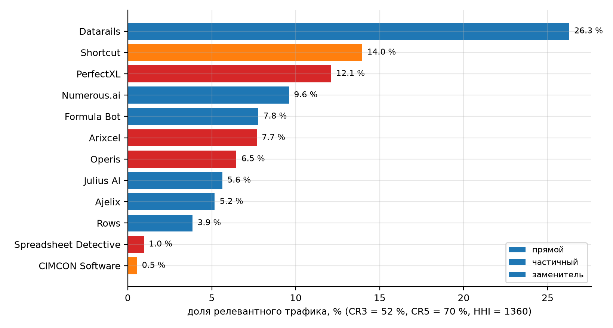
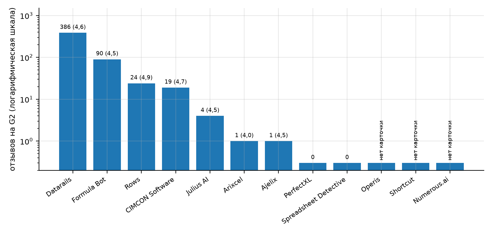
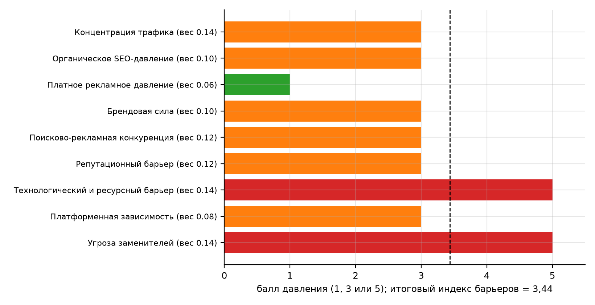

## 1 Цель работы

Цель работы - оценить уровень конкуренции и барьеры входа на рынок онлайн-проверки Excel-моделей для проекта TableMind, применив адаптированную для электронного бизнеса модель пяти сил Портера [1] и методику оценки конкуренции по данным Similarweb [2] (классическая модель описана в работах [3], [4]), и сформулировать вывод о привлекательности рынка и стратегии входа.

Для достижения цели решены задачи - составлен список игроков (прямых конкурентов, частичных конкурентов и заменителей); использован единый снимок Similarweb от 03.10.2026, снятый для ЛР2-3; рассчитаны концентрация трафика, структура каналов и индекс барьеров входа в книге Excel; собраны отзывы и рейтинги на G2, Capterra и Trustpilot; оценена каждая из пяти сил по параметрам простого шаблона Портера и по доказательствам; оценены цифровые усилители; составлена сводная матрица, карточки сильнейших конкурентов и стратегия входа.

Границы рынка и данные берутся из ЛР1 и ЛР2-3 [5], [6] без изменений - онлайн-сервисы независимой проверки Excel-моделей, территория - англоязычные страны и ЕС, контрольная - Беларусь и русскоязычный сегмент. Числа проекта (тарифы, цели, бюджет) сверены с ПЗ1 и ПЗ4 [7]. Все оценки конкурентов являются оценочными - они основаны на открытых данных и не доказывают фактическую выручку игроков.

## 2 Ход работы

Работа выполнена в порядке, заданном методикой [1] - границы рынка, список игроков, оценка каждой из пяти сил с доказательствами, оценка цифровых усилителей, сводная матрица, вывод и стратегические последствия. Количественная часть рассчитана в книге Excel по шаблону оценки конкуренции и барьеров входа и в простом шаблоне Портера; результаты независимо пересчитаны на Python.

### 2.1 Игроки рынка и состав выборки

Список игроков составлен из трех источников - конкуренты из ПЗ1 (PerfectXL, Shortcut, Microsoft 365 Copilot, ChatGPT for Excel, Claude for Excel), раздел «похожие сайты» сервиса Similarweb и каталоги G2 и Capterra. Каждый игрок отнесен к одному из трех классов - прямой конкурент (специализированный аудит таблиц и финансовых моделей), частичный конкурент (AI-агенты и решения, закрывающие часть задачи) и заменитель (универсальные AI-помощники, FP&A-платформы, ручная проверка).

В таблице 1 представлено - игроки рынка и заменители.

Таблица 1 – Игроки рынка и заменители

| Игрок | Класс | Продукт и сегмент | Визитов в месяц, 06-08.2026 |
|---|---|---|---|
| PerfectXL (perfectxl.com) | Прямой | Аудит таблиц | 35 325 |
| Arixcel (arixcel.com) | Прямой | Аудит таблиц | 17 824 |
| Operis (operis.com) | Прямой | Аудит финансовых моделей | 14 688 |
| Spreadsheet Detective (spreadsheetdetective.com) | Прямой | Аудит таблиц | 1 935 |
| Shortcut (shortcut.ai) | Частичный | AI-агент для Excel | 154 111 |
| CIMCON Software (cimcon.com) | Частичный | Риски пользовательских таблиц | 5 522 |
| Julius AI (julius.ai) | Заменитель | AI-анализ данных | 701 540 |
| Formula Bot (formulabot.com) | Заменитель | AI-помощник в таблицах | 292 214 |
| Rows (rows.com) | Заменитель | AI-таблицы | 241 737 |
| Datarails (datarails.com) | Заменитель | FP&A-платформа для Excel | 222 359 |
| Numerous.ai (numerous.ai) | Заменитель | AI-помощник в таблицах | 202 178 |
| Ajelix (ajelix.com) | Заменитель | AI-помощник в таблицах | 116 617 |
| SheetAI (sheetai.app) | Заменитель | AI-помощник в таблицах | 61 247 (снимок неполный) |
| Macabacus (macabacus.com) | Частичный | Надстройка для финансового моделирования | Около 41 300 (публичная страница) |
| Cube Software (cubesoftware.com) | Заменитель | FP&A над таблицами | Около 38 600 (публичная страница) |
| Microsoft 365 Copilot | Заменитель | Встроенный AI, 16 у.е. в месяц | Нет отдельного домена |
| ChatGPT (OpenAI) | Заменитель | Универсальный AI-ассистент | Трафик нерелевантен |
| Claude for Excel | Заменитель | AI-агент в Excel | Трафик нерелевантен |
| Gemini в Google Sheets | Заменитель | AI в таблицах Google | Трафик нерелевантен |
| Spreadsheet Inquire (Microsoft) | Заменитель | Встроенная проверка в Office | - |
| Ручная проверка, внутренний аудитор | Заменитель | Самостоятельное решение | - |

В полном снимке Similarweb 12 сайтов, а еще 9 кандидатов рассмотрены без полного снимка из-за суточного лимита пробного доступа или отсутствия отдельного домена. Всего в таблице 21 игрока, что превышает минимум 20 кандидатов, а прямых конкурентов в нише четыре - PerfectXL, Arixcel, Operis и Spreadsheet Detective; CIMCON, Shortcut и Macabacus закрывают часть задачи и отнесены к частичным конкурентам. Остальной трафик создают заменители.

### 2.2 Сила 1. Конкуренция между существующими игроками

Цифровой масштаб игроков определен по снимку Similarweb за июнь - август 2026 (одна дата, один период, весь мир, весь трафик) [8]. В расчет вошел релевантный трафик - визиты, умноженные на долю целевой географии, долю релевантного содержания и коэффициент качества данных (допущение Д-15 из ЛР2-3). Суммарный релевантный трафик 12 сайтов составляет 87 230 визитов в месяц.

В таблице 2 представлено - доли релевантного трафика и ключевые каналы игроков.

Таблица 2 – Доли релевантного трафика и ключевые каналы игроков

| Игрок | Класс | Доля релевантного трафика | Визитов в месяц | Прямые заходы | Органический поиск |
|---|---|---|---|---|---|
| Datarails | Заменитель | 26,3 % | 222 359 | 59 % | 12 % |
| Shortcut | Частичный | 14,0 % | 154 111 | 56 % | 32 % |
| PerfectXL | Прямой | 12,1 % | 35 325 | 40 % | 33 % |
| Numerous.ai | Заменитель | 9,6 % | 202 178 | 26 % | 56 % |
| Formula Bot | Заменитель | 7,8 % | 292 214 | 28 % | 58 % |
| Arixcel | Прямой | 7,7 % | 17 824 | 39 % | 33 % |
| Operis | Прямой | 6,5 % | 14 688 | 27 % | 29 % |
| Julius AI | Заменитель | 5,6 % | 701 540 | 36 % | 41 % |
| Ajelix | Заменитель | 5,2 % | 116 617 | 26 % | 56 % |
| Rows | Заменитель | 3,9 % | 241 737 | 34 % | 53 % |
| Spreadsheet Detective | Прямой | 1,0 % | 1 935 | 39 % | 31 % |
| CIMCON Software | Частичный | 0,5 % | 5 522 | 39 % | 34 % |

Лидеры - Datarails (26,3 %), Shortcut (14,0 %) и PerfectXL (12,1 %); три крупнейших игрока держат 52,3 %, пять - 69,7 %, индекс концентрации HHI равен 1 360. Порог высокой концентрации CR3 равен 60 %, HHI - 2 500, поэтому рынок оценивается как умеренно концентрированный - лидеры заметны, но монополии нет, а свободное место для узкой специализации остается.

На рисунке 1 показано - доли релевантного трафика игроков, %.

Рисунок 1 – Доли релевантного трафика игроков, %

Рисунок показывает, что в первую тройку входят один заменитель (Datarails), один частичный конкурент (Shortcut) и один прямой (PerfectXL), то есть конкуренция идет сразу по трем классам игроков. Среди прямых конкурентов значимый трафик у PerfectXL, остальные прямые игроки (Arixcel, Operis) меньше и держат по 6-8 %.

В таблице 3 представлено - вовлеченность аудитории, география и реферальный трафик игроков.

Таблица 3 – Вовлеченность аудитории, география и реферальный трафик игроков

| Игрок | Длительность визита | Страниц за визит | Индекс вовлеченности (среднее по группе = 1) | Доля топ-5 стран | Реферальный трафик |
|---|---|---|---|---|---|
| Datarails | 199 с | 3,86 | 2,48 | 76 % | 2,0 % |
| Julius AI | 104 с | 3,24 | 1,55 | 8 % | 10,2 % |
| Shortcut | 83 с | 3,14 | 1,35 | 27 % | 6,4 % |
| Formula Bot | 55 с | 3,09 | 1,11 | 10 % | 7,6 % |
| Spreadsheet Detective | 55 с | 2,05 | 0,89 | 89 % | 10,6 % |
| Numerous.ai | 29 с | 2,34 | 0,73 | 16 % | 8,3 % |
| Rows | 37 с | 1,95 | 0,72 | 11 % | 3,0 % |
| Arixcel | 31 с | 2,03 | 0,68 | 59 % | 10,9 % |
| CIMCON Software | 34 с | 1,85 | 0,67 | 48 % | 9,7 % |
| PerfectXL | 30 с | 1,84 | 0,63 | 44 % | 10,6 % |
| Ajelix | 28 с | 1,81 | 0,61 | 18 % | 11,8 % |
| Operis | 26 с | 1,72 | 0,58 | 96 % | 8,2 % |

Индекс вовлеченности равен среднему отношений длительности визита и числа страниц к средним по группе (59 с и 2,41 страницы). Самая глубокая аудитория у Datarails; у специализированных инструментов (PerfectXL, Arixcel, Operis) визиты короткие, порядка 30 секунд и около двух страниц, то есть пользователь решает узкую задачу и уходит. Реферальный трафик у специализированных игроков составляет 8-11 %, у AI-помощников и FP&A-платформ 2-12 % - различия невелики, а каталоги, обзоры и партнерские сайты остаются заметным каналом для всех групп, включая TableMind.

Репутационные показатели подтверждают умеренную конкуренцию. На G2 у PerfectXL 0 отзывов, у Arixcel Explorer 1 отзыв (4,0), у Spreadsheet Detective оценок нет, у CIMCON 19 (4,7), у заменителей больше - Rows 24 (4,9), Formula Bot 90 (4,5), Datarails 386 (4,6); для Shortcut, Numerous.ai и Operis карточек на G2 нет [9], [10], [11]. Трафик большой там, где есть общая AI-тема, а доказательная база прямых конкурентов бедна, и это снижает давление именно в нише проверки.

На рисунке 2 показано - число отзывов на G2 у игроков рынка (логарифмическая шкала).

Рисунок 2 – Число отзывов на G2 у игроков рынка (логарифмическая шкала)

Рисунок наглядно показывает разрыв в социальных доказательствах - у Datarails и Formula Bot сотни и десятки отзывов, у прямых конкурентов в нише аудита таблиц - нуль или единицы. Для нового игрока это окно возможностей - первые 20-30 проверенных отзывов дадут заметное преимущество в нише.

Ценовой ориентир - PerfectXL отдельный инструмент от 69 у.е. в месяц [12], Numerous.ai 8,9 у.е. в месяц [13], Rows Plus 7,1 у.е. за пользователя [14], Shortcut Pro 89 у.е. в месяц [15], Microsoft 365 Copilot (надстройка) 16 у.е. за пользователя [16]. Тарифы TableMind (Pro 19 у.е., Team 29 у.е. за место) лежат между AI-подписками массового сегмента и специализированным аудитом.

В таблице 4 представлено - оценка конкуренции игроков по параметрам шаблона Портера.

Таблица 4 – Оценка конкуренции игроков по параметрам шаблона Портера

| Параметр | Балл (1-3) | Основание |
|---|---|---|
| Количество игроков | 2 | Специализированных игроков 5 (3-10), вместе с заменителями больше 10 |
| Темп роста рынка | 2 | Рынок табличного ПО растет на 6-8 % в год, интерес по Google Trends растет, по Вордстату снижается |
| Дифференциация продукта | 2 | Ключевые свойства стандартизированы, но отличаются проверка структуры, доказательность и отчеты |
| Ограничение в повышении цен | 2 | Цены от 7,1 до 89 у.е.; рост цен возможен в рамках ценности для сегмента |

Сумма баллов равна 8 из 12, что соответствует среднему уровню внутриотраслевой конкуренции (5-8 баллов). Вывод - конкуренция между существующими игроками оценивается как средняя, поскольку на рынке есть сопоставимые специализированные игроки и сильные заменители, но видимость распределена между многими сайтами, а доказательная база прямых конкурентов слабая.

### 2.3 Сила 2. Угроза новых участников и барьеры входа

Барьеры входа оценены через структуру каналов привлечения, поисково-рекламное давление, репутацию, технологии и платформенную зависимость. Для каждого канала рассчитана средневзвешенная доля по релевантному трафику, порог высокого давления взят из шаблона (параметры листа 01), балл равен 5, 3 или 1.

В таблице 5 представлено - каналы трафика и давление на нового игрока.

Таблица 5 – Каналы трафика и давление на нового игрока

| Канал | Взвешенная доля | Порог высокого давления | Балл |
|---|---|---|---|
| Прямой трафик | 42,8 % | 30 % | 5 |
| Органический поиск | 33,6 % | 45 % | 3 |
| Платный поиск | 4,4 % | 20 % | 1 |
| Социальные сети | 4,5 % | 20 % | 1 |
| Реферальный трафик | 6,9 % | 15 % | 1 |
| Медийная реклама | 2,3 % | 10 % | 1 |
| Брендовая сила | 42,8 % | 50 % | 3 |

Прямые заходы (43 %) и органический поиск (34 %) - основные каналы игроков; платный поиск составляет всего 4,4 %, социальные сети 4,5 %, рефералы 6,9 %. Платного давления почти нет, зато узнаваемость брендов и органическая видимость средние. Новому игроку надо вкладываться в поисковую видимость и доверие, а покупка трафика пока дает шанс дешево обойти конкурентов.

В таблице 6 представлено - сводная оценка барьеров входа.

Таблица 6 – Сводная оценка барьеров входа

| Фактор | Значение | Балл | Вес | Взвешенный балл | Уровень |
|---|---|---|---|---|---|
| Концентрация трафика | 0,52 | 3 | 0,14 | 0,42 | Среднее |
| Органическое SEO-давление | 0,34 | 3 | 0,10 | 0,30 | Среднее |
| Платное рекламное давление | 0,27 | 1 | 0,06 | 0,06 | Низкое |
| Брендовая сила | 0,43 | 3 | 0,10 | 0,30 | Среднее |
| Поисково-рекламная конкуренция | 0,48 | 3 | 0,12 | 0,36 | Среднее |
| Репутационный барьер | 0,43 | 3 | 0,12 | 0,36 | Среднее |
| Технологический и ресурсный барьер | 0,70 | 5 | 0,14 | 0,70 | Высокое |
| Платформенная зависимость | 0,60 | 3 | 0,08 | 0,24 | Среднее |
| Угроза заменителей | 0,73 | 5 | 0,14 | 0,70 | Высокое |

Нормированный индекс барьеров входа равен 3,44 из 5, это средние барьеры (2,5-4,0) - технологический барьер и угроза заменителей высокие (5), остальные факторы средние, платное давление низкое. Веса факторов заданы с суммой 1,00 и повышены для концентрации трафика, технологического барьера и угрозы заменителей (Д-21).

На рисунке 3 показано - баллы факторов барьеров входа.

Рисунок 3 – Баллы факторов барьеров входа

Рисунок показывает два фактора с наивысшим баллом (технологический барьер и заменители) и единственный низкий (платная реклама). Для TableMind это значит - основная борьба идет не за рекламные клики, а за доверие и за доказательство отличия от AI-помощников.

В таблице 7 представлено - индекс конкурентного давления по шкале методики (8 критериев).

Таблица 7 – Индекс конкурентного давления по шкале методики (8 критериев)

| Критерий | Балл (1, 3, 5) | Основание |
|---|---|---|
| Количество релевантных конкурентов | 3 | 5 специализированных игроков и более 15 с заменителями, сильных брендов мало |
| Концентрация трафика | 3 | CR3 52 % - два-три заметных лидера |
| Стоимость входа в каналы | 1 | Платный трафик около 4 %, вход возможен через органику, AppSource и партнеров |
| Поисковая конкуренция | 3 | Есть устойчивые SEO-игроки среди AI-помощников |
| Рекламная конкуренция | 3 | Реклама есть, но не доминирует |
| Репутационный барьер | 3 | У специализированных мало отзывов, у FP&A-платформ сотни |
| Технологический барьер | 5 | Нужны движок проверки, интеграции и надстройка Excel |
| Издержки переключения клиента | 3 | Переключение возможно, но требует времени и переноса правил |
| Итоговый индекс (среднее) | 3,00 | Уровень по шкале методики - 2,1-3,0 - умеренный |

Среднее по восьми критериям равно 3,00, что по шкале методики соответствует умеренному уровню конкуренции (2,1-3,0) - вход возможен через нишевое позиционирование и узкое ценностное предложение. Шкала шаблона (индекс 3,44 с весами, средние барьеры 2,5-4,0) и шкала методики измеряют разные величины - первая учитывает веса и пороги каналов, вторая усредняет восемь критериев; обе дают вывод о среднем давлении, а сильнее всего давят технологический барьер и заменители.

В таблице 8 представлено - оценка угрозы новых участников по параметрам шаблона Портера.

Таблица 8 – Оценка угрозы новых участников по параметрам шаблона Портера

| Параметр | Балл (1-3) | Основание |
|---|---|---|
| Экономия на масштабе | 2 | Экономия на масштабе есть у Microsoft и OpenAI, в нише аудита - нет |
| Сильные марки | 3 | Крупных брендов именно в нише аудита таблиц нет - у PerfectXL 35 тыс. визитов в месяц, отзывов почти нет |
| Дифференциация продукта | 2 | Есть микро-ниши - аудит моделей, EUC-риск, FP&A |
| Инвестиции для входа | 2 | Окупаемость разработки и продвижения 6-12 месяцев и более (бюджет 152 тыс. у.е.) |
| Доступ к каналам | 2 | Нужны AppSource, поиск и партнеры; платный трафик у конкурентов почти не используется |
| Политика государства | 2 | Регулирование низкое, но GDPR и правила AppSource обязательны |
| Готовность снижать цены | 1 | Конкуренты имеют бесплатные тарифы (Rows, Shortcut) и могут снизить цены |
| Темп роста отрасли | 3 | Рост интереса к AI-инструментам для Excel привлекает новых игроков |

Сумма баллов равна 17 из 24, что на границе высокого уровня угрозы (17-24). Вывод - угроза новых участников оценивается как высокая, поскольку формальный вход дешев (AI-обертка над таблицей создается быстро), а реальный вход ограничен доверием и каналами лишь умеренно; тот же вход открыт и для самого TableMind, но требует защиты отличия.

### 2.4 Сила 3. Сила покупателей

Покупатели TableMind - финансовые аналитики, бухгалтеры, консультанты и малые компании (ЛР2-3). Они легко сравнивают предложения, пользуются бесплатными тарифами и AI-помощниками, но платят за результат, когда ошибка в модели дорога. Платежеспособность сегментов достаточная (средний индекс бюджета к цене 2,4 в ЛР2-3).

В таблице 9 представлено - оценка силы покупателей по параметрам шаблона Портера.

Таблица 9 – Оценка силы покупателей по параметрам шаблона Портера

| Параметр | Балл (1-3) | Основание |
|---|---|---|
| Доля покупателей с большим объемом | 1 | Покупатели - отдельные специалисты и небольшие компании, крупных закупщиков мало |
| Склонность к переключению на заменители | 3 | Переключение на AI-помощников и бесплатные тарифы дешево |
| Чувствительность к цене | 3 | Цена сравнивается с бесплатными и недорогими AI-подписками |
| Неудовлетворенность качеством рынка | 2 | AI-ответы требуют проверки (ПЗ1), неудовлетворенность создает спрос на независимую проверку |

Сумма баллов равна 9 из 12 - порог высокого уровня (9-12 баллов). Вывод - сила покупателей высокая, потому что переключение дешево, а цена сравнивается с бесплатными и недорогими AI-подписками; смягчает ситуацию то, что результат AI требует проверки (по ПЗ1 ошибки есть в 86-94 % таблиц), и спрос на независимую проверку растет.

### 2.5 Сила 4. Сила поставщиков

Поставщики цифрового бизнеса - это платформы и инфраструктура - Microsoft (Excel, Office.js, AppSource), провайдеры больших языковых моделей, облака и платежные сервисы (Stripe). Принцип TableMind «LLM предлагает, движок доказывает» ослабляет зависимость от конкретной модели - модель можно заменить без смены ядра проверки.

В таблице 10 представлено - оценка силы поставщиков по параметрам шаблона Портера.

Таблица 10 – Оценка силы поставщиков по параметрам шаблона Портера

| Параметр | Балл (1-2) | Основание |
|---|---|---|
| Количество поставщиков | 2 | Ключевые поставщики немногочисленны - платформа Microsoft, облако, платежи |
| Ограниченность ресурсов | 1 | Вычислительные ресурсы и LLM доступны у нескольких провайдеров |
| Издержки переключения | 1 | Принцип «LLM предлагает, движок доказывает» позволяет менять провайдера модели без смены ядра |
| Приоритетность направления для поставщика | 2 | Ниша аудита таблиц неприоритетна для Microsoft и провайдеров LLM |

Сумма баллов равна 6 из 8 - средний уровень (5-6 баллов). Вывод - сила поставщиков средняя, главный риск связан не с ценой моделей, а с зависимостью от правил и видимости в Microsoft AppSource и с тем, что ниша проверки таблиц неприоритетна для платформ.

### 2.6 Сила 5. Угроза заменителей

Заменители определяют основное давление. Доля релевантного трафика, приходящаяся на частичных конкурентов и заменителей, равна 73 %, а на прямых конкурентов - 27 %. Клиент решает задачу проверки таблицы тремя способами - просит AI-помощника (ChatGPT, Copilot, Claude, Gemini), использует встроенный Spreadsheet Inquire или проверяет вручную и через консультанта.

В таблице 11 представлено - оценка угрозы заменителей по параметру шаблона Портера.

Таблица 11 – Оценка угрозы заменителей по параметру шаблона Портера

| Параметр | Балл (1-3) | Основание |
|---|---|---|
| Заменители «цена-качество» | 3 | Частичные конкуренты и заменители (AI-помощники, FP&A-платформы, встроенный Copilot) дают около 73 % релевантного трафика сегмента; ручная проверка и Spreadsheet Inquire тоже доступны |

Максимальный балл 3 из 3 означает высокий уровень угрозы. Вывод - угроза заменителей высокая; единственный способ ослабить ее - предложить то, чего универсальный AI не дает - детерминированное доказательство ошибки, воспроизводимый отчет и сверку текста с ячейками.

### 2.7 Цифровые усилители

Цифровые усилители оценены по шести факторам методики - сетевые эффекты, данные, алгоритмическая видимость, платформенная зависимость, издержки переключения и экосистемная связанность.

В таблице 12 представлено - оценка цифровых усилителей.

Таблица 12 – Оценка цифровых усилителей

| Фактор | Балл (1-5) | Основание |
|---|---|---|
| Сетевые эффекты | 2 | Ценность сервиса не растет с числом пользователей; эффект слабый |
| Данные | 3 | Накопленные правила и eval-набор улучшают точность, но не блокируют вход |
| Алгоритмическая видимость | 4 | Органический поиск и прямые заходы дают около трех четвертей трафика игроков |
| Платформенная зависимость | 3 | AppSource и Product Hunt - канал, но есть и прямой вход через веб |
| Издержки переключения | 2 | Клиент не хранит критичных данных в сервисе, уйти легко |
| Экосистемная связанность | 4 | Microsoft и Google встраивают AI прямо в таблицы |

Среднее значение усилителей равно 3,0 из 5. Наиболее выражены алгоритмическая видимость и связанность с экосистемой Microsoft, слабы сетевые эффекты и издержки переключения. Вывод - цифровые усилители усиливают давление через видимость в поиске и экосистемы крупных платформ, но не создают непреодолимой защиты для лидеров.

### 2.8 Сводная матрица пяти сил

Баллы шаблона Портера (сумма по параметрам) приведены к единой шкале 1-5 линейной нормировкой по диапазону возможных сумм (минимум и максимум каждой силы); это правило записано в приложении А и воспроизводится пересчетом.

В таблице 13 представлено - единая матрица пяти сил.

Таблица 13 – Единая матрица пяти сил

| Сила | Сумма баллов шаблона | Оценка 1-5 | Давление по шкале 1-5 | Уровень по порогам шаблона |
|---|---|---|---|---|
| Конкуренция игроков | 8 из 12 | 3,00 | Умеренное | Средний |
| Угроза новых участников | 17 из 24 | 3,25 | Умеренное | Высокий |
| Сила покупателей | 9 из 12 | 3,50 | Умеренное | Высокий |
| Сила поставщиков | 6 из 8 | 3,00 | Умеренное | Средний |
| Угроза заменителей | 3 из 3 | 5,00 | Высокое | Высокий |

Среднее давление пяти сил равно 3,55 из 5. По шкале методики это верхняя граница умеренного давления (2,1-3,5) с переходом к высокому (3,6-5,0). Самая критичная сила - заменители (5,0), затем покупатели (3,5) и новые участники (3,25). Индекс барьеров входа Similarweb (3,15) лежит в той же зоне средних барьеров. Разные подписи давления в разделах 2.3-2.4 и в таблице объясняются шкалами - по суммам баллов шаблона Портера угроза новых участников (17 из 24) и сила покупателей (9 из 12) находятся на нижней границе высокого уровня, а после приведения к единой шкале 1-5 они равны 3,25 и 3,50 и попадают в верхнюю часть умеренного; в выводах они названы повышенными.

В таблице 14 представлено - матрица оценок и доказательств по силам Портера (шкала методики 0-3).

Таблица 14 – Матрица оценок и доказательств по силам Портера (шкала методики 0-3)

| Сила | Оценка 0-3 | Ключевые доказательства | Основные источники | Ограничения |
|---|---|---|---|---|
| Конкуренция игроков | 2 | CR3 52 %, HHI 1 360; четыре прямых игрока малы (около 70 тыс. визитов в месяц); платный трафик около 4 % | Similarweb, G2, страницы цен | Нет точной выручки конкурентов |
| Угроза новых участников | 3 | Формальный вход дешев (AI-обертка над таблицей); барьеры - доверие, технологии, каналы; индекс барьеров 3,15 | Similarweb, G2, Capterra, страницы безопасности | Нет данных Crunchbase и BuiltWith по всем игрокам |
| Сила покупателей | 3 | Переключение дешево, бесплатные тарифы и AI-подписки за 7,1-16 у.е.; платежеспособность сегментов достаточная (индекс 2,4) | Capterra, Trustpilot, ЛР2-3, страницы цен | Отзывы смещены в сторону корпоративных платформ |
| Сила поставщиков | 2 | Зависимость от Microsoft (Excel, AppSource), облака и платежей; провайдеров LLM несколько | Условия AppSource, ПЗ1, страницы провайдеров | Контракты и тарифы провайдеров изменяются |
| Угроза заменителей | 3 | Заменители и частичные конкуренты дают 73 % релевантного трафика; встроенные Copilot и Spreadsheet Inquire | Similarweb, страницы продуктов, ЛР5 | Нет данных о реальной доле клиентов, ушедших к заменителям |

Матрица связывает каждую оценку с доказательствами и источниками - высокое давление создают новые участники, покупатели и заменители, среднее - конкуренция игроков и поставщики; ограничения показывают, где оценка опирается на косвенные данные.

В таблице 15 представлено - рабочий журнал источников данных.

Таблица 15 – Рабочий журнал источников данных

| Сила Портера | Аналитический пункт | Источник | Период и география | Показатели | Вывод | Ограничения |
|---|---|---|---|---|---|---|
| Конкуренция | Трафик игроков | Similarweb Pro | 06-08.2026, мир | Визиты, каналы, страны | CR3 52 %, HHI 1 360 | Оценочные данные |
| Конкуренция | Отзывы и рейтинги | G2, Capterra, Trustpilot | Актуальные карточки | Число отзывов, рейтинг | У прямых конкурентов 0-19 отзывов | Смещение отзывов |
| Конкуренция | Цены | Страницы цен PerfectXL, Numerous.ai, Rows, Shortcut | Актуальные тарифы | Цена в месяц | Коридор 7,1-89 у.е. | Цены меняются |
| Новые участники | Каналы входа | Similarweb Pro | 06-08.2026, мир | Доли каналов | Платный трафик 4,4 % | Оценочные данные |
| Новые участники | Поисково-рекламное давление | Расчетные показатели (приложение Д) | Ядро ЛР1 | Объем, CPC | Услуговые запросы дороже | Не измерение |
| Покупатели | Платежеспособность | ЛР2-3 | Четыре сегмента | Индекс бюджета к цене | Индекс 2,4 | Бюджеты сегментов - допущения |
| Поставщики | Условия платформы | Microsoft Learn (AppSource) | Актуальные правила | Комиссия, сертификация | 3 %, ручная проверка | Условия меняются |
| Заменители | Доля заменителей | Similarweb Pro, страницы продуктов | 06-08.2026 | Доля релевантного трафика | 73 % | Не равно выручке |
| Усилители | Сетевые эффекты, данные | ЛР5, страницы продуктов | Актуальные страницы | Признаки | Слабые сетевые эффекты | Суждение аналитика |

Журнал фиксирует, откуда получен каждый аналитический пункт; все источники сняты 03.10.2026, поэтому анализ воспроизводим по перечисленным страницам и файлам снимка.

На рисунке 4 показано - пять сил Портера и цифровые усилители.

Рисунок 4 – Пять сил Портера и цифровые усилители

Рисунок показывает единственный выброс - заменители; остальные силы лежат около 3 и вместе с цифровыми усилителями дают картину умеренного давления с одной критичной угрозой. Это определяет стратегию - бороться надо не с отдельным конкурентом, а с привычкой доверять AI-помощнику без проверки.

### 2.9 Карточки сильнейших конкурентов

Карточки составлены для пяти игроков с наибольшим вкладом в конкурентное давление - два специализированных конкурента, AI-агент, FP&A-платформа и нишевый инструмент. Поля, по которым нет точных открытых данных, заполнены оценками третьих сторон или расчетными значениями.

В таблице 16 представлено - карточка конкурента PerfectXL.

Таблица 16 – Карточка конкурента PerfectXL

| Поле | Содержание |
|---|---|
| Домен | perfectxl.com |
| Класс | Прямой |
| Продукт | Аудит Excel - риски, поток данных, сравнение файлов |
| Целевая аудитория | Аудиторы, налоговые и консалтинговые фирмы, страховщики и пенсионные фонды |
| Цена | Отдельный инструмент от 69 у.е. в месяц; пакеты без цен |
| Трафик | 35 325 визитов в месяц, мировой ранг 835 662 |
| Каналы | Прямые 40 %, органика 33 %, рефералы 11 % |
| География | US 16 %, IN 14 %, NL 10 % |
| Сильные стороны | Узкая специализация, пакеты для аудита, надстройка Excel, голландская компания Infotron B.V. |
| Слабые стороны и возможность для TableMind | Нет публичных отзывов (G2 0, Trustpilot 0), высокая цена для индивидуальных пользователей - ниша недорогих подписок свободна |

Карточка PerfectXL показывает, что именно он забирает у рынка и где у TableMind остается место - ниша недорогих подписок свободна.

В таблице 17 представлено - карточка конкурента Arixcel.

Таблица 17 – Карточка конкурента Arixcel

| Поле | Содержание |
|---|---|
| Домен | arixcel.com |
| Класс | Прямой |
| Продукт | Arixcel Explorer - надстройка для аудита моделей |
| Целевая аудитория | Аналитики, моделисты |
| Цена | 3,2 у.е. за пользователя в месяц, лицензия на 12-36 месяцев (страница производителя) |
| Трафик | 17 824 визитов в месяц, мировой ранг 1 588 798 |
| Каналы | Прямые 39 %, органика 33 %, рефералы 11 % |
| География | US 28 %, AU 22 %, JP 11 % |
| Сильные стороны | Надстройка для навигации и аудита сложных моделей, США 28 % и Австралия 22 % трафика |
| Слабые стороны и возможность для TableMind | Один отзыв на G2 (4,0), малый трафик; нет облачной проверки и AI-пояснений |

Карточка Arixcel показывает, что именно он забирает у рынка и где у TableMind остается место - один отзыв на G2 (4,0), малый трафик; нет облачной проверки и AI-пояснений.

В таблице 18 представлено - карточка конкурента Shortcut.

Таблица 18 – Карточка конкурента Shortcut

| Поле | Содержание |
|---|---|
| Домен | shortcut.ai |
| Класс | Частичный |
| Продукт | AI-агент, создающий и правящий таблицы |
| Целевая аудитория | Финансовые аналитики и консультанты |
| Цена | Pro 89 у.е. в месяц, Teams 284 у.е. + 89 у.е. за место [15] |
| Трафик | 154 111 визитов в месяц, мировой ранг 278 471 |
| Каналы | Прямые 56 %, органика 32 %, рефералы 6 % |
| География | US 22 %, IN 9 %, BR 7 % |
| Сильные стороны | AI-агент в Excel и Sheets, высокая доля прямых заходов, большой трафик |
| Слабые стороны и возможность для TableMind | Дорогие тарифы, нет карточки на G2, результат требует проверки - пространство для независимой проверки |

Карточка Shortcut показывает, что именно он забирает у рынка и где у TableMind остается место - пространство для независимой проверки.

В таблице 19 представлено - карточка конкурента Datarails.

Таблица 19 – Карточка конкурента Datarails

| Поле | Содержание |
|---|---|
| Домен | datarails.com |
| Класс | Заменитель |
| Продукт | FP&A-платформа над Excel |
| Целевая аудитория | Финансовые команды компаний среднего размера |
| Цена | Прайс не публикуется; по данным закупочной платформы медианный контракт около 30 тыс. у.е. в год |
| Трафик | 222 359 визитов в месяц, мировой ранг 208 570 |
| Каналы | Прямые 59 %, органика 12 %, рефералы 2 % |
| География | US 69 %, CA 4 %, GB 4 % |
| Сильные стороны | 386 отзывов на G2 (4,6), 68,6 % трафика из США, средняя длительность визита 3 мин. 19 с. |
| Слабые стороны и возможность для TableMind | Корпоративная платформа, не инструмент проверки; дорого для малых пользователей |

Карточка Datarails показывает, что именно он забирает у рынка и где у TableMind остается место - корпоративная платформа, не инструмент проверки; дорого для малых пользователей.

В таблице 20 представлено - карточка конкурента Operis.

Таблица 20 – Карточка конкурента Operis

| Поле | Содержание |
|---|---|
| Домен | operis.com |
| Класс | Прямой |
| Продукт | Консалтинг и аудит финансовых моделей, Operis Analysis Kit |
| Целевая аудитория | Проектное финансирование, инфраструктура, модели |
| Цена | Подписка OAK 365 у.е. в год плюс налог (страница производителя) |
| Трафик | 14 688 визитов в месяц, мировой ранг 2 346 862 |
| Каналы | Прямые 27 %, органика 29 %, рефералы 8 % |
| География | GB 59 %, US 18 %, CA 17 % |
| Сильные стороны | Узнаваемая консалтинговая марка в Великобритании (59 % трафика), услуги аудита моделей |
| Слабые стороны и возможность для TableMind | Малый трафик (14,7 тыс. визитов), отказов 69 %; продает услугу, а не самообслуживаемый сервис |

Карточка Operis показывает, что именно он забирает у рынка и где у TableMind остается место - малый трафик (14,7 тыс. визитов), отказов 69 %; продает услугу, а не самообслуживаемый сервис.

### 2.10 Вывод о привлекательности рынка и стратегия входа

Рынок онлайн-проверки Excel-моделей умеренно привлекателен - потенциал достаточен (SAM около 35 млн у.е. в год по ЛР2-3), платежеспособность сегментов достаточная, прямые конкуренты малы и слабо подкреплены отзывами, платной рекламы почти нет. Давление создают заменители (AI-помощники и встроенные инструменты Microsoft), чувствительность покупателей к цене и низкий порог входа для новых игроков. Среднее давление пяти сил 3,55 из 5, индекс барьеров входа 3,44.

В таблице 21 представлено - стратегия входа по ситуациям.

Таблица 21 – Стратегия входа по ситуациям

| Ситуация по данным | Что означает | Рекомендуемая стратегия TableMind |
|---|---|---|
| Топ-3 держат 52 % релевантного трафика | Рынок умеренно концентрирован | Входить в недообслуженный сегмент - независимая проверка моделей финансистов, а не общий AI-помощник |
| Платный трафик конкурентов около 4 % | Реклама пока недорога | Проверить стоимость клика и конверсии в тестовых кампаниях на этапе MVP; ориентиры ставок приведены в приложении Д |
| Выдача и трафик в органике и прямых заходах | Высокая роль поиска и бренда | Контент и страницы по проблемным запросам (ошибки в формулах), AppSource и партнеры |
| Отзывов у прямых конкурентов почти нет | Репутационный барьер в нише низкий | Первым собрать отзывы и кейсы - пилоты, публичные примеры найденных ошибок |
| Заменители дают 73 % трафика | Критичная сила | Позиционировать как проверку AI-результатов - доказательство, отчет, воспроизводимость; интеграция с Copilot, а не борьба с ним |
| Цена покупателя сравнивается с 7,1-16 у.е. | Сила покупателей высокая | Бесплатный тариф, Pro 19 у.е., не конкурировать только ценой, показывать экономию времени и риск ошибки |

Стратегия входа сводится к узкому позиционированию «независимая проверка и доказательство» для финансовых специалистов, входу через поиск, AppSource и партнеров и ранней работе с отзывами. Эти выводы переходят в ЛР5 (анализ конкурентов и стандарт товара) и в ЛР6 (ценностное предложение).

### 2.11 Проверка расчетов и чувствительность

Независимый пересчет выполнен отдельным скриптом на Python - пересчитаны релевантный трафик, CR3, CR5, HHI, взвешенные доли каналов, индекс доверия, индекс ресурсной силы, доля заменителей, итоговый индекс барьеров, суммы баллов шаблона Портера. Из 19 контрольных величин расхождений выше допуска нет (19 из 19); допуск 1e-6 для формул без округления и 1e-4 для величин, в которые входят округленные коэффициенты. Ошибок формул в книгах нет.

В таблице 22 представлено - чувствительность индекса барьеров входа.

Таблица 22 – Чувствительность индекса барьеров входа

| Фактор или вариант | Индекс при балле минус 2 | Индекс при балле плюс 2 | Наибольшее отклонение |
|---|---|---|---|
| Равные веса факторов | 3,22 | - | - |
| Концентрация трафика | 3,16 | 3,72 | 0,28 |
| Органическое SEO-давление | 3,24 | 3,64 | 0,20 |
| Платное рекламное давление | 3,44 | 3,56 | 0,12 |
| Брендовая сила | 3,24 | 3,64 | 0,20 |
| Поисково-рекламная конкуренция | 3,20 | 3,68 | 0,24 |
| Репутационный барьер | 3,20 | 3,68 | 0,24 |
| Технологический и ресурсный барьер | 3,16 | 3,44 | 0,28 |
| Платформенная зависимость | 3,28 | 3,60 | 0,16 |
| Угроза заменителей | 3,16 | 3,44 | 0,28 |

Индекс барьеров входа устойчив - при равных весах он равен 3,22, а изменение балла любого одного фактора на 2 пункта сдвигает его не более чем на 0,28. Зона средних барьеров (2,5-4,0) сохраняется почти при всех вариантах, поэтому вывод о умеренных барьерах входа устойчив к отдельным допущениям.

### 2.12 Ограничения

Ограничения влияют на интерпретацию так - оценки Similarweb приблизительны, особенно для малых сайтов; география взята по пяти крупнейшим странам, поэтому доля целевых стран занижена; данные Semrush и Google Ads недоступны - ставки и сложность выдачи получены только для пяти массовых запросов по разделу Keyword research Similarweb (приложение Д), для остальных запросов поисково-рекламная конкуренция оценена по прокси на основе каналов Similarweb, а объемы запросов расчетные; данные Crunchbase и LinkedIn заменены сведениями деловой прессы (приложение Д ЛР5), профиль BuiltWith получен только для PerfectXL, поэтому технологическая зрелость оценена экспертно; отзывы Google и кейсы на сайтах не собирались. Все эти пункты вынесены в приложение Б.

## 3 Ответы на контрольные вопросы

Ответы даны по контрольному листу применения методики пяти сил [1] (раздел 16) и по чек-листу качества анализа конкуренции [2] (раздел 13).

1. Зафиксированы ли продуктовые, клиентские, географические и канальные границы рынка? Да, границы перенесены из ЛР1 и ЛР2-3.

2. Составлен ли список прямых конкурентов, частичных конкурентов и заменителей? Да, таблица 1.

3. Оценена ли цифровая видимость конкурентов - поиск, сайты, социальные сети, платформы, отзывы? Да, по Similarweb, G2, Capterra и Trustpilot; поисковая выдача и реклама - частично - ставки и конкуренция запросов получены по разделу Keyword research Similarweb для пяти массовых запросов (приложение Д), рекламные кабинеты недоступны.

4. Проверены ли каналы трафика и зависимость от поисковых систем, рекламы и платформ? Да, таблица 5: поиск и прямые заходы около трех четвертей трафика.

5. Оценена ли угроза входа новых участников с учетом стоимости привлечения клиента и доверия? Да, таблица 8; ориентиры стоимости клика получены по Similarweb для пяти массовых запросов, для узких запросов они расчетные (приложение Д).

6. Оценена ли сила покупателей с учетом сравнимости предложений и издержек переключения? Да, таблица 9.

7. Оценена ли сила поставщиков, включая трафик, данные, платежи и инфраструктуру? Да, таблица 10.

8. Выявлены ли цифровые заменители, включая автоматизацию, ИИ и самостоятельные решения? Да, таблица 11 и список игроков.

9. Оценены ли сетевые эффекты, данные, алгоритмическая видимость и платформенная зависимость? Да, таблица 12.

10. Сформулирован ли итоговый вывод о привлекательности рынка и условиях входа? Да, раздел 2.10.

11. Показатели Similarweb собраны по одной дате и сопоставимому периоду? Да, 03.10.2026, 06-08.2026.

12. Использовано ли не менее трех независимых источников помимо Similarweb? Да - G2, Capterra, Trustpilot, страницы цен конкурентов, BLS и SBA (через ЛР2-3).

13. Исключены ли нерелевантные глобальные сайты, если они не работают в целевой географии? Да, через долю целевых стран и релевантного содержания (таблица 2); ChatGPT, Claude и Gemini вынесены в список как заменители без трафика.

14. Рассчитаны ли доли трафика, CR3, CR5 и оценочная концентрация? Да - CR3 52,3 %, CR5 69,7 %, HHI 1 360 (таблица 2).

15. Оценены ли каналы - поиск, реклама, социальные сети, рефералы, прямые заходы? Да, таблица 5.

16. Проверены ли поисковая выдача и рекламная активность конкурентов? Частично - доля платного поиска по Similarweb и ставки запросов (приложение Д); выдача и объявления в рекламных кабинетах не просматривались.

17. Проверены ли отзывы, рейтинги, кейсы и репутационный барьер? Да, G2, Capterra, Trustpilot (рисунок 2, приложение Г).

18. Проверены ли технологические признаки конкурентов через BuiltWith, Wappalyzer или аналогичные сервисы? Частично - бесплатный профиль BuiltWith просмотрен для PerfectXL (72 технологии, среди них WordPress, WooCommerce, Cloudflare, Google Analytics, Google Tag Manager, MailerLite), для остальных сайтов профиль в бесплатном доступе неполон; технологические баллы заданы экспертно (допущение Д-17) с опорой на страницы продуктов (интеграции, безопасность, надстройка).

19. Содержит ли вывод не только балл конкуренции, но и управленческое объяснение барьеров входа? Да, раздел 2.10 и рисунок 3.

## Выводы

В ходе работы оценены конкуренция и барьеры входа на рынке онлайн-проверки Excel-моделей. Конкурентное поле состоит из четырех небольших прямых конкурентов (около 70 тысяч визитов в месяц, с частичным конкурентом CIMCON около 75 тысяч) и большого числа заменителей, которые дают 73 % релевантного трафика. Концентрация умеренная - CR3 52 %, CR5 70 %, HHI 1 360.

Среднее давление пяти сил равно 3,55 из 5, индекс барьеров входа 3,44: рынок умеренно привлекателен. Критичная сила - заменители (AI-помощники и встроенные инструменты Microsoft), повышенные - сила покупателей и угроза новых участников (по шаблону Портера они на нижней границе высокого уровня). У прямых конкурентов почти нет отзывов, платная реклама почти не используется, цена между массовыми AI-подписками и специализированным аудитом свободна.

Стратегия входа - узкое позиционирование независимой проверки с доказательствами для финансовых специалистов, вход через поиск, AppSource и партнеров, ранний сбор отзывов и кейсов, бесплатный тариф и Pro по 19 у.е.. Для замены расчетных показателей реальными (Semrush, Google Ads, Crunchbase, LinkedIn) потребуется платный доступ (приложение Б); результаты переходят в ЛР5 и ЛР6.

## Список использованных источников

1. Методические материалы дисциплины «Электронный бизнес» к лабораторной работе № 4: методика пяти сил Портера для электронного бизнеса и источники данных по силам Портера. – Минск : БГУИР, 2026.

2. Методика оценки уровня конкуренции и барьеров входа по данным Similarweb; шаблон Excel оценки конкуренции и барьеров входа. Методические материалы дисциплины «Электронный бизнес». – Минск : БГУИР, 2026.

3. Porter, M. E. How Competitive Forces Shape Strategy // Harvard Business Review. – 1979. – Vol. 57, No. 2. – P. 137–145.

4. Porter, M. E. The Five Competitive Forces That Shape Strategy // Harvard Business Review. – 2008. – Vol. 86, No. 1. – P. 78–93.

5. Земляник, Р. В. Отчет по лабораторной работе № 1 «Анализ поискового спроса и фиксация границ рынка» / Р. В. Земляник. – Минск : БГУИР, 2026.

6. Земляник, Р. В. Отчет по лабораторной работе № 2–3 «Оценка объема рынка» / Р. В. Земляник. – Минск : БГУИР, 2026.

7. Земляник, Р. В. Концепция проекта TableMind; WBS, сетевой график и диаграмма Ганта TableMind: отчеты по практическим занятиям по дисциплине «Управление проектами» / Р. В. Земляник. – Минск : БГУИР, 2026.

8. Similarweb. Website Analysis (Similarweb Pro) [Электронный ресурс]. – Режим доступа: https://pro.similarweb.com/. – Дата доступа: 03.10.2026.

9. G2. Product reviews and ratings [Электронный ресурс]. – Режим доступа: https://www.g2.com/. – Дата доступа: 03.10.2026.

10. Capterra. Software reviews [Электронный ресурс]. – Режим доступа: https://www.capterra.com/. – Дата доступа: 03.10.2026.

11. Trustpilot. PerfectXL reviews [Электронный ресурс]. – Режим доступа: https://www.trustpilot.com/review/perfectxl.com. – Дата доступа: 03.10.2026.

12. PerfectXL. Pricing [Электронный ресурс]. – Режим доступа: https://www.perfectxl.com/pricing/. – Дата доступа: 03.10.2026.

13. Numerous.ai. Pricing [Электронный ресурс]. – Режим доступа: https://www.numerous.ai/pricing. – Дата доступа: 03.10.2026.

14. Rows. Pricing [Электронный ресурс]. – Режим доступа: https://rows.com/pricing. – Дата доступа: 03.10.2026.

15. Shortcut. Pricing [Электронный ресурс]. – Режим доступа: https://www.shortcut.ai/pricing. – Дата доступа: 03.10.2026.

16. Microsoft. Microsoft 365 Copilot plans and pricing [Электронный ресурс]. – Режим доступа: https://www.microsoft.com/en-us/microsoft-365-copilot/pricing. – Дата доступа: 03.10.2026.

17. Capterra. DataSnipper; Datarails; PerfectXL Explore [Электронный ресурс]. – Режим доступа: https://www.capterra.com/p/10002513/DataSnipper/. – Дата доступа: 03.10.2026.

18. Trustpilot. Numerous.ai reviews [Электронный ресурс]. – Режим доступа: https://www.trustpilot.com/review/numerous.ai. – Дата доступа: 03.10.2026.

## Приложение А (обязательное) Допущения и параметры расчета

В приложении собраны допущения ЛР4 в дополнение к допущениям Д-01...Д-16 предыдущих работ.

В таблице 23 представлено - журнал допущений ЛР4.

Таблица 23 – Журнал допущений ЛР4

| № | Параметр | Значение | Обоснование | Влияние на результат | Как проверить |
|---|---|---|---|---|---|
| Д-17 | Экспертные баллы технологии и автоматизации | 1-5 для каждого из 12 сайтов | Нет данных BuiltWith, Crunchbase, LinkedIn | Индекс ресурсной силы 0,70 и балл 5 | Собрать данные Crunchbase, LinkedIn, BuiltWith |
| Д-18 | Приведение суммы баллов Портера к шкале 1-5 | 1 + 4 x (S - Smin) / (Smax - Smin) | Методика задает шкалу 1-5, шаблон - суммы баллов | Матрица пяти сил и среднее 3,55 | Заменить на экспертную оценку и сравнить |
| Д-19 | Прокси поисково-рекламного давления | Среднее отношение долей органики и платного поиска к порогам | Нет данных CPC и SEO difficulty | Балл 3 вместо расчета по Semrush | Данные Semrush, Google Ads |
| Д-20 | Платформенная зависимость | 0,6 | 3 из 5 каналов ПЗ1 идут через платформы | Балл 3 | Учет каналов после запуска |
| Д-21 | Веса факторов барьеров | Сумма весов 1,00, повышены концентрация, технологический барьер и заменители | В шаблоне веса выровнены и дают сумму 1,04 | Индекс 3,44 вместо 3,28 при весах шаблона | Пересчет с весами шаблона |

Допущения Д-17...Д-21 перенесены в общий журнал допущений проекта.

## Приложение Б (обязательное) Принятые решения по недостающим данным

Ниже для каждого элемента, которого нет в открытом доступе или который недоступен без платного сервиса, зафиксировано принятое решение - расчетные данные, альтернативный источник или допущение.

В таблице 24 представлено - принятые решения по данным, которых нет в открытом доступе.

Таблица 24 – Принятые решения по данным, которых нет в открытом доступе

| № | Данные | Источник или метод | Принятое решение | Где использовано |
|---|---|---|---|---|
| 1 | CPC, конкурентность PPC, SEO difficulty, объявления | Semrush, Ahrefs, Google Ads недоступны без оплаты | Приняты расчетные показатели (приложение Д, допущение Д-33), для пяти массовых запросов ставки и конкуренция сверены с Similarweb Pro | Лист 04_Поиск_реклама |
| 2 | Финансирование, штат, стек конкурентов | Открытые источники (ЛР5, приложение Д), публичные карточки Crunchbase | Для семи конкурентов использованы найденные сведения, остальное оценено экспертно (допущение Д-17) | Лист 06_Технологии_финансы |
| 3 | Отзывы и рейтинги | G2, Capterra, Trustpilot | Приняты данные трех площадок (приложение Г); возраст брендов и кейсы - по сайтам | Лист 05_Отзывы_рейтинги |
| 4 | Брендовый поиск и полный список стран | Similarweb Pro | Принят топ-5 стран, доля прямых заходов используется как прокси брендового поиска | Лист 02_Конкуренты_SW |
| 5 | Кандидаты для снимка Similarweb | Similarweb Pro | SheetAI и Cube сняты 03.10.2026, у Macabacus данных нет | Таблица 1 |
| 6 | Данные об AppSource | Microsoft Learn | Условия публикации приняты по документации (ЛР6, приложение Г); число надстроек в расчетах не используется | ЛР5, ЛР6 |

Решения не меняют индексы ЛР4: расчеты опираются на снимок Similarweb и допущения Д-17...Д-21.

## Приложение В (обязательное) Исправления и изменения шаблонов

Шаблон оценки конкуренции открывается только с восстановлением файла. Ниже перечислены исправления, сделанные в рабочей копии; оригинал не менялся.

В таблице 25 представлено - изменения шаблона.

Таблица 25 – Изменения шаблона

| № | Лист | Проблема | Исправление |
|---|---|---|---|
| 1 | 01_Параметры | Формулы в строках 8-10 были сдвинуты (дата заменена подсчетом сайтов, число сайтов - суммой трафика) | Строка 8 - дата, строка 9 - число сайтов, строка 10 - релевантный трафик |
| 2 | 07_Барьеры_входа | Веса шаблона равны между собой и в сумме дают 1,04 | Веса пересмотрены, сумма равна 1,00 |
| 3 | 05_Отзывы_рейтинги | Пустые поля считались нулями и занижали индекс; формула среднего числа отзывов требовала массивного ввода | Индекс считается по доступным компонентам; среднее число отзывов - SUM / число сайтов |
| 4 | 06_Технологии_финансы | Индекс считался по восьми компонентам при любых пропусках; доля зрелости суммировала две доли | Индекс по доступным компонентам; зрелость - среднее двух долей |
| 5 | 04_Поиск_реклама | При отсутствии данных индекс давления становился нулем | Индекс считается только при наличии не менее двух показателей; в итоговой оценке применен прокси по Similarweb |
| 6 | 08_Дашборд | Итоговая формулировка содержала жестко заданное число 3,12 | Формулировка собирается формулой из ячеек |

Исправления 1, 2 и 6 затрагивают корректность формул; исправления 3-5 учитывают отсутствие части внешних данных и не меняют смысл показателей.

## Приложение Г (справочное) Отзывы Capterra и Trustpilot

Часть пунктов приложения Б по отзывам закрыта 03.10.2026 по публичным страницам Capterra и Trustpilot [10], [17], [18]. Данные дополняют лист «Отзывы_рейтинги» и в расчет индекса давления не вносились.

В таблице 26 представлено - дополнительные отзывы и рейтинги.

Таблица 26 – Дополнительные отзывы и рейтинги

| Игрок | Площадка | Рейтинг и число отзывов | Комментарий |
|---|---|---|---|
| DataSnipper | Capterra | 4,7 из 5, 131 отзыв | Пробной версии нет; пользователи отмечают замедление при больших файлах |
| Datarails | Capterra | 4,7 из 5, 245 отзывов | Поддержка оценена 4,8; сложность внедрения - главная претензия; G2 386 отзывов, 4,6 |
| PerfectXL | Capterra | 0 отзывов | Подтверждает отсутствие публичных отзывов (ЛР4, G2 и Trustpilot также 0) |
| Numerous.ai | Trustpilot | 2,5 из 5, 5 отзывов | Все отзывы однозвездочные - списание после пробного периода, сложная отмена, отказ в возврате |
| Arixcel | Capterra | Карточка не найдена | Отзывов на крупных площадках нет |
| Shortcut | Capterra | Не использовано | В выдаче Capterra найден одноименный продукт для управления проектами (4,6; 363 отзыва), к Excel-агенту он не относится |

Отзывы сосредоточены у платформ с корпоративными продажами (Datarails, DataSnipper), а у прямых специализированных инструментов (PerfectXL, Arixcel) их нет, что подтверждает слабое доверие как барьер и возможность для TableMind. У Numerous.ai жалобы на автосписание после пробного периода показывают риск для политики пробного доступа TableMind - нужно уведомление до списания и простая отмена.

## Приложение Д (справочное) Расчетные поисково-рекламные показатели

Google Keyword Planner, Semrush и рекламные кабинеты требуют платного доступа или аккаунта с оплатой, поэтому показатели запросов ядра ЛР1 рассчитаны от измеренной опоры (скрипт и файлы - в папке 00_Общее/Расчетные_показатели, допущение Д-33). Опорой служит месячный объем запроса «excel formulas» в США по данным Google Ads, полученный через сервис Search Volume 04.10.2026: 14 800 запросов (сложность 17, ставка около 1,8 у.е.); объемы остальных запросов получены как доли из Google Trends (ЛР1), стоимость клика и конкурентность заданы диапазонами по классу намерения с учетом полученных ставок (1,8-11 у.е. для запросов об инструментах и услугах). Для смежных запросов сервис дал реальные объемы - copilot excel - 1 600, excel formula generator - 880, excel formula bot - 170, spreadsheet compare - 1 000 запросов в месяц; запросы о проверке и аудите таблиц в списках связанных запросов не появились, то есть их объемы ниже сотен в месяц.

В таблице 27 представлено - расчетные показатели запросов ядра.

Таблица 27 – Расчетные показатели запросов ядра

| Запрос | Намерение | Объем в месяц | CPC, у.е. | Конкурентность | SEO difficulty | Рекламодателей |
|---|---|---|---|---|---|---|
| excel formulas | Информационный | 14 800 | 0,98-2,45 | 45 | 38 | 8 |
| financial modeling | Информационный | 3 040 | 1,03-2,50 | 30 | 24 | 4 |
| excel copilot | Инструмент | 2 560 | 1,46-5,21 | 45 | 32 | 10 |
| chatgpt excel | Инструмент | 1 760 | 1,79-5,63 | 75 | 58 | 15 |
| excel ai | Инструмент | 820 | 1,62-5,72 | 50 | 49 | 5 |
| excel formula checker | Инструмент | 170 | 1,50-5,75 | 57 | 41 | 10 |
| excel error checker | Инструмент | 90 | 1,47-5,31 | 53 | 41 | 9 |
| spreadsheet audit | Услуга | 120 | 3,39-8,46 | 62 | 55 | 9 |
| excel audit | Услуга | 90 | 3,61-9,34 | 69 | 65 | 8 |
| financial model audit | Услуга | 60 | 3,28-8,96 | 59 | 55 | 8 |
| excel model audit | Услуга | 30 | 3,50-8,64 | 75 | 70 | 10 |
| check excel formulas | Инструмент | 130 | 1,80-5,10 | 48 | 48 | 9 |

Запросы услуги и проверки (spreadsheet audit, excel audit, financial model audit) дороже и конкурентнее информационных - клик стоит 3,4-9,4 у.е. при конкурентности 46-72. Суммарный объем семи узких запросов ядра - 690 в месяц.

Экономика платного поиска по узкому ядру - средний клик 5,01 у.е., при доле кликов 3 % от объема это 21 кликов и около 104 у.е. в месяц. При конверсиях базового сценария ЛР2-3 (визит - регистрация 4 %, регистрация - платящий 5 %) стоимость привлечения платящего составила бы около 2 504 у.е. при выручке первого года на платящего около 101 у.е.. Вывод - платный поиск при текущей цене нельзя считать основным каналом; ставка должна делаться на органический поиск, AppSource, партнеров и сообщества. Даже в оптимистичном сценарии конверсий (7 % и 8 %) стоимость платящего остается около 900 у.е.. Бюджет маркетингового запуска по ПЗ1 составляет 4 282 у.е. (около 4 300 у.е.) на весь проект, а платная реклама в масштабе исключена из бюджета, поэтому платный поиск за пределами тестовых кампаний не планируется.

В таблице 28 представлено - сверка расчетных показателей с данными Similarweb Pro (август 2026, весь мир).

Таблица 28 – Сверка расчетных показателей с данными Similarweb Pro (август 2026, весь мир)

| Запрос | CPC в Similarweb, у.е. | Конкуренция в рекламе | Сложность органической выдачи | Расчетный CPC, у.е. |
|---|---|---|---|---|
| excel formulas | 0,01-7,73 | 1 (низкая) | 15 (низкая) | 0,98-2,45 |
| financial modeling | 0,17-8,97 | 26 (средняя) | 41 (средняя) | 1,03-2,50 |
| excel copilot | 0,02-9,43 | 1 (низкая) | 35 (средняя) | 1,46-5,21 |
| chatgpt excel | 0,03-10,93 | 30 (средняя) | 33 (средняя) | 1,79-5,63 |
| excel ai | 0,03-12,70 | 9 (низкая) | 42 (средняя) | 1,62-5,72 |
| excel formula checker, excel error checker, spreadsheet audit, excel audit, financial model audit, excel model audit, check excel formulas | - | - | - | 1,49-9,38 |

Для пяти массовых запросов Similarweb Pro (раздел Keyword research, пробный доступ, 04.10.2026) показал реальные диапазоны ставок и уровни конкуренции; для семи узких запросов ядра сервис ответил «нет данных», то есть их трафик ниже порога панели. Реальные диапазоны ставок широкие (верхняя граница 7,7-13 у.е., нижняя близка к нулю) и включают расчетные диапазоны; при этом конкуренция в рекламе для массовых запросов низкая или средняя; органическая сложность умеренная (15-42 из 100). Объемы запросов в пробном доступе Similarweb скрыты, поэтому опорный объем получен из Google Ads через сервис Search Volume (14 800 запросов в месяц для «excel formulas» в США), а объемы остальных запросов рассчитаны от него по долям Google Trends. Вывод - узкое ядро действительно мало по объему, а ставки модели по классам намерения лежат внутри реальных диапазонов; вывод о неокупаемости платного поиска не опирается только на модель, но требует проверки в рекламном кабинете при запуске.

