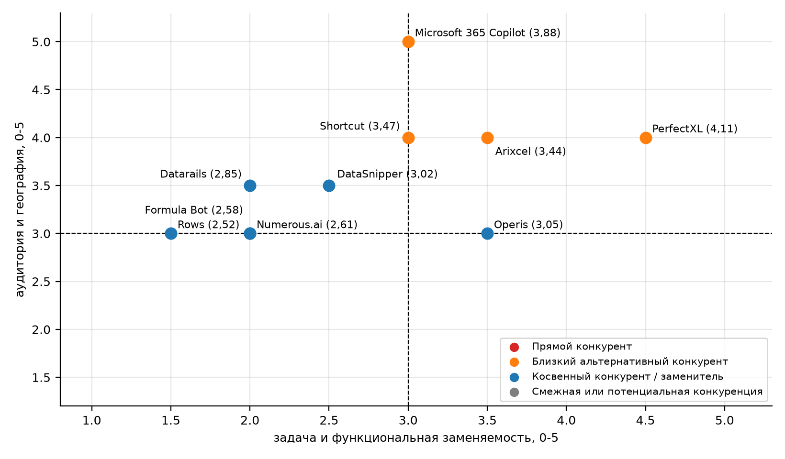
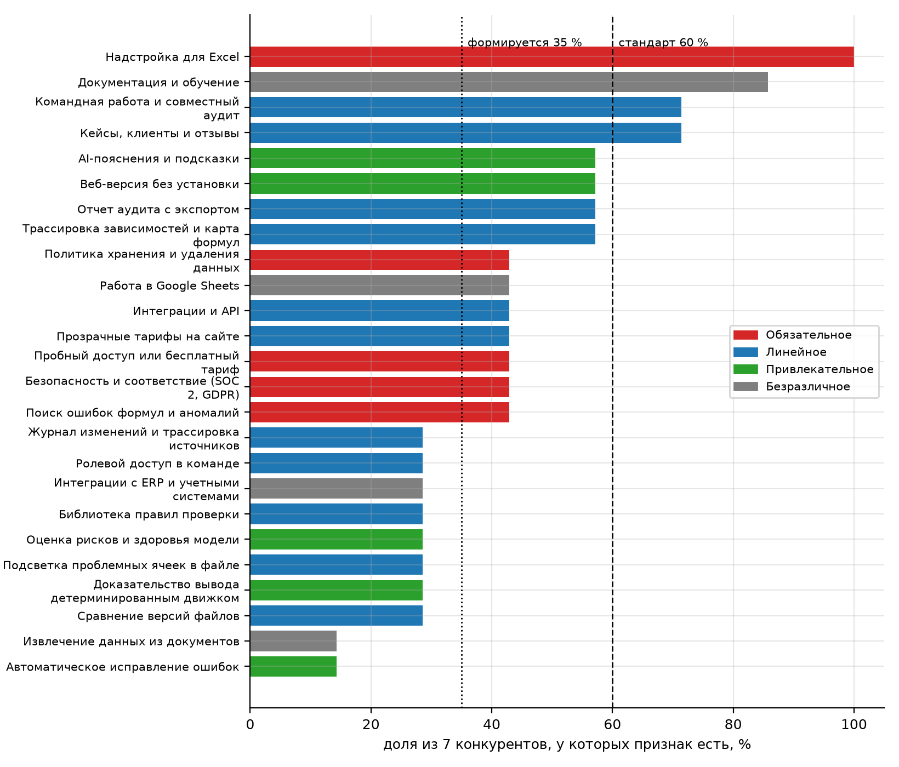
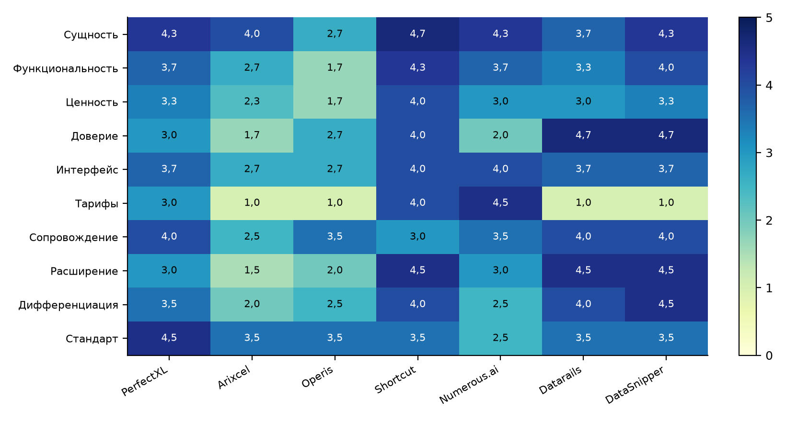
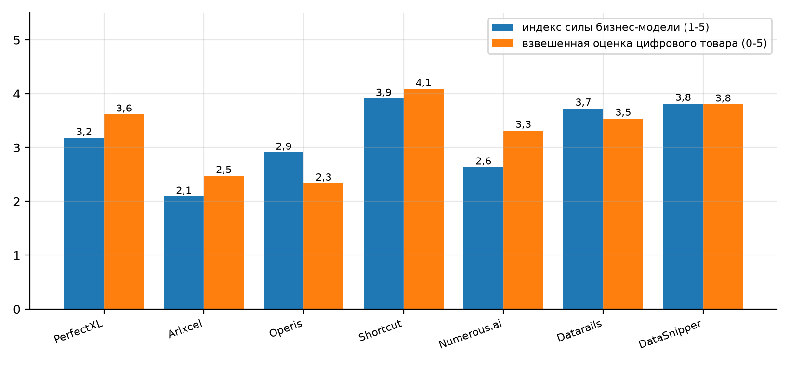

## 1 Цель работы

Цель работы: классифицировать компании рынка онлайн-проверки Excel-моделей по уровням конкуренции [1], определить рыночный стандарт цифрового товара и зоны дифференциации по моделям Левитта и Кано [2], реконструировать бизнес-модели конкурентов по их сайтам [3] и сформулировать на этой основе минимальный цифровой товар и бизнес-гипотезы TableMind для ЛР6.

Для достижения цели решены задачи: сформирован реестр из 10 компаний и классифицирован по 10 критериям с ограничителями; для 7 конкурентов зафиксированы страницы сайтов и доказательства; рассчитаны признаки по уровням Левитта и категории Кано; выполнена сравнительная оценка товаров по 25 критериям; определены рыночные стандарты и зоны дифференциации; реконструированы девять блоков бизнес-модели, монетизация, каналы и операционная модель; выявлены преимущества конкурентов; сформулирован собственный цифровой товар.

Работа опирается на результаты ЛР1-ЛР4 [4]: границы рынка (онлайн-проверка Excel-моделей, англоязычные страны и ЕС), снимок Similarweb от 03.10.2026, отзывы G2 и вывод ЛР4 о том, что заменители создают критичное давление. Факты о проекте (тарифы, цели, сроки) сверены с ПЗ1 и ПЗ4 [5]. Все оценки по сайтам являются оценочными суждениями аналитика по просмотренным страницам и требуют проверки.

## 2 Ход работы

Работа выполнена в трех блоках по трем методикам: классификация компаний, анализ цифрового товара и анализ бизнес-моделей. Каждый блок реализован в отдельной книге Excel, а ее значения независимо пересчитаны скриптом на Python.

### 2.1 Контур анализа и реестр компаний

Контур определен списком ЛР4: специализированные инструменты проверки (PerfectXL, Arixcel, Operis), AI-агенты и помощники (Shortcut, Numerous.ai, Formula Bot, Rows), платформы финансов и аудита (Datarails, DataSnipper) и встроенный AI Microsoft 365 Copilot. Для анализа товара и бизнес-модели выбраны 7 конкурентов с достаточными открытыми данными (норма шаблона 5-12), для классификации - 10 компаний.

В таблице 1 представлено: реестр компаний анализа.

Таблица 1 – Реестр компаний анализа

| ID | Компания | Тип | Основной цифровой товар | Сегмент |
|---|---|---|---|---|
| K001 | PerfectXL | специализированный инструмент | аудит Excel: риски, потоки данных, сравнение | аудит, консалтинг, страхование |
| K002 | Arixcel | специализированный инструмент | надстройка навигации и аудита моделей | аналитики, моделисты |
| K003 | Operis | консалтинг и инструмент | аудит моделей и надстройка OAK | проектное финансирование |
| K004 | Shortcut | AI-агент | AI-агент для финансовых моделей в Excel | финансовые институты, FP&A |
| K005 | Numerous.ai | AI-помощник | функция =AI в Sheets и Excel | массовые пользователи |
| K006 | Datarails | FP&A-платформа | FinanceOS над Excel | финансовые команды среднего размера |
| K007 | DataSnipper | платформа аудита | агентная автоматизация аудита | аудиторские фирмы |
| K008 | Rows | электронная таблица с AI | альтернативная таблица с AI-функциями | команды и бизнес |
| K009 | Formula Bot | AI-помощник | генерация формул и анализ данных | массовые пользователи |
| K010 | Microsoft 365 Copilot | встроенный AI | AI-ассистент внутри Excel | корпоративные пользователи Microsoft 365 |

Реестр охватывает прямые инструменты проверки, три AI-помощника, две платформы и встроенный AI Microsoft. Первые семь компаний (K001-K007) совпадают с конкурентами C01-C07 в книгах товара и бизнес-модели.

### 2.2 Классификация по уровням конкуренции

Методика [1] оценивает каждую компанию по 10 критериям от 0 до 5 с весами и ограничителями: прямым конкурентом нельзя назвать компанию, у которой совпадение потребительской задачи или функциональная заменяемость ниже 3 баллов. Взвешенный балл переводится в уровень: 4,20-5,00 - прямой конкурент; 3,40-4,19 - близкий альтернативный; 2,50-3,39 - косвенный или заменитель; 1,60-2,49 - смежная конкуренция.

В таблице 2 представлено: критерии и веса классификации.

Таблица 2 – Критерии и веса классификации

| Код | Критерий | Вес |
|---|---|---|
| C1 | Потребительская задача | 20 |
| C2 | Целевая аудитория | 15 |
| C3 | Функциональная заменяемость товара | 18 |
| C4 | Сценарий использования | 10 |
| C5 | Ценовой уровень и форма оплаты | 8 |
| C6 | Каналы продаж и привлечения | 8 |
| C7 | География, язык, регулирование | 7 |
| C8 | Модель монетизации | 7 |
| C9 | Уровень зрелости и доверия | 4 |
| C10 | Вероятность переключения клиента | 3 |

Наибольшие веса имеют потребительская задача (20), функциональная заменяемость (18) и целевая аудитория (15): именно эти критерии определяют, считает ли клиент товар заменой. Остальные критерии (цена, каналы, география, монетизация, зрелость, переключение) уточняют близость.

В таблице 3 представлено: баллы критериев и уровень конкуренции.

Таблица 3 – Баллы критериев и уровень конкуренции

| Компания | Задача (C1) | Аудитория (C2) | Заменяемость (C3) | Балл | Уровень |
|---|---|---|---|---|---|
| PerfectXL | 5 | 4 | 4 | 4,11 | Близкий альтернативный конкурент |
| Arixcel | 4 | 4 | 3 | 3,44 | Близкий альтернативный конкурент |
| Operis | 4 | 3 | 3 | 3,05 | Косвенный конкурент / заменитель |
| Shortcut | 3 | 4 | 3 | 3,47 | Близкий альтернативный конкурент |
| Numerous.ai | 2 | 2 | 2 | 2,61 | Косвенный конкурент / заменитель |
| Datarails | 2 | 3 | 2 | 2,85 | Косвенный конкурент / заменитель |
| DataSnipper | 3 | 3 | 2 | 3,02 | Косвенный конкурент / заменитель |
| Rows | 1 | 2 | 2 | 2,52 | Косвенный конкурент / заменитель |
| Formula Bot | 2 | 2 | 2 | 2,58 | Косвенный конкурент / заменитель |
| Microsoft 365 Copilot | 3 | 5 | 3 | 3,88 | Близкий альтернативный конкурент |

Ни одна компания не достигает порога прямого конкурента (4,20): ближе всех PerfectXL (4,11), затем Microsoft 365 Copilot (3,88), Shortcut (3,47) и Arixcel (3,44) - это близкие альтернативные конкуренты. Остальные - косвенные конкуренты и заменители. Полный набор десяти баллов хранится в книге.

В таблице 4 представлено: ограничители классификации.

Таблица 4 – Ограничители классификации

| Компания | Сработавший ограничитель |
|---|---|
| Numerous.ai | Низкое совпадение задачи |
| Datarails | Низкое совпадение задачи |
| DataSnipper | Низкая товарная заменяемость |
| Rows | Низкое совпадение задачи |
| Formula Bot | Низкое совпадение задачи |

Ограничители понижают уровень компаний, которые по сумме баллов могли бы выглядеть ближе: AI-помощники решают другую задачу (генерация формул), а платформы и аудиторские инструменты слабо заменяют проверку произвольного Excel-файла. Это согласуется с выводом ЛР4: заменители опасны не как прямые аналоги, а как привычный способ работы.

На рисунке 1 показано: карта конкурентной близости (в скобках взвешенный балл).

Рисунок 1 – Карта конкурентной близости (в скобках взвешенный балл)

Ближе всего к ядру прямой конкуренции стоят PerfectXL и Arixcel по задаче и заменяемости, Microsoft Copilot - по аудитории и рынку, но не по задаче; AI-помощники и Datarails находятся в зоне косвенной конкуренции. Пустое поле в правом верхнем углу означает, что полностью заменяющего TableMind товара на рынке нет.

Вывод по классификации: прямых конкурентов в строгом смысле нет, есть четыре близких альтернативных конкурента (PerfectXL, Copilot, Shortcut, Arixcel) и шесть косвенных. Для стратегии это означает, что TableMind входит в нишу с неполным покрытием, но клиент уже решает ту же задачу другими способами.

### 2.3 Карта страниц сайтов и доказательства

Для каждого вывода зафиксирована страница сайта и наблюдаемый факт. Страницы просмотрены 03.10.2026: главные, цены, отзывы и каталог надстроек [6]-[13]. Достоверность оценивается от 1 до 5.

В таблице 5 представлено: проверенные страницы и факты.

Таблица 5 – Проверенные страницы и факты

| Конкурент | Страница | Наблюдаемый факт | Достоверность |
|---|---|---|---|
| PerfectXL | Главная | Software That Helps You Master Excel; клиенты Deloitte, Grant Thornton, BDO; премия 2026 | 5 |
| PerfectXL | Цены | один инструмент от 69 EUR в месяц; пакеты без цен; обучение от 49 EUR | 5 |
| Arixcel | Главная | надстройка Excel: логика формул, сравнение, карта формул, трассировка | 4 |
| Operis | Главная | Advisory, Modelling, Model Audit, Tax & Accounting, OAK, Training; с 1990 г., более 1 200 проектов | 4 |
| Shortcut | Главная | AI-агент для финансистов, SOC 2 Type II, Excel Add-in, веб, CLI | 5 |
| Shortcut | Цены | Free, Pro 100 USD, Teams 320 USD + 100 USD за место, Enterprise | 5 |
| Numerous.ai | Главная | ChatGPT в Sheets и Excel, функция =AI, без API-ключей | 5 |
| Numerous.ai | Цены | 10 USD в месяц, 7 дней пробного периода | 5 |
| Datarails | Главная | Trusted AI for Finance Teams; 600+ интеграций; 2 000+ клиентов | 5 |
| DataSnipper | Главная | End-to-end Agentic Automation for Audit and Finance; SOC 2, GDPR, AI Act | 5 |
| Shortcut | Отзывы | карточки на G2 нет | 4 |
| Datarails | Отзывы | G2 386 отзывов, 4,6 | 5 |
| PerfectXL | Отзывы | G2 0 отзывов; Trustpilot 0 | 5 |
| Arixcel | Отзывы | G2 Arixcel Explorer 4,0 (1 отзыв) | 4 |
| Operis | AppSource | OAK (Excel add-in) указан на сайте; в AppSource по запросу formula checker найден 1 результат | 3 |
| DataSnipper | AppSource | DataSnipper for Excel Online в выдаче по запросу excel audit | 4 |

Всего проверено 16 страниц (норма шаблона - 30 и более), то есть по 2-3 страницы на конкурента. Этого достаточно для обзорных выводов, но не для детального сравнения; недостающие страницы (документация, безопасность, регистрация, оплата) вынесены в приложение Б.

### 2.4 Цифровой товар: модели Левитта и Кано

Модель Левитта [14] раскладывает товар на пять уровней: базовая выгода, родовой товар, ожидаемый товар, расширенный товар и потенциальный товар. Модель Кано [15] относит каждый признак к категории: обязательное, линейное, привлекательное или безразличное. Категории Кано в шаблоне назначаются аналитиком; опрос пользователей не проводился, он вынесен в приложение Б как модельный.

В таблице 6 представлено: признаки товара по Кано и их распространенность.

Таблица 6 – Признаки товара по Кано и их распространенность

| ID | Признак | Категория | Вес | Конкурентов | Средняя сила | Статус | Решение |
|---|---|---|---|---|---|---|---|
| R001 | Поиск ошибок формул и аномалий | Обязательное | 5 | 3 из 7 | 3,33 | Потенциальный обязательный разрыв | включить в MVP |
| R002 | Трассировка зависимостей и карта формул | Линейное | 4 | 4 из 7 | 3,50 | Конкурентная норма с влиянием на выбор | включить во второй релиз |
| R003 | Сравнение версий файлов | Линейное | 4 | 2 из 7 | 3,50 | Зона усиления ценности | рассмотреть как дифференциацию |
| R004 | Отчет аудита с экспортом | Линейное | 4 | 4 из 7 | 3,50 | Конкурентная норма с влиянием на выбор | включить во второй релиз |
| R005 | Надстройка для Excel | Обязательное | 5 | 7 из 7 | 4,00 | Минимальный рыночный стандарт | включить в MVP |
| R006 | Веб-версия без установки | Привлекательное | 3 | 4 из 7 | 3,50 | Переходит в ожидаемую норму | включить во второй релиз |
| R007 | AI-пояснения и подсказки | Привлекательное | 4 | 4 из 7 | 3,50 | Переходит в ожидаемую норму | включить во второй релиз |
| R008 | Доказательство вывода детерминированным движком | Привлекательное | 5 | 2 из 7 | 2,50 | Зона дифференциации | рассмотреть как дифференциацию |
| R009 | Безопасность и соответствие (SOC 2, GDPR) | Обязательное | 5 | 3 из 7 | 4,67 | Потенциальный обязательный разрыв | включить в MVP |
| R010 | Пробный доступ или бесплатный тариф | Обязательное | 4 | 3 из 7 | 3,33 | Потенциальный обязательный разрыв | включить в MVP |
| R011 | Прозрачные тарифы на сайте | Линейное | 4 | 3 из 7 | 4,33 | Зона усиления ценности | включить во второй релиз |
| R012 | Интеграции и API | Линейное | 3 | 3 из 7 | 4,33 | Зона усиления ценности | включить во второй релиз |
| R013 | Кейсы, клиенты и отзывы | Линейное | 4 | 5 из 7 | 4,20 | Конкурентная норма с влиянием на выбор | включить в MVP |
| R014 | Документация и обучение | Безразличное | 2 | 6 из 7 | 3,50 | Не делать при дефиците ресурсов | включить в MVP |
| R015 | Командная работа и совместный аудит | Линейное | 3 | 5 из 7 | 3,60 | Конкурентная норма с влиянием на выбор | включить в MVP |
| R016 | Автоматическое исправление ошибок | Привлекательное | 4 | 1 из 7 | 3,00 | Зона дифференциации | рассмотреть как дифференциацию |

Единственный признак с долей 100 % - надстройка для Excel; он и есть минимальный рыночный стандарт. Три обязательных признака (поиск ошибок, безопасность и соответствие, пробный доступ) есть только у 3 из 7 конкурентов: это «потенциальный обязательный разрыв», который TableMind обязан закрыть уже в MVP. Доказательство вывода детерминированным движком и автоисправление встречаются у одного-двух игроков и образуют зоны дифференциации.

На рисунке 2 показано: доля конкурентов, у которых есть признак.

Рисунок 2 – Доля конкурентов, у которых есть признак

Рисунок показывает три группы признаков: стандарт (выше 60 %), формирующиеся (35-60 %) и редкие (ниже 35 %). Обязательные признаки, расположенные ниже линии стандарта, - основная возможность для первого игрока, который закроет их надежно и прозрачно.

В таблице 7 представлено: признаки по уровням Левитта.

Таблица 7 – Признаки по уровням Левитта

| Уровень | Количество признаков | Средняя оценка признака |
|---|---|---|
| 1. Базовая выгода | 3 | 4,17 |
| 2. Родовой товар | 11 | 3,56 |
| 3. Ожидаемый товар | 18 | 3,71 |
| 4. Расширенный товар | 24 | 2,63 |
| 5. Потенциальный товар | 3 | 3,33 |

В анализе 59 признаков конкурентов (норма шаблона - 40 и более). Больше всего признаков на уровне расширенного товара, но их средняя оценка самая низкая: лидеры конкурируют дополнениями, а базовая выгода и ожидаемый товар реализованы сильнее. Потенциальный уровень (доказательство, автоисправление) занят слабо.

### 2.5 Сравнительная оценка цифровых товаров

Сравнение выполнено по 25 критериям десяти групп (сущность товара, функциональность, ценность, доверие, интерфейс, тарифы, сопровождение, расширение, дифференциация, рыночный стандарт) по шкале 0-5 с весами критериев. Баллы поставлены по просмотренным страницам (допущение Д-22).

В таблице 8 представлено: взвешенная оценка товара конкурента.

Таблица 8 – Взвешенная оценка товара конкурента

| Конкурент | Тип | Взвешенная оценка (0-5) |
|---|---|---|
| Shortcut | частичный | 4,09 |
| DataSnipper | частичный | 3,80 |
| PerfectXL | прямой | 3,62 |
| Datarails | заменитель | 3,54 |
| Numerous.ai | заменитель | 3,32 |
| Arixcel | прямой | 2,48 |
| Operis | прямой | 2,34 |

Лидеры по сайту и товару - Shortcut (4,09) и DataSnipper (3,80); специализированные PerfectXL и Arixcel уступают по доверию, тарифам и безопасности. Среди прямых игроков PerfectXL заметно сильнее остальных.

На рисунке 3 показано: средние оценки групп критериев по конкурентам.

Рисунок 3 – Средние оценки групп критериев по конкурентам

Тепловая карта показывает, что слабое место специализированных игроков - группы «Доверие» и «Тарифы и оплата», а сильные места крупных платформ - «Доверие» и «Расширение товара». Именно по доверию и прозрачности цены TableMind может опередить прямых конкурентов на старте.

### 2.6 Рыночный стандарт и зоны дифференциации

Рыночный стандарт определяется долей конкурентов с признаком: не менее 60 % для товара (шаблон Левитта и Кано) и не менее 70 % для практик бизнес-модели. Признаки с долей 35-60 % считаются формирующимися, ниже 35 % - зонами дифференциации.

В таблице 9 представлено: рыночный стандарт цифрового товара.

Таблица 9 – Рыночный стандарт цифрового товара

| Признак | Категория Кано | Конкурентов | Доля | Статус |
|---|---|---|---|---|
| Поиск ошибок формул и аномалий | Обязательное | 3 | 43 % | Формирующаяся норма |
| Трассировка зависимостей и карта формул | Линейное | 4 | 57 % | Формирующаяся норма |
| Сравнение версий файлов | Линейное | 2 | 29 % | Проверить необходимость |
| Отчет аудита с экспортом | Линейное | 4 | 57 % | Формирующаяся норма |
| Надстройка для Excel | Обязательное | 7 | 100 % | Рыночный стандарт |
| Веб-версия без установки | Привлекательное | 4 | 57 % | Переходит в ожидаемое |
| AI-пояснения и подсказки | Привлекательное | 4 | 57 % | Переходит в ожидаемое |
| Доказательство вывода детерминированным движком | Привлекательное | 2 | 29 % | Зона дифференциации |
| Безопасность и соответствие (SOC 2, GDPR) | Обязательное | 3 | 43 % | Формирующаяся норма |
| Пробный доступ или бесплатный тариф | Обязательное | 3 | 43 % | Формирующаяся норма |
| Прозрачные тарифы на сайте | Линейное | 3 | 43 % | Формирующаяся норма |
| Интеграции и API | Линейное | 3 | 43 % | Формирующаяся норма |
| Кейсы, клиенты и отзывы | Линейное | 5 | 71 % | Рыночный стандарт |
| Документация и обучение | Безразличное | 6 | 86 % | Низкий приоритет |
| Командная работа и совместный аудит | Линейное | 5 | 71 % | Рыночный стандарт |
| Автоматическое исправление ошибок | Привлекательное | 1 | 14 % | Зона дифференциации |

Статусы разделяют минимальную планку (надстройка Excel), потенциальные обязательные разрывы (поиск ошибок, безопасность, пробный доступ), нормы с влиянием на выбор (кейсы, документация, командная работа) и зоны дифференциации (доказательство, автоисправление, сравнение файлов). Минимальный товар TableMind должен закрыть первые три группы.

### 2.7 Паспорта цифровых товаров конкурентов

В таблице 10 представлено: паспорта цифровых товаров.

Таблица 10 – Паспорта цифровых товаров

| Конкурент | Цифровой товар | Сегмент | Монетизация |
|---|---|---|---|
| PerfectXL | PerfectXL Suite: Risk Finder, Explore, Compare, Highlighter, Formula Inspector, Source Inspector | аудиторские, налоговые и консалтинговые фирмы, страховщики, пенсионные фонды, контролеры | подписка на инструменты и пакеты, услуги и обучение |
| Arixcel | Arixcel Explorer: логика формул, сравнение таблиц, карта формул, трассировка зависимых ячеек | профессиональные пользователи Excel и моделисты | лицензия на надстройку (2,75 GBP за пользователя в месяц, срок 12-36 месяцев) |
| Operis | Model Audit, OAK (надстройка Excel), онлайн-курс по моделированию | проектное финансирование, инфраструктура | консалтинг и аудит моделей, надстройка OAK, обучение |
| Shortcut | AI-агент для финансового моделирования в Excel, веб и CLI | хедж-фонды, PE, банки, управляющие активами, FP&A-команды | подписка Free / Pro / Teams / Enterprise |
| Numerous.ai | функция =AI для ChatGPT в Google Sheets и Excel | маркетологи, студенты, исследователи, менеджеры | подписка 10 USD в месяц |
| Datarails | FinanceOS: FP&A, закрытие месяца, денежные потоки, контроль расходов | CFO, финансовые директора и контролеры компаний среднего размера | подписка по запросу, демо |
| DataSnipper | агентная автоматизация аудита, надстройка Excel, извлечение данных из документов | внешние и внутренние аудиторы, налоговые специалисты, финансовый контроль | корпоративные продажи, демо |

Паспорта показывают разные товарные модели: надстройка-инструмент (PerfectXL, Arixcel), услуга с инструментом (Operis), AI-агент (Shortcut), AI-функция (Numerous.ai), платформа (Datarails) и автоматизация аудита (DataSnipper). Модель TableMind - облачный сервис проверки с доказательством - не совпадает полностью ни с одной.

В таблице 11 представлено: конкурентные преимущества по товару.

Таблица 11 – Конкурентные преимущества по товару

| ID | Конкурент | Преимущество | Тип | Индекс | Вывод |
|---|---|---|---|---|---|
| A001 | PerfectXL | Методология 39 принципов, подтвержденная вузами, и клиенты Big-4 | доверие | 3,95 | Потенциальное преимущество |
| A002 | PerfectXL | Широкий набор инструментов проверки в одном пакете | товарное | 3,75 | Потенциальное преимущество |
| A003 | Shortcut | Прозрачная лестница тарифов и бесплатный вход | коммерческое | 3,70 | Потенциальное преимущество |
| A004 | Shortcut | SOC 2 Type II и нулевое хранение данных | доверие | 4,50 | Сильное преимущество |
| A005 | Numerous.ai | Минимальная цена и мгновенная установка | ценовое | 2,90 | Слабое преимущество |
| A006 | Datarails | Более 600 интеграций и 2 000 клиентов | ресурсное | 4,25 | Сильное преимущество |
| A007 | DataSnipper | Доверие Big-4 и соответствие регуляторике аудита | доверие | 4,75 | Сильное преимущество |
| A008 | Operis | Тридцатилетняя репутация в проектном финансировании | репутационное | 3,95 | Потенциальное преимущество |

Сильных преимуществ с индексом выше 4,2 нет: все найденные преимущества потенциальные. Наиболее значимы доверие и безопасность (Shortcut, DataSnipper), методология и клиенты Big-4 у PerfectXL и интеграции Datarails; их нужно учесть при формулировке ценности TableMind.

### 2.8 Бизнес-модели конкурентов

Бизнес-модели реконструированы по сайтам в девяти блоках шаблона Остервальдера и Пинье [16] с добавлением данных и сетевых эффектов. Полнота профилей - 100 %, средняя доказательность выводов - 4,5 из 5 (на уровне страниц, которые удалось просмотреть).

В таблице 12 представлено: сегменты, ценность и доходы конкурентов.

Таблица 12 – Сегменты, ценность и доходы конкурентов

| Конкурент | Целевые сегменты | Ценностное предложение | Потоки доходов |
|---|---|---|---|
| PerfectXL | аудит, налоги, консалтинг, страхование и пенсии; контролеры и проверяющие модели | контроль качества и рисков Excel-моделей, 39 принципов | подписка на инструменты (от 69 EUR в месяц), пакеты по запросу, проекты, обучение |
| Arixcel | профессиональные пользователи Excel | быстрая навигация по формулам и сравнение файлов | лицензия 2,75 GBP за пользователя в месяц (срок 12-36 месяцев) |
| Operis | проектное финансирование и инфраструктура | независимая проверка моделей с репутацией 30 лет | гонорары за аудит и консалтинг, обучение, надстройка |
| Shortcut | хедж-фонды, PE, банки, управляющие активами, FP&A-команды | точный финансовый AI-агент для моделей и анализа | подписки Free, Pro 100 USD, Teams 320 USD + 100 USD за место, Enterprise |
| Numerous.ai | маркетологи, студенты, исследователи, менеджеры | ChatGPT внутри таблиц без API-ключей | подписка 10 USD в месяц, корпоративный тариф |
| Datarails | CFO, контролеры и финансовые команды среднего размера | доверенный AI для финансов поверх Excel | подписка по запросу, модульные продукты |
| DataSnipper | аудиторские фирмы, внутренний аудит, налоги, государственный аудит | автоматизация проверки доказательств аудита | корпоративные лицензии (цена не показана) |

Блоки показывают две модели: самообслуживание с подпиской (Shortcut, Numerous.ai) и продажи через менеджера и демо (Datarails, DataSnipper, PerfectXL в корпоративных пакетах, Operis через консультанта). TableMind с Free, Pro 19 EUR и Team 29 EUR ближе к первой модели с корпоративным расширением.

В таблице 13 представлено: каналы, отношения, ресурсы и данные.

Таблица 13 – Каналы, отношения, ресурсы и данные

| Конкурент | Каналы | Отношения с клиентами | Ключевые ресурсы | Данные и сетевые эффекты |
|---|---|---|---|---|
| PerfectXL | прямой трафик 40 %, органический поиск 33 %, рефералы 11 %; английский, нидерландский, немецкий | демо и пробный период 30 дней, академия, поддержка в пакетах Enterprise | методология 39 принципов, команда разработки, партнерства с вузами | накопленные правила и сравнения файлов; сетевых эффектов нет |
| Arixcel | прямые заходы 39 %, органика 33 %, рефералы 11 % | загрузка и активация, справка | надстройка, малая команда | не показано |
| Operis | прямые заходы 27 %, органика 29 %, рефералы 8 %, соцсети 10 % | консультанты, сопровождение проектов | эксперты и репутация, более 1 200 проектов | знания и шаблоны, масштабируемость ограничена |
| Shortcut | прямые заходы 56 %, органика 32 %, рефералы 6 % | самообслуживание и корпоративные продажи, кейсы клиентов | собственная модель Pivot, провайдер LLM, команда безопасности | данные использования улучшают агента; сетевые эффекты слабые |
| Numerous.ai | органика 56 %, рефералы 8 %, прямые 26 % | самообслуживание, поддержка по почте | интеграция с провайдером LLM, кэширование | кэширование результатов снижает затраты; сетевых эффектов нет |
| Datarails | прямые заходы 59 %, органика 12 %, платный поиск 12 % | демо, менеджеры по работе с клиентами, Trust Center | интеграции 600+, данные клиентов, команда продаж | консолидированные данные клиентов; умеренные эффекты данных |
| DataSnipper | корпоративные продажи, демо, магазин надстроек | демо, ROI-калькулятор, поддержка, сообщество | технологии извлечения данных, клиентская база Big-4 и крупных фирм | данные документов и шаблоны проверок; сильные эффекты данных у лидера |

Каналы большинства конкурентов - прямые заходы и органический поиск, платная реклама почти не используется (согласуется с ЛР4). Сетевые эффекты слабые у всех; сильнее всего эффект данных у платформ (Datarails, DataSnipper).

В таблице 14 представлено: монетизация конкурентов.

Таблица 14 – Монетизация конкурентов

| Конкурент | Модель | Страница цен | Бесплатный уровень | Пробный доступ | Прозрачность цены (1-5) | Гибкость модели (1-5) |
|---|---|---|---|---|---|---|
| PerfectXL | подписка + услуги | perfectxl.com/pricing | нет | да (30 дней, Formula Inspector) | 3 | 3 |
| Arixcel | лицензия | arixcel.com/explorer/download | нет | да (пробный режим) | 3 | 2 |
| Operis | услуги + лицензия | operisanalysiskit.com/oak-price | нет | да (30 дней по запросу) | 3 | 2 |
| Shortcut | подписка по местам | shortcut.ai/pricing | да (20 кредитов в неделю) | да (Free) | 5 | 4 |
| Numerous.ai | подписка | numerous.ai/pricing | нет | да (7 дней, 1 USD) | 5 | 2 |
| Datarails | подписка по запросу | datarails.com/pricing | нет | демо | 1 | 3 |
| DataSnipper | корпоративная лицензия | не показано | нет | демо | 1 | 2 |

Лестницу от бесплатного тарифа до корпоративного прозрачно показывают только Shortcut и Numerous.ai; у специализированных игроков показана единичная цена (Arixcel 2,75 GBP за пользователя в месяц, Operis OAK 311,66 GBP в год, PerfectXL от 69 EUR) без лестницы и бесплатного входа, а у платформ (DataSnipper, Datarails) цена только по запросу. Прозрачная цена и бесплатный вход - возможность дифференциации в нише проверки.

В таблице 15 представлено: каналы и воронка конкурентов.

Таблица 15 – Каналы и воронка конкурентов

| Конкурент | Главные каналы | Призыв к действию | Тип воронки | Сложность пути (1-5) | Сила воронки (1-5) |
|---|---|---|---|---|---|
| PerfectXL | прямой, органика, рефералы | Get started now / 30-day free trial | смешанная | 3 | 3 |
| Arixcel | прямой, органика | Download / Activate | самостоятельная покупка | 3 | 2 |
| Operis | прямой, органика, соцсети | Contact | консультативная | 4 | 2 |
| Shortcut | прямой, органика | Start for Free | самостоятельная покупка | 2 | 5 |
| Numerous.ai | органика, прямой | Get started | самостоятельная покупка | 2 | 4 |
| Datarails | прямой, органика, платный поиск | Request Demo | продажа через менеджера | 4 | 4 |
| DataSnipper | корпоративные продажи, магазин надстроек | Book a demo | продажа через менеджера | 4 | 4 |

Самые сильные воронки у Shortcut (бесплатный старт, доверие) и Numerous.ai (установка за минуты); корпоративные воронки Datarails и DataSnipper длиннее, но опираются на сильное доверие. Воронка TableMind должна сочетать быстрый бесплатный вход и элементы доверия.

В таблице 16 представлено: операционная модель конкурентов.

Таблица 16 – Операционная модель конкурентов

| Конкурент | Ключевые ресурсы | Технологии | Масштабируемость (1-5) | Трудность копирования (1-5) | Операционный риск |
|---|---|---|---|---|---|
| PerfectXL | методология и команда разработки | надстройка Excel и веб | 3 | 3 | зависимость от Excel-платформы |
| Arixcel | малая команда | надстройка Excel | 2 | 2 | малый масштаб |
| Operis | эксперты | OAK | 2 | 4 | масштабирование через людей |
| Shortcut | модель и вычисления, безопасность | агент, Excel add-in, CLI | 4 | 3 | зависимость от провайдера LLM |
| Numerous.ai | надстройка и кэш | функция AI в ячейке | 4 | 1 | легко копируется |
| Datarails | команда интеграций и продаж | платформа FinanceOS | 3 | 4 | длинный цикл внедрения |
| DataSnipper | технологии извлечения данных, клиентская база | платформа Alwin, AI Vision | 3 | 4 | зависимость от аудиторских фирм |

Легче всего копируется Numerous.ai (1 из 5) - это подтверждает высокую угрозу новых участников из ЛР4. Устойчивее остальных модели с интеграциями и клиентской базой (Datarails, DataSnipper) и с репутацией (Operis).

В таблице 17 представлено: индекс силы бизнес-модели.

Таблица 17 – Индекс силы бизнес-модели

| Конкурент | Индекс силы (1-5) | Доказательность | Полнота | Итог с учетом надежности |
|---|---|---|---|---|
| Shortcut | 3,91 | 4,7 | 100 % | 4,26 |
| Datarails | 3,73 | 5,0 | 100 % | 4,24 |
| DataSnipper | 3,82 | 4,5 | 100 % | 4,17 |
| PerfectXL | 3,18 | 5,0 | 100 % | 3,91 |
| Numerous.ai | 2,64 | 5,0 | 100 % | 3,58 |
| Operis | 2,91 | 3,5 | 100 % | 3,37 |
| Arixcel | 2,09 | 4,0 | 100 % | 3,00 |

Сильнейшие модели у Shortcut (4,26), Datarails и DataSnipper; слабейшая у Arixcel (3,00). Рейтинг не совпадает с трафиком: PerfectXL имеет больший релевантный трафик, чем Datarails по доле, но уступает по силе модели.

На рисунке 4 показано: сила бизнес-модели и оценка цифрового товара конкурентов.

Рисунок 4 – Сила бизнес-модели и оценка цифрового товара конкурентов

Рисунок показывает согласованность рядов: Shortcut, Datarails и DataSnipper лидируют и по модели, и по товару. Numerous.ai выше по товару, чем по модели из-за простоты, а Arixcel замыкает оба ряда.

В таблице 18 представлено: практики бизнес-модели и рыночный стандарт (порог 70 %).

Таблица 18 – Практики бизнес-модели и рыночный стандарт (порог 70 %)

| Практика | Блок | Конкурентов | Доля | Статус |
|---|---|---|---|---|
| Надстройка Excel или Excel-интеграция | Цифровой товар | 7 | 100 % | рыночный стандарт |
| Прозрачные тарифы на сайте | Потоки доходов | 2 | 29 % | зона дифференциации |
| Бесплатный тариф или пробный период | Отношения с клиентами | 3 | 43 % | формирующийся стандарт |
| Запрос демо / консультация как основной вход | Каналы | 4 | 57 % | формирующийся стандарт |
| Раскрытие безопасности и соответствия | Ключевые ресурсы | 3 | 43 % | формирующийся стандарт |
| Кейсы и клиенты на сайте | Ценностное предложение | 5 | 71 % | рыночный стандарт |
| Корпоративные пакеты и продажи | Потоки доходов | 5 | 71 % | рыночный стандарт |
| Обучение и документация | Отношения с клиентами | 6 | 86 % | рыночный стандарт |
| AI-пояснения в продукте | Цифровой товар | 4 | 57 % | формирующийся стандарт |
| Доказательство вывода проверяемой логикой | Цифровой товар | 2 | 29 % | зона дифференциации |
| Подписка по пользователям или местам | Потоки доходов | 4 | 57 % | формирующийся стандарт |
| Интеграции и API | Ключевые партнеры | 4 | 57 % | формирующийся стандарт |

Рыночными стандартами по порогу 70 % являются надстройка Excel, обучение и документация, кейсы и клиенты на сайте и корпоративные пакеты; формирующиеся - демо как вход, подписка по местам и интеграции; зоны дифференциации - прозрачные тарифы и доказательство вывода. TableMind должен выполнить стандарты и сделать ставку на зоны дифференциации.

### 2.9 Собственный цифровой товар и гипотезы для TableMind

На основе стандартов и разрывов сформулирована следующая рабочая формулировка. Цифровой товар TableMind - облачный сервис независимой проверки Excel-моделей для финансовых аналитиков, бухгалтеров, консультантов и малого бизнеса, который находит ошибки в формулах и логике и доказывает каждую находку вычислением, чтобы снизить риск неверных решений.

В таблице 19 представлено: минимальный товар и зоны дифференциации TableMind.

Таблица 19 – Минимальный товар и зоны дифференциации TableMind

| Группа | Признаки | Основание |
|---|---|---|
| Минимальный стандарт (MVP) | надстройка и веб-аудит файла, поиск ошибок формул, отчет аудита, личный кабинет | надстройка есть у 100 % конкурентов; поиск ошибок и отчет - ядро задачи |
| Потенциальные обязательные разрывы | безопасность и соответствие (GDPR), бесплатный тариф и пробный аудит | есть у 3 из 7 конкурентов; без них клиент не доверит файл |
| Нормы с влиянием на выбор | кейсы и отзывы, документация, командные места | есть у 5-6 из 7 конкурентов |
| Зоны дифференциации | доказательство вывода движком, автоисправление, прозрачные тарифы, сравнение файлов | есть у 1-3 из 7 конкурентов; соответствуют принципу «LLM предлагает, движок доказывает» |

Минимальный товар включает признаки стандарта и обязательных разрывов, а ставка делается на доказательность вывода и прозрачность цены. Эти группы переходят в ЛР6 как вход для ценностного предложения и требований к первому релизу.

В таблице 20 представлено: гипотезы бизнес-модели TableMind по девяти блокам.

Таблица 20 – Гипотезы бизнес-модели TableMind по девяти блокам

| Блок | Гипотеза | Основание |
|---|---|---|
| Сегменты | финансовые аналитики, бухгалтеры и аудиторы, консультанты, МСП с финансовой функцией | ЛР2-3, четыре сегмента с достаточной платежеспособностью |
| Ценностное предложение | независимая проверка с доказательством каждой находки | зона дифференциации: доказательство вывода есть у 2 из 7 |
| Каналы | поиск по проблемным запросам, AppSource, партнеры, Product Hunt | ЛР4: прямой трафик и органика - основные каналы |
| Отношения | бесплатный старт, самообслуживание, шаблоны отчетов, обучение | стандарты: пробный доступ и документация |
| Потоки доходов | Free, разовый аудит 9 EUR, Pro 19 EUR, Team 29 EUR за место | ПЗ1; цена в рыночном коридоре (ЛР2-3) |
| Ключевые ресурсы | движок проверки, база правил, eval-набор, безопасность и GDPR | барьер: доверие и данные; безопасность - обязательный разрыв |
| Ключевые виды деятельности | развитие правил и движка, оценка точности, контент и партнерства | метрики качества ПЗ1 (precision не ниже 90 %) |
| Ключевые партнеры | Microsoft AppSource, бухгалтерские и консалтинговые фирмы, провайдеры LLM и облака | ЛР4: поставщики и каналы |
| Структура затрат | вычисления и LLM, разработка, продвижение, поддержка | затраты на вычисления у AI-конкурентов высокие |

Гипотезы связывают результаты ЛР1-ЛР5 в один контур и служат черновиком для Канваса бизнес-модели в ЛР6; каждая требует проверки на MVP.

### 2.10 Проверка расчетов и ограничения

Независимый пересчет на Python охватил взвешенные баллы классификации, доли конкурентов по признакам Кано, средние оценки сравнения, индексы бизнес-моделей и доли практик. Из 70 контрольных величин расхождений выше допуска нет (70 из 70); допуск 1e-6 для прямых формул и 5e-3 для величин, округленных в книге до двух знаков. Ошибок формул в трех книгах нет.

Ограничения: оценки по сайтам - суждения аналитика по 2-3 страницам на конкурента; цены DataSnipper и Datarails не опубликованы (цены Arixcel и Operis найдены в конце работы и внесены в книгу бизнес-моделей, приложение Д); отзывы собраны на G2 и сайтах (Capterra, Trustpilot - частично); категории Кано назначены без опроса пользователей; данные о выручке и финансировании конкурентов не получены. Все эти пункты перечислены в приложении Б.

## 3 Ответы на контрольные вопросы

Ответы даны по контрольным показателям дашборда шаблона анализа товара [2] (раздел «Норма контроля») и по чек-листам методик [1], [3].

1. Сколько конкурентов в анализе и достаточно ли их (норма 5-12)? Семь конкурентов для товара и бизнес-модели и десять компаний для классификации; норма выполнена.

2. Сколько страниц проверено (норма 30 и более)? 16 страниц; норма не выполнена, недостающие страницы указаны в приложении Б.

3. Сколько признаков по Левитту выделено (норма 40 и более)? 59 признаков; норма выполнена.

4. Сколько требований по Кано выделено (норма 25 и более)? 16 требований; норма не выполнена, список может быть расширен после опроса.

5. Определены ли рыночные стандарты и зоны дифференциации? Да, таблицы 9 и 18.

6. Есть ли у каждого вывода страница и факт? Да, таблица 5; достоверность 3-5.

7. Классифицированы ли компании по уровням конкуренции с ограничителями? Да, таблицы 3 и 4.

8. Реконструированы ли девять блоков бизнес-модели конкурентов? Да, таблицы 12 и 13.

9. Определен ли собственный цифровой товар и гипотезы для ЛР6? Да, таблицы 19 и 20.

## Выводы

Классификация по уровням конкуренции показала отсутствие строго прямых конкурентов: ближе всех PerfectXL (4,11), Microsoft Copilot (3,88), Shortcut и Arixcel относятся к близким альтернативным, остальные шесть - к косвенным и заменителям. Рыночный стандарт цифрового товара минимален: надстройка Excel (100 %); обязательные признаки поиска ошибок, безопасности и пробного доступа есть лишь у трех из семи конкурентов.

Зонами дифференциации являются доказательство вывода детерминированным движком (2 из 7), автоисправление (1 из 7), прозрачные тарифы (2 из 7) и сравнение файлов. Сильнейшие бизнес-модели у Shortcut, Datarails и DataSnipper, слабейшие - у Arixcel и Operis; прямые конкуренты слабы в доверии и ценообразовании.

Для TableMind это означает следующее: минимальный товар должен закрыть стандарт и обязательные разрывы (надстройка и веб, поиск ошибок, GDPR, бесплатный старт), а позиционирование строится на независимом доказательстве находок и прозрачной цене. Эти выводы передаются в ЛР6 как банк выводов, стандарт товара и зоны дифференциации.

## Список использованных источников

1. Методика классификации компаний по уровням конкуренции; шаблон Excel классификации. Методические материалы дисциплины «Электронный бизнес» к лабораторной работе № 5. – Минск : БГУИР, 2026.

2. Методика анализа конкурентов по сайтам: цифровой товар (модели Левитта и Кано); шаблон Excel анализа конкурентов. Методические материалы дисциплины «Электронный бизнес». – Минск : БГУИР, 2026.

3. Методика анализа бизнес-модели конкурентов по сайтам; шаблон Excel анализа бизнес-модели. Методические материалы дисциплины «Электронный бизнес». – Минск : БГУИР, 2026.

4. Земляник, Р. В. Отчеты по лабораторным работам № 1, № 2–3 и № 4 по дисциплине «Электронный бизнес» / Р. В. Земляник. – Минск : БГУИР, 2026.

5. Земляник, Р. В. Концепция проекта TableMind; WBS, сетевой график и диаграмма Ганта TableMind: отчеты по практическим занятиям по дисциплине «Управление проектами» / Р. В. Земляник. – Минск : БГУИР, 2026.

6. PerfectXL [Электронный ресурс]. – Режим доступа: https://www.perfectxl.com/. – Дата доступа: 03.10.2026.

7. Shortcut [Электронный ресурс]. – Режим доступа: https://www.shortcut.ai/. – Дата доступа: 03.10.2026.

8. Numerous.ai [Электронный ресурс]. – Режим доступа: https://www.numerous.ai/. – Дата доступа: 03.10.2026.

9. Datarails [Электронный ресурс]. – Режим доступа: https://datarails.com/. – Дата доступа: 03.10.2026.

10. DataSnipper [Электронный ресурс]. – Режим доступа: https://www.datasnipper.com/. – Дата доступа: 03.10.2026.

11. Arixcel; Operis [Электронный ресурс]. – Режим доступа: https://www.arixcel.com/, https://www.operis.com/. – Дата доступа: 03.10.2026.

12. G2. Product reviews and ratings [Электронный ресурс]. – Режим доступа: https://www.g2.com/. – Дата доступа: 03.10.2026.

13. Microsoft Marketplace (AppSource). Microsoft 365 Apps [Электронный ресурс]. – Режим доступа: https://appsource.microsoft.com/. – Дата доступа: 03.10.2026.

14. Levitt, T. Marketing Success Through Differentiation - of Anything // Harvard Business Review. – 1980. – Vol. 58, No. 1. – P. 83–91.

15. Kano, N. Attractive Quality and Must-Be Quality / N. Kano, N. Seraku, F. Takahashi, S. Tsuji // Journal of the Japanese Society for Quality Control. – 1984. – Vol. 14, No. 2. – P. 39–48.

16. Osterwalder, A. Business Model Generation / A. Osterwalder, Y. Pigneur. – Hoboken : Wiley, 2010. – 288 p.

17. DataSnipper. DataSnipper Raises $100M at $1B Valuation [Электронный ресурс]. – Режим доступа: https://www.datasnipper.com/resources/datasnipper-raises-100m. – Дата доступа: 03.10.2026.

18. Calcalist. AI finance startup Datarails secures $70 million Series C at $550 million valuation [Электронный ресурс]. – Режим доступа: https://www.calcalistech.com/ctechnews/article/sk00jsmasbl. – Дата доступа: 03.10.2026.

19. TechCrunch. Fundamental Research Labs nabs $30M from Prosus to build AI agents for multiple verticals [Электронный ресурс]. – Режим доступа: https://techcrunch.com/2025/08/01/fundamental-research-labs-nabs-30-million-from-prosus-to-build-ai-agents-for-multiple-verticals. – Дата доступа: 03.10.2026.

20. PerfectXL. History; About [Электронный ресурс]. – Режим доступа: https://www.perfectxl.com/about-us/history/. – Дата доступа: 03.10.2026.

21. Tracxn. Operis Group Limited - 2025 Company Profile and Financials [Электронный ресурс]. – Режим доступа: https://tracxn.com/d/legal-entities/united-kingdom/operis-group-limited/__w42ZiByEDopkOdfs8fgtMvwsyZf6TUz2VmMuk1AKBc0. – Дата доступа: 03.10.2026.

22. ZoomInfo. Arixcel - Overview, News and Similar companies [Электронный ресурс]. – Режим доступа: https://www.zoominfo.com/c/arixcel/345716426. – Дата доступа: 03.10.2026.

23. EU-Startups. Berlin-based Rows raises 8 million euros to spread AI-powered spreadsheets around the world [Электронный ресурс]. – Режим доступа: https://www.eu-startups.com/2024/05/berlin-based-rows-raises-e8-million-to-spread-ai-powered-spreadsheets-around-the-world/. – Дата доступа: 03.10.2026.

24. Starter Story. I Turned My Side Project into a $26K/Month SaaS Tool (Formula Bot) [Электронный ресурс]. – Режим доступа: https://www.starterstory.com/stories/excelformulabot. – Дата доступа: 03.10.2026.

25. PitchBook. Numerous.ai 2026 Company Profile: Valuation, Funding and Investors [Электронный ресурс]. – Режим доступа: https://pitchbook.com/profiles/company/522717-76. – Дата доступа: 03.10.2026.

## Приложение А (обязательное) Допущения и параметры расчета

В приложении собраны допущения ЛР5 в дополнение к допущениям Д-01...Д-21 предыдущих работ.

В таблице 21 представлено: журнал допущений ЛР5.

Таблица 21 – Журнал допущений ЛР5

| № | Параметр | Значение | Обоснование | Влияние на результат | Как проверить |
|---|---|---|---|---|---|
| Д-22 | Баллы критериев классификации, сравнения и бизнес-модели | 0-5 и 1-5 по просмотренным страницам | нет количественных данных о качестве товара | уровни конкуренции и рейтинги | расширить проверку страниц, второй аналитик |
| Д-23 | Категории Кано | назначены аналитиком | опрос пользователей не проводился | статусы признаков | модельный или реальный опрос |
| Д-24 | Пороги стандарта | 60 % для товара, 70 % для практик бизнес-модели | значения шаблонов | список стандартов | порог 50 % и 80 % |
| Д-25 | Состав конкурентов | 7 для товара, 10 для классификации | достаточность открытых данных | доли признаков | добавить конкурентов после снимка Similarweb |

Допущения Д-22...Д-25 перенесены в общий журнал допущений проекта.

## Приложение Б (обязательное) Принятые решения по недостающим данным

Ниже для каждого элемента, которого нет в открытом доступе или который недоступен без платного сервиса, зафиксировано принятое решение: модельные данные, альтернативный источник или допущение.

В таблице 22 представлено: принятые решения по данным, которых нет в открытом доступе.

Таблица 22 – Принятые решения по данным, которых нет в открытом доступе

| № | Данные | Источник или метод | Принятое решение | Где использовано |
|---|---|---|---|---|
| 1 | Страницы сайтов конкурентов | сайты производителей | просмотрено 21 адрес (приложение Д): безопасность, цены, пробные периоды, интеграции | лист 02_Карта_сайтов |
| 2 | Цены Arixcel, Operis, DataSnipper, Datarails | страницы производителей и обзоры | Arixcel и Operis по страницам производителей; DataSnipper и Datarails - оценки третьих сторон (приложение Д ЛР2-3) | лист 06_Монетизация |
| 3 | Опрос Кано по 16 функциям | модель | приняты модельные данные (приложение Г, допущение Д-30) | лист 04_Кано |
| 4 | Отзывы и рейтинги | G2, Capterra, Trustpilot | данные трех площадок приведены в ЛР4 (приложение Г) | ЛР4 лист 05, лист 03_Факты_сайта |
| 5 | Выручка, финансирование и штат | открытые источники и публичные карточки Crunchbase | приняты найденные сведения по восьми компаниям (приложение Д); суммы раундов вне открытого доступа не используются | лист 08_Операц_модель |

Решения не изменили индексы классификации, Левитта и Кано и бизнес-моделей: 70 проверок Python и Excel сходятся.

## Приложение В (обязательное) Исправления и изменения шаблонов

В шаблонах выявлены ошибки и ограничения совместимости; ниже перечислено, что исправлено в рабочих копиях. Оригиналы не менялись.

В таблице 23 представлено: изменения шаблонов.

Таблица 23 – Изменения шаблонов

| № | Книга и лист | Проблема | Исправление |
|---|---|---|---|
| 1 | Классификация, листы 02, 04, 07 | функция XLOOKUP недоступна в используемой версии Excel, названия и сайты не подтягивались | XLOOKUP заменена на INDEX и MATCH (800 формул) |
| 2 | Классификация, лист 04 | SUMPRODUCT горизонтального диапазона баллов и вертикального диапазона весов давал #ЗНАЧ! | заменено на MMULT (100 формул) |
| 3 | Цифровой товар, лист 06 | столбец «Лидер» давал #Н/Д в пустых строках критериев | формула обернута в IFERROR |
| 4 | Бизнес-модель, лист 09 | строка весов блоков была пустой, индекс силы делился на ноль | строка весов заполнена единицами (равные веса), объединение ячеек снято |
| 5 | Бизнес-модель, лист 10 | доля конкурентов делилась на ячейку-заголовок «Значение» (12_Сводка!B4) | знаменатель заменен на 12_Сводка!B5 (число конкурентов) |

Исправления 1-5 затрагивают корректность формул и не меняют смысл методик.

## Приложение Г (справочное) Модельные данные опроса Кано

Для проверки методики Кано сгенерированы модельные ответы 30 условных респондентов на пары функциональных и дисфункциональных вопросов по 16 функциям (по решению автора, Р-8; генератор и файлы - в папке 00_Общее/Опрос_модельный, seed 20261003). Это модельные данные, а не опрос людей: вероятность согласия с категорией аналитика задана параметром 58 %, поэтому совпадение с таблицей 6 неизбежно и подтверждает только работу расчета, а не истинность категорий.

В таблице 24 представлено: модельные категории Кано по функциям.

Таблица 24 – Модельные категории Кано по функциям

| Код | Функция | Категория аналитика | Модальная категория | Привлекательность (Better) | Недовольство (Worse) |
|---|---|---|---|---|---|
| R001 | Поиск ошибок формул и аномалий | Обязательное | Обязательное | 0,23 | -0,63 |
| R002 | Трассировка зависимостей и карта формул | Линейное | Линейное | 0,53 | -0,90 |
| R003 | Сравнение версий файлов | Линейное | Линейное | 0,63 | -0,73 |
| R004 | Отчет аудита с экспортом | Линейное | Линейное | 0,57 | -0,70 |
| R005 | Надстройка для Excel | Обязательное | Обязательное | 0,43 | -0,50 |
| R006 | Веб-версия без установки | Привлекательное | Привлекательное | 0,60 | -0,33 |
| R007 | AI-пояснения и подсказки | Привлекательное | Привлекательное | 0,67 | -0,33 |
| R008 | Доказательство вывода детерминированным движком | Привлекательное | Привлекательное | 0,47 | -0,43 |
| R009 | Безопасность и соответствие (SOC 2, GDPR) | Обязательное | Обязательное | 0,23 | -0,67 |
| R010 | Пробный доступ или бесплатный тариф | Обязательное | Обязательное | 0,27 | -0,73 |
| R011 | Прозрачные тарифы на сайте | Линейное | Линейное | 0,63 | -0,67 |
| R012 | Интеграции и API | Линейное | Линейное | 0,53 | -0,77 |
| R013 | Кейсы, клиенты и отзывы | Линейное | Обязательное | 0,40 | -0,70 |
| R014 | Документация и обучение | Безразличное | Безразличное | 0,33 | -0,37 |
| R015 | Командная работа и совместный аудит | Линейное | Линейное | 0,63 | -0,63 |
| R016 | Автоматическое исправление ошибок | Привлекательное | Привлекательное | 0,70 | -0,27 |

Модальная категория совпала с назначенной аналитиком у 15 из 16 функций; расхождения: «Кейсы, клиенты и отзывы» (аналитик: линейное, модель: обязательное). Наибольшее недовольство при отсутствии функции (Worse) в модели у «Трассировка зависимостей и карта формул», «Интеграции и API», «Сравнение версий файлов»; наибольшую привлекательность (Better) дают «Автоматическое исправление ошибок», «AI-пояснения и подсказки», «Сравнение версий файлов».

Модальные категории и коэффициенты рассчитываются скриптом по файлу kano_responses.csv; категории в листе 04_Кано книги заданы аналитиком (Д-23) и сопоставлены с моделью.

## Приложение Д (справочное) Данные о компаниях из открытых источников

Вместо Crunchbase и LinkedIn, доступ к которым требует личного аккаунта, финансирование и размер компаний найдены в новостях и пресс-релизах 03.10.2026. Значения справочные и в расчетах баллов ЛР5 не использовались.

В таблице 25 представлено: финансирование и размер конкурентов по открытым источникам.

Таблица 25 – Финансирование и размер конкурентов по открытым источникам

| Компания | Показатель | Значение | Источник | Надежность |
|---|---|---|---|---|
| DataSnipper | Финансирование и оценка | Series B 100 млн USD (февраль 2024), оценка 1 млрд USD; более 400 тыс. аудиторов в 125 странах; около 289 сотрудников (2025) | [17] | высокая (пресс-релиз компании); число сотрудников - оценка каталога |
| Datarails | Финансирование и оценка | Series C 70 млн USD, оценка 550 млн USD; привлечено около 175 млн USD; более 400 сотрудников | [18] | высокая (деловая пресса) |
| Shortcut (Fundamental Research Labs) | Финансирование | Seed 9 млн USD и Series A 33 млн USD (Prosus); более 40 млн USD в сумме | [19] | высокая (деловая пресса) |
| Operis Group | Выручка и размер | выручка 5,68 млн GBP за 2022 год; 51-100 сотрудников; в Великобритании с 1997 года; консалтинг, аудит моделей, надстройка OAK | [21] | средняя (данные каталога по отчетности Companies House) |
| Arixcel | Размер | Западная Австралия; 1-10 сотрудников; выручка менее 5 млн USD (оценка каталога) | [22] | низкая (оценка каталога) |
| Rows | Финансирование и размер | привлечено около 43,7 млн USD (Series A 8 млн USD в 2018, Series B 16 млн USD в 2021, 8 млн EUR в 2024); основана в Берлине в 2016 году; около 50 сотрудников | [23] | средняя (деловая пресса и каталоги) |
| Formula Bot | Модель и масштаб | основатель David Bressler, запуск в августе 2022 на no-code платформе без внешнего финансирования; около 750 тыс. пользователей, платящих порядка 5-11 тыс.; выручка по сообщениям основателя около 22-26 тыс. USD в месяц | [24] | низкая (самоотчет основателя) |
| Numerous.ai | Финансирование | стартап из Сан-Франциско (2023), seed-раунд в мае 2023 года с участием Soma Capital; сумма не раскрыта; по публичной карточке Crunchbase 1-10 сотрудников, частная компания (детали финансирования закрыты платной подпиской) | [25] | низкая (каталог) |
| PerfectXL (Infotron BV) | Размер и история | основана в Амстердаме, связана с Делфтским техническим университетом; по каталогам около 4 сотрудников, инвестиции не раскрыты | [20] | средняя (данные каталогов) |

Конкуренты делятся на венчурные компании с оценкой от сотен миллионов до миллиарда долларов (DataSnipper, Datarails, Shortcut), консалтинговую компанию с выручкой в единицы миллионов фунтов (Operis) и малые специализированные компании (PerfectXL, Arixcel). Это поддерживает вывод ЛР4 и ЛР5: рядом с TableMind работают сильные, хорошо финансируемые игроки, поэтому ставка на независимость проверки, доказательство находок движком и прозрачную цену должна оставаться отличием, а не гонкой по числу функций.

В таблице 26 представлено: дополнительные страницы сайтов конкурентов (просмотр 03.10.2026).

Таблица 26 – Дополнительные страницы сайтов конкурентов (просмотр 03.10.2026)

| Конкурент | Страница | Что показано | Влияние на выводы |
|---|---|---|---|
| DataSnipper | Безопасность | SOC 2 Type II, хостинг Microsoft Azure, шифрование AES-256 и TLS 1.2+, хранение данных документов до 24 часов, обучение моделей на данных клиентов не ведется, соответствие GDPR и AI Act | подтверждает признак «раскрытие безопасности и соответствия»: ожидание рынка выше, чем у специализированных игроков |
| DataSnipper | Цены | тарифы Start, Accelerate, Elevate без сумм, вход через «Book demo» и «Contact sales» | подтверждает модель с демо как входом и скрытую цену |
| Datarails | Цены | тарифы Professional, Premium, Expert без сумм, «Request Quote» и «Request Demo», пробного периода нет | подтверждает цену по запросу и длинный цикл продажи |
| Arixcel | Загрузка и лицензия | цена 2,75 GBP за пользователя в месяц, лицензия на 12-36 месяцев, только Windows-версии Excel, есть пробный режим и раздел информационной безопасности, версия 9.0 | цена не скрыта: в книгу бизнес-моделей внесены цена и пробный режим, оценка прозрачности повышена с 1 до 3 |
| Operis (OAK) | Цены | годовая подписка 311,66 GBP плюс налог, более 30 инструментов, кнопки «Try OAK» и «Buy now» | цена не скрыта: в книгу внесены цена и пробная версия, оценка прозрачности повышена с 1 до 3 |
| Numerous.ai | Цены и регистрация | первые 7 дней бесплатно для всех тарифов, оплата за год (10 USD в месяц при годовой оплате), лимит 500 тыс. символов и 500 генераций, неиспользованные токены сохраняются после отмены | подтверждает путь «бесплатная проба - годовая подписка» без разговора с продавцом |
| Datarails | Интеграции | более 200 интеграций в списке (ERP, CRM, хранилища данных, Google Sheets, Excel через API); главная страница заявляет более 600 | заявление главной страницы завышено относительно списка; интеграции - главный барьер переключения платформы |
| Shortcut | Центр приватности и безопасности (shortcut.ai/privacy) | SOC 2 Type II завершен (отчет по запросу), AES-256 в хранилище, TLS 1.3, соглашения о нулевом хранении данных у провайдеров, вход через Google OAuth и SAML, ролевой доступ, документы DPA и ответы на вопросы безопасности публично | заявление о Type II на главной подтверждено первичным источником; ранее найденное описание «Type I» устарело |
| Datarails | Trust Center (trust.datarails.com) | SOC 2 Type II, SOC 1 (Type I и отчет Type II 2026), политика информационной безопасности, тест на проникновение, перечень контролей; отчеты по запросу | самый полный профиль доверия среди конкурентов; ожидание корпоративных покупателей высокое |
| PerfectXL | Пробный период и правовые страницы | бесплатные 30 дней для Formula Inspector без карты и автопродления, Excel 2016 и новее; на сайте только юридические страницы (политика конфиденциальности, условия, cookie), страницы безопасности нет | бесплатный вход есть, но без раскрытия сертификатов; подтверждает слабое раскрытие безопасности |
| DataSnipper | База знаний: интеграции | SharePoint, OneDrive, Box, Dropbox, SAP Concur, QuickBooks, Suralink, Microsoft Azure | интеграции ориентированы на документы аудита, а не на проверку формул |
| Numerous.ai | Подвал сайта | только политика конфиденциальности и условия использования, заявлений о безопасности и сертификатах нет | дешевый массовый продукт не раскрывает безопасность |
| PerfectXL | Политика конфиденциальности | данные о лицензии и использовании могут проверяться и записываться; сертификаты безопасности не указаны | подтверждает слабое раскрытие безопасности у специализированных игроков |
| Все семь | Прежние адреса /security | на адресах Shortcut, PerfectXL, Datarails, Numerous.ai страниц нет (404, 502, перенаправление на изображение), но безопасность раскрыта в других разделах (строки выше) | отсутствие страницы по прежнему адресу не означает отсутствия раскрытия; проверять нужно ссылки подвала |

Проверено 21 адрес: по каждому из семи конкурентов найден ответ о безопасности (Shortcut и Datarails - SOC 2 Type II, DataSnipper - SOC 2 Type II и GDPR, PerfectXL, Numerous.ai и Arixcel - только юридические страницы), а также цены, пробные периоды и интеграции. Прежние адреса /security у четырех компаний не существуют, поэтому сведения взяты из центров доверия и подвалов сайтов. Результаты уточняют факты ЛР5; цены Arixcel и Operis были отмечены как не показанные, хотя опубликованы на страницах производителей. Поэтому в книгу бизнес-моделей внесены их цены и пробные режимы, а оценки прозрачности цен повышены с 1 до 3 из 5; 70 независимых проверок Python и Excel по-прежнему сходятся, а индексы бизнес-моделей не изменились, так как оценка прозрачности в них не входит.

Чувствительность: признак «прозрачные тарифы» по определению ЛР5 означает опубликованную лестницу тарифов (Shortcut и Numerous.ai, 2 из 7), поэтому единичные цены Arixcel и Operis не меняют статус «зона дифференциации». Если считать признаком любую опубликованную цену, показатель вырастет до 5 из 7 (71 %) и перейдет порог 70 % в рыночный стандарт; тогда возможностью дифференциации остаются лестница тарифов с бесплатным входом и доказательство вывода. Книги Excel пересчитаны после внесения цен Arixcel и Operis (скрипты fill5.py и analysis5.py): индексы классификации, Левитта и Кано и бизнес-моделей не изменились, поэтому выводы ЛР5-ЛР7 остаются в силе.

