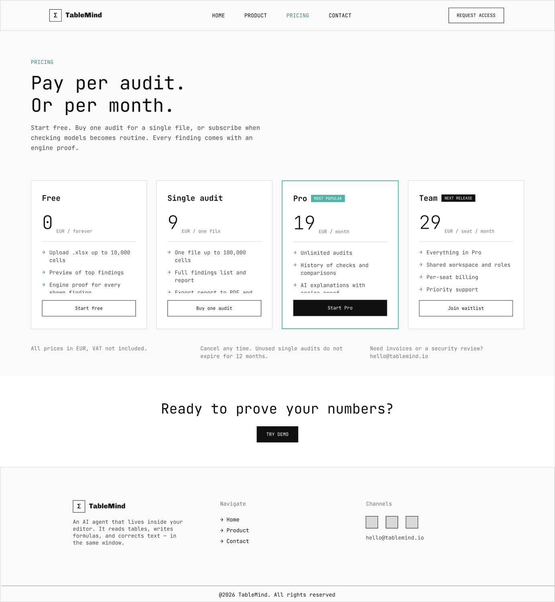
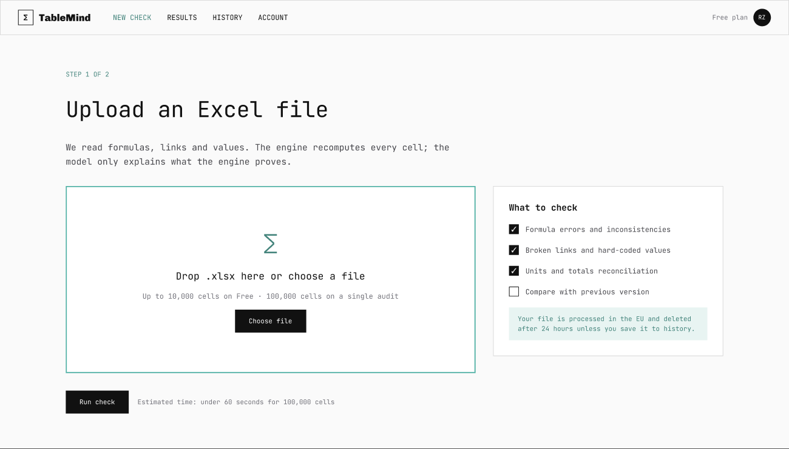
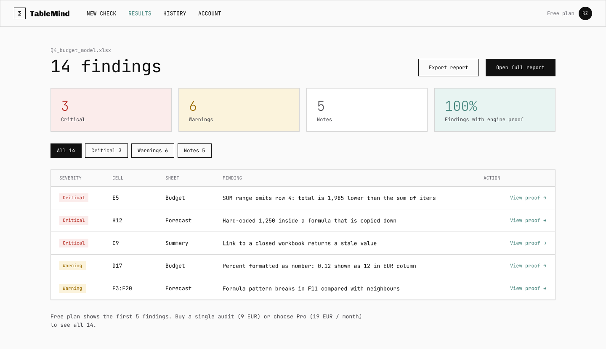
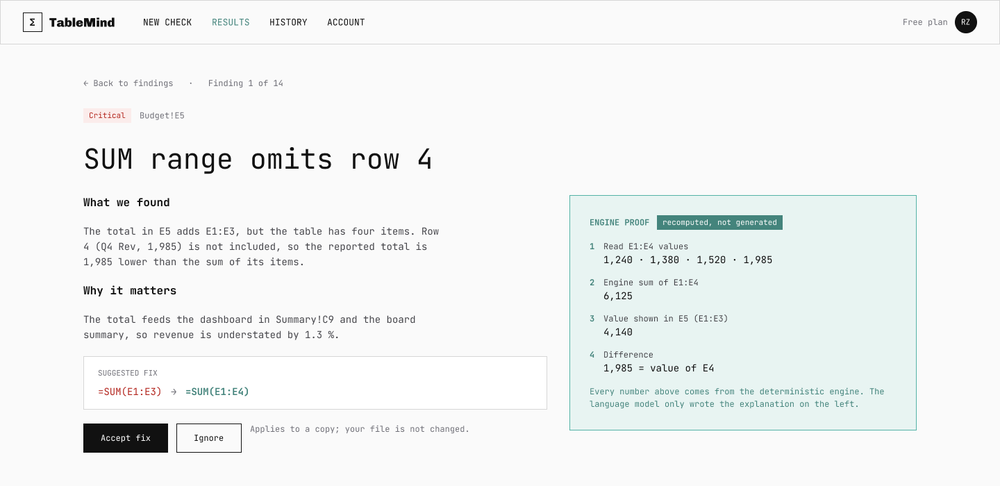
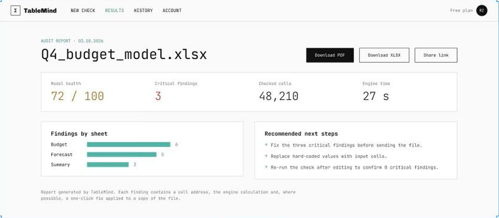
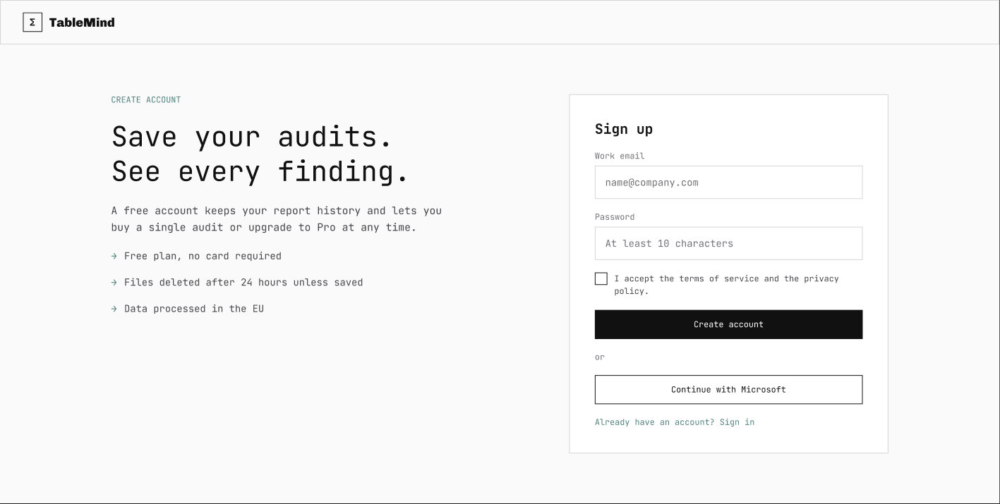
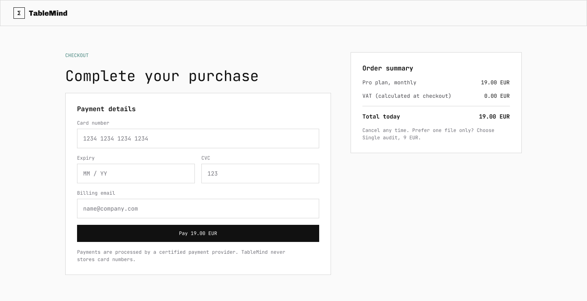
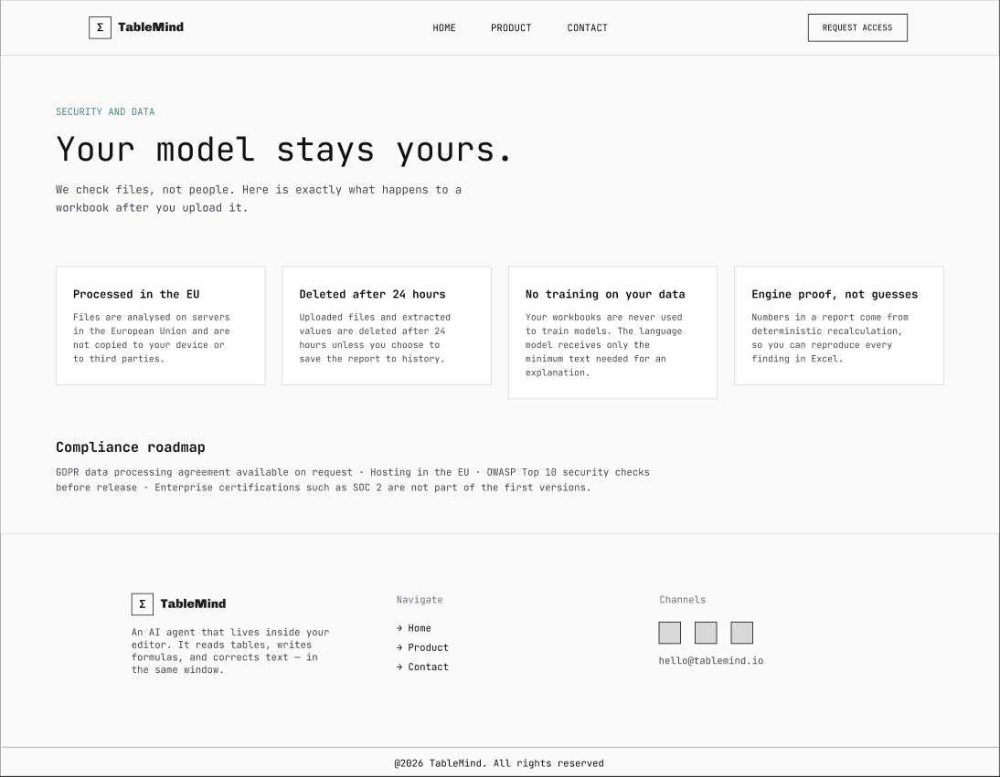

## 1 Цель работы

Цель работы - превратить результаты анализа рынка, спроса, конкурентов и цифрового товара (ЛР1-ЛР5) в проверяемое ценностное предложение и цифровой товар TableMind [1], собрать бизнес-модель по Канвасу [2], сформулировать бизнес-логику и пользовательские сценарии [3], перейти к страницам и экранам [4] и разделить разработку на релизы [5].

Для достижения цели решены задачи - сформирован банк из 14 источников и 12 выводов анализа; выделены и оценены шесть проблем клиентов, сформулированы четыре ценностных предложения, три цифровых товара и три единицы монетизации; заполнен Канвас по девяти блокам; описаны 5 ролей, 10 сценариев, 18 функциональных требований и 8 инициатив; спроектированы 14 страниц и экранов и составлен релизный план с 24 единицами разработки. Результаты сверены с ПЗ1 и ПЗ4 [6].

Все оценки в книгах получены по просмотренным страницам и расчетам предыдущих работ и являются допущениями аналитика (Д-26); числа рынка, цен и воронки взяты из ЛР2-3, числа конкурентов - из ЛР4 и ЛР5. Прототип создан в Figma (разделы 2.5.1 и 2.5.2) - страницы сайта и макеты экранов приложения, схемы ключевых экранов приведены в разделе 2.5, дальнейшая доработка - в приложении Б. Итоговые паспорта, карта пути пользователя, реестры и контрольные листы методик приведены в приложении Ж.

## 2 Ход работы

Работа выполнена по цепочке из пяти методик - каждая следующая использует результат предыдущей. Расчеты выполнены в пяти книгах Excel и независимо пересчитаны на Python.

### 2.1 Банк источников и выводов анализа

Банк источников объединяет отчеты ЛР1-ЛР5, страницы конкурентов и документы проекта. Он является общей доказательной базой для всех книг - каждый вывод далее имеет ссылку на запись банка.

В таблице 1 представлено - банк источников.

Таблица 1 – Банк источников

| ID | Тип | Объект | Факт | Достоверность |
|---|---|---|---|---|
| SRC-001 | Отчет ЛР1 | Запросы о таблицах Excel | Структура намерений 4 578 запросов - проблемные 36,6 %, AI 45,3 %, проверка 8,6 %, услуги 2,3 % | 4 |
| SRC-002 | Отчет ЛР2-3 | Рынок | SAM 35 млн у.е. в год; индекс платежеспособности сегментов 2,4 | 4 |
| SRC-003 | Отчет ЛР4 | 12 сайтов | Заменители дают 73 % релевантного трафика; CR3 52 % | 4 |
| SRC-004 | Отзывы | PerfectXL | 0 отзывов на G2 и Trustpilot | 5 |
| SRC-005 | Отзывы | Datarails | 386 отзывов, 4,6 | 5 |
| SRC-006 | Страница цен | PerfectXL | Отдельный инструмент от 69 у.е. в месяц; пакеты без цен | 5 |
| SRC-007 | Страница цен | Shortcut | Free, Pro 89 у.е., Teams 284 у.е. + 89 у.е. за место | 5 |
| SRC-008 | Главная страница | Shortcut | SOC 2 Type II, нулевое хранение данных | 5 |
| SRC-009 | Страница цен | Numerous.ai | 8,9 у.е. в месяц, 7 дней пробного периода | 5 |
| SRC-010 | Каталог | Формулы Excel | По запросу formula checker найден 1 результат, по excel audit - 138 | 4 |
| SRC-011 | Документ проекта | Концепция | Ошибки есть в 86-94 % реальных таблиц; AI-надстройки лидеров сами требуют проверки | 4 |
| SRC-012 | Главная страница | DataSnipper | SOC 2, GDPR, AI Act; клиенты RSM, Mazars, BDO, Grant Thornton | 5 |
| SRC-013 | Главная страница | Arixcel | Надстройка - логика формул, сравнение, карта формул; цены нет | 4 |
| SRC-014 | Отчет ЛР5 | Цифровой товар | Стандарт - надстройка Excel (7 из 7); разрывы - поиск ошибок, безопасность, пробный доступ (по 3 из 7) | 4 |

Четырнадцать записей покрывают спрос, рынок, конкуренцию, отзывы, цены, безопасность и проблему проекта. Больше всего опоры на собственные результаты (ЛР1-ЛР5) и на страницы цен и главные страницы конкурентов, снятые 03.10.2026.

### 2.2 Ценностное предложение и цифровой товар

Методика [1] требует выбрать опорную проблему по индексу, сопоставить ее с покрытием конкурентами и сформулировать ценностное предложение, цифровой товар и единицу монетизации. Индекс проблемы рассчитывается по частоте, интенсивности, срочности, незакрытости конкурентами, готовности платить и доказательности.

В таблице 2 представлено - проблемы клиентов и их приоритет.

Таблица 2 – Проблемы клиентов и их приоритет

| ID | Проблема | Индекс | Приоритет |
|---|---|---|---|
| P-001 | Скрытые ошибки в формулах обнаруживаются после передачи модели заказчику, инвестору или аудитору | 86 | Критический |
| P-002 | Результат AI-помощника в Excel нельзя подтвердить без ручной проверки | 80 | Критический |
| P-003 | Ручная проверка модели занимает часы и зависит от опыта проверяющего | 71 | Высокий |
| P-004 | Специализированные инструменты дороги, цена скрыта, публичных отзывов нет | 62 | Средний |
| P-005 | Неясно, безопасно ли загружать файл с финансовыми данными во внешний сервис | 70 | Высокий |
| P-006 | Нет отчета с доказательствами, который можно передать заказчику или аудитору | 71 | Высокий |

Критичны две проблемы - скрытые ошибки в формулах (индекс 86) и невозможность подтвердить результат AI-помощника (80). Именно они определяют ядро ценностного предложения; безопасность загрузки файлов и отсутствие передаваемого отчета образуют второй уровень.

В таблице 3 представлено - как конкуренты закрывают проблемы.

Таблица 3 – Как конкуренты закрывают проблемы

| Конкурент | Проблема | Как решает | Покрытие (1-5) |
|---|---|---|---|
| PerfectXL | P-001 | Risk Finder и Formula Inspector находят риски и ошибки формул | 4 |
| PerfectXL | P-003 | Автоматизирует ручной обзор структуры модели | 4 |
| PerfectXL | P-004 | Цена от 69 у.е. в месяц, пакеты без цен, отзывов нет | 2 |
| PerfectXL | P-005 | Безопасность и соответствие на главной странице не показаны | 1 |
| Arixcel | P-001 | Карта формул показывает несогласованные формулы и жестко заданные числа | 3 |
| Shortcut | P-002 | Агент прослеживает формулы до исходных файлов, заявленная точность 76 % | 3 |
| Shortcut | P-005 | SOC 2 Type II, нулевое хранение данных, частные шлюзы моделей | 5 |
| Numerous.ai | P-003 | Функция AI в ячейке ускоряет работу, но не проверяет результат | 2 |
| Datarails | P-006 | Аудируемые отчеты, закрытие месяца и журнал изменений | 4 |
| DataSnipper | P-006 | Доказательства аудита связываются с документами и сохраняются | 5 |
| DataSnipper | P-005 | SOC 2, GDPR, AI Act, отсутствие обучения на данных клиента | 5 |
| Microsoft 365 Copilot | P-002 | Встроенный AI в Excel за 16 у.е.; результат требует проверки пользователем | 2 |

Только безопасность (Shortcut, DataSnipper) и отчеты для аудита (DataSnipper, Datarails) закрыты сильно. Поиск ошибок формул покрыт специализированными инструментами умеренно (3-4), а проверка результата AI не закрыта никем сильнее 3: это и есть конкурентный пробел.

В таблице 4 представлено - ценностные предложения.

Таблица 4 – Ценностные предложения

| ID | Проблема | Формулировка | Индекс | Статус |
|---|---|---|---|---|
| VP-001 | P-001 | Для финансовых аналитиков, бухгалтеров и консультантов, которые передают Excel-модели заказчикам, TableMind находит скрытые ошибки формул до отправки файла и доказывает каждую находку вычислением, поэтому модель можно сдавать без риска неверных чисел. | 86 | Готово |
| VP-002 | P-002 | Для тех, кто строит таблицы с помощью AI-помощников, TableMind независимо проверяет результат движком и показывает доказательство каждой ошибки, поэтому использование AI не увеличивает риск. | 80 | Готово |
| VP-003 | P-005 | Для компаний с финансовыми данными TableMind проверяет файл без хранения содержимого дольше сессии и с соблюдением GDPR, поэтому проверку можно разрешить без согласования с безопасностью. | 70 | Готово |
| VP-004 | P-006 | Для консультантов и аудиторов TableMind выдает отчет о проверке с перечнем находок и ссылками на ячейки, поэтому проверка модели становится передаваемым документом, а не устным заверением. | 71 | Готово |

Четыре предложения построены по шаблону «для кого, какая проблема, какой механизм, какой результат». Ядро - VP-001 (независимая проверка с доказательством); VP-002 усиливает его для пользователей AI, VP-003 снимает барьер доверия, VP-004 дает передаваемый отчет.

В таблице 5 представлено - цифровые товары.

Таблица 5 – Цифровые товары

| ID | Товар | Тип | Полнота описания | Статус описания |
|---|---|---|---|---|
| PR-001 | TableMind Web Audit | Веб-сервис | 100 % | Описан |
| PR-002 | TableMind для Excel | Надстройка | 100 % | Описан |
| PR-003 | TableMind Team | Командный сервис | 100 % | Описан |

Три товара соответствуют трем уровням - веб-аудит (MVP), надстройка Excel (бета v1) и командный сервис (следующий релиз). Все три полностью описаны по пяти элементам (задача, базовая функция, расширенные функции, данные и алгоритмы, условия доступа).

В таблице 6 представлено - единицы монетизации.

Таблица 6 – Единицы монетизации

| ID | Единица | Цена, у.е. | Единиц в месяц | Потенциал | Статус описания |
|---|---|---|---|---|---|
| M-001 | Файл (разовый аудит) | 9 | 3 | 82 | Описана |
| M-002 | Пользователь Pro | 19 | 2 | 100 | Описана |
| M-003 | Место Team | 29 | 1 | 92 | Описана |

Единицы совпадают с тарифами ПЗ1: файл (9 у.е.), пользователь Pro (19 у.е. в месяц) и место Team (29 у.е. в месяц). Наибольший потенциал у Pro (100) - цена на медиане рынка и повторяемость платежа. Количества единиц в месяц взяты из базовой воронки ЛР2-3 и округлены.

В таблице 7 представлено - проверка связности цепочки «проблема - ценность - товар - монетизация - модель».

Таблица 7 – Проверка связности цепочки «проблема - ценность - товар - монетизация - модель»

| ID | Индекс связности | Решение | Главный разрыв |
|---|---|---|---|
| CHK-001 | 90 | Проходят проверку | Нет отзывов и кейсов |
| CHK-002 | 91 | Проходят проверку | Надстройка выйдет позже веб-версии |
| CHK-003 | 87 | Проходят проверку | Сертификации SOC 2 пока нет |
| CHK-004 | 85 | Проходят проверку | Team выходит со следующим релизом |

Все четыре цепочки проходят проверку (индекс 85-91 из 100). Средний индекс связности - 88. Разрывы не критичны - нужны отзывы и кейсы, более ранняя надстройка и план сертификации безопасности.

### 2.3 Канвас бизнес-модели

Канвас [2] собирается из выводов анализа - каждый блок получает формулировку, доказательства и оценки достоверности, полноты и риска. Блок получает статус «Готово» при достоверности и полноте не ниже 4 и риске не выше 2.

На рисунке 1 показано - канвас бизнес-модели TableMind.

Рисунок 1 – Канвас бизнес-модели TableMind

Рисунок показывает девять блоков в стандартной раскладке Остервальдера и Пинье [7]. Центральное место занимает ценностное предложение, а крайние блоки (партнеры и сегменты) связаны с результатами ЛР2-ЛР4.

В таблице 8 представлено - статусы блоков Канваса.

Таблица 8 – Статусы блоков Канваса

| Блок | Достоверность | Полнота | Риск | Статус |
|---|---|---|---|---|
| Клиентские сегменты | 4,0 | 5,0 | 2,0 | Готово |
| Ценностное предложение | 5,0 | 4,0 | 2,0 | Готово |
| Каналы | 3,0 | 4,0 | 3,0 | Частично |
| Отношения с клиентами | 4,0 | 5,0 | 1,0 | Готово |
| Потоки доходов | 5,0 | 4,0 | 2,0 | Готово |
| Ключевые ресурсы | 4,0 | 3,0 | 3,0 | Частично |
| Ключевые виды деятельности | 4,0 | 4,0 | 1,0 | Готово |
| Ключевые партнеры | 3,0 | 3,0 | 4,0 | Частично |
| Структура затрат | 5,0 | 5,0 | 2,0 | Готово |

Готовы шесть блоков из девяти (доля готовых 67 %); подтверждены частично каналы, ключевые ресурсы и партнеры. Полнота заполнения 82 %, контроль риска 56 % - слабые места - стоимость привлечения, метрики точности и условия AppSource.

В таблице 9 представлено - приоритет клиентских сегментов.

Таблица 9 – Приоритет клиентских сегментов

| Сегмент | Индекс | Статус |
|---|---|---|
| Финансовые аналитики и FP&A | 4,25 | Приоритетный |
| Бухгалтеры и аудиторы | 3,75 | Перспективный |
| Консультанты по управлению | 4,25 | Приоритетный |
| МСП с финансовой функцией | 3,00 | Перспективный |

Приоритетные сегменты - финансовые аналитики и консультанты (индекс 4,25); бухгалтеры и аудиторы и МСП - перспективные. Это согласуется с ЛР2-3, где консультанты дают наибольший вклад в SAM.

В таблице 10 представлено - каналы и воронка.

Таблица 10 – Каналы и воронка

| Канал | Индекс | Решение |
|---|---|---|
| Поиск по проблемным запросам (ошибки в формулах) | 4,33 | Включить |
| Microsoft AppSource | 3,67 | Частично |
| Партнерские фирмы и преподаватели Excel | 3,33 | Частично |
| Product Hunt и профессиональные сообщества | 3,33 | Частично |
| Страница продукта, примеры найденных ошибок | 4,33 | Включить |
| Бесплатная проверка файла без оплаты | 4,33 | Включить |
| Прозрачная страница тарифов | 5,00 | Включить |
| Email, отчеты, обучающие материалы | 3,67 | Частично |

Включить сразу рекомендуется поиск по проблемным запросам, страницу продукта, бесплатную проверку и прозрачные тарифы; остальные каналы (AppSource, партнеры, сообщества) требуют проверки. Вывод совпадает с ЛР4: трафик конкурентов идет в основном из поиска и прямых заходов.

### 2.4 Бизнес-логика и пользовательские сценарии

Методика [3] переводит выводы анализа в бизнес-логику (за счет чего создается и монетизируется ценность), роли, сценарии и функциональные требования с приоритетами. Требование попадает в MVP, если его индекс приоритета не ниже 10 (высокий или критический).

В таблице 11 представлено - элементы бизнес-логики.

Таблица 11 – Элементы бизнес-логики

| ID | Элемент | Тип | Индекс надежности |
|---|---|---|---|
| BL-001 | Снижение барьера первого использования | Клиентская | 0,75 |
| BL-002 | Доказательство каждой находки | Продуктовая | 0,75 |
| BL-003 | Отчет для передачи | Клиентская | 0,60 |
| BL-004 | Подписка на постоянную проверку | Монетизационная | 0,75 |
| BL-005 | Командная работа | Монетизационная | 0,30 |
| BL-006 | Доверие к безопасности | Рисковая | 0,60 |

Шесть элементов охватывают клиентскую, продуктовую, монетизационную и рисковую логику; средний индекс надежности - 0,62 (шкала 0-1). Наименее подтверждена командная работа (0,30) - это согласуется с переносом Team на следующий релиз.

В таблице 12 представлено - пользовательские сценарии.

Таблица 12 – Пользовательские сценарии

| ID | Сценарий | Роль | Тип | Индекс | Приоритет |
|---|---|---|---|---|---|
| S-001 | Проверить файл без регистрации | Финансовый аналитик / FP&A | Основной | 15,0 | Критический |
| S-002 | Зарегистрироваться и сохранить отчет | Финансовый аналитик / FP&A | Основной | 12,0 | Высокий |
| S-003 | Купить разовый аудит файла | Консультант по управлению | Монетизационный | 15,0 | Критический |
| S-004 | Оформить Pro после нескольких проверок | Финансовый аналитик / FP&A | Монетизационный | 12,0 | Высокий |
| S-005 | Подтвердить результат AI в Excel | Финансовый аналитик / FP&A | Основной | 10,0 | Высокий |
| S-006 | Передать отчет заказчику | Консультант по управлению | Основной | 4,8 | Низкий |
| S-007 | Проверить чужую модель клиента | Консультант по управлению | Основной | 4,8 | Низкий |
| S-008 | Настроить правила проверки под компанию | Администратор команды | Вспомогательный | 1,8 | Отложить |
| S-009 | Пригласить коллег в Team | Администратор команды | Монетизационный | 2,4 | Низкий |
| S-010 | Удалить данные по запросу | Бухгалтер / аудитор | Вспомогательный | 2,4 | Низкий |

Критичны сценарии первого результата и разовой покупки, высокие - регистрация, подписка и проверка результата AI. Три монетизационных сценария покрывают разовый аудит, Pro и Team.

В таблице 13 представлено - функциональные требования и MVP.

Таблица 13 – Функциональные требования и MVP

| ID | Требование | Категория Кано | Индекс | Приоритет | MVP |
|---|---|---|---|---|---|
| F-001 | Загрузка xlsx и проверка без регистрации | Базовое требование | 18,0 | Критический | Да |
| F-002 | Поиск ошибок формул и логики | Базовое требование | 12,0 | Высокий | Да |
| F-003 | Доказательство каждой находки вычислением | Привлекательное требование | 12,0 | Высокий | Да |
| F-004 | Отчет аудита с перечнем находок | Одномерное требование | 12,0 | Высокий | Да |
| F-005 | Регистрация, вход и личный кабинет | Базовое требование | 12,0 | Высокий | Да |
| F-006 | Оплата разового аудита и Pro | Базовое требование | 10,7 | Высокий | Да |
| F-007 | Политика данных GDPR и удаление файла | Базовое требование | 14,0 | Высокий | Да |
| F-008 | Страница тарифов и лимиты Free | Одномерное требование | 21,0 | Критический | Да |
| F-009 | Надстройка Excel для проверки книги | Одномерное требование | 6,8 | Средний | Кандидат |
| F-010 | Экспорт отчета в PDF и Excel | Одномерное требование | 9,0 | Средний | Кандидат |
| F-011 | История проверок | Одномерное требование | 9,0 | Средний | Кандидат |
| F-012 | AI-пояснения и подсказки исправления | Привлекательное требование | 6,0 | Средний | Кандидат |
| F-013 | Сравнение версий файла | Одномерное требование | 3,8 | Низкий | Нет |
| F-014 | Командное пространство и роли | Привлекательное требование | 4,8 | Низкий | Нет |
| F-015 | API и интеграции | Безразличное требование | 2,0 | Отложить | Нет |
| F-016 | Шаблоны правил под компанию | Привлекательное требование | 3,0 | Низкий | Нет |
| F-017 | Автоматическое исправление ошибок | Привлекательное требование | 2,8 | Отложить | Нет |
| F-018 | Дашборд качества моделей | Безразличное требование | 2,0 | Отложить | Нет |

В MVP входят 8 требований из 18 (44 %), что совпадает с ориентиром ПЗ1 (Must 8 из 18, 44 %). Это поиск ошибок, доказательство находки, отчет, регистрация, оплата, политика данных и страница тарифов; надстройка, экспорт, история и AI-пояснения - кандидаты следующих релизов.

На рисунке 2 показано - приоритеты функциональных требований.

Рисунок 2 – Приоритеты функциональных требований

Рисунок показывает четкий разрыв между восемью требованиями MVP и остальными - все требования MVP лежат правее порога 10, а надстройка Excel (индекс 6,75) остается кандидатом. Ядро MVP определено не по желанию, а по формуле шаблона.

В таблице 14 представлено - приоритизация инициатив.

Таблица 14 – Приоритизация инициатив

| ID | Инициатива | Индекс | Решение |
|---|---|---|---|
| P-001 | Бесплатная проверка файла без регистрации | 7,00 | Включить в первую версию |
| P-002 | Движок проверки с доказательством находки | 7,00 | Включить в первую версию |
| P-003 | Отчет аудита | 6,00 | Включить в первую версию |
| P-004 | Оплата и тарифы | 6,00 | Включить в первую версию |
| P-005 | Политика данных и удаление файла | 6,00 | Включить в первую версию |
| P-006 | Надстройка Excel | 2,80 | Проверить дополнительно |
| P-007 | Командное пространство Team | 3,20 | Проверить дополнительно |
| P-008 | Автоматическое исправление | 0,72 | Исключить |

Пять инициатив первой версии получают решение «включить в первую версию»; надстройка и Team проходят как «проверить дополнительно», автоисправление исключено из ближайших релизов из-за сложности и риска.

### 2.5 Страницы и экраны

Методика [4] связывает каждый сценарий со страницами и экранами, описывает состояния и ошибки, навигацию и паспорт каждого экрана. Идентификаторы U-001...U-017 совпадают с реестром единиц разработки (раздел 2.6).

В таблице 15 представлено - страницы и экраны TableMind.

Таблица 15 – Страницы и экраны TableMind

| ID | Тип | Название | Итоговый балл | Класс | Решение |
|---|---|---|---|---|---|
| U-001 | Страница сайта | Страница продукта с примерами ошибок | 86 | P1 - первая версия | Включить в первую версию |
| U-002 | Экран приложения | Загрузка файла и запуск проверки | 86 | P1 - первая версия | Включить в первую версию |
| U-003 | Экран приложения | Результат проверки - список находок | 84 | P1 - первая версия | Включить в первую версию |
| U-004 | Экран приложения | Карточка находки с доказательством | 72 | P2 - следующий выпуск | Включить в первую версию |
| U-005 | Экран приложения | Отчет аудита | 74 | P2 - следующий выпуск | Включить в первую версию |
| U-006 | Экран приложения | Регистрация и вход | 68 | P2 - следующий выпуск | Включить в первую версию |
| U-007 | Страница сайта | Страница тарифов | 79 | P2 - следующий выпуск | Включить в первую версию |
| U-008 | Экран приложения | Оплата | 66 | P2 - следующий выпуск | Включить в первую версию |
| U-009 | Страница сайта | Безопасность и политика данных | 70 | P2 - следующий выпуск | Включить в первую версию |
| U-010 | Экран приложения | Настройки аккаунта и удаление данных | 50 | P3 - можно отложить | Включить в первую версию |
| U-011 | Экран приложения | Личный кабинет - история проверок | 53 | P3 - можно отложить | Отложить |
| U-012 | Экран приложения | Надстройка Excel - панель проверки | 68 | P2 - следующий выпуск | Отложить |
| U-016 | Экран приложения | Команда - места и роли | 53 | P3 - можно отложить | Отложить |
| U-017 | Страница сайта | Документация и справка | 53 | P3 - можно отложить | Включить в первую версию |

Спроектированы 14 единиц. Итоговый балл (ценность, влияние на бизнес, частота, риск без реализации, сложность) относит три единицы к классу P1, семь к P2 и четыре к P3; решение о включении принимается отдельно - в первую версию включены 11 единиц (U-001...U-010 и U-017), отложены U-011, U-012 и U-016. Каждая единица имеет паспорт, набор состояний (нормальное, пустое, загрузка, ошибки, успех) и сообщение пользователю; полнота паспортов и состояний - 100 %. Реестр, карта состояний и паспорта приведены в приложении Ж.

В таблице 16 представлено - основные переходы.

Таблица 16 – Основные переходы

| Откуда | Куда | Событие | Риск разрыва (1-5) |
|---|---|---|---|
| U-001 | U-002 | Нажатие «Проверить файл» | 2 |
| U-002 | U-003 | Завершение проверки | 2 |
| U-003 | U-004 | Открытие находки | 1 |
| U-004 | U-006 | Сохранить результат | 3 |
| U-003 | U-007 | Открыть полный отчет | 3 |
| U-007 | U-008 | Нажатие «Купить» | 2 |
| U-008 | U-005 | Платеж подтвержден | 2 |
| U-006 | U-011 | Вход выполнен | 1 |
| U-001 | U-009 | Открытие политики данных | 2 |
| U-009 | U-010 | Удаление данных | 3 |
| U-011 | U-007 | Предложение Pro | 2 |
| U-012 | U-003 | Проверка книги | 3 |
| U-016 | U-008 | Оплата мест | 3 |

Описано 13 переходов и 17 связей сценариев с интерфейсом. Наибольший риск разрыва (3) - сохранение результата без входа, переход к оплате при исчерпании лимита Free и удаление данных; для них предусмотрены подсказки и подтверждения.

На рисунке 3 показано - схемы ключевых экранов первой версии.

Рисунок 3 – Схемы ключевых экранов первой версии

Схемы показывают шесть экранов основного пути - страницу продукта, загрузку файла, результат, карточку находки, тарифы и отчет. Путь от страницы до первой находки занимает три действия, а оплата вынесена после первого бесплатного результата.

Покрытие сценариев страницами и экранами равно 80 % (восемь из десяти; не покрыты настройка правил команды и один вспомогательный сценарий), интегральная готовность интерфейсной модели - 95 %. Схемы экранов подготовлены как основа; кликабельный прототип сайта выполнен в Figma и описан ниже.

#### 2.5.1 Прототип сайта в Figma

Прототип создан в Figma по методическому пособию [8] и размещен по ссылке https://www.figma.com/design/QEj3FhylPe0fG2rDef7bMy/TableMind-project. Файл содержит три страницы сайта шириной 1440 пикселей (главная, продукт, контакты) и лист «Elements» с палитрой, шапкой и подвалом, из которых страницы собраны. Содержимое файла прочитано через подключенный инструмент Figma и сопоставлено со страницами и экранами раздела 2.5.

На рисунке 4 показано - прототип Figma - страница Home (главная).

Рисунок 4 – Прототип Figma, страница Home (главная)

Главная страница состоит из шапки с кнопкой «Request access», первого экрана с заголовком и иллюстрацией, блока «Three operators. One agent» с тремя карточками (подключение данных, интеллектуальный анализ, автоматические результаты), макета редактора с подсказкой агента и подвала. Она соответствует точке входа пути пользователя, но тарифов и примеров ошибок на ней нет.

На рисунке 5 показано - прототип Figma - страница Product (продукт).

Рисунок 5 – Прототип Figma, страница Product (продукт)

Страница продукта показывает работу агента на примере пустой ячейки E5 и предложенной формулы суммы, затем описывает три шага («читает структуру таблицы», «понимает документ», «предлагает и проверяет») и завершается призывом «Try demo». По назначению она ближе всего к единице U-001, но пока не содержит примеров реальных ошибок и доказательства находки.

На рисунке 6 показано - прототип Figma - страница Contact (контакты).

Рисунок 6 – Прототип Figma, страница Contact (контакты)

Страница контактов содержит форму с полями «Name», «Email», «Company (optional)», «Topic» и «Message», кнопку «Send message» и согласие на обработку обращения. Форма может служить основой для листа ожидания и сбора первых регистраций, что напрямую связано с целью 300 регистраций.

На рисунке 7 показано - прототип Figma - лист Elements (палитра и компоненты).

Рисунок 7 – Прототип Figma, лист Elements (палитра и компоненты)

Лист «Elements» фиксирует палитру из шести цветов (серый, черный, светло-серый, бирюзовый, белый, темно-бирюзовый), шапку с навигацией и подвал. Единые компоненты шапки и подвала используются на всех трех страницах, что обеспечивает целостность интерфейса.

В таблице 17 представлено - соответствие страниц прототипа единицам интерфейсной модели.

Таблица 17 – Соответствие страниц прототипа единицам интерфейсной модели

| Страница Figma | Единица (раздел 2.5) | Покрытие | Что доработать |
|---|---|---|---|
| Home | U-001 Страница продукта (вход) | Частично | Добавить примеры ошибок Excel и ссылку на тарифы |
| Product | U-001 Страница продукта с примерами ошибок | Частично | Показать находку с доказательством (движок), а не только формулу суммы |
| Contact | U-017 Документация и справка; сбор регистраций | Частично | Связать форму с регистрацией (U-006) и листом ожидания |
| Pricing (добавлена) | U-007 Страница тарифов | Покрыто | Лимиты тарифов иллюстративные, уточнить по продукту |
| U-002...U-005 (добавлены) | Загрузка файла, список находок, карточка находки с доказательством, отчет | Покрыто | Заменить демо-данные реальными результатами движка |
| U-006, U-008 (добавлены) | Регистрация и оплата | Покрыто | Подключить провайдера оплаты после выбора |
| U-009 (добавлена) | Безопасность и политика данных | Покрыто | Сверить сроки хранения с политикой конфиденциальности |

Исходный прототип закрывал маркетинговую часть пути (вход, объяснение продукта, контакт); по решению автора он дополнен восемью макетами в том же стиле - тарифы, загрузка файла, список находок, карточка находки, отчет, регистрация, оплата и безопасность. Теперь макетами покрыты 9 единиц первой версии (U-001...U-009), в прототип не вошли единица первого релиза U-010 (удаление данных) и U-017 (справка), а также единицы последующих релизов.

Наблюдение - тексты прототипа описывают универсального агента для текстового редактора («AI agent that lives inside your editor»), а не проверку Excel-моделей с доказательством находок. Для согласования с ценностным предложением раздела 2.1 заголовок и примеры страниц нужно переписать под аудит таблиц; это зафиксировано как доработка прототипа.

#### 2.5.2 Дополнительные макеты приложения и тарифов

Дополнительные макеты созданы в том же файле Figma рядом с исходными страницами (в тех же цветах, шрифтах JetBrains Mono и Chivo, с квадратными углами и тонкими рамками), шапка и подвал на страницах сайта скопированы из исходного макета. Исходные кадры Home, Product, Contact и Elements не изменялись. Новые кадры расположены справа - Pricing, App / U-002 ... U-008 и Site / U-009. Кликабельная связь между новыми кадрами - Pricing (Free) - регистрация, регистрация - загрузка файла, запуск проверки - список находок, «View proof» - карточка находки, «Open full report» - отчет, Pricing (Pro) - оплата. Тексты и числа на макетах (14 находок, 1 985 у.е., 48 210 ячеек) являются демонстрационными.

На рисунке 8 показано - макет Pricing (U-007) - тарифы.

Рисунок 8 – Макет Pricing (U-007), тарифы

На странице тарифов четыре карточки - Free (0 у.е.), Single audit (9 у.е. за файл), Pro (19 у.е. в месяц, выделен как популярный) и Team (29 у.е. за место, помечен как следующий релиз). Тарифы и цены совпадают с ценообразованием ПЗ1 и ЛР2-3, а прозрачная лестница с бесплатным входом реализует зону дифференциации ЛР5.

На рисунке 9 показано - макет U-002: загрузка файла и запуск проверки.

Рисунок 9 – Макет U-002, загрузка файла и запуск проверки

Экран содержит зону загрузки файла, список проверок и пояснение о хранении файла. Путь до запуска проверки занимает два действия - выбрать файл и нажать «Run check».

На рисунке 10 показано - макет U-003: список находок.

Рисунок 10 – Макет U-003, список находок

Экран показывает сводку по критичности (3 критичных, 6 предупреждений, 5 заметок), долю находок с доказательством движка и таблицу находок с ячейкой, листом и ссылкой «View proof». На бесплатном тарифе показаны первые пять находок, остальные открываются после оплаты.

На рисунке 11 показано - макет U-004: карточка находки с доказательством.

Рисунок 11 – Макет U-004, карточка находки с доказательством

Слева описаны суть находки, последствия и предлагаемое исправление, справа - панель доказательства движка с шагами пересчета. Макет воплощает принцип «LLM предлагает, движок доказывает» - все числа приведены как результат вычисления, а текст объяснения вторичен.

На рисунке 12 показано - макет U-005: отчет аудита.

Рисунок 12 – Макет U-005, отчет аудита

Отчет включает показатели модели (оценка 72 из 100, 3 критичных находки, 48 210 проверенных ячеек, время движка 27 секунд), распределение находок по листам и рекомендации. Время движка согласуется с целью проекта проверять 100 тыс. ячеек быстрее 60 секунд.

На рисунке 13 показано - макет U-006: регистрация.

Рисунок 13 – Макет U-006, регистрация

Экран регистрации состоит из краткого описания выгод (бесплатный тариф без карты, удаление файлов через 24 часа, обработка данных в ЕС) и формы с рабочей почтой, паролем, согласием с условиями и входом через Microsoft. Переход от тарифа Free и от результата проверки к регистрации занимает одно действие.

На рисунке 14 показано - макет U-008: оплата.

Рисунок 14 – Макет U-008, оплата

Экран оплаты содержит форму карты, сводку заказа Pro за 19 у.е. и напоминание о возможности отмены и о покупке одного аудита за 9 у.е.. Оплата вынесена после первого бесплатного результата, как предусмотрено сценарием монетизации.

На рисунке 15 показано - макет U-009: безопасность и политика данных.

Рисунок 15 – Макет U-009, безопасность и политика данных

Страница безопасности объясняет четыре принципа - обработка в ЕС, удаление файлов через 24 часа, отсутствие обучения моделей на данных клиента и доказательство движком вместо догадок; внизу указана строка о соответствии (GDPR, размещение в ЕС, проверки OWASP Top 10) с пометкой, что корпоративные сертификаты вроде SOC 2 не входят в первые версии, как предусмотрено ПЗ1. Страница закрывает барьер доверия, выявленный в ЛР5 и риском R5 карты рисков.

### 2.6 Деление разработки на релизы

Методика [5] оценивает 24 единицы разработки по десяти показателям и относит их к первому релизу, следующим релизам или к гипотезам. Единица попадает в первый релиз, если она связана с ценностным предложением, доходом, доказательна и ее потеря критична, либо если балл первого релиза не ниже 3,7.

В таблице 18 представлено - состав релизов по единицам разработки.

Таблица 18 – Состав релизов по единицам разработки

| ID | Единица | Балл первого релиза | Балл следующих | Релиз |
|---|---|---|---|---|
| U-001 | Страница продукта с примерами найденных ошибок | 4,28 | 3,24 | Первый релиз |
| U-002 | Загрузка файла и запуск проверки без регистрации | 4,72 | 4,06 | Первый релиз |
| U-003 | Результат проверки - список находок | 4,77 | 3,98 | Первый релиз |
| U-004 | Карточка находки с доказательством | 4,11 | 4,00 | Первый релиз |
| U-005 | Отчет аудита | 4,14 | 3,64 | Первый релиз |
| U-006 | Регистрация и вход | 4,31 | 2,90 | Первый релиз |
| U-007 | Страница тарифов | 4,45 | 2,98 | Первый релиз |
| U-008 | Оплата разового аудита и Pro | 4,02 | 3,46 | Первый релиз |
| U-009 | Политика данных и страница безопасности | 4,18 | 3,38 | Первый релиз |
| U-010 | Удаление файла и данных пользователя | 3,81 | 2,94 | Первый релиз |
| U-011 | Личный кабинет - история проверок | 3,25 | 3,22 | Не включать |
| U-012 | Надстройка Excel - проверка книги | 3,69 | 4,32 | Следующий релиз |
| U-013 | Экспорт отчета в PDF и Excel | 3,46 | 3,40 | Не включать |
| U-014 | AI-пояснения и подсказки исправления | 3,35 | 3,50 | Не включать |
| U-015 | Сравнение версий файла | 2,80 | 3,38 | Не включать |
| U-016 | Командное пространство и роли Team | 3,23 | 3,80 | Следующий релиз |
| U-017 | Документация и справка | 3,72 | 3,28 | Первый релиз |
| U-018 | Шаблоны правил под компанию | 3,07 | 3,54 | Не включать |
| U-019 | Листинг в Microsoft AppSource | 3,47 | 3,66 | Следующий релиз |
| U-020 | API и интеграции | 2,57 | 3,26 | Не включать |
| U-021 | Дашборд качества моделей | 2,41 | 3,00 | Не включать |
| U-022 | Автоматическое исправление ошибок | 2,52 | 3,50 | Не включать |
| U-023 | Мобильное приложение | 1,02 | 2,18 | Не включать |
| U-024 | Интеграция с ERP-системами | 1,48 | 2,66 | Не включать |

В первый релиз входят 11 единиц (балл первого релиза в среднем 4,23, средний технический риск 1,73), в следующие релизы - 3 (надстройка Excel, Team, листинг AppSource), остальные 10 остаются гипотезами до подтверждения спроса.

В таблице 19 представлено - дорожная карта релизов.

Таблица 19 – Дорожная карта релизов

| Релиз | Цель | Срок | Критерий перехода |
|---|---|---|---|
| Первый релиз | Проверить ценность и спрос - MVP веб-аудита | 31.03.2027 | 50 проверенных файлов и precision не ниже 90 % |
| Релиз 2 | Открытая бета с оплатой | 01.06.2027 | Не менее 300 регистраций и первые платежи |
| Релиз 3 | Бета v1 с надстройкой Excel | 31.07.2027 | Стабильная точность и установки из AppSource |
| Релиз 4 | Релиз проекта | 30.09.2027 | Не менее 50 платящих пользователей |

Даты релизов согласованы с вехами ПЗ1 и ПЗ4: MVP веб-аудита 31.03.2027, открытая бета с оплатой 01.06.2027, бета v1 с надстройкой в июле 2027, релиз проекта в сентябре 2027. Критерии перехода измеримы и совпадают с целями проекта (300 регистраций и 50 платящих).

На рисунке 16 показано - дорожная карта релизов TableMind.

Рисунок 16 – Дорожная карта релизов TableMind

Рисунок показывает четыре последовательных релиза и вехи ПЗ1. Основной риск плана - узкое окно платной беты (01.06-30.09.2027) - по расчетам ЛР2-3 в базовом сценарии за это время приходит около 19 платящих при цели 50.

В таблице 20 представлено - риски и зависимости релизов.

Таблица 20 – Риски и зависимости релизов

| ID | Единица | Риск | Индекс |
|---|---|---|---|
| R-001 | Сокращение ядра проверки | Пользователь не получает заявленную ценность | 10 |
| R-002 | Точность находок | Precision ниже 90 % | 15 |
| R-003 | Надстройка Excel | Сложность публикации в AppSource | 12 |
| R-004 | Безопасность и GDPR | Отказ клиентов из-за недоверия | 12 |
| R-005 | Оплата | Сбой платежей или налоги | 8 |
| R-006 | Цель по платящим | 50 платящих недостижимы за 4 месяца бета (ЛР2-3) | 16 |
| R-007 | Стоимость вычислений | Затраты на LLM превышают плановые | 9 |

Наибольшие индексы у риска недостижения цели по платящим (16) и точности находок (15). Они требуют ранней проверки - измерения конверсий уже на MVP и регулярной оценки precision на eval-наборе.

В таблице 21 представлено - контрольный лист первого релиза.

Таблица 21 – Контрольный лист первого релиза

| Проверка | Ответ | Комментарий |
|---|---|---|
| Определен один основной сегмент первого запуска | да | Финансовые аналитики и консультанты |
| Выбрана одна главная проблема | да | Скрытые ошибки в формулах (индекс 86) |
| Ценностное предложение не изменилось после сокращения объема | да | Сохранены находка с доказательством (U-003, U-004) и отчет (U-005) |
| Основной сценарий проходится без разрыва | да | U-002, U-003, U-004, U-005, далее регистрация и оплата (U-006, U-008) |
| Есть понятная единица цифрового товара | да | Проверка файла, подписка Pro |
| Есть единица монетизации и целевое действие | да | U-007 и U-008: разовый аудит 9 у.е., Pro 19 у.е. |
| Добавлены минимальные элементы доверия | да | U-009 и U-010: политика данных, удаление файла, прозрачные цены |
| Определены страницы и экраны первого выпуска | да | 11 единиц из 24 |
| Описаны состояния ошибок и исключений | да | Для всех единиц, раздел 2.5 |
| Настроены события аналитики и обратная связь | Частично | Отдельной единицы нет - события (просмотр, загрузка, завершение проверки, регистрация, оплата) и форму обратной связи нужно включить в ТЗ в рамках U-001...U-008 |
| Есть минимальный механизм повторного использования | Частично | Учетная запись и сохранение отчета (U-005, U-006); история проверок (U-011) вынесена во второй релиз |
| Состав последующих релизов не смешан с первым | да | Единицы со статусом «следующий релиз» не входят в MVP |

Десять проверок из двенадцати выполнены, две выполнены частично - аналитика событий и механизм возвращения пользователя. Оба пробела закрываются без роста объема MVP - события вшиваются в уже входящие единицы, а возвращение обеспечивается сохраненными отчетами в учетной записи до появления истории проверок.

В таблице 22 представлено - итоговый протокол утверждения первого релиза.

Таблица 22 – Итоговый протокол утверждения первого релиза

| Блок протокола | Содержание |
|---|---|
| Решение | Первый релиз утвержден с доработкой ТЗ по аналитике событий и обратной связи |
| Состав | 11 единиц - страница продукта, загрузка файла, список находок, карточка находки, отчет, регистрация, тарифы, оплата, политика данных, удаление данных, справка |
| Главные исключения | Надстройка Excel, командное пространство, API, ERP, мобильное приложение - высокая сложность или слабая связь с первой ценностью |
| Критические риски | Точность находок (индекс 15), недоверие к загрузке файлов (12), недостижимость цели по платящим (16) |
| Метрики запуска | Проверенных файлов, precision не ниже 90 %, время проверки 100 тыс. ячеек менее 60 с, конверсия визит - регистрация 4 % |
| Порог продолжения | 50 проверенных файлов и precision не ниже 90 % - переход к открытой бете с оплатой |
| Порог пересмотра | Конверсия регистрация - платящий ниже 3 % за два месяца после MVP - пересмотр тарифа, сегмента или сценария |
| Ответственные | Владелец продукта и аналитика - автор проекта; разработка и дизайн - команда проекта по ПЗ1 |

Протокол фиксирует границы MVP, пороги перехода между релизами и порог пересмотра; он совпадает с критериями дорожной карты и с условиями решения о старте в ЛР7.

### 2.7 Согласованность с ПЗ1 и ПЗ4

В таблице 23 представлено - сверка с документами проекта.

Таблица 23 – Сверка с документами проекта

| Показатель | ПЗ1 и ПЗ4 | ЛР6 | Совпадение |
|---|---|---|---|
| Тарифы | Free, 9, 19, 29 у.е. | Free, 9, 19, 29 у.е. | да |
| MVP веб-аудита | 31.03.2027 | 31.03.2027 (первый релиз) | да |
| Открытая бета с оплатой | 01.06.2027 | 01.06.2027 (релиз 2) | да |
| Бета v1 с надстройкой | Июль 2027 | 31.07.2027 (релиз 3) | да |
| Релиз | Сентябрь 2027 | 30.09.2027 (релиз 4) | да |
| Требования Must | 8 из 18 (44 %) | 8 из 18 (44 %) | да |
| Цели | 300 регистраций, 50 платящих | Учтены в критериях релизов; риск недостижения 50 отмечен | Да, с риском |
| Качество | precision не ниже 90 %, 100 тыс. ячеек быстрее 60 с | Критерии готовности FR-001, FR-002 | да |

Все параметры проекта сохранены; единственное расхождение - не в данных, а в прогнозе - цель по платящим достижима только при дополнительных каналах, и это отражено в рисках релизного плана и в реестре рисков проекта.

### 2.8 Проверка расчетов и ограничения

Независимый пересчет на Python охватил индексы проблем, потенциал монетизации и выручку, индексы сегментов, индексы и приоритеты требований и сценариев, баллы и решения по релизам, индексы рисков и приоритеты экранов. Из 155 контрольных величин расхождений нет (155 из 155); допуск 1e-6, для двухзначных баллов релизов 1e-9. Ошибок формул в пяти книгах нет.

Ограничения - оценки 1-5 и 1-4 в книгах выставлены аналитиком по страницам и результатам прежних работ (Д-26), прототип в Figma использует демонстрационные данные, бизнес-логика проверена на формальную связность, но не на реальных пользователях. Эти пункты перечислены в приложении Б.

## 3 Ответы на контрольные вопросы

Ответы даны по контрольным точкам книг [3], [4] и проверкам связности [1], [2].

1. Проведена ли проверка связности «проблема - ценность - товар - монетизация - модель»? Да, таблица 7: четыре цепочки проходят проверку.

2. Заполнен ли каждый блок Канваса с доказательствами и оценкой риска? Да, таблица 8: готовы шесть блоков из девяти.

3. Есть ли роли и не менее пяти сценариев, включая монетизационные? Да - 5 ролей, 10 сценариев, 3 монетизационных (таблица 12).

4. Определены ли требования MVP? Да, таблица 13: 8 требований из 18.

5. Покрыты ли сценарии страницами и экранами, описаны ли состояния и ошибки? Покрытие 80 %, состояния описаны для всех 14 единиц (таблица 15).

6. Определены ли первый и следующие релизы и их критерии? Да, таблицы 18 и 19.

7. Согласованы ли результаты с ПЗ1 и ПЗ4? Да, таблица 23.

8. Выполнены ли все пункты методики? Да; прототип создан в Figma (разделы 2.5.1 и 2.5.2), включая экраны приложения и тарифы.

## Выводы

Из результатов ЛР1-ЛР5 сформированы ценностное предложение (независимая проверка Excel-моделей с доказательством каждой находки), три цифровых товара (веб-аудит, надстройка Excel, командный сервис) и три единицы монетизации (9, 19 и 29 у.е.). Цепочка «проблема - ценность - товар - монетизация - модель» проходит проверку связности со средним индексом 88 из 100.

Канвас готов на 67 % по блокам - слабее остальных каналы, ключевые ресурсы и партнеры. В MVP входят 8 из 18 требований, как в ПЗ1; первый релиз содержит 11 единиц разработки, надстройка Excel и Team перенесены в бета v1 и релиз, остальные единицы остаются гипотезами.

Главный риск плана - узкое окно платной беты при цели 50 платящих - его нужно снимать дополнительными каналами и ранним измерением конверсий. Следующие шаги - заменить демонстрационные данные макетов Figma реальными результатами движка после запуска MVP, затем свести результаты в итоговом отчете ЛР7.

## Список использованных источников

1. Методика формулирования ценностного предложения и цифрового товара; шаблон Excel. Методические материалы дисциплины «Электронный бизнес» к лабораторной работе № 6. – Минск : БГУИР, 2026.

2. Методика сборки бизнес-модели по Канвас на основе анализа; шаблон Excel. Методические материалы дисциплины «Электронный бизнес». – Минск : БГУИР, 2026.

3. Методика формулирования бизнес-логики и пользовательских сценариев; шаблон Excel. Методические материалы дисциплины «Электронный бизнес». – Минск : БГУИР, 2026.

4. Методика перехода к страницам и экранам сайта или приложения; шаблон Excel. Методические материалы дисциплины «Электронный бизнес». – Минск : БГУИР, 2026.

5. Методика деления разработки сайта на релизы; шаблон Excel. Методические материалы дисциплины «Электронный бизнес». – Минск : БГУИР, 2026.

6. Земляник, Р. В. Концепция проекта TableMind; WBS, сетевой график и диаграмма Ганта TableMind: отчеты по практическим занятиям по дисциплине «Управление проектами»; отчеты по лабораторным работам № 1, № 2–3, № 4, № 5 по дисциплине «Электронный бизнес» / Р. В. Земляник. – Минск : БГУИР, 2026.

7. Osterwalder, A. Business Model Generation / A. Osterwalder, Y. Pigneur. – Hoboken : Wiley, 2010. – 288 p.

8. Методическое пособие по Figma / под рук. Т. Н. Беляцкой. – Минск : БГУИР, 2026. – 73 с.

9. Microsoft. Plan a SaaS offer for Microsoft Marketplace [Электронный ресурс]. – Режим доступа: https://learn.microsoft.com/en-us/partner-center/marketplace-offers/plan-saas-offer. – Дата доступа: 03.10.2026.

10. Microsoft. How to review and publish an offer to Microsoft Marketplace [Электронный ресурс]. – Режим доступа: https://learn.microsoft.com/en-us/partner-center/marketplace-offers/review-publish-offer. – Дата доступа: 03.10.2026.

11. Microsoft. Microsoft Marketplace certification policies [Электронный ресурс]. – Режим доступа: https://learn.microsoft.com/en-us/legal/marketplace/certification-policies. – Дата доступа: 03.10.2026.

12. SOC2Auditors. SOC 2 Audit Cost, September 2026 [Электронный ресурс]. – Режим доступа: https://soc2auditors.org/soc-2-audit-cost/. – Дата доступа: 03.10.2026.

13. Drata. SOC 2 Type 1 vs. Type 2: Timeline, Cost, and Key Differences [Электронный ресурс]. – Режим доступа: https://drata.com/learn/soc-2/type-1-vs-type-2. – Дата доступа: 03.10.2026.

## Приложение А (обязательное) Допущения и параметры расчета

В приложении собраны допущения ЛР6 в дополнение к допущениям Д-01...Д-25 предыдущих работ.

В таблице 24 представлено - журнал допущений ЛР6.

Таблица 24 – Журнал допущений ЛР6

| № | Параметр | Значение | Обоснование | Влияние на результат | Как проверить |
|---|---|---|---|---|---|
| Д-26 | Оценки проблем, сегментов, каналов, товаров 1-5 и доказательности 1-4 | По результатам ЛР1-ЛР5 и просмотренным страницам | Нет опроса пользователей | Индексы, статусы блоков и приоритеты | Опрос, второй аналитик |
| Д-27 | Единиц монетизации в месяц | 3 / 2 / 1 | Базовая воронка ЛР2-3 (округлено) | Расчетная выручка единиц | Данные MVP |
| Д-28 | Оценки единиц релизов (10 показателей) | 1-5 | Характеристики сложности и ценности | Состав первого релиза | Пересмотр после MVP |
| Д-29 | Сопоставление идентификаторов | S-... = SC-..., R-... = ROLE-..., U-... едины в 6.4 и 6.5 | Единая нумерация цепочки | Связность книг | - |

Допущения Д-26...Д-29 перенесены в общий журнал допущений проекта.

## Приложение Б (обязательное) Принятые решения по недостающим данным

Ниже для каждого элемента, которого нет в открытом доступе или который недоступен без платного сервиса, зафиксировано принятое решение - расчетные данные, альтернативный источник или допущение.

В таблице 25 представлено - принятые решения по данным, которых нет в открытом доступе.

Таблица 25 – Принятые решения по данным, которых нет в открытом доступе

| № | Данные | Источник или метод | Принятое решение | Где использовано |
|---|---|---|---|---|
| 1 | Макеты страниц и экранов | Figma | Созданы макеты U-001...U-009 (раздел 2.5.2); данные на макетах демонстрационные; единицы U-010, U-017 и последующих релизов в прототип не входят | Раздел 2.5.2 |
| 2 | Платежеспособность и функции (Кано) | Расчет | Приняты расчетные данные (приложение Г ЛР2-3 и ЛР5) | Книги 6.1, 6.3 |
| 3 | Скриншоты страниц конкурентов | Chrome | Сняты 8 страниц 03.10.2026 | Приложение Д |
| 4 | Конверсии MVP | Расчет | Приняты расчетные замеры воронки (приложение Е, допущение Д-32) | ЛР2-3, книги 6.1 и 6.5 |
| 5 | Условия AppSource и сертификация безопасности | Microsoft Learn, ПЗ1 | Правила публикации приняты по документации (приложение Г); SOC 2 не входит в объем и бюджет проекта по ПЗ1 | Книги 6.2 и 6.5, риски |

Решения согласованы с ПЗ1 и ПЗ4: объем проекта, сроки и бюджет не изменяются.

## Приложение В (обязательное) Изменения шаблонов

Формулы шаблонов ЛР6 ошибок не содержали; демонстрационные строки заменены данными TableMind, строки с формулами не изменялись.

В таблице 26 представлено - изменения шаблонов.

Таблица 26 – Изменения шаблонов

| № | Книга | Изменение |
|---|---|---|
| 1 | Все пять книг | Демонстрационные примеры заменены данными TableMind; формулы сохранены |
| 2 | Канвас (лист 10_Паспорт) | Заполнены ячейки паспорта 4-16; первая строка паспорта вычисляется формулой из Канваса |
| 3 | Страницы и экраны, релизы | Поля, зависящие от формул (приоритеты, полнота, релиз), не заполнялись вручную |

Изменения не затрагивают расчетную логику шаблонов - все итоговые показатели получены формулами книг и подтверждены независимым пересчетом.

## Приложение Г (справочное) Условия публикации в Microsoft AppSource

Условия уточнены по документации Microsoft 03.10.2026 [9]-[11] и относятся к единицам релиза «листинг AppSource» и «надстройка Excel» (бета v1 и релиз проекта).

В таблице 27 представлено - требования и условия публикации в AppSource с учетом ПЗ1.

Таблица 27 – Требования и условия публикации в AppSource с учетом ПЗ1

| Вопрос | Что установлено | Следствие для плана релизов |
|---|---|---|
| Объект публикации | По ПЗ1 в AppSource публикуется надстройка Excel (Office add-in); веб-сервис продается напрямую, оплата через Stripe | Действуют политики для надстроек Office (1100, 1120) - HTTPS, политика конфиденциальности, условия использования, согласие на обработку данных, запрет излишних разрешений |
| Сертификация и сроки | Автоматическая проверка занимает до 30 минут, затем ручная сертификация (содержание, техническая проверка, критерии издателя), предпросмотр и выпуск; при отказе приходит отчет и можно подать повторно | Допущение 3 ПЗ1 (проверка до четырех недель) приемлемо; план резервирует время на повторные подачи, риск R14 карты рисков |
| Хостинг | По ПЗ1 облако в ЕС (Hetzner или AWS eu-central-1); требование «преимущественно на Azure» (политика 1000.1) относится к SaaS-предложениям, продаваемым через Microsoft | Для публикации только надстройки требование не применяется; продажа SaaS через Microsoft потребовала бы Azure и входа через Microsoft Entra ID и в проект не входит |
| Комиссия | 3 % стандартной платы при продаже через Microsoft Marketplace | При оплате через Stripe комиссия AppSource не возникает; 3 % в ЛР2-3 принято как верхняя оценка (допущение Д-14) |
| Безопасность | Политики требуют HTTPS, политику конфиденциальности и условия использования; сертификат SOC 2 или ISO для публикации не нужен | SOC 2 и ISO 27001 исключены из объема и бюджета проекта (ПЗ1, раздел 2.2 и бюджет); доверие обеспечивают GDPR, соглашение об обработке данных, OWASP Top 10 и доказательство вывода движком |
| Пробный период | Для транзакционных тарифов Microsoft допускает пробный период 1-180 дней | Бесплатный старт обеспечивается тарифом Free, что совпадает с зоной дифференциации ЛР5 |

Для публикации надстройки достаточно требований политик Office, и они согласуются с планом ПЗ1: оплата идет через Stripe, облако находится в ЕС, SOC 2 не требуется. Главный риск публикации - срок и замечания ручной проверки (R14).

Сертификация SOC 2 исключена из объема и бюджета проекта (ПЗ1), но корпоративные конкуренты (Shortcut, Datarails, DataSnipper) ею располагают, поэтому для решения о развитии после 30.09.2027 приведены ориентиры сроков и стоимости по открытым обзорам рынка 2026 года [12], [13]. Пересчет в BYN выполнен по курсу НБРБ 0,9 у.е. за 0,9 у.е. (03.10.2026).

В таблице 28 представлено - ориентиры сроков и стоимости SOC 2 для решения после завершения проекта.

Таблица 28 – Ориентиры сроков и стоимости SOC 2 для решения после завершения проекта

| Показатель | Type I | Type II |
|---|---|---|
| Плата аудитору, у.е. | 7 100-22 190 | 13 310-35 500 |
| Первый год полностью (аудит, платформа соответствия, тест на проникновение, время команды), у.е. | 13 310-35 500 | 26 630-71 000 |
| Доля бюджета проекта 152 688 у.е. | 9-23 % | 17-46 % |
| Срок от начала подготовки до отчета | 3-5 месяцев | 9-14 месяцев (наблюдение 3-12 месяцев) |

Затраты на Type I сопоставимы с 9-23 % бюджета проекта и в него не заложены, поэтому SOC 2 планируется отдельным решением после 30.09.2027, когда появятся выручка и корпоративные клиенты; до этого доверие обеспечивается GDPR, OWASP Top 10 и доказательством вывода движком.

## Приложение Д (справочное) Скриншоты страниц конкурентов

Скриншоты сняты 03.10.2026 в Chrome (первый экран страницы, баннеры cookie скрыты или отклонены) и подтверждают данные ЛР4 и ЛР5 о ценах и позиционировании.

На рисунке 17 показано - PerfectXL - главная страница.

Рисунок 17 – PerfectXL, главная страница

Главная PerfectXL построена вокруг награды «Best Excel Add-in of 2026» и кнопки анонса; цен и пробного доступа на первом экране нет.

На рисунке 18 показано - PerfectXL - страница цен.

Рисунок 18 – PerfectXL, страница цен

Страница показывает три пакета (Professional, Medium Business, Enterprise) для разных размеров организаций; подтверждает, что цена раскрыта частично и сгруппирована по сегментам.

На рисунке 19 показано - Shortcut - страница цен.

Рисунок 19 – Shortcut, страница цен

Страница показывает Free за 0,0 у.е., Pro 89 у.е., Teams 284 у.е. плюс 89 у.е. за место и Enterprise по запросу со скидкой 20 % за год; это самая прозрачная лестница тарифов среди конкурентов.

На рисунке 20 показано - Numerous.ai - главная страница.

Рисунок 20 – Numerous.ai, главная страница

Главная Numerous.ai продает массовое предложение «AI в Sheets и Excel» без разговора с продавцом; страница цен перенаправляет на главную, а условия пробного периода и оплаты описаны в тексте.

На рисунке 21 показано - Datarails - страница цен.

Рисунок 21 – Datarails, страница цен

Три тарифа (Professional, Premium, Expert) без сумм и кнопки «Request Quote»; цена по запросу и ограничения по числу пользователей и интеграций подтверждают корпоративную модель продаж.

На рисунке 22 показано - DataSnipper - страница цен.

Рисунок 22 – DataSnipper, страница цен

Тарифы Start, Accelerate и Elevate без сумм, вход через «Book Demo» и «Contact sales»; баннер cookie был отклонен до снимка.

На рисунке 23 показано - Arixcel - лицензирование.

Рисунок 23 – Arixcel, лицензирование

Раздел цен показывает 3,2 у.е. за пользователя в месяц с примером расчета для 10 пользователей на 12 месяцев; правила активации ключей и администрирования лицензий говорят о нацеленности на корпоративных пользователей Windows.

На рисунке 24 показано - Operis OAK - страница цен.

Рисунок 24 – Operis OAK, страница цен

Страница показывает годовую подписку 365 у.е. плюс налог и более 30 инструментов в пакете; кнопка «Buy now» говорит о продаже без консультанта, в отличие от услуг аудита моделей Operis.

## Приложение Е (справочное) Расчет воронки MVP по сценарию

Воронка с 01.04.2027 по 30.09.2027 рассчитана по параметрам базового сценария ЛР2-3: визит - регистрация 4 %, регистрация - активация 60 %, активация - платящий около 8 %, платежи с 01.06.2027 (допущение Д-32; расчет воспроизводится скриптом из папки 00_Общее/Расчетные_показатели, seed 20261004). Расчет показывает ожидаемую динамику конверсий и чувствительность целей проекта к разбросу параметров.

В таблице 29 представлено - расчетные показатели воронки по месяцам.

Таблица 29 – Расчетные показатели воронки по месяцам

| Месяц | Визиты | Регистрации | Активации | Платящие |
|---|---|---|---|---|
| 2027-04 | 1 584 | 66 | 30 | 0 |
| 2027-05 | 2 038 | 175 | 102 | 0 |
| 2027-06 | 2 454 | 129 | 74 | 5 |
| 2027-07 | 3 592 | 212 | 119 | 10 |
| 2027-08 | 3 539 | 175 | 117 | 9 |
| 2027-09 | 5 691 | 309 | 172 | 10 |
| Итого | 18 898 | 1 066 | 614 | 34 |

За шесть месяцев расчет дает 1 066 регистраций и 34 платящих; итоговые конверсии - визит - регистрация 5,6 %, регистрация - платящий 4,1 %. Цель 300 регистраций достигнута, цель 50 платящих не достигнута.

В таблице 30 представлено - разброс итогов при неопределенности конверсий (500 повторов).

Таблица 30 – Разброс итогов при неопределенности конверсий (500 повторов)

| Показатель | 10-й перцентиль | Медиана | 90-й перцентиль | Вероятность достичь цели |
|---|---|---|---|---|
| Регистрации (цель 300) | 437 | 744 | 1 107 | 98 % |
| Платящие (цель 50) | 10 | 23 | 54 | 15 % |

Цель по регистрациям достижима почти при любых разумных конверсиях (вероятность 98 %), а цель 50 платящих - лишь примерно в 15 % повторов. Это согласуется с выводом ЛР2-3 и ЛР7: окно платной беты слишком узкое, нужны дополнительные каналы и ранний замер активации и оплаты.

## Приложение Ж (справочное) Итоговые паспорта и формы проектной документации

В приложении собраны итоговые формы, которых требуют методики цепочки 6.1-6.4: паспорта ценностного предложения, бизнес-модели, бизнес-логики и интерфейсных единиц, карта пути пользователя, реестр, карта состояний и контрольные листы. Таблицы взяты из рабочих книг Excel и результатов работы; состав и числа совпадают с основными разделами отчета.

В таблице 31 представлено - паспорт ценностного предложения и цифрового товара.

Таблица 31 – Паспорт ценностного предложения и цифрового товара

| Раздел паспорта | Содержание |
|---|---|
| Сегмент клиента | Покупает и использует финансовый аналитик (FP&A) или консультант по управлению; на решение влияют руководитель и заказчик отчета; платит сам специалист (Pro) или команда (Team) |
| Опорная проблема | P-001 скрытые ошибки в формулах (индекс 86) и P-002 невозможность подтвердить результат AI-помощника (80); последствие - неверные числа в модели, переданной заказчику, инвестору или аудитору |
| Ценностное предложение | Краткое - для финансовых аналитиков, бухгалтеров и консультантов TableMind находит скрытые ошибки формул до отправки файла и доказывает каждую находку вычислением; расширенное - клиент передает модель без риска неверных чисел, потому что каждая находка подтверждена детерминированным движком, а не догадкой языковой модели, в отличие от AI-помощников, результат которых нужно проверять вручную, и от специализированных инструментов, которые стоят от 69 у.е. в месяц и не доказывают вывод |
| Цифровой товар | TableMind Web Audit (MVP), TableMind для Excel (бета v1), TableMind Team (следующий релиз); состав - загрузка xlsx, поиск ошибок, карточка находки, отчет аудита, учетная запись, политика данных |
| Носители ценности | Движок проверки с доказательством, карточка находки, отчет с перечнем находок и ссылками на ячейки, база правил и инвариантов |
| Рыночный стандарт | Надстройка Excel (7 из 7 конкурентов); поиск ошибок, безопасность и GDPR, пробный доступ (по 3 из 7); кейсы и клиенты (5 из 7) |
| Отличия и преимущества | Доказательство вывода движком (2 из 7), прозрачные тарифы с бесплатным входом (2 из 7), цена между AI-подписками и специализированным аудитом |
| Единица монетизации | Файл 9 у.е.; пользователь Pro 19 у.е. в месяц; место Team 29 у.е. в месяц; бесплатная зона - проверка файла без регистрации с показом первых пяти находок |
| Проверочные показатели | 300 регистраций и 50 платящих к 30.09.2027; конверсия визит - регистрация 4 %, регистрация - платящий 5 %; precision критичных находок не ниже 90 %; аудит 100 тыс. ячеек быстрее 60 с |
| Ограничения | Не заменяет экспертизу аудитора; не исполняет макросы VBA, не подключается к базам данных и Google Sheets (исключено ПЗ1); результат гарантируется для файлов xlsx в пределах поддерживаемых правил |

Паспорт собирает в одном месте сегмент, проблему, обещание, товар, отличия и монетизацию; он служит входом для разработки, маркетинга и финансовой модели.

В таблице 32 представлено - список гипотез для проверки.

Таблица 32 – Список гипотез для проверки

| Гипотеза | Что проверяется | Показатель и порог |
|---|---|---|
| Спрос | Специалисты загружают файл и доходят до первого результата без регистрации | Конверсия визит - регистрация 4 % |
| Цена | Pro по 19 у.е. принимается как цена подписки | Конверсия регистрация - платящий не ниже 3 %, цель 5 % |
| Состав товара | Восьми требований MVP достаточно для первой оплаты | Первые платежи в открытой бете 01.06.2027 |
| Канал | Поиск по проблемным запросам, AppSource и партнеры дают регистрации | 300 регистраций за 6 месяцев после MVP |
| Удержание | Пользователи возвращаются к повторной проверке после правок | Доля повторных проверок, история проверок |
| Конкурентное отличие | Доказательство находки движком влияет на выбор | Доля принятых находок, отзывы первых клиентов |

Гипотезы связаны с проблемой и результатом и проверяются на MVP и в открытой бете; пороги совпадают с критериями переходов между релизами.

В таблице 33 представлено - контрольный лист ценностного предложения и цифрового товара.

Таблица 33 – Контрольный лист ценностного предложения и цифрового товара

| Проверка | Да / нет | Комментарий |
|---|---|---|
| Опорная проблема подтверждена наблюдаемыми источниками | да | Банк источников, отзывы, страницы |
| Проблема имеет высокий индекс приоритета | да | 86 и 80 |
| Предложение содержит сегмент, проблему, результат, механизм, отличие, доказательство | да | VP-001 |
| Товар описан как единица ценности с составом и границами | да | Паспорт товара |
| Выделены обязательные признаки рыночного стандарта | да | ЛР5 |
| Выделены признаки конкурентного преимущества | да | ЛР5, таблица 13 |
| Единица монетизации понятна и связана с результатом | да | Тарифы ПЗ1 |
| Формулировка согласована с каналом, поддержкой, ресурсами и затратами | Частично | Каналы и ресурсы в статусе «Проверить» |
| Определены показатели проверки спроса, ценности и удержания | да | Таблица гипотез |
| Зафиксированы ограничения применимости | да | Паспорт товара |

Девять проверок выполнены, одна частично; ограничение связано с неполной проверкой каналов и ресурсов.

В таблице 34 представлено - итоговый паспорт бизнес-модели.

Таблица 34 – Итоговый паспорт бизнес-модели

| Раздел паспорта | Итоговая формулировка |
|---|---|
| Проблема клиента | Скрытые ошибки в формулах Excel-моделей и невозможность подтвердить результат AI-помощников (P-001, P-002) |
| Ценностное предложение | Для финансовых аналитиков, бухгалтеров и консультантов, которые передают Excel-модели заказчикам, TableMind находит скрытые ошибки формул до отправки файла и доказывает каждую находку вычислением, поэтому модель можно сдавать без риска неверных чисел. |
| Цифровой товар | TableMind - веб-аудит файла Excel и надстройка Excel с поиском ошибок, объяснениями и отчетом |
| Единица монетизации | Файл (9 у.е.), пользователь Pro (19 у.е. в месяц), место Team (29 у.е. в месяц) |
| Каналы | Поиск по проблемным запросам, AppSource, партнерские фирмы, Product Hunt |
| Отношения с клиентами | Бесплатный старт, самообслуживание, шаблоны отчетов, документация и обучение |
| Потоки доходов | Разовые платежи за аудит и подписки Pro и Team |
| Ключевые ресурсы | Движок проверки, база правил и eval-набор, соответствие GDPR, команда разработки |
| Ключевые виды деятельности | Развитие правил и движка, оценка точности, контент и партнерства |
| Ключевые партнеры | Microsoft AppSource, бухгалтерские и консалтинговые фирмы, провайдеры LLM и облака |
| Структура затрат | Вычисления и LLM, разработка, продвижение, поддержка, резерв 10 % |
| Главное конкурентное отличие | Независимое доказательство каждой находки движком при прозрачной цене и бесплатном входе |
| Ключевая гипотеза для проверки | Финансисты платят 19 у.е. в месяц за проверку с доказательствами, если получают первый результат бесплатно в течение одного сеанса |

Паспорт кратко передает логику бизнеса без обращения ко всему Канвасу - клиент, проблема, ценность, товар, монетизация, каналы, ресурсы, затраты и главная гипотеза.

В таблице 35 представлено - контрольный лист готовности бизнес-модели.

Таблица 35 – Контрольный лист готовности бизнес-модели

| № | Критерий готовности | Отметка | Комментарий |
|---|---|---|---|
| 1 | Определен конкретный цифровой товар | да | Web Audit, надстройка, Team |
| 2 | Сформулирован приоритетный клиентский сегмент | да | Аналитики и консультанты, индекс 4,25 |
| 3 | Проблема подтверждена источниками | да | Банк из 14 источников |
| 4 | Ценностное предложение связано с проблемой и отличием | да | VP-001, VP-002 |
| 5 | Разделены рыночный стандарт и преимущества | да | ЛР5, таблицы 11 и 13 |
| 6 | Описана единица монетизации | да | M-001...M-003 |
| 7 | Потоки доходов согласованы с товаром | да | Тарифы 9 / 19 / 29 у.е. |
| 8 | Каналы соответствуют поведению сегмента | Частично | Достоверность канала 3 из 5, нужна проверка на MVP |
| 9 | Отношения соответствуют сложности товара | да | Самообслуживание и документация |
| 10 | Ключевые ресурсы объясняют создание и защиту ценности | Частично | Полнота 3 из 5: нужны метрики точности |
| 11 | Ключевые процессы позволяют поставить результат | да | Правила, оценка точности, контент |
| 12 | Партнеры указаны только там, где нужны | Частично | AppSource и фирмы-партнеры требуют проверки |
| 13 | Затраты соответствуют ресурсам, процессам и каналам | да | Бюджет 152 688 у.е. |
| 14 | По каждому блоку указаны источники | да | Матрица источников Канваса |
| 15 | Выделены гипотезы для проверки | да | Таблица гипотез |

Двенадцать критериев выполнены, три выполнены частично (каналы, ресурсы, партнеры); эти блоки совпадают с блоками статуса «Проверить» в таблице статусов Канваса.

В таблице 36 представлено - паспорт бизнес-логики.

Таблица 36 – Паспорт бизнес-логики

| Блок | Формулировка | Источник ответа | Доказательность |
|---|---|---|---|
| Сегмент | Финансовые аналитики и консультанты, затем бухгалтеры и МСП | Канвас, ЛР2-3 | Высокая |
| Опорная проблема | Скрытые ошибки в формулах и непроверяемый результат AI | Отзывы, ПЗ1, конкурентные пробелы | Высокая |
| Ценностное предложение | Находка с доказательством вычислением до отправки файла | Методика 6.1 | Высокая |
| Цифровой товар | Веб-аудит, затем надстройка и командный сервис | Модели Левитта и Кано, ЛР5 | Средняя |
| Механизм создания ценности | Правило, вычисление, объяснение, отчет | Сценарии, цифровой товар | Средняя |
| Ключевые сценарии | S-001 проверка без регистрации, S-003 разовый аудит, S-004 Pro, S-005 проверка результата AI | Карта сценариев | Высокая |
| Единица монетизации | Файл, пользователь Pro, место Team | Тарифы конкурентов, ПЗ1 | Высокая |
| Каналы | Поиск по проблемным запросам, AppSource, партнеры | Анализ сайтов, ЛР1 и ЛР4 | Средняя |
| Ресурсы и процессы | Движок проверки, база правил, eval-набор, оценка точности | Канвас, ЛР5 | Средняя |
| Метрики | Регистрация 4 %, платящий 5 %, precision не ниже 90 % | Канвас, сценарии | Средняя |

Паспорт показывает причинную цепочку от проблемы к продукту, ценности и доходу; наименее подтверждены ресурсы, каналы и метрики, которые проверяются на MVP.

В таблице 37 представлено - карта пути пользователя.

Таблица 37 – Карта пути пользователя

| Этап пути | Сценарий или действие | Ценность | Точка монетизации | Блоки Канваса | Приоритет |
|---|---|---|---|---|---|
| Осознание проблемы | Поиск «ошибки в формулах excel», страница продукта (U-001) | Понимание, что ошибку можно найти доказуемо | Нет | Сегменты, каналы, ценность | Высокий |
| Сравнение решений | Сопоставление с AI-помощниками и PerfectXL, страница тарифов (U-007) | Прозрачная цена и бесплатный вход | Тарифы | Каналы, отношения, ценность | Высокий |
| Первый вход | S-001: загрузка файла без регистрации (U-002) | Быстрый старт за минуту | Нет | Каналы, отношения, товар | Критический |
| Получение первой ценности | Список и карточка находки (U-003, U-004) | Находка с доказательством | Показ первых пяти находок | Ценность, ключевая деятельность | Критический |
| Регулярное использование | S-004: Pro после нескольких проверок, надстройка | Постоянная проверка правок | Подписка Pro | Отношения, ресурсы, деятельность | Высокий |
| Оплата или расширение | S-003 разовый аудит, S-009 Team (U-008) | Полный отчет, командные места | 9 / 19 / 29 у.е. | Доходы, товар, отношения | Критический |
| Поддержка | Справка и удаление данных (U-017, U-010) | Доверие и самостоятельное решение вопросов | Снижение отказов | Отношения, затраты, деятельность | Средний |
| Удержание | Повторные проверки, история, команда | Накопление проверок и общий журнал | Продление подписки | Доходы, отношения, ресурсы | Высокий |

Карта покрывает путь от поиска до удержания и связывает каждый этап с блоками Канваса и точкой монетизации; этапы удержания и командной работы зависят от релизов после MVP.

В таблице 38 представлено - контрольный лист готовности бизнес-логики и сценариев.

Таблица 38 – Контрольный лист готовности бизнес-логики и сценариев

| Проверка | Да / нет | Комментарий |
|---|---|---|
| Выбран целевой сегмент, не описан слишком широко | да | Аналитики и консультанты |
| Опорная проблема подтверждена отзывами или конкурентным анализом | да | ЛР4, ЛР5 |
| Проблема связана с платежной готовностью | да | Индекс платежеспособности 2,4 |
| Ценностное предложение сформулировано как результат | да | VP-001 |
| Цифровой товар описан как единица ценности | да | PR-001...PR-003 |
| Единица монетизации связана с результатом и уровнем сервиса | да | Файл, Pro, Team |
| Показана причинная связь проблемы, товара, ценности и дохода | да | BL-001...BL-006 |
| Роли разделены - пользователь, покупатель, администратор, лицо влияния | Частично | Пять ролей; лицо влияния выделено только в паспорте сегмента |
| Есть сценарий получения первой ценности | да | S-001 |
| Есть сценарий регулярного получения ценности | Частично | S-004; история проверок во втором релизе |
| Есть сценарий оплаты, продления или расширения | да | S-003, S-004, S-009 |
| Есть сценарии поддержки и восстановления после ошибки | Частично | S-010; восстановление описано в состояниях экранов |
| Каждый ключевой сценарий связан с блоком Канваса | да | Карта пути пользователя |
| Для каждого ключевого сценария определена метрика | да | Паспорта интерфейсных единиц |
| Сценарии приоритизированы | да | Индексы сценариев, таблица 12 |

Двенадцать проверок выполнены, три выполнены частично; пробелы касаются регулярного использования и поддержки и закрываются вместе с историей проверок и справкой.

В таблице 39 представлено - реестр страниц и экранов.

Таблица 39 – Реестр страниц и экранов

| ID | Название | Сценарий | Роль | Этап пути | Источник требования |
|---|---|---|---|---|---|
| U-001 | Страница продукта с примерами ошибок | SC-001 | ROLE-001 | Первичный интерес | F-001; F-008 |
| U-002 | Загрузка файла и запуск проверки | SC-001 | ROLE-001 | Получение ценности | F-001 |
| U-003 | Результат проверки - список находок | SC-001 | ROLE-001 | Получение ценности | F-002 |
| U-004 | Карточка находки с доказательством | SC-001 | ROLE-001 | Получение ценности | F-003 |
| U-005 | Отчет аудита | SC-006 | ROLE-002 | Получение ценности | F-004 |
| U-006 | Регистрация и вход | SC-002 | ROLE-001 | Регистрация | F-005 |
| U-007 | Страница тарифов | SC-003 | ROLE-002 | Оплата | F-008 |
| U-008 | Оплата | SC-003 | ROLE-002 | Оплата | F-006 |
| U-009 | Безопасность и политика данных | SC-010 | ROLE-003 | Первичный интерес | F-007 |
| U-010 | Настройки аккаунта и удаление данных | SC-010 | ROLE-003 | Поддержка | F-007 |
| U-011 | Личный кабинет - история проверок | SC-004 | ROLE-001 | Удержание | F-005 |
| U-012 | Надстройка Excel - панель проверки | SC-005 | ROLE-001 | Получение ценности | F-009 |
| U-016 | Команда - места и роли | SC-009 | ROLE-005 | Оплата | F-014 |
| U-017 | Документация и справка | SC-001 | ROLE-001 | Первичный интерес | F-008 |

Реестр фиксирует полный состав интерфейсных единиц - у каждой есть сценарий, роль, этап пути и источник требования из бизнес-логики.

В таблице 40 представлено - карта состояний страниц и экранов.

Таблица 40 – Карта состояний страниц и экранов

| ID | Нормальное | Пустое | Загрузка | Ошибка | Нет доступа | Успех |
|---|---|---|---|---|---|---|
| U-001 | Показаны блоки и призыв | Не применимо | Индикатор загрузки | Сообщение о недоступности | Не применимо | Переход к загрузке |
| U-002 | Поле загрузки и лимиты | Файл не выбран | Индикатор проверки | Неверный формат или размер; Сервис недоступен | Не применимо | Переход к результату |
| U-003 | Таблица находок | Ошибок не найдено | Индикатор проверки | Не удалось получить результат | Не применимо | Находки отображены |
| U-004 | Описание и доказательство | Не применимо | Индикатор расчета | Не удалось загрузить доказательство | Не применимо | Находка принята |
| U-005 | Отчет собран | Нет находок для отчета | Индикатор сборки | Сбой экспорта | Нужен вход | Отчет получен |
| U-006 | Форма регистрации | Не применимо | Индикатор отправки | Неверный email; Сервис недоступен | Не применимо | Аккаунт создан |
| U-007 | Таблица тарифов | Не применимо | Индикатор загрузки | Цены временно недоступны | Не применимо | Переход к оплате |
| U-008 | Форма оплаты | Корзина пуста | Индикатор оплаты | Неверные данные карты; Платежный сервис недоступен | Нужен вход | Платеж подтвержден |
| U-009 | Текст политики | Не применимо | Индикатор загрузки | Страница недоступна | Не применимо | Не применимо |
| U-010 | Настройки аккаунта | Файлов нет | Индикатор удаления | Неверное подтверждение; Сбой удаления | Нужен вход | Данные удалены |
| U-011 | Список проверок | История пуста | Индикатор загрузки | Не удалось загрузить историю | Нужен вход | Проверка запущена повторно |
| U-012 | Панель надстройки | Книга пуста | Индикатор проверки | Книга защищена; Нет сети | Нет лицензии | Находки подсвечены |
| U-016 | Список участников | Участников нет | Индикатор отправки | Неверный email; Сбой приглашения | Нет прав администратора | Приглашение отправлено |
| U-017 | Статьи справки | Ничего не найдено | Индикатор поиска | Страница недоступна | Не применимо | Не применимо |

Для каждой единицы описаны нормальное, пустое, загрузочное, ошибочное состояния, ограничение доступа и успех; для статических страниц пустое состояние и права не применимы.

В таблице 41 представлено - паспорта страниц и экранов.

Таблица 41 – Паспорта страниц и экранов

| ID | Назначение | Состав блоков | Метрика успеха | Основной риск | Навигация |
|---|---|---|---|---|---|
| U-001 | Показать ценность и направить к бесплатной проверке | Первый экран, примеры, сравнение, призыв к действию | Клики по призыву, переход к загрузке | Непонятная ценность, перегрузка | Переход к Загрузка файла и запуск проверки |
| U-002 | Принять файл Excel и запустить проверку без регистрации | Поле загрузки, лимиты, индикатор прогресса | Доля завершенных загрузок | Большой файл, неверный формат | Переход к Результат проверки - список находок |
| U-003 | Показать найденные ошибки с критичностью | Таблица находок, фильтры, сводка | Доля просмотренных находок | Слишком много находок | Переход к Карточка находки с доказательством |
| U-004 | Объяснить ошибку и доказать ее вычислением | Описание, доказательство, исправление | Доля принятых находок | Непонятное доказательство | Переход к Регистрация и вход |
| U-005 | Собрать находки в передаваемый отчет | Заголовок, сводка, таблица, подпись проверки | Доля купивших отчет | Формат не подходит заказчику | Возврат к предыдущему шагу |
| U-006 | Сохранить результат и открыть кабинет | Форма, подтверждение, ссылка входа | Конверсия в регистрацию | Потеря результата без входа | Переход к Личный кабинет - история проверок |
| U-007 | Показать тарифы и помочь выбрать | Таблица тарифов, сравнение, вопросы и ответы | Доля перешедших к оплате | Неясные лимиты Free | Переход к Оплата |
| U-008 | Принять платеж за аудит или подписку | Форма оплаты, итог, подтверждение | Конверсия в платящего | Сбой платежа | Переход к Отчет аудита |
| U-009 | Снять опасения по загрузке файлов | Описание мер, сроки, контакты | Доля посетителей страницы, дошедших до загрузки | Неполные формулировки | Переход к Настройки аккаунта и удаление данных |
| U-010 | Дать пользователю управление данными | Настройки, кнопка удаления, подтверждение | Число запросов на удаление | Случайное удаление | Возврат к предыдущему шагу |
| U-011 | Показать прошлые проверки и повторить | Список, фильтры, кнопка повторной проверки | Доля повторных проверок | Пустая история у новых | Возврат к предыдущему шагу |
| U-012 | Проверять книгу прямо в Excel | Боковая панель, список находок, подсветка | Установки и активация | Правила публикации AppSource | Переход к Результат проверки - список находок |
| U-016 | Управлять местами и ролями команды | Список участников, приглашение, оплата мест | Число мест | Нет подтвержденного спроса | Переход к Оплата |
| U-017 | Помочь начать и объяснить правила проверки | Поиск, разделы, статьи | Просмотры статей, обращения в поддержку | Устаревшие статьи | Возврат к предыдущему шагу |

Паспорта передают проектировщику назначение, состав, показатель эффективности, риск и следующий переход каждой единицы.

В таблице 42 представлено - контрольные вопросы перед передачей в проектирование.

Таблица 42 – Контрольные вопросы перед передачей в проектирование

| Вопрос | Ответ | Комментарий |
|---|---|---|
| Понятно ли, какая единица обеспечивает каждую основную задачу пользователя | да | Реестр страниц и экранов |
| Есть ли путь для нового, вернувшегося и оплатившего пользователя | Частично | Вернувшийся пользователь - история проверок (U-011), второй релиз |
| Описано ли первое получение ценности | да | U-002...U-004 |
| Есть ли путь к оплате или подписке | да | U-007, U-008 |
| Описаны ли пустое состояние, ошибки, успех, ограничения доступа | да | Карта состояний |
| Не дублируют ли единицы друг друга | да | У каждой единицы своя задача |
| Можно ли по каждому экрану сформулировать показатель | да | Паспорта |
| Имеет ли каждый экран источник обоснования | да | Реестр, столбец «Источник требования» |

Семь вопросов получили положительный ответ, один частичный (путь вернувшегося пользователя); это согласуется с переносом истории проверок на следующий релиз.

