## 1 Цель работы

Цель работы: превратить результаты анализа рынка, спроса, конкурентов и цифрового товара (ЛР1-ЛР5) в проверяемое ценностное предложение и цифровой товар TableMind [1], собрать бизнес-модель по Канвасу [2], сформулировать бизнес-логику и пользовательские сценарии [3], перейти к страницам и экранам [4] и разделить разработку на релизы [5].

Для достижения цели решены задачи: сформирован банк из 14 источников и 12 выводов анализа; выделены и оценены шесть проблем клиентов, сформулированы четыре ценностных предложения, три цифровых товара и три единицы монетизации; заполнен Канвас по девяти блокам; описаны 5 ролей, 10 сценариев, 18 функциональных требований и 8 инициатив; спроектированы 14 страниц и экранов и составлен релизный план с 24 единицами разработки. Результаты сверены с ПЗ1 и ПЗ4 [6].

Все оценки в книгах получены по просмотренным страницам и расчетам предыдущих работ и являются допущениями аналитика (Д-26); числа рынка, цен и воронки взяты из ЛР2-3, числа конкурентов - из ЛР4 и ЛР5. Прототип сайта создан в Figma (раздел 2.5.1), схемы ключевых экранов приложения приведены в разделе 2.5, доработка прототипа - в приложении Б.

## 2 Ход работы

Работа выполнена по цепочке из пяти методик: каждая следующая использует результат предыдущей. Расчеты выполнены в пяти книгах Excel и независимо пересчитаны на Python.

### 2.1 Банк источников и выводов анализа

Банк источников объединяет отчеты ЛР1-ЛР5, страницы конкурентов и документы проекта. Он является общей доказательной базой для всех книг: каждый вывод далее имеет ссылку на запись банка.

В таблице 1 представлено: банк источников.

Таблица 1 – Банк источников

| ID | Тип | Объект | Факт | Достоверность |
|---|---|---|---|---|
| SRC-001 | Отчет ЛР1 | запросы о таблицах Excel | Структура намерений 4 578 запросов: проблемные 36,6 %, AI 45,3 %, проверка 8,6 %, услуги 2,3 % | 4 |
| SRC-002 | Отчет ЛР2-3 | рынок | SAM 35 млн EUR в год; индекс платежеспособности сегментов 2,4 | 4 |
| SRC-003 | Отчет ЛР4 | 12 сайтов | Заменители дают 73 % релевантного трафика; CR3 52 % | 4 |
| SRC-004 | Отзывы | PerfectXL | 0 отзывов на G2 и Trustpilot | 5 |
| SRC-005 | Отзывы | Datarails | 386 отзывов, 4,6 | 5 |
| SRC-006 | Страница цен | PerfectXL | Отдельный инструмент от 69 EUR в месяц; пакеты без цен | 5 |
| SRC-007 | Страница цен | Shortcut | Free, Pro 100 USD, Teams 320 USD + 100 USD за место | 5 |
| SRC-008 | Главная страница | Shortcut | SOC 2 Type II, нулевое хранение данных | 5 |
| SRC-009 | Страница цен | Numerous.ai | 10 USD в месяц, 7 дней пробного периода | 5 |
| SRC-010 | Каталог | формулы Excel | По запросу formula checker найден 1 результат, по excel audit - 138 | 4 |
| SRC-011 | Документ проекта | концепция | Ошибки есть в 86-94 % реальных таблиц; AI-надстройки лидеров сами требуют проверки | 4 |
| SRC-012 | Главная страница | DataSnipper | SOC 2, GDPR, AI Act; клиенты RSM, Mazars, BDO, Grant Thornton | 5 |
| SRC-013 | Главная страница | Arixcel | Надстройка: логика формул, сравнение, карта формул; цены нет | 4 |
| SRC-014 | Отчет ЛР5 | цифровой товар | Стандарт: надстройка Excel (7 из 7); разрывы: поиск ошибок, безопасность, пробный доступ (по 3 из 7) | 4 |

Четырнадцать записей покрывают спрос, рынок, конкуренцию, отзывы, цены, безопасность и проблему проекта. Больше всего опоры на собственные результаты (ЛР1-ЛР5) и на страницы цен и главные страницы конкурентов, снятые 03.10.2026.

### 2.2 Ценностное предложение и цифровой товар

Методика [1] требует выбрать опорную проблему по индексу, сопоставить ее с покрытием конкурентами и сформулировать ценностное предложение, цифровой товар и единицу монетизации. Индекс проблемы рассчитывается по частоте, интенсивности, срочности, незакрытости конкурентами, готовности платить и доказательности.

В таблице 2 представлено: проблемы клиентов и их приоритет.

Таблица 2 – Проблемы клиентов и их приоритет

| ID | Проблема | Индекс | Приоритет |
|---|---|---|---|
| P-001 | Скрытые ошибки в формулах обнаруживаются после передачи модели заказчику, инвестору или аудитору | 86 | Критический |
| P-002 | Результат AI-помощника в Excel нельзя подтвердить без ручной проверки | 80 | Критический |
| P-003 | Ручная проверка модели занимает часы и зависит от опыта проверяющего | 71 | Высокий |
| P-004 | Специализированные инструменты дороги, цена скрыта, публичных отзывов нет | 62 | Средний |
| P-005 | Неясно, безопасно ли загружать файл с финансовыми данными во внешний сервис | 70 | Высокий |
| P-006 | Нет отчета с доказательствами, который можно передать заказчику или аудитору | 71 | Высокий |

Критичны две проблемы: скрытые ошибки в формулах (индекс 86) и невозможность подтвердить результат AI-помощника (80). Именно они определяют ядро ценностного предложения; безопасность загрузки файлов и отсутствие передаваемого отчета образуют второй уровень.

В таблице 3 представлено: как конкуренты закрывают проблемы.

Таблица 3 – Как конкуренты закрывают проблемы

| Конкурент | Проблема | Как решает | Покрытие (1-5) |
|---|---|---|---|
| PerfectXL | P-001 | Risk Finder и Formula Inspector находят риски и ошибки формул | 4 |
| PerfectXL | P-003 | Автоматизирует ручной обзор структуры модели | 4 |
| PerfectXL | P-004 | Цена от 69 EUR в месяц, пакеты без цен, отзывов нет | 2 |
| PerfectXL | P-005 | Безопасность и соответствие на главной странице не показаны | 1 |
| Arixcel | P-001 | Карта формул показывает несогласованные формулы и жестко заданные числа | 3 |
| Shortcut | P-002 | Агент прослеживает формулы до исходных файлов, заявленная точность 76 % | 3 |
| Shortcut | P-005 | SOC 2 Type II, нулевое хранение данных, частные шлюзы моделей | 5 |
| Numerous.ai | P-003 | Функция AI в ячейке ускоряет работу, но не проверяет результат | 2 |
| Datarails | P-006 | Аудируемые отчеты, закрытие месяца и журнал изменений | 4 |
| DataSnipper | P-006 | Доказательства аудита связываются с документами и сохраняются | 5 |
| DataSnipper | P-005 | SOC 2, GDPR, AI Act, отсутствие обучения на данных клиента | 5 |
| Microsoft 365 Copilot | P-002 | Встроенный AI в Excel за 18 USD; результат требует проверки пользователем | 2 |

Только безопасность (Shortcut, DataSnipper) и отчеты для аудита (DataSnipper, Datarails) закрыты сильно. Поиск ошибок формул покрыт специализированными инструментами умеренно (3-4), а проверка результата AI не закрыта никем сильнее 3: это и есть конкурентный пробел.

В таблице 4 представлено: ценностные предложения.

Таблица 4 – Ценностные предложения

| ID | Проблема | Формулировка | Индекс | Статус |
|---|---|---|---|---|
| VP-001 | P-001 | Для финансовых аналитиков, бухгалтеров и консультантов, которые передают Excel-модели заказчикам, TableMind находит скрытые ошибки формул до отправки файла и доказывает каждую находку вычислением, поэтому модель можно сдавать без риска неверных чисел. | 86 | Готово |
| VP-002 | P-002 | Для тех, кто строит таблицы с помощью AI-помощников, TableMind независимо проверяет результат движком и показывает доказательство каждой ошибки, поэтому использование AI не увеличивает риск. | 80 | Готово |
| VP-003 | P-005 | Для компаний с финансовыми данными TableMind проверяет файл без хранения содержимого дольше сессии и с соблюдением GDPR, поэтому проверку можно разрешить без согласования с безопасностью. | 70 | Готово |
| VP-004 | P-006 | Для консультантов и аудиторов TableMind выдает отчет о проверке с перечнем находок и ссылками на ячейки, поэтому проверка модели становится передаваемым документом, а не устным заверением. | 71 | Готово |

Четыре предложения построены по шаблону «для кого, какая проблема, какой механизм, какой результат». Ядро - VP-001 (независимая проверка с доказательством); VP-002 усиливает его для пользователей AI, VP-003 снимает барьер доверия, VP-004 дает передаваемый отчет.

В таблице 5 представлено: цифровые товары.

Таблица 5 – Цифровые товары

| ID | Товар | Тип | Готовность | Статус |
|---|---|---|---|---|
| PR-001 | TableMind Web Audit | Веб-сервис | 100 % | Готово |
| PR-002 | TableMind для Excel | Надстройка | 100 % | Готово |
| PR-003 | TableMind Team | Командный сервис | 100 % | Готово |

Три товара соответствуют трем уровням: веб-аудит (MVP), надстройка Excel (бета v1) и командный сервис (следующий релиз). Все три полностью описаны по пяти элементам (задача, базовая функция, расширенные функции, данные и алгоритмы, условия доступа).

В таблице 6 представлено: единицы монетизации.

Таблица 6 – Единицы монетизации

| ID | Единица | Цена, EUR | Единиц в месяц | Потенциал | Статус |
|---|---|---|---|---|---|
| M-001 | Файл (разовый аудит) | 9 | 3 | 82 | Готово |
| M-002 | Пользователь Pro | 19 | 2 | 100 | Готово |
| M-003 | Место Team | 29 | 1 | 92 | Готово |

Единицы совпадают с тарифами ПЗ1: файл (9 EUR), пользователь Pro (19 EUR в месяц) и место Team (29 EUR в месяц). Наибольший потенциал у Pro (100): цена на медиане рынка и повторяемость платежа. Количества единиц в месяц взяты из базовой воронки ЛР2-3 и округлены.

В таблице 7 представлено: проверка связности цепочки «проблема - ценность - товар - монетизация - модель».

Таблица 7 – Проверка связности цепочки «проблема - ценность - товар - монетизация - модель»

| ID | Индекс связности | Решение | Главный разрыв |
|---|---|---|---|
| CHK-001 | 90 | Проходят проверку | Нет отзывов и кейсов |
| CHK-002 | 91 | Проходят проверку | Надстройка выйдет позже веб-версии |
| CHK-003 | 87 | Проходят проверку | Сертификации SOC 2 пока нет |
| CHK-004 | 85 | Проходят проверку | Team выходит со следующим релизом |

Все четыре цепочки проходят проверку (индекс 85-91 из 100). Средний индекс связности - 88. Разрывы не критичны: нужны отзывы и кейсы, более ранняя надстройка и план сертификации безопасности.

### 2.3 Канвас бизнес-модели

Канвас [2] собирается из выводов анализа: каждый блок получает формулировку, доказательства и оценки достоверности, полноты и риска. Блок получает статус «Готово» при достоверности и полноте не ниже 4 и риске не выше 2.

На рисунке 1 показано: канвас бизнес-модели TableMind.

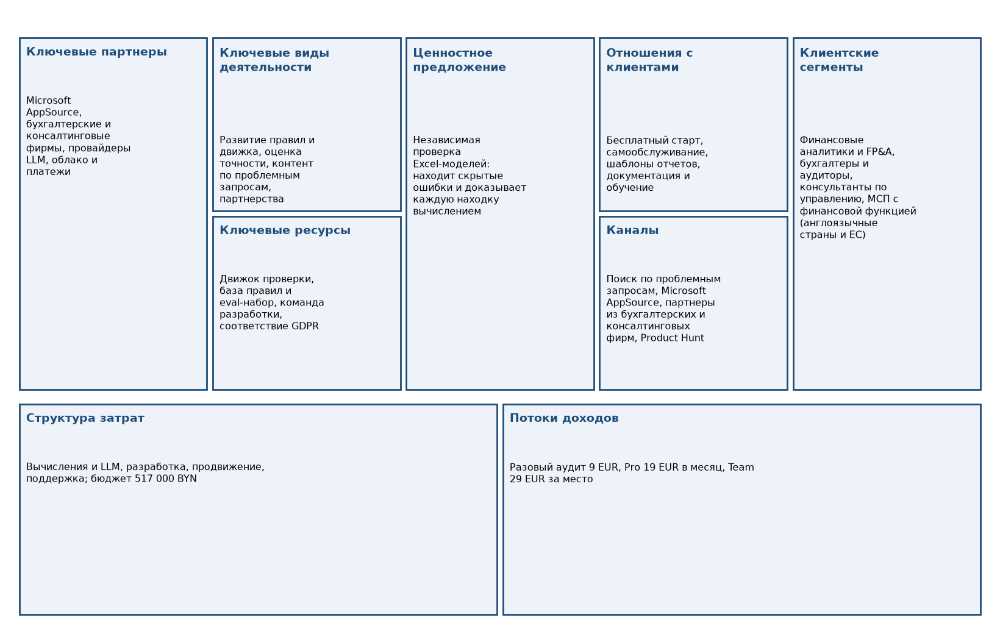

Рисунок 1 – Канвас бизнес-модели TableMind

Рисунок показывает девять блоков в стандартной раскладке Остервальдера и Пинье [7]. Центральное место занимает ценностное предложение, а крайние блоки (партнеры и сегменты) связаны с результатами ЛР2-ЛР4.

В таблице 8 представлено: статусы блоков Канваса.

Таблица 8 – Статусы блоков Канваса

| Блок | Достоверность | Полнота | Риск | Статус |
|---|---|---|---|---|
| Клиентские сегменты | 4.0 | 4.0 | 2.0 | Готово |
| Ценностное предложение | 4.0 | 4.0 | 2.0 | Готово |
| Каналы | 3.0 | 4.0 | 3.0 | Проверить |
| Отношения с клиентами | 4.0 | 4.0 | 2.0 | Готово |
| Потоки доходов | 4.0 | 4.0 | 2.0 | Готово |
| Ключевые ресурсы | 4.0 | 3.0 | 3.0 | Проверить |
| Ключевые виды деятельности | 4.0 | 4.0 | 2.0 | Готово |
| Ключевые партнеры | 3.0 | 3.0 | 3.0 | Проверить |
| Структура затрат | 4.0 | 4.0 | 2.0 | Готово |

Готовы шесть блоков из девяти (доля готовых 67 %); требуют проверки каналы, ключевые ресурсы и партнеры. Полнота заполнения 76 %, контроль риска 53 %: слабые места - стоимость привлечения, метрики точности и условия AppSource.

В таблице 9 представлено: приоритет клиентских сегментов.

Таблица 9 – Приоритет клиентских сегментов

| Сегмент | Индекс | Статус |
|---|---|---|
| Финансовые аналитики и FP&A | 4,25 | Приоритетный |
| Бухгалтеры и аудиторы | 3,75 | Перспективный |
| Консультанты по управлению | 4,25 | Приоритетный |
| МСП с финансовой функцией | 3,00 | Перспективный |

Приоритетные сегменты - финансовые аналитики и консультанты (индекс 4,25); бухгалтеры и аудиторы и МСП - перспективные. Это согласуется с ЛР2-3, где консультанты дают наибольший вклад в SAM.

В таблице 10 представлено: каналы и воронка.

Таблица 10 – Каналы и воронка

| Канал | Индекс | Решение |
|---|---|---|
| Поиск по проблемным запросам (ошибки в формулах) | 4,33 | Включить |
| Microsoft AppSource | 3,67 | Проверить |
| Партнерские фирмы и преподаватели Excel | 3,33 | Проверить |
| Product Hunt и профессиональные сообщества | 3,33 | Проверить |
| Страница продукта, примеры найденных ошибок | 4,33 | Включить |
| Бесплатная проверка файла без оплаты | 4,33 | Включить |
| Прозрачная страница тарифов | 5,00 | Включить |
| Email, отчеты, обучающие материалы | 3,67 | Проверить |

Включить сразу рекомендуется поиск по проблемным запросам, страницу продукта, бесплатную проверку и прозрачные тарифы; остальные каналы (AppSource, партнеры, сообщества) требуют проверки. Вывод совпадает с ЛР4: трафик конкурентов идет в основном из поиска и прямых заходов.

### 2.4 Бизнес-логика и пользовательские сценарии

Методика [3] переводит выводы анализа в бизнес-логику (за счет чего создается и монетизируется ценность), роли, сценарии и функциональные требования с приоритетами. Требование попадает в MVP, если его индекс приоритета не ниже 10 (высокий или критический).

В таблице 11 представлено: элементы бизнес-логики.

Таблица 11 – Элементы бизнес-логики

| ID | Элемент | Тип | Индекс надежности |
|---|---|---|---|
| BL-001 | Снижение барьера первого использования | Клиентская | 0,75 |
| BL-002 | Доказательство каждой находки | Продуктовая | 0,75 |
| BL-003 | Отчет для передачи | Клиентская | 0,60 |
| BL-004 | Подписка на постоянную проверку | Монетизационная | 0,75 |
| BL-005 | Командная работа | Монетизационная | 0,30 |
| BL-006 | Доверие к безопасности | Рисковая | 0,60 |

Шесть элементов охватывают клиентскую, продуктовую, монетизационную и рисковую логику; средний индекс надежности - 0,62 (шкала 0-1). Наименее подтверждена командная работа (0,30): это согласуется с переносом Team на следующий релиз.

В таблице 12 представлено: пользовательские сценарии.

Таблица 12 – Пользовательские сценарии

| ID | Сценарий | Роль | Тип | Индекс | Приоритет |
|---|---|---|---|---|---|
| S-001 | Проверить файл без регистрации | Финансовый аналитик / FP&A | Основной | 15,0 | Критический |
| S-002 | Зарегистрироваться и сохранить отчет | Финансовый аналитик / FP&A | Основной | 12,0 | Высокий |
| S-003 | Купить разовый аудит файла | Консультант по управлению | Монетизационный | 15,0 | Критический |
| S-004 | Оформить Pro после нескольких проверок | Финансовый аналитик / FP&A | Монетизационный | 12,0 | Высокий |
| S-005 | Подтвердить результат AI в Excel | Финансовый аналитик / FP&A | Основной | 10,0 | Высокий |
| S-006 | Передать отчет заказчику | Консультант по управлению | Основной | 4,8 | Низкий |
| S-007 | Проверить чужую модель клиента | Консультант по управлению | Основной | 4,8 | Низкий |
| S-008 | Настроить правила проверки под компанию | Администратор команды | Вспомогательный | 1,8 | Отложить |
| S-009 | Пригласить коллег в Team | Администратор команды | Монетизационный | 2,4 | Низкий |
| S-010 | Удалить данные по запросу | Бухгалтер / аудитор | Вспомогательный | 2,4 | Низкий |

Критичны сценарии первого результата и разовой покупки, высокие - регистрация, подписка и проверка результата AI. Три монетизационных сценария покрывают разовый аудит, Pro и Team.

В таблице 13 представлено: функциональные требования и MVP.

Таблица 13 – Функциональные требования и MVP

| ID | Требование | Категория Кано | Индекс | Приоритет | MVP |
|---|---|---|---|---|---|
| F-001 | Загрузка xlsx и проверка без регистрации | Базовое требование | 18,0 | Критический | Да |
| F-002 | Поиск ошибок формул и логики | Базовое требование | 12,0 | Высокий | Да |
| F-003 | Доказательство каждой находки вычислением | Привлекательное требование | 12,0 | Высокий | Да |
| F-004 | Отчет аудита с перечнем находок | Одномерное требование | 12,0 | Высокий | Да |
| F-005 | Регистрация, вход и личный кабинет | Базовое требование | 12,0 | Высокий | Да |
| F-006 | Оплата разового аудита и Pro | Базовое требование | 10,7 | Высокий | Да |
| F-007 | Политика данных GDPR и удаление файла | Базовое требование | 14,0 | Высокий | Да |
| F-008 | Страница тарифов и лимиты Free | Одномерное требование | 21,0 | Критический | Да |
| F-009 | Надстройка Excel для проверки книги | Одномерное требование | 6,8 | Средний | Кандидат |
| F-010 | Экспорт отчета в PDF и Excel | Одномерное требование | 9,0 | Средний | Кандидат |
| F-011 | История проверок | Одномерное требование | 9,0 | Средний | Кандидат |
| F-012 | AI-пояснения и подсказки исправления | Привлекательное требование | 6,0 | Средний | Кандидат |
| F-013 | Сравнение версий файла | Одномерное требование | 3,8 | Низкий | Нет |
| F-014 | Командное пространство и роли | Привлекательное требование | 4,8 | Низкий | Нет |
| F-015 | API и интеграции | Безразличное требование | 2,0 | Отложить | Нет |
| F-016 | Шаблоны правил под компанию | Привлекательное требование | 3,0 | Низкий | Нет |
| F-017 | Автоматическое исправление ошибок | Привлекательное требование | 2,8 | Отложить | Нет |
| F-018 | Дашборд качества моделей | Безразличное требование | 2,0 | Отложить | Нет |

В MVP входят 8 требований из 18 (44 %), что совпадает с ориентиром ПЗ1 (Must 8 из 18, 44 %). Это поиск ошибок, доказательство находки, отчет, регистрация, оплата, политика данных и страница тарифов; надстройка, экспорт, история и AI-пояснения - кандидаты следующих релизов.

На рисунке 2 показано: приоритеты функциональных требований.

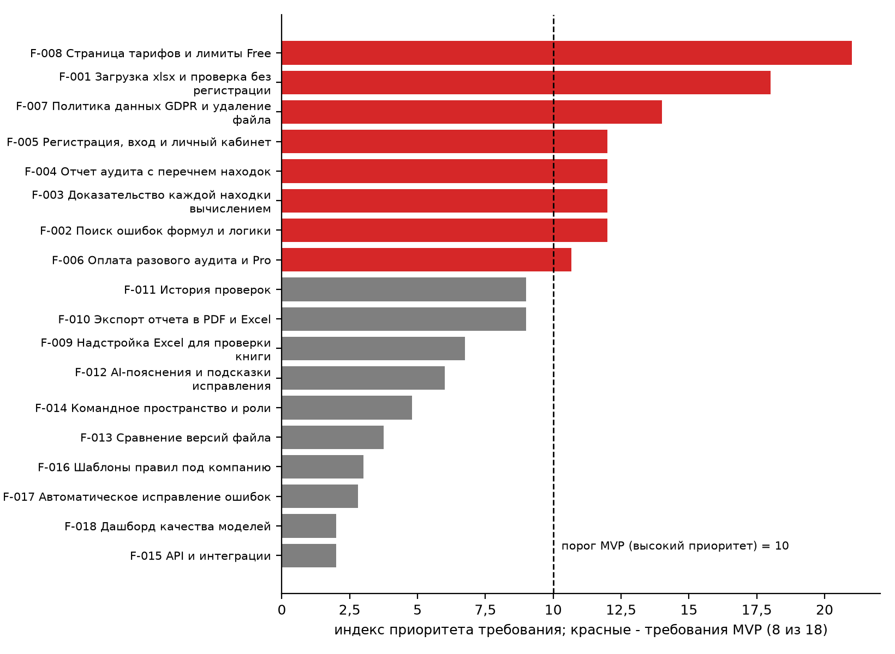

Рисунок 2 – Приоритеты функциональных требований

Рисунок показывает четкий разрыв между восемью требованиями MVP и остальными: все требования MVP лежат правее порога 10, а надстройка Excel (индекс 6,75) остается кандидатом. Ядро MVP определено не по желанию, а по формуле шаблона.

В таблице 14 представлено: приоритизация инициатив.

Таблица 14 – Приоритизация инициатив

| ID | Инициатива | Индекс | Решение |
|---|---|---|---|
| P-001 | Бесплатная проверка файла без регистрации | 7,00 | Включить в первую версию |
| P-002 | Движок проверки с доказательством находки | 7,00 | Включить в первую версию |
| P-003 | Отчет аудита | 6,00 | Включить в первую версию |
| P-004 | Оплата и тарифы | 6,00 | Включить в первую версию |
| P-005 | Политика данных и удаление файла | 6,00 | Включить в первую версию |
| P-006 | Надстройка Excel | 2,80 | Проверить дополнительно |
| P-007 | Командное пространство Team | 3,20 | Проверить дополнительно |
| P-008 | Автоматическое исправление | 0,72 | Исключить |

Пять инициатив первой версии получают решение «включить в первую версию» или «включить после проверки»; надстройка и Team проходят как «проверить дополнительно», автоисправление исключено из ближайших релизов из-за сложности и риска.

### 2.5 Страницы и экраны

Методика [4] связывает каждый сценарий со страницами и экранами, описывает состояния и ошибки, навигацию и паспорт каждого экрана. Идентификаторы U-001...U-017 совпадают с реестром единиц разработки (раздел 2.6).

В таблице 15 представлено: страницы и экраны TableMind.

Таблица 15 – Страницы и экраны TableMind

| ID | Тип | Название | Приоритет | Класс |
|---|---|---|---|---|
| U-001 | Страница сайта | Страница продукта с примерами ошибок | 68 | P1 — первая версия |
| U-002 | Экран приложения | Загрузка файла и запуск проверки | 68 | P1 — первая версия |
| U-003 | Экран приложения | Результат проверки: список находок | 68 | P1 — первая версия |
| U-004 | Экран приложения | Карточка находки с доказательством | 68 | P2 — следующий выпуск |
| U-005 | Экран приложения | Отчет аудита | 45 | P2 — следующий выпуск |
| U-006 | Экран приложения | Регистрация и вход | 59 | P2 — следующий выпуск |
| U-007 | Страница сайта | Страница тарифов | 61 | P2 — следующий выпуск |
| U-008 | Экран приложения | Оплата | 61 | P2 — следующий выпуск |
| U-009 | Страница сайта | Безопасность и политика данных | 38 | P2 — следующий выпуск |
| U-010 | Экран приложения | Настройки аккаунта и удаление данных | 38 | P3 — можно отложить |
| U-011 | Экран приложения | Личный кабинет: история проверок | 52 | P3 — можно отложить |
| U-012 | Экран приложения | Надстройка Excel: панель проверки | 68 | P2 — следующий выпуск |
| U-016 | Экран приложения | Команда: места и роли | 29 | P3 — можно отложить |
| U-017 | Страница сайта | Документация и справка | 68 | P3 — можно отложить |

Спроектированы 14 единиц: 8 страниц и экранов P1 (первая версия) и остальные P2-P3. Каждая имеет паспорт, набор состояний (нормальное, пустое, загрузка, ошибки, успех) и сообщение пользователю; полнота паспортов и состояний - 100 %.

В таблице 16 представлено: основные переходы.

Таблица 16 – Основные переходы

| Откуда | Куда | Событие | Риск разрыва (1-5) |
|---|---|---|---|
| U-001 | U-002 | Нажатие «Проверить файл» | 2 |
| U-002 | U-003 | Завершение проверки | 2 |
| U-003 | U-004 | Открытие находки | 1 |
| U-004 | U-006 | Сохранить результат | 3 |
| U-003 | U-007 | Открыть полный отчет | 3 |
| U-007 | U-008 | Нажатие «Купить» | 2 |
| U-008 | U-005 | Платеж подтвержден | 2 |
| U-006 | U-011 | Вход выполнен | 1 |
| U-001 | U-009 | Открытие политики данных | 2 |
| U-009 | U-010 | Удаление данных | 3 |
| U-011 | U-007 | Предложение Pro | 2 |
| U-012 | U-003 | Проверка книги | 3 |
| U-016 | U-008 | Оплата мест | 3 |

Описано 13 переходов и 17 связей сценариев с интерфейсом. Наибольший риск разрыва (3) - сохранение результата без входа, переход к оплате при исчерпании лимита Free и удаление данных; для них предусмотрены подсказки и подтверждения.

На рисунке 3 показано: схемы ключевых экранов первой версии.

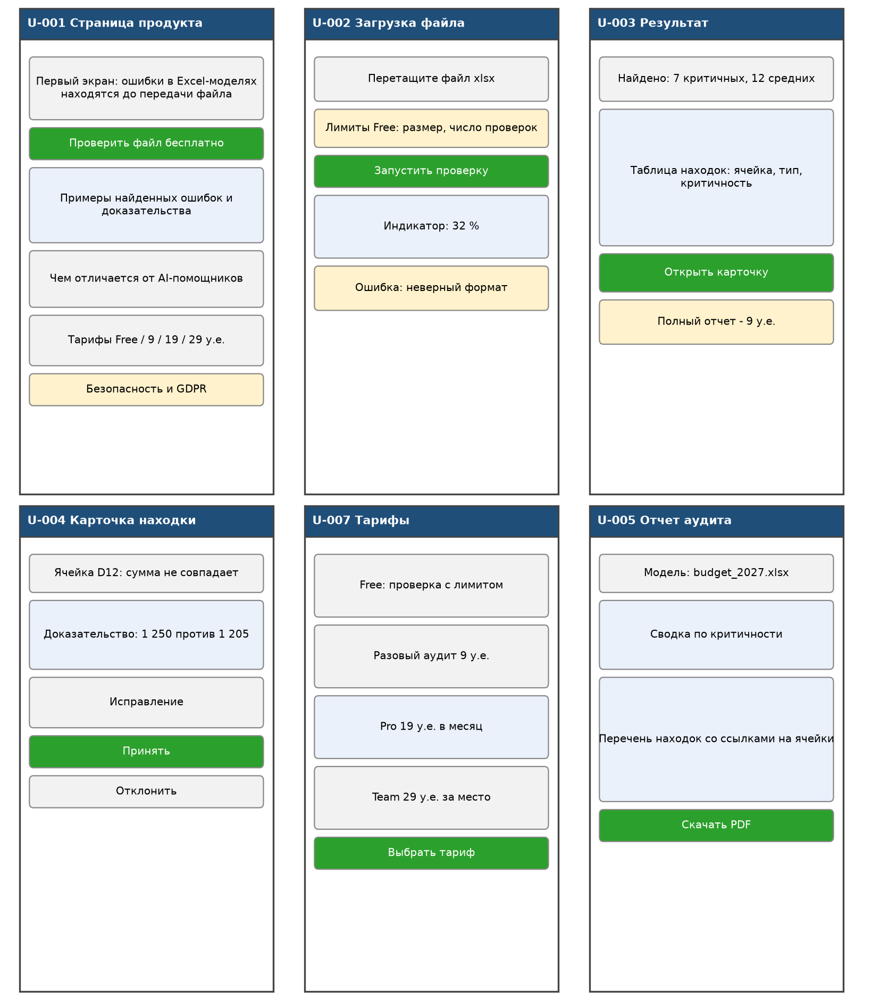

Рисунок 3 – Схемы ключевых экранов первой версии

Схемы показывают шесть экранов основного пути: страницу продукта, загрузку файла, результат, карточку находки, тарифы и отчет. Путь от страницы до первой находки занимает три действия, а оплата вынесена после первого бесплатного результата.

Покрытие сценариев страницами и экранами равно 80 % (восемь из десяти; не покрыты настройка правил команды и один вспомогательный сценарий), интегральная готовность интерфейсной модели - 95 %. Схемы экранов подготовлены как основа; кликабельный прототип сайта выполнен в Figma и описан ниже.

#### 2.5.1 Прототип сайта в Figma

Прототип создан в Figma по методическому пособию [8] и размещен по ссылке https://www.figma.com/design/QEj3FhylPe0fG2rDef7bMy/TableMind-project. Файл содержит три страницы сайта шириной 1440 пикселей (главная, продукт, контакты) и лист «Elements» с палитрой, шапкой и подвалом, из которых страницы собраны. Содержимое файла прочитано через подключенный инструмент Figma и сопоставлено со страницами и экранами раздела 2.5.

На рисунке 4 показано: прототип Figma: страница Home (главная).

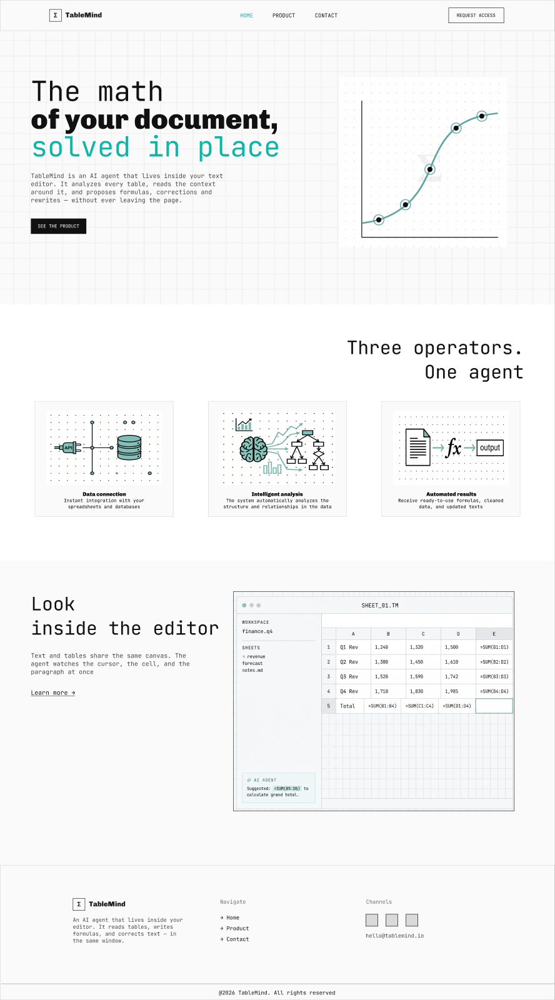

Рисунок 4 – Прототип Figma: страница Home (главная)

Главная страница состоит из шапки с кнопкой «Request access», первого экрана с заголовком и иллюстрацией, блока «Three operators. One agent» с тремя карточками (подключение данных, интеллектуальный анализ, автоматические результаты), макета редактора с подсказкой агента и подвала. Она соответствует точке входа пути пользователя, но тарифов и примеров ошибок на ней нет.

На рисунке 5 показано: прототип Figma: страница Product (продукт).

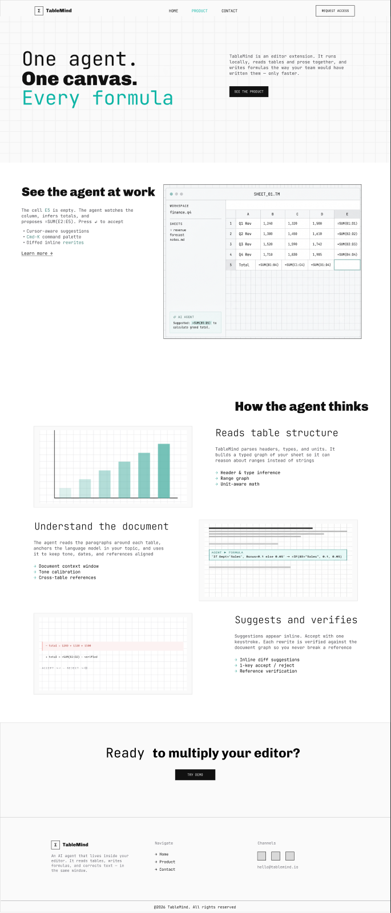

Рисунок 5 – Прототип Figma: страница Product (продукт)

Страница продукта показывает работу агента на примере пустой ячейки E5 и предложенной формулы суммы, затем описывает три шага («читает структуру таблицы», «понимает документ», «предлагает и проверяет») и завершается призывом «Try demo». По назначению она ближе всего к единице U-001, но пока не содержит примеров реальных ошибок и доказательства находки.

На рисунке 6 показано: прототип Figma: страница Contact (контакты).

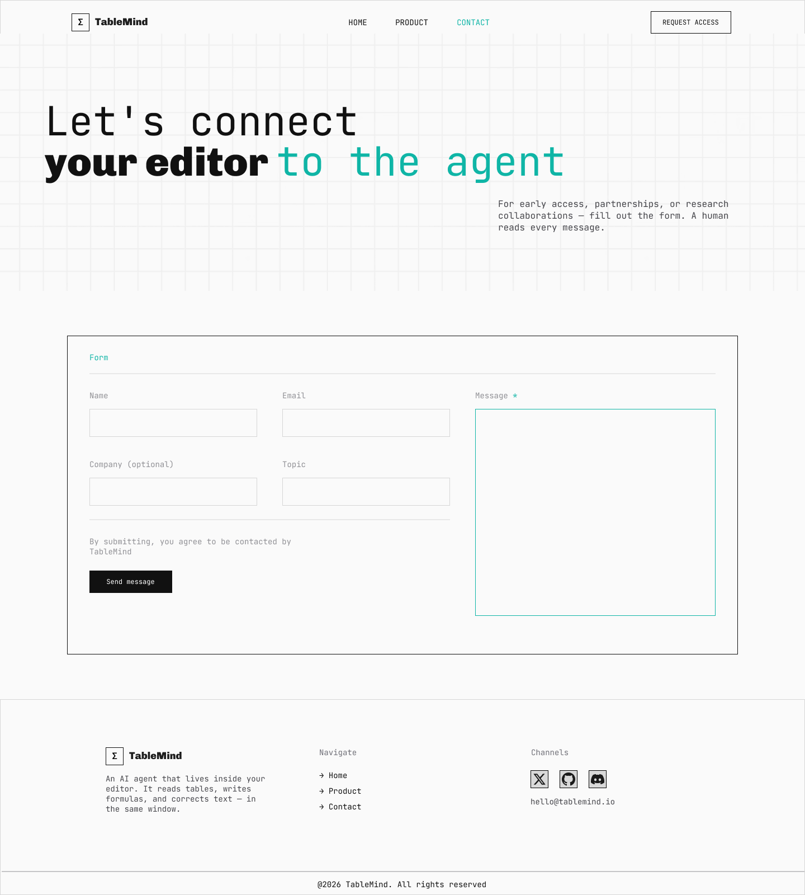

Рисунок 6 – Прототип Figma: страница Contact (контакты)

Страница контактов содержит форму с полями «Name», «Email», «Company (optional)», «Topic» и «Message», кнопку «Send message» и согласие на обработку обращения. Форма может служить основой для листа ожидания и сбора первых регистраций, что напрямую связано с целью 300 регистраций.

На рисунке 7 показано: прототип Figma: лист Elements (палитра и компоненты).

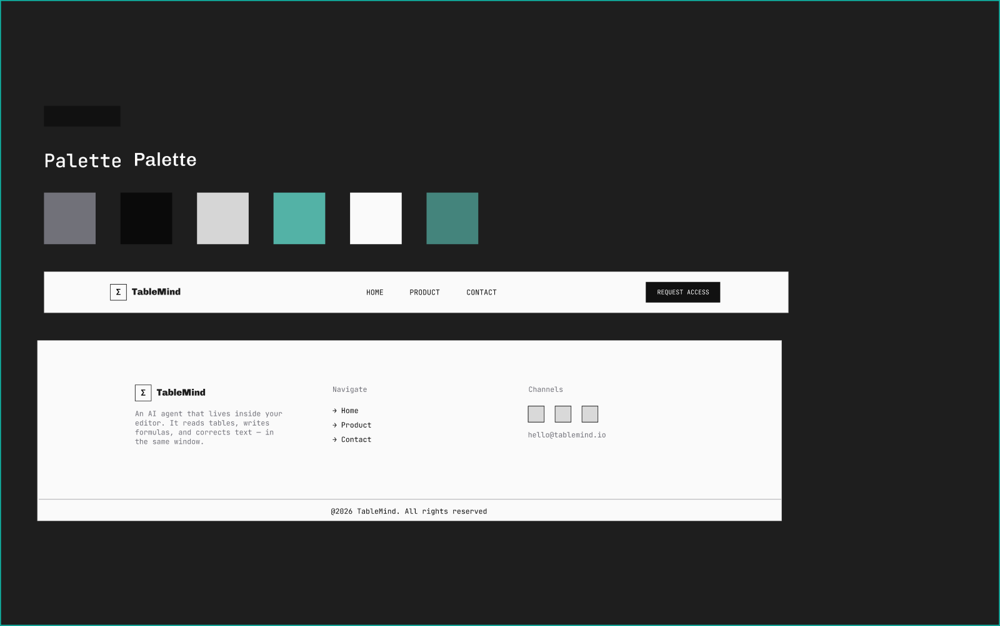

Рисунок 7 – Прототип Figma: лист Elements (палитра и компоненты)

Лист «Elements» фиксирует палитру из шести цветов (серый, черный, светло-серый, бирюзовый, белый, темно-бирюзовый), шапку с навигацией и подвал. Единые компоненты шапки и подвала используются на всех трех страницах, что обеспечивает целостность интерфейса.

В таблице 17 представлено: соответствие страниц прототипа единицам интерфейсной модели.

Таблица 17 – Соответствие страниц прототипа единицам интерфейсной модели

| Страница Figma | Единица (раздел 2.5) | Покрытие | Что доработать |
|---|---|---|---|
| Home | U-001 Страница продукта (вход) | частично | добавить примеры ошибок Excel и ссылку на тарифы |
| Product | U-001 Страница продукта с примерами ошибок | частично | показать находку с доказательством (движок), а не только формулу суммы |
| Contact | U-017 Документация и справка; сбор регистраций | частично | связать форму с регистрацией (U-006) и листом ожидания |
| нет страницы | U-007 Страница тарифов | не покрыто | добавить страницу с тарифами Free, 9, 19, 29 EUR |
| нет страницы | U-002...U-005, U-008 экраны приложения | не покрыто | собрать кликабельный путь «загрузка - результат - карточка - отчет - оплата» по схемам |

Прототип закрывает маркетинговую часть пути (вход, объяснение продукта, контакт), но не экраны приложения и тарифы. Вывод: подтверждена визуальная система и каркас сайта, а интерфейсное покрытие 80 % относится к схемам, а не к прототипу; доработки перечислены в приложении Б.

Наблюдение: тексты прототипа описывают универсального агента для текстового редактора («AI agent that lives inside your editor»), а не проверку Excel-моделей с доказательством находок. Для согласования с ценностным предложением раздела 2.1 заголовок и примеры страниц нужно переписать под аудит таблиц; это зафиксировано как доработка прототипа.

### 2.6 Деление разработки на релизы

Методика [5] оценивает 24 единицы разработки по десяти показателям и относит их к первому релизу, следующим релизам или к гипотезам. Единица попадает в первый релиз, если она связана с ценностным предложением, доходом, доказательна и ее потеря критична, либо если балл первого релиза не ниже 3,7.

В таблице 18 представлено: состав релизов по единицам разработки.

Таблица 18 – Состав релизов по единицам разработки

| ID | Единица | Балл первого релиза | Балл следующих | Релиз |
|---|---|---|---|---|
| U-001 | Страница продукта с примерами найденных ошибок | 4,28 | 3,24 | Первый релиз |
| U-002 | Загрузка файла и запуск проверки без регистрации | 4,72 | 4,06 | Первый релиз |
| U-003 | Результат проверки: список находок | 4,77 | 3,98 | Первый релиз |
| U-004 | Карточка находки с доказательством | 4,11 | 4,00 | Первый релиз |
| U-005 | Отчет аудита | 4,14 | 3,64 | Первый релиз |
| U-006 | Регистрация и вход | 4,31 | 2,90 | Первый релиз |
| U-007 | Страница тарифов | 4,45 | 2,98 | Первый релиз |
| U-008 | Оплата разового аудита и Pro | 4,02 | 3,46 | Первый релиз |
| U-009 | Политика данных и страница безопасности | 4,18 | 3,38 | Первый релиз |
| U-010 | Удаление файла и данных пользователя | 3,81 | 2,94 | Первый релиз |
| U-011 | Личный кабинет: история проверок | 3,25 | 3,22 | Не включать / проверить |
| U-012 | Надстройка Excel: проверка книги | 3,69 | 4,32 | Следующий релиз |
| U-013 | Экспорт отчета в PDF и Excel | 3,46 | 3,40 | Не включать / проверить |
| U-014 | AI-пояснения и подсказки исправления | 3,35 | 3,50 | Не включать / проверить |
| U-015 | Сравнение версий файла | 2,80 | 3,38 | Не включать / проверить |
| U-016 | Командное пространство и роли Team | 3,23 | 3,80 | Следующий релиз |
| U-017 | Документация и справка | 3,72 | 3,28 | Первый релиз |
| U-018 | Шаблоны правил под компанию | 3,07 | 3,54 | Не включать / проверить |
| U-019 | Листинг в Microsoft AppSource | 3,47 | 3,66 | Следующий релиз |
| U-020 | API и интеграции | 2,57 | 3,26 | Не включать / проверить |
| U-021 | Дашборд качества моделей | 2,41 | 3,00 | Не включать / проверить |
| U-022 | Автоматическое исправление ошибок | 2,52 | 3,50 | Не включать / проверить |
| U-023 | Мобильное приложение | 1,02 | 2,18 | Не включать / проверить |
| U-024 | Интеграция с ERP-системами | 1,48 | 2,66 | Не включать / проверить |

В первый релиз входят 11 единиц (балл первого релиза в среднем 4,23, средний технический риск 1,73), в следующие релизы - 3 (надстройка Excel, Team, листинг AppSource), остальные 10 остаются гипотезами до подтверждения спроса.

В таблице 19 представлено: дорожная карта релизов.

Таблица 19 – Дорожная карта релизов

| Релиз | Цель | Срок | Критерий перехода |
|---|---|---|---|
| Первый релиз | Проверить ценность и спрос: MVP веб-аудита | 31.03.2027 | 50 проверенных файлов и precision не ниже 90 % |
| Релиз 2 | Открытая бета с оплатой | 01.06.2027 | Не менее 300 регистраций и первые платежи |
| Релиз 3 | Бета v1 с надстройкой Excel | 31.07.2027 | Стабильная точность и установки из AppSource |
| Релиз 4 | Релиз проекта | 30.09.2027 | Не менее 50 платящих пользователей |

Даты релизов согласованы с вехами ПЗ1 и ПЗ4: MVP веб-аудита 31.03.2027, открытая бета с оплатой 01.06.2027, бета v1 с надстройкой в июле 2027, релиз проекта в сентябре 2027. Критерии перехода измеримы и совпадают с целями проекта (300 регистраций и 50 платящих).

На рисунке 8 показано: дорожная карта релизов TableMind.

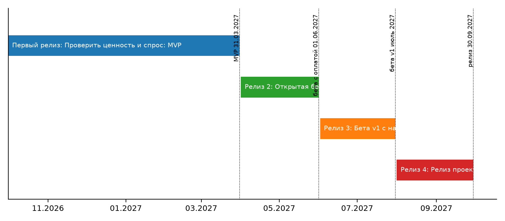

Рисунок 8 – Дорожная карта релизов TableMind

Рисунок показывает четыре последовательных релиза и вехи ПЗ1. Основной риск плана - узкое окно платной беты (01.06-30.09.2027): по расчетам ЛР2-3 в базовом сценарии за это время приходит около 19 платящих при цели 50.

В таблице 20 представлено: риски и зависимости релизов.

Таблица 20 – Риски и зависимости релизов

| ID | Единица | Риск | Индекс |
|---|---|---|---|
| R-001 | Сокращение ядра проверки | Пользователь не получает заявленную ценность | 10 |
| R-002 | Точность находок | Precision ниже 90 % | 15 |
| R-003 | Надстройка Excel | Сложность публикации в AppSource | 12 |
| R-004 | Безопасность и GDPR | Отказ клиентов из-за недоверия | 12 |
| R-005 | Оплата | Сбой платежей или налоги | 8 |
| R-006 | Цель по платящим | 50 платящих недостижимы за 4 месяца бета (ЛР2-3) | 16 |
| R-007 | Стоимость вычислений | Затраты на LLM превышают плановые | 9 |

Наибольшие индексы у риска недостижения цели по платящим (16) и точности находок (15). Они требуют ранней проверки: измерения конверсий уже на MVP и регулярной оценки precision на eval-наборе.

### 2.7 Согласованность с ПЗ1 и ПЗ4

В таблице 21 представлено: сверка с документами проекта.

Таблица 21 – Сверка с документами проекта

| Показатель | ПЗ1 и ПЗ4 | ЛР6 | Совпадение |
|---|---|---|---|
| Тарифы | Free, 9, 19, 29 EUR | Free, 9, 19, 29 EUR | да |
| MVP веб-аудита | 31.03.2027 | 31.03.2027 (первый релиз) | да |
| Открытая бета с оплатой | 01.06.2027 | 01.06.2027 (релиз 2) | да |
| Бета v1 с надстройкой | июль 2027 | 31.07.2027 (релиз 3) | да |
| Релиз | сентябрь 2027 | 30.09.2027 (релиз 4) | да |
| Требования Must | 8 из 18 (44 %) | 8 из 18 (44 %) | да |
| Цели | 300 регистраций, 50 платящих | учтены в критериях релизов; риск недостижения 50 отмечен | да, с риском |
| Качество | precision не ниже 90 %, 100 тыс. ячеек быстрее 60 с | критерии готовности FR-001, FR-002 | да |

Все параметры проекта сохранены; единственное расхождение - не в данных, а в прогнозе: цель по платящим достижима только при дополнительных каналах, и это отражено в рисках релизного плана и в реестре рисков проекта.

### 2.8 Проверка расчетов и ограничения

Независимый пересчет на Python охватил индексы проблем, потенциал монетизации и выручку, индексы сегментов, индексы и приоритеты требований и сценариев, баллы и решения по релизам, индексы рисков и приоритеты экранов. Из 155 контрольных величин расхождений нет (155 из 155); допуск 1e-6, для двухзначных баллов релизов 1e-9. Ошибок формул в пяти книгах нет.

Ограничения: оценки 1-5 и 1-4 в книгах выставлены аналитиком по страницам и результатам прежних работ (Д-26), опрос пользователей не проводился (используются модельные данные), прототип в Figma покрывает только страницы сайта, бизнес-логика проверена на формальную связность, но не на реальных пользователях. Эти пункты перечислены в приложении Б.

## 3 Ответы на контрольные вопросы

Ответы даны по контрольным точкам книг [3], [4] и проверкам связности [1], [2].

1. Проведена ли проверка связности «проблема - ценность - товар - монетизация - модель»? Да, таблица 7: четыре цепочки проходят проверку.

2. Заполнен ли каждый блок Канваса с доказательствами и оценкой риска? Да, таблица 8: готовы шесть блоков из девяти.

3. Есть ли роли и не менее пяти сценариев, включая монетизационные? Да: 5 ролей, 10 сценариев, 3 монетизационных (таблица 12).

4. Определены ли требования MVP? Да, таблица 13: 8 требований из 18.

5. Покрыты ли сценарии страницами и экранами, описаны ли состояния и ошибки? Покрытие 80 %, состояния описаны для всех 14 единиц (таблица 15).

6. Определены ли первый и следующие релизы и их критерии? Да, таблицы 18 и 19.

7. Согласованы ли результаты с ПЗ1 и ПЗ4? Да, таблица 21.

8. Выполнены ли все пункты методики? Да; прототип сайта создан в Figma (раздел 2.5.1), его доработка под экраны приложения вынесена в приложение Б.

## Выводы

Из результатов ЛР1-ЛР5 сформированы ценностное предложение (независимая проверка Excel-моделей с доказательством каждой находки), три цифровых товара (веб-аудит, надстройка Excel, командный сервис) и три единицы монетизации (9, 19 и 29 EUR). Цепочка «проблема - ценность - товар - монетизация - модель» проходит проверку связности со средним индексом 88 из 100.

Канвас готов на 67 % по блокам: слабее остальных каналы, ключевые ресурсы и партнеры. В MVP входят 8 из 18 требований, как в ПЗ1; первый релиз содержит 11 единиц разработки, надстройка Excel и Team перенесены в бета v1 и релиз, остальные единицы остаются гипотезами.

Главный риск плана - узкое окно платной беты при цели 50 платящих: его нужно снимать дополнительными каналами и ранним измерением конверсий. Следующие шаги: дополнить прототип в Figma экранами приложения и страницей тарифов, провести опрос по платежеспособности и Кано, затем свести результаты в итоговом отчете ЛР7.

## Список использованных источников

1. Методика формулирования ценностного предложения и цифрового товара; шаблон Excel. Методические материалы дисциплины «Электронный бизнес» к лабораторной работе № 6. – Минск : БГУИР, 2026.

2. Методика сборки бизнес-модели по Канвас на основе анализа; шаблон Excel. Методические материалы дисциплины «Электронный бизнес». – Минск : БГУИР, 2026.

3. Методика формулирования бизнес-логики и пользовательских сценариев; шаблон Excel. Методические материалы дисциплины «Электронный бизнес». – Минск : БГУИР, 2026.

4. Методика перехода к страницам и экранам сайта или приложения; шаблон Excel. Методические материалы дисциплины «Электронный бизнес». – Минск : БГУИР, 2026.

5. Методика деления разработки сайта на релизы; шаблон Excel. Методические материалы дисциплины «Электронный бизнес». – Минск : БГУИР, 2026.

6. Земляник, Р. В. Концепция проекта TableMind; WBS, сетевой график и диаграмма Ганта TableMind: отчеты по практическим занятиям по дисциплине «Управление проектами»; отчеты по лабораторным работам № 1, № 2–3, № 4, № 5 по дисциплине «Электронный бизнес» / Р. В. Земляник. – Минск : БГУИР, 2026.

7. Osterwalder, A. Business Model Generation / A. Osterwalder, Y. Pigneur. – Hoboken : Wiley, 2010. – 288 p.

8. Методическое пособие по Figma / под рук. Т. Н. Беляцкой. – Минск : БГУИР, 2026. – 73 с.

9. Microsoft. Plan a SaaS offer for Microsoft Marketplace [Электронный ресурс]. – Режим доступа: https://learn.microsoft.com/en-us/partner-center/marketplace-offers/plan-saas-offer. – Дата доступа: 03.10.2026.

10. Microsoft. How to review and publish an offer to Microsoft Marketplace [Электронный ресурс]. – Режим доступа: https://learn.microsoft.com/en-us/partner-center/marketplace-offers/review-publish-offer. – Дата доступа: 03.10.2026.

11. Microsoft. Microsoft Marketplace certification policies [Электронный ресурс]. – Режим доступа: https://learn.microsoft.com/en-us/legal/marketplace/certification-policies. – Дата доступа: 03.10.2026.

12. SOC2Auditors. SOC 2 Audit Cost, September 2026 [Электронный ресурс]. – Режим доступа: https://soc2auditors.org/soc-2-audit-cost/. – Дата доступа: 03.10.2026.

13. Drata. SOC 2 Type 1 vs. Type 2: Timeline, Cost, and Key Differences [Электронный ресурс]. – Режим доступа: https://drata.com/learn/soc-2/type-1-vs-type-2. – Дата доступа: 03.10.2026.

## Приложение А (обязательное) Допущения и параметры расчета

В приложении собраны допущения ЛР6 в дополнение к допущениям Д-01...Д-25 предыдущих работ.

В таблице 22 представлено: журнал допущений ЛР6.

Таблица 22 – Журнал допущений ЛР6

| № | Параметр | Значение | Обоснование | Влияние на результат | Как проверить |
|---|---|---|---|---|---|
| Д-26 | Оценки проблем, сегментов, каналов, товаров 1-5 и доказательности 1-4 | по результатам ЛР1-ЛР5 и просмотренным страницам | нет опроса пользователей | индексы, статусы блоков и приоритеты | опрос, второй аналитик |
| Д-27 | Единиц монетизации в месяц | 3 / 2 / 1 | базовая воронка ЛР2-3 (округлено) | расчетная выручка единиц | данные MVP |
| Д-28 | Оценки единиц релизов (10 показателей) | 1-5 | характеристики сложности и ценности | состав первого релиза | пересмотр после MVP |
| Д-29 | Сопоставление идентификаторов | S-... = SC-..., R-... = ROLE-..., U-... едины в 6.4 и 6.5 | единая нумерация цепочки | связность книг | - |

Допущения Д-26...Д-29 перенесены в общий журнал допущений проекта.

## Приложение Б (обязательное) Данные, которые необходимо доснять

Ниже перечислены элементы, которые не удалось получить или которые требуют личного участия.

В таблице 23 представлено: перечень данных, требующих получения или уточнения.

Таблица 23 – Перечень данных, требующих получения или уточнения

| № | Что доснять | Где | Как | Куда внести |
|---|---|---|---|---|
| 1 | Дополнить прототип экранами приложения и тарифами | Figma (файл студентки, ссылка в разделе 2.5.1) | по схемам и паспортам добавить U-002...U-008, переписать тексты под аудит Excel, связать кликабельный путь | раздел 2.5.1, приложение |
| 2 | Опрос по платежеспособности и функциям (Кано) | аудитория студентки | анкета 20-30 респондентов; пока использованы модельные данные (приложение Г ЛР2-3 и ЛР5) | книги 6.1, 6.3, ЛР3 платежеспособность |
| 3 | Скриншоты страниц конкурентов | Chrome | выполнено 03.10.2026: 8 страниц конкурентов (приложение Д) | папка Скриншоты, приложение Д |
| 4 | Измерение конверсий на MVP | собственный сайт | MVP еще не написан: использованы модельные замеры (приложение Е); после запуска заменить реальными измерениями | ЛР2-3, книги 6.1 и 6.5 |
| 5 | Условия AppSource и план SOC 2 | Microsoft Learn, поставщики аудита | правила публикации, сроки и ориентировочная стоимость SOC 2 уточнены 03.10.2026 (приложение Г); точные предложения - запросом у поставщиков аудита | книги 6.2 и 6.5, риски |

Пункты 1-3 выполняются в Figma и Chrome под аккаунтом студентки; пункты 4-5 зависят от запуска и внешних условий. Базовый прототип сайта (три страницы) уже создан.

## Приложение В (обязательное) Изменения шаблонов

Формулы шаблонов ЛР6 ошибок не содержали; демонстрационные строки заменены данными TableMind, строки с формулами не изменялись.

В таблице 24 представлено: изменения шаблонов.

Таблица 24 – Изменения шаблонов

| № | Книга | Изменение |
|---|---|---|
| 1 | Все пять книг | демонстрационные примеры заменены данными TableMind; формулы сохранены |
| 2 | Канвас (лист 10_Паспорт) | заполнены ячейки паспорта 4-16; первая строка паспорта вычисляется формулой из Канваса |
| 3 | Страницы и экраны, релизы | поля, зависящие от формул (приоритеты, полнота, релиз), не заполнялись вручную |

Изменения не затрагивают расчетную логику шаблонов: все итоговые показатели получены формулами книг и подтверждены независимым пересчетом.

## Приложение Г (справочное) Условия публикации в Microsoft AppSource

Условия уточнены по документации Microsoft 03.10.2026 [9]-[11] и относятся к единицам релиза «листинг AppSource» и «надстройка Excel» (бета v1 и релиз проекта).

В таблице 25 представлено: требования и условия публикации SaaS-предложения в AppSource.

Таблица 25 – Требования и условия публикации SaaS-предложения в AppSource

| Вопрос | Что установлено | Следствие для плана релизов |
|---|---|---|
| Варианты размещения | «Contact me», «Free trial», «Get it now (Free)» и «Sell through Microsoft» (транзакционное предложение); последний вариант после публикации изменить нельзя | первым шагом достаточно листинга с бесплатным пробным доступом без транзакций, продажу через Microsoft можно включить в релизе проекта |
| Техническая база | для вариантов, кроме «Contact me», нужен вход через Microsoft Entra ID с единым входом и страница приветствия; для транзакционного варианта дополнительно API выполнения заказов SaaS, веб-обработчик событий и не менее одного тарифа | в ТЗ первого релиза закладывается вход через Microsoft; это дополнительная работа для единицы «листинг AppSource» |
| Размещение инфраструктуры | политика 1000.1 требует, чтобы SaaS преимущественно размещался на Azure | хостинг TableMind нужно выбрать или согласовать с Azure до подачи; это условие проверяется при планировании архитектуры |
| Сертификация и сроки | автоматическая проверка занимает до 30 минут, затем ручная сертификация (содержание, техническая проверка, деловые критерии издателя), предпросмотр и выпуск; при отказе приходит отчет и можно подать повторно | в плане релизов выделить время на повторные подачи; точный срок ручной проверки в документации не указан |
| Безопасность и сертификат SOC 2 | политики 100.11 и 1000 требуют безопасной работы, HTTPS, политики конфиденциальности и условий использования; сторонний сертификат SOC 2 или ISO явно не требуется | SOC 2 не нужен для публикации, но DataSnipper и Shortcut заявляют SOC 2 Type II, поэтому он остается ожиданием рынка; запрос предложений на SOC 2 включить в риски |
| Пробный период и комиссия | пробный период для транзакционных тарифов 1-180 дней с автопереходом в платную подписку; комиссия Microsoft 3 % | бесплатный старт и пробный период совпадают с зоной дифференциации ЛР5 и допущением Д-14 |

Для публикации в AppSource достаточно Microsoft Entra ID, страницы приветствия, политики конфиденциальности и преимущественного размещения на Azure; SOC 2 формально не нужен. Поэтому листинг можно планировать раньше, чем SOC 2, но доверие корпоративных покупателей без SOC 2 останется слабым местом, что отражено в рисках ЛР7.

Сроки и стоимость SOC 2 уточнены по открытым обзорам рынка аудита безопасности 2026 года [12], [13], так как коммерческие предложения поставщиков можно получить только запросом. Диапазоны ориентировочные; пересчет в BYN выполнен по курсу НБРБ 3,0051 BYN за 1 USD (03.10.2026).

В таблице 26 представлено: ориентировочные сроки и стоимость SOC 2 для стартапа.

Таблица 26 – Ориентировочные сроки и стоимость SOC 2 для стартапа

| Показатель | Type I | Type II |
|---|---|---|
| Плата аудитору, USD | 8 000-25 000 | 15 000-40 000 |
| Первый год полностью (аудит, платформа соответствия, пентест, время команды), USD | 15 000-40 000 | 30 000-80 000 |
| То же, BYN | 45 100-120 200 | 90 200-240 400 |
| Доля бюджета проекта 517 000 BYN | 9-23 % | 17-46 % |
| Срок от начала подготовки до отчета | 3-5 месяцев | 9-14 месяцев (наблюдение 3-12 месяцев) |

Type I дает фиксацию средств контроля на дату и достижим до открытой беты, а Type II требует периода наблюдения, поэтому при старте подготовки в январе 2027 года отчет Type II придет уже после завершения проекта 30.09.2027. Вывод: в плане закладывать Type I к бете v1 (июль 2027) и начало наблюдения Type II, при условии что статья расходов предусмотрена бюджетом ПЗ1; наличие такой статьи нужно сверить.

## Приложение Д (справочное) Скриншоты страниц конкурентов

Скриншоты сняты 03.10.2026 в Chrome (первый экран страницы, баннеры cookie скрыты или отклонены) и подтверждают данные ЛР4 и ЛР5 о ценах и позиционировании.

На рисунке 9 показано: PerfectXL: главная страница.

Рисунок 9 – PerfectXL: главная страница

Главная PerfectXL построена вокруг награды «Best Excel Add-in of 2026» и кнопки анонса; цен и пробного доступа на первом экране нет.

На рисунке 10 показано: PerfectXL: страница цен.

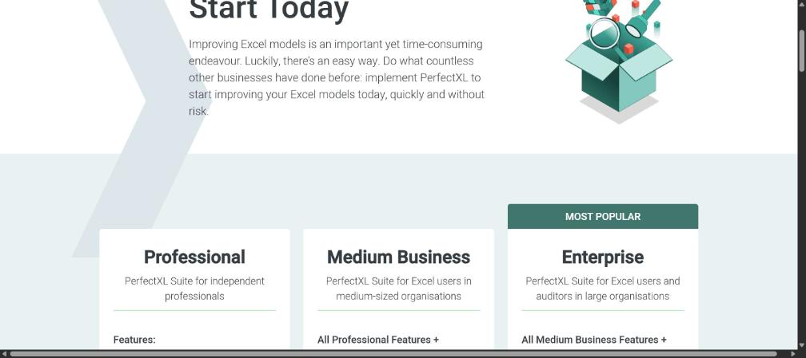

Рисунок 10 – PerfectXL: страница цен

Страница показывает три пакета (Professional, Medium Business, Enterprise) для разных размеров организаций; подтверждает, что цена раскрыта частично и сгруппирована по сегментам.

На рисунке 11 показано: Shortcut: страница цен.

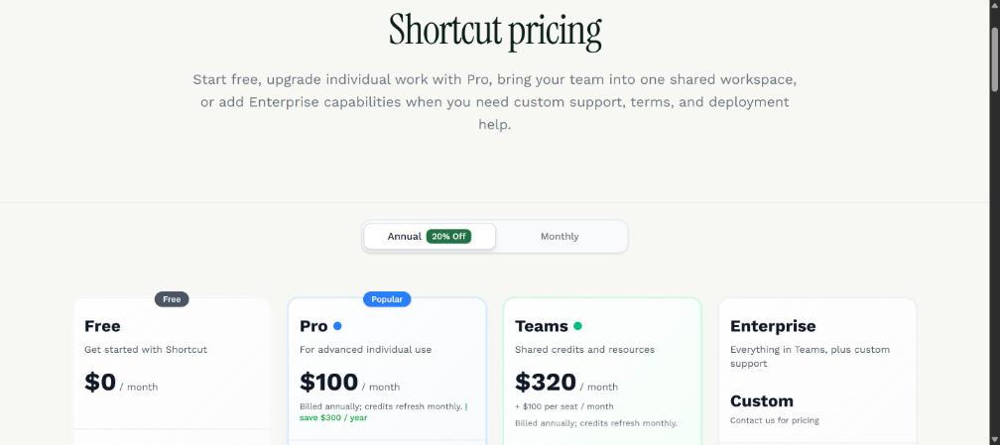

Рисунок 11 – Shortcut: страница цен

Страница показывает Free за 0 USD, Pro 100 USD, Teams 320 USD плюс 100 USD за место и Enterprise по запросу со скидкой 20 % за год; это самая прозрачная лестница тарифов среди конкурентов.

На рисунке 12 показано: Numerous.ai: главная страница.

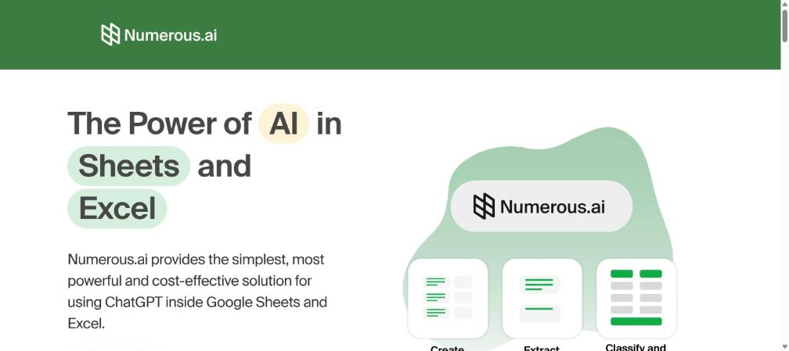

Рисунок 12 – Numerous.ai: главная страница

Главная Numerous.ai продает массовое предложение «AI в Sheets и Excel» без разговора с продавцом; страница цен перенаправляет на главную, а условия пробного периода и оплаты описаны в тексте.

На рисунке 13 показано: Datarails: страница цен.

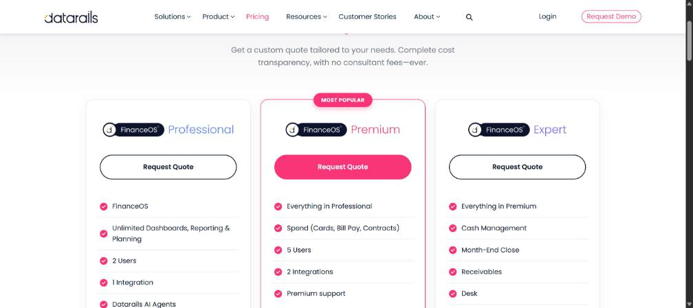

Рисунок 13 – Datarails: страница цен

Три тарифа (Professional, Premium, Expert) без сумм и кнопки «Request Quote»; цена по запросу и ограничения по числу пользователей и интеграций подтверждают корпоративную модель продаж.

На рисунке 14 показано: DataSnipper: страница цен.

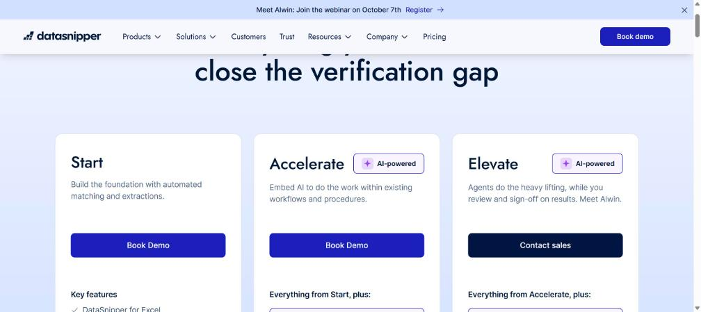

Рисунок 14 – DataSnipper: страница цен

Тарифы Start, Accelerate и Elevate без сумм, вход через «Book Demo» и «Contact sales»; баннер cookie был отклонен до снимка.

На рисунке 15 показано: Arixcel: лицензирование.

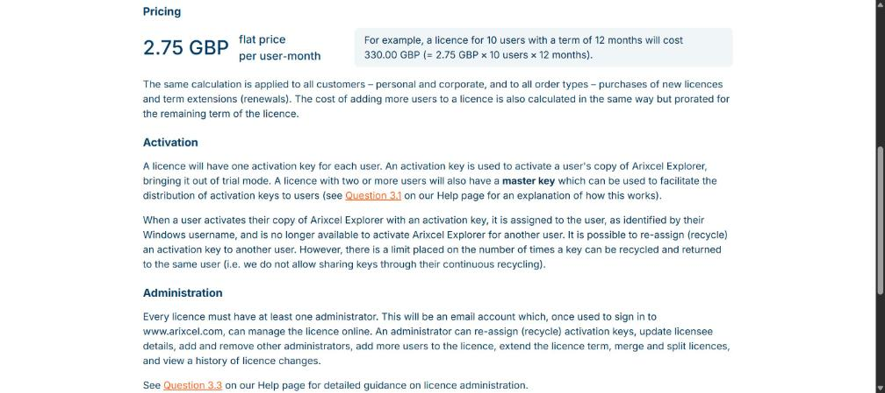

Рисунок 15 – Arixcel: лицензирование

Раздел цен показывает 2,75 GBP за пользователя в месяц с примером расчета для 10 пользователей на 12 месяцев; правила активации ключей и администрирования лицензий говорят о нацеленности на корпоративных пользователей Windows.

На рисунке 16 показано: Operis OAK: страница цен.

Рисунок 16 – Operis OAK: страница цен

Страница показывает годовую подписку 311,66 GBP плюс налог и более 30 инструментов в пакете; кнопка «Buy now» говорит о продаже без консультанта, в отличие от услуг аудита моделей Operis.

## Приложение Е (справочное) Модельные замеры MVP

MVP еще не написан, поэтому замеры воронки с 01.04.2027 по 30.09.2027 смоделированы (генератор и файлы - в папке 00_Общее/Модельные_данные, seed 20261004, допущение Д-32). Параметры соответствуют базовому сценарию ЛР2-3: визит - регистрация 4 %, регистрация - активация 60 %, активация - платящий около 8 %, платежи с 01.06.2027. Это не измерения, а демонстрация того, как отчет о конверсиях выглядит и насколько цели чувствительны к разбросу.

В таблице 27 представлено: модельные показатели воронки по месяцам.

Таблица 27 – Модельные показатели воронки по месяцам

| Месяц | Визиты | Регистрации | Активации | Платящие |
|---|---|---|---|---|
| 2027-04 | 1 584 | 66 | 30 | 0 |
| 2027-05 | 2 038 | 175 | 102 | 0 |
| 2027-06 | 2 454 | 129 | 74 | 5 |
| 2027-07 | 3 592 | 212 | 119 | 10 |
| 2027-08 | 3 539 | 175 | 117 | 9 |
| 2027-09 | 5 691 | 309 | 172 | 10 |
| Итого | 18 898 | 1 066 | 614 | 34 |

За шесть месяцев модель дает 1 066 регистраций и 34 платящих; фактические конверсии: визит - регистрация 5,6 %, регистрация - платящий 4,1 %. Цель 300 регистраций достигнута, цель 50 платящих не достигнута.

В таблице 28 представлено: разброс итогов при неопределенности конверсий (500 повторов).

Таблица 28 – Разброс итогов при неопределенности конверсий (500 повторов)

| Показатель | 10-й перцентиль | Медиана | 90-й перцентиль | Вероятность достичь цели |
|---|---|---|---|---|
| Регистрации (цель 300) | 437 | 744 | 1 107 | 98 % |
| Платящие (цель 50) | 10 | 23 | 54 | 15 % |

Цель по регистрациям достижима почти при любых разумных конверсиях (вероятность 98 %), а цель 50 платящих - лишь примерно в 15 % повторов. Это согласуется с выводом ЛР2-3 и ЛР7: окно платной беты слишком узкое, нужны дополнительные каналы и ранний замер активации и оплаты.

