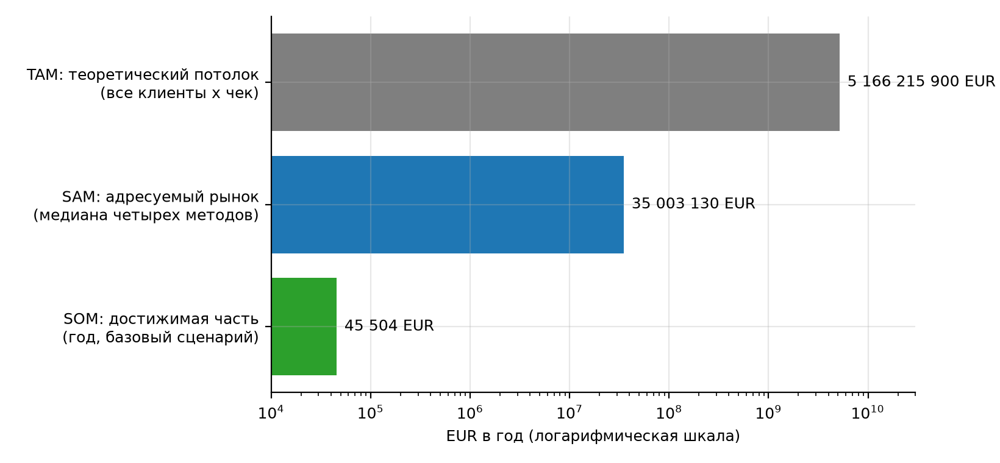
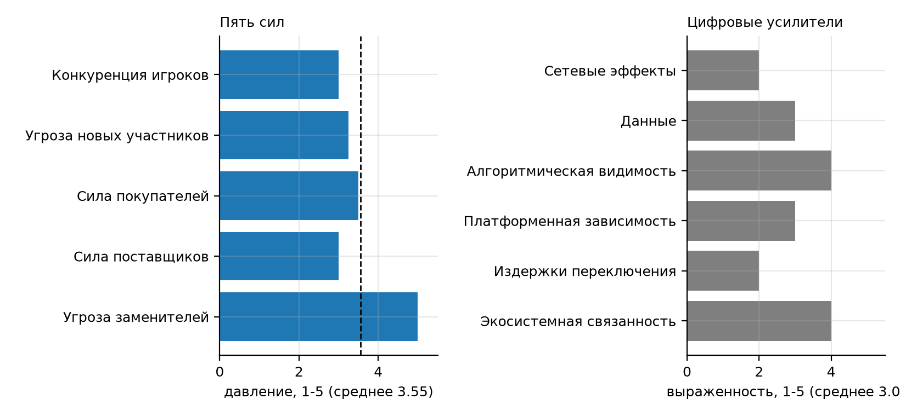

## Резюме проекта

Проект TableMind - облачный AI-сервис независимой проверки Excel-моделей для финансовых аналитиков, бухгалтеров, консультантов и малого бизнеса англоязычных стран и ЕС. Принцип сервиса: модель языка предлагает находки, а детерминированный движок доказывает их вычислением. Итоговый отчет объединяет результаты семи лабораторных работ по дисциплине «Электронный бизнес» [1] и сверяет их с документами проекта ПЗ1 и ПЗ4 [2].

В таблице 1 представлено: резюме проекта.

Таблица 1 – Резюме проекта

| Показатель | Содержание |
|---|---|
| Идея | Проверка Excel-моделей с доказательством каждой находки (веб-аудит и надстройка Excel) |
| Рынок | SAM 35 003 130 EUR в год (диапазон 14 852 811 EUR - 68 543 809 EUR); SOM первого года 7 426 EUR - 205 631 EUR |
| Спрос | Поисковый интерес подтвержден частично: проблемные и AI-запросы массовые, прямой запрос на аудит мал |
| Конкуренция | Прямых конкурентов в строгом смысле нет; заменители дают 73 % релевантного трафика; индекс барьеров входа 3,15 из 5 |
| Ценность | Независимая проверка с доказательством находок, прозрачная цена и бесплатный старт |
| Монетизация | Разовый аудит 9 EUR, Pro 19 EUR в месяц, Team 29 EUR за место |
| Первый релиз | MVP веб-аудита 31.03.2027: 11 единиц разработки, 8 из 18 требований |
| Решение | Стартовать полностью: реализовать проект по плану ПЗ1 с полным бюджетом; цель 50 платящих закрывать дополнительными каналами с самого начала |

Резюме показывает положительное решение с оговорками: проблема и пробел подтверждены, рынок достаточен, однако достижимая выручка первого года ограничена каналом привлечения, поэтому принят полный старт с параллельным запуском дополнительных каналов и контрольными метриками для управления рисками.

## 1 Идея и исходная гипотеза

Исходная идея сформулирована в ПЗ1 и уточнена в ЛР1: клиентам нужен не «курс Excel», а проверенный результат - найденные и подтвержденные ошибки в таблице до ее передачи заказчику, инвестору или аудитору [2]. По оценке ПЗ1 ошибки есть в 86-94 % реальных таблиц, а результат AI-помощников сам требует проверки.

В таблице 2 представлено: паспорт идеи.

Таблица 2 – Паспорт идеи

| Поле | Содержание |
|---|---|
| Проблема клиента | Скрытые ошибки в формулах и невозможность подтвердить результат AI |
| Клиент | Финансовые аналитики и FP&A, бухгалтеры и аудиторы, консультанты, МСП с финансовой функцией |
| Решение | Веб-аудит файла и надстройка Excel: поиск ошибок, объяснения, отчет с доказательствами |
| Гипотеза 1 | Специалисты готовы загрузить файл и дойти до первого результата без регистрации |
| Гипотеза 2 | После первого результата 5 % зарегистрировавшихся станут платящими (разовый аудит, Pro, Team) |
| Гипотеза 3 | Независимое доказательство находок и прозрачная цена отличают сервис от AI-помощников и дорогих инструментов |

Идея заслуживает проверки, потому что проблема массовая, а конкуренты закрывают ее только частично: специализированные инструменты не доказывают находки и не имеют отзывов, универсальные AI-помощники ничего не проверяют.

## 2 Аргументация спроса на основе Google Trends и Вордстат

Спрос оценен в ЛР1 по пяти пакетам запросов Google Trends (мир, 5 лет) и тринадцати запросам Вордстата (Россия и Беларусь, 2018-2026) [3]. Объем запросов в Вордстате за 12 месяцев (Россия): кластер А «проверка и аудит таблиц» - 25 024, кластер Б «AI-инструменты» - 21 068, кластер В «аудит финансовых моделей» - около 1,1 тысячи.

В таблице 3 представлено: матрица спроса.

Таблица 3 – Матрица спроса

| Кластер | Google Trends, мир (последний год к предыдущему) | Вордстат, Россия (последний год к предыдущему) | Вывод |
|---|---|---|---|
| А. Проверка и аудит таблиц | +296 % (от низкой базы) | -18 % | Источники расходятся, вывод нельзя окончательно |
| Б. AI-инструменты для Excel | +90 % | -12 % | Интерес массовый; растет в мире, снижается в русскоязычном сегменте |
| В. Аудит финансовых моделей | +666 % (малая база) | +20 % | Нишевый, малые объемы |

Спрос существует, но поисковый интерес к самому аудиту невелик и расходится по источникам; структура намерений (проблемные 36,6 %, AI 45,3 %, проверка 8,6 %, услуги 2,3 %) показывает, что канал привлечения должен строиться на проблемных запросах. Сезонность выражена: пик в ноябре-декабре, второй подъем в апреле-мае, спад в июле-августе. Беларусь составляет около 1 % российского объема, поэтому русскоязычный сегмент оставлен контрольным.

Вывод: спрос подтвержден частично. Он достаточен для проверки гипотезы через проблемные запросы, но не для обоснования масштаба только по поисковой статистике; дальнейшая оценка выполнена по клиентской базе и трафику конкурентов.

## 3 Границы и размер рынка

Границы рынка: односторонний цифровой рынок онлайн-проверки Excel-моделей; основная территория - англоязычные страны (США, Великобритания, Канада, Австралия, Ирландия) и ЕС-27; контрольная - Беларусь и русскоязычный сегмент; расчеты в EUR, курс НБРБ на 03.10.2026: 1 EUR = 3,3860 BYN [4].

В таблице 4 представлено: размер рынка по результатам ЛР2-3.

Таблица 4 – Размер рынка по результатам ЛР2-3

| Показатель | Осторожный | Базовый | Оптимистичный |
|---|---|---|---|
| SAM, EUR в год | 14 852 811 | 35 003 130 | 68 543 809 |
| SOM клиентский, EUR в год | 7 426 | 45 504 | 205 631 |
| Платящих за 4 месяца платной беты | 1,9 | 19,0 | 142,0 |
| Регистраций за 6 месяцев после MVP | 95 | 571 | 2 663 |

SAM рассчитан как медиана четырех потенциальных методов (потенциальные клиенты, сверху вниз, снизу вверх, платежеспособность); TAM 5,2 млрд EUR служит только потолком. Трафиковые оценки на два порядка меньше и измеряют реализованный пул. Цель 300 регистраций достигается в базовом сценарии (571), цель 50 платящих - нет (19); она требует доли трафика около 3,9 %.

На рисунке 1 показано: TAM, SAM и SOM (логарифмическая шкала).

Рисунок 1 – TAM, SAM и SOM (логарифмическая шкала)

Рисунок показывает разрыв в два порядка между потолком TAM и адресуемым SAM и еще на три порядка меньшую достижимую часть SOM первого года: масштаб старта определяется каналом привлечения, а не емкостью сегмента.

Вывод: рынок достаточен для проверки гипотезы (SAM около 35 003 130 EUR), но первый год не окупает бюджет проекта (152 688 EUR): клиентский SOM покрывает около 30 % бюджета. Окупаемость зависит от роста после 30.09.2027.

## 4 Конкурентная среда и уровни конкуренции

В таблице 5 представлено: уровни конкуренции.

Таблица 5 – Уровни конкуренции

| Компания | Взвешенный балл | Уровень |
|---|---|---|
| PerfectXL | 4,11 | Близкий альтернативный конкурент |
| Microsoft 365 Copilot | 3,88 | Близкий альтернативный конкурент |
| Shortcut | 3,47 | Близкий альтернативный конкурент |
| Arixcel | 3,44 | Близкий альтернативный конкурент |
| Operis | 3,05 | Косвенный конкурент / заменитель |
| DataSnipper | 3,02 | Косвенный конкурент / заменитель |
| Datarails | 2,85 | Косвенный конкурент / заменитель |
| Numerous.ai | 2,61 | Косвенный конкурент / заменитель |
| Formula Bot | 2,58 | Косвенный конкурент / заменитель |
| Rows | 2,52 | Косвенный конкурент / заменитель |

Ни одна компания не достигает порога прямого конкурента (4,20). Близкие альтернативные конкуренты - PerfectXL, Microsoft Copilot, Shortcut и Arixcel; остальные - косвенные и заменители. Рыночный стандарт товара минимален: надстройка Excel (у 7 из 7); обязательные признаки поиска ошибок, безопасности и пробного доступа есть лишь у 3 из 7.

Вывод: место проекта - независимая проверка с доказательством на стыке специализированных инструментов (дорогих, без отзывов) и AI-помощников (дешевых, но не проверяющих). Пробелы: доказательство вывода (2 из 7), прозрачные тарифы (2 из 7), публичные отзывы (у прямых конкурентов 0-19).

## 5 Оценка барьеров входа и выхода

В таблице 6 представлено: барьеры входа.

Таблица 6 – Барьеры входа

| Показатель | Значение | Оценка |
|---|---|---|
| Концентрация трафика (CR3 / CR5 / HHI) | 52 % / 70 % / 1 360 | умеренная |
| Индекс барьеров входа | 3,15 из 5 | средние барьеры |
| Среднее давление пяти сил | 3,55 из 5 | умеренное, верхняя граница |
| Критичная сила | заменители (5,0) | высокая |
| Платное давление в каналах | около 4 % трафика конкурентов | низкое |

Барьеры входа средние: технологический барьер лидеров и угроза заменителей высокие, платная реклама почти не используется, репутационный барьер в нише низкий. Барьеры выхода низкие: проект цифровой, основная часть затрат - труд команды, инфраструктура арендуется, остаточных обязательств перед клиентами в MVP нет.

На рисунке 2 показано: пять сил Портера и цифровые усилители.

Рисунок 2 – Пять сил Портера и цифровые усилители

Рисунок показывает единственную критичную силу - заменители; остальные силы и цифровые усилители лежат около трех баллов, то есть барьеры умеренные.

Вывод: можно стартовать по полному плану проекта: обратимость обеспечивается поэтапным расходованием бюджета и резервом по триггерам риска; главный риск - привычка пользователей доверять AI-помощнику без проверки.

## 6 Анализ проблем пользователей и рыночных пробелов

В таблице 7 представлено: реестр проблем.

Таблица 7 – Реестр проблем

| ID | Проблема | Индекс | Приоритет |
|---|---|---|---|
| P-001 | Скрытые ошибки в формулах обнаруживаются после передачи модели заказчику, инвестору или аудитору | 86 | Критический |
| P-002 | Результат AI-помощника в Excel нельзя подтвердить без ручной проверки | 80 | Критический |
| P-003 | Ручная проверка модели занимает часы и зависит от опыта проверяющего | 71 | Высокий |
| P-004 | Специализированные инструменты дороги, цена скрыта, публичных отзывов нет | 62 | Средний |
| P-005 | Неясно, безопасно ли загружать файл с финансовыми данными во внешний сервис | 70 | Высокий |
| P-006 | Нет отчета с доказательствами, который можно передать заказчику или аудитору | 71 | Высокий |

Опорными проблемами становятся скрытые ошибки в формулах (86) и невозможность подтвердить результат AI (80). Они подтверждены несколькими источниками: ПЗ1, структурой запросов Вордстата, отзывами и страницами конкурентов (банк из 14 источников в ЛР6).

Вывод: опорная проблема массовая и слабо закрыта конкурентами: покрытие поиска ошибок специализированными инструментами умеренное (3-4 из 5), покрытие проверки результатов AI не выше 3.

## 7 Ценностное предложение и цифровой товар

В таблице 8 представлено: ценность, товар и монетизация.

Таблица 8 – Ценность, товар и монетизация

| Элемент | Содержание |
|---|---|
| Ценностное предложение | Для финансовых аналитиков, бухгалтеров и консультантов TableMind находит скрытые ошибки формул до отправки файла и доказывает каждую находку вычислением |
| Цифровые товары | TableMind Web Audit (MVP), TableMind для Excel (бета v1), TableMind Team (следующий релиз) |
| Единицы монетизации | файл 9 EUR; пользователь Pro 19 EUR в месяц; место Team 29 EUR в месяц |
| Цена относительно рынка | Pro на медиане персональных подписок (индекс 0,99), в 3,6 раза ниже PerfectXL; Team дешевле места Shortcut |
| Связность цепочки | средний индекс 88 из 100, все четыре цепочки проходят проверку |

Предложение связывает сегмент, проблему, результат, механизм и доказательство; единица оплаты понятна, цена находится в рыночном коридоре.

## 8 Бизнес-модель по Канвас

В таблице 9 представлено: канвас в сокращенном виде.

Таблица 9 – Канвас в сокращенном виде

| Блок | Формулировка | Статус |
|---|---|---|
| Клиентские сегменты | Финансовые аналитики и FP&A, бухгалтеры и аудиторы, консультанты по управлению, МСП с финансовой функцией (англоязычные страны и ЕС) | Готово |
| Ценностное предложение | Независимая проверка Excel-моделей: находит скрытые ошибки и доказывает каждую находку вычислением | Готово |
| Каналы | Поиск по проблемным запросам, Microsoft AppSource, партнеры из бухгалтерских и консалтинговых фирм, Product Hunt | Проверить |
| Отношения с клиентами | Бесплатный старт, самообслуживание, шаблоны отчетов, документация и обучение | Готово |
| Потоки доходов | Разовый аудит 9 EUR, Pro 19 EUR в месяц, Team 29 EUR за место | Готово |
| Ключевые ресурсы | Движок проверки, база правил и eval-набор, команда разработки, соответствие GDPR | Проверить |
| Ключевые виды деятельности | Развитие правил и движка, оценка точности, контент по проблемным запросам, партнерства | Готово |
| Ключевые партнеры | Microsoft AppSource, бухгалтерские и консалтинговые фирмы, провайдеры LLM, облако и платежи | Проверить |
| Структура затрат | Вычисления и LLM, разработка, продвижение, поддержка; бюджет 517 000 BYN | Готово |

Готовы шесть блоков из девяти (полнота 76 %); слабее каналы, ключевые ресурсы и партнеры. Модель сочетает самообслуживание с бесплатным входом и корпоративное расширение через Team.

## 9 Бизнес-логика и пользовательские сценарии

Описаны 5 ролей, 10 сценариев (из них критичных и высоких 5, монетизационных 3) и 18 функциональных требований. В MVP входят 8 требований (44 %), что совпадает с ориентиром ПЗ1 (Must 8 из 18): поиск ошибок, доказательство находки, отчет, регистрация, оплата, политика данных, страница тарифов и загрузка файла без регистрации.

## 10 Техническое задание: страницы, экраны, контент и функционал

В таблице 10 представлено: основа технического задания первого релиза.

Таблица 10 – Основа технического задания первого релиза

| ID | Страница или экран | Приоритет | Класс |
|---|---|---|---|
| U-001 | Страница продукта с примерами ошибок | 68 | P1 - первая версия |
| U-002 | Загрузка файла и запуск проверки | 68 | P1 - первая версия |
| U-003 | Результат проверки: список находок | 68 | P1 - первая версия |
| U-004 | Карточка находки с доказательством | 68 | P2 - следующий выпуск |
| U-005 | Отчет аудита | 45 | P2 - следующий выпуск |
| U-006 | Регистрация и вход | 59 | P2 - следующий выпуск |
| U-007 | Страница тарифов | 61 | P2 - следующий выпуск |
| U-008 | Оплата | 61 | P2 - следующий выпуск |
| U-009 | Безопасность и политика данных | 38 | P2 - следующий выпуск |
| U-010 | Настройки аккаунта и удаление данных | 38 | P3 - можно отложить |
| U-011 | Личный кабинет: история проверок | 52 | P3 - можно отложить |
| U-012 | Надстройка Excel: панель проверки | 68 | P2 - следующий выпуск |
| U-016 | Команда: места и роли | 29 | P3 - можно отложить |
| U-017 | Документация и справка | 68 | P3 - можно отложить |

Каждая единица имеет паспорт, состояния (нормальное, пустое, загрузка, ошибки, успех) и сообщения; покрытие сценариев экранами - 80 %. Нефункциональные требования ТЗ: проверка файла до 100 тысяч ячеек быстрее 60 с, precision критичных находок не ниже 90 %, соответствие GDPR и правилам AppSource, адаптивность интерфейса.

## 11 Деление разработки на релизы

В таблице 11 представлено: релизный план.

Таблица 11 – Релизный план

| Релиз | Срок | Состав |
|---|---|---|
| Первый релиз (MVP) | 31.03.2027 | 11 единиц: проверка файла, карточка находки, отчет, регистрация, тарифы, оплата, политика данных, справка |
| Релиз 2 (открытая бета с оплатой) | 01.06.2027 | история проверок, экспорт отчета |
| Релиз 3 (бета v1) | 31.07.2027 | надстройка Excel, листинг AppSource, AI-пояснения |
| Релиз 4 (релиз) | 30.09.2027 | Team, сравнение версий, шаблоны правил |

Первый релиз дешевле и быстрее полной версии и сохраняет ценность (средняя связь с ценностным предложением 4,0 из 5, технический риск 1,7). Остальные 10 из 24 единиц остаются гипотезами до подтверждения спроса.

На рисунке 3 показано: дорожная карта релизов TableMind.

Рисунок 3 – Дорожная карта релизов TableMind

Рисунок показывает четыре релиза и вехи ПЗ1; узкое окно платной беты с 01.06.2027 по 30.09.2027 - главный риск достижения цели в 50 платящих.

## 12 Решение о целесообразности старта

В таблице 12 представлено: критерии решения о старте.

Таблица 12 – Критерии решения о старте

| Критерий | Порог | Факт по проекту | Вывод |
|---|---|---|---|
| Проблема подтверждена | Повторяется в нескольких независимых источниках | ПЗ1, Вордстат, страницы конкурентов; индекс 86 | да |
| Спрос подтвержден | Устойчивые или коммерчески значимые запросы | проблемные запросы массовые, прямой запрос мал, источники расходятся | частично |
| Рынок достаточен | Покрывает проверочные расходы и дает рост | SAM 35 003 130 EUR; первый год не окупает бюджет | да, с оговоркой |
| Конкурентный пробел найден | Отличие, не сводимое к копированию | доказательство вывода, прозрачная цена, отзывы | да |
| Ценность сформулирована | Связка сегмент - проблема - результат - механизм - доказательство | VP-001, индекс связности 88 | да |
| Единица монетизации определена | Понятно, за что и кто платит | файл, Pro, Team | да |
| Первый релиз реалистичен | Дешевле и быстрее полной версии | 11 из 24 единиц, MVP 31.03.2027 | да |
| Барьеры управляемы | Не делают проверку чрезмерно рискованной | индекс 3,15; заменители критичны | да, с оговоркой |

Шесть критериев выполнены полностью или с оговоркой, один выполнен частично (спрос); отрицательных нет. Поэтому по решению владельца проекта (03.10.2026) выбран тип решения «стартовать полностью»: отрицательных критериев нет, а непроверенные данные (конверсии, платежеспособность, реальные цены) собираются в ходе реализации и учитываются как риски.

В таблице 13 представлено: размер и границы старта.

Таблица 13 – Размер и границы старта

| Параметр | Значение |
|---|---|
| Тип старта | полный старт по плану ПЗ1: MVP 31.03.2027, открытая бета с оплатой 01.06.2027, релиз проекта 09.2027 |
| География | англоязычные страны и ЕС; контрольный русскоязычный сегмент не используется как источник выручки |
| Аудитория | финансовые аналитики и консультанты (приоритетные сегменты), затем бухгалтеры и МСП |
| Категория товара | веб-аудит файла Excel с отчетом (MVP), затем надстройка |
| Каналы проверки спроса | поиск по проблемным запросам, AppSource, партнерские фирмы, Product Hunt |
| Предел инвестиций | бюджет проекта 517 000 BYN (152 688 EUR); база 470 000 BYN расходуется поэтапно, резерв 47 000 BYN - по триггерам риска; SOC 2 Type I (45-120 тыс. BYN, ЛР6 приложение Г) финансируется из резерва и перераспределения статей, Type II - после завершения проекта |
| Контрольные метрики | precision не ниже 90 %, аудит 100 тыс. ячеек быстрее 60 с, конверсия визит - регистрация 4 %, регистрация - платящий 5 %, 300 регистраций и 50 платящих к 30.09.2027 |

Границы фиксируют, что именно запускается и по каким показателям управляется проект. Если за 2 месяца после MVP конверсия регистрация - платящий окажется ниже 3 % или доля трафика ниже 0,5 %, резерв бюджета направляется на дополнительные каналы, а цена и сегмент пересматриваются без остановки проекта.

Итоговое заключение. По результатам анализа рекомендуется полный старт проекта TableMind в границах онлайн-проверки Excel-моделей для финансовых специалистов англоязычных стран и ЕС. Основания: проблема подтверждена и массовая; рынок достаточен (SAM около 35 003 130 EUR в год) для проверки гипотезы; есть конкурентный пробел (доказательство вывода, прозрачная цена, отзывы); цена Pro 19 EUR находится в рыночном коридоре. Ключевые риски: цель 50 платящих при базовых допущениях достигает около 19 за 4 месяца платной беты, давление заменителей, зависимость от поиска и AppSource; способы снижения - дополнительные каналы (партнеры, AppSource), ранние отзывы и кейсы, измерение конверсий на MVP. Таким образом, запуск целесообразен в полном объеме плана ПЗ1 с перечисленными мерами снижения рисков.

## 13 Сквозная проверка согласованности чисел

В таблице 14 представлено: сверка ключевых чисел по отчетам.

Таблица 14 – Сверка ключевых чисел по отчетам

| Показатель | Источник | Результат поиска в отчете | Вывод |
|---|---|---|---|
| Тарифы 9 / 19 / 29 EUR | ЛР2-3 | найдено | согласовано |
| Бюджет 517 000 BYN | ЛР2-3 | найдено | согласовано |
| Курс НБРБ 3,3860 | ЛР2-3 | найдено | согласовано |
| Нормирование MVP 8 из 18 | ЛР6 | найдено | согласовано |
| Заменители 73 % трафика | ЛР4 | найдено | согласовано |
| Индекс барьеров 3,15 | ЛР4 | найдено | согласовано |
| SAM 35 млн EUR | ЛР2-3 | найдено | согласовано |
| MVP 31.03.2027 | ЛР6 | найдено | согласовано |

Сверка выполнена автоматическим поиском значений в отчетах; расхождений между работами не выявлено. Дополнительно независимые пересчеты четырех работ дали 296 контрольных величин без расхождений выше допуска, а числа проекта (тарифы, цели, бюджет, вехи) совпадают с ПЗ1 и ПЗ4.

## Выводы

Итоговый отчет объединил результаты ЛР1-ЛР6: спрос подтвержден частично, рынок достаточен для проверки (SAM около 35 003 130 EUR в год), конкурентный пробел найден, ценностное предложение и бизнес-модель сформулированы, первый релиз определен. Решение - полный старт с контрольными метриками. Главная управленческая задача - довести число платящих до цели 50 дополнительными каналами и ранней проверкой конверсий.

## Список использованных источников

1. Методика-шаблон итогового отчета по бизнес-анализу; шаблон краткого резюме проекта. Методические материалы дисциплины «Электронный бизнес» к лабораторной работе № 7. – Минск : БГУИР, 2026.

2. Земляник, Р. В. Концепция проекта TableMind; WBS, сетевой график и диаграмма Ганта TableMind: отчеты по практическим занятиям по дисциплине «Управление проектами» / Р. В. Земляник. – Минск : БГУИР, 2026.

3. Земляник, Р. В. Отчет по лабораторной работе № 1 «Анализ поискового спроса и фиксация границ рынка» / Р. В. Земляник. – Минск : БГУИР, 2026.

4. Земляник, Р. В. Отчеты по лабораторным работам № 2–3, № 4, № 5, № 6 по дисциплине «Электронный бизнес» / Р. В. Земляник. – Минск : БГУИР, 2026.

## Приложение 1 (обязательное) Паспорт итогового отчета

В таблице 15 представлено: паспорт итогового отчета.

Таблица 15 – Паспорт итогового отчета

| Параметр | Значение |
|---|---|
| Название проекта | TableMind |
| Краткое описание идеи | облачный AI-сервис независимой проверки Excel-моделей |
| Основной сегмент | финансовые аналитики и FP&A, консультанты |
| География старта | англоязычные страны и ЕС |
| Основная проблема | скрытые ошибки в формулах и невозможность подтвердить результат AI |
| Ценностное предложение | находит скрытые ошибки до отправки файла и доказывает каждую находку вычислением |
| Цифровой товар | веб-аудит и надстройка Excel |
| Единица монетизации | файл 9 EUR; Pro 19 EUR в месяц; место Team 29 EUR |
| Первый релиз | MVP веб-аудита, 31.03.2027 |
| Контрольные метрики | precision не ниже 90 %, 300 регистраций, 50 платящих, конверсия регистрация - платящий 5 % |
| Решение | полный старт |

Паспорт сводит ключевые параметры отчета в одну таблицу и служит входом для краткого резюме проекта.

## Приложение 2 (обязательное) Карта доказательств по разделам

В таблице 16 представлено: карта доказательств.

Таблица 16 – Карта доказательств

| Утверждение | Раздел | Доказательство | Источник | Сила (1-5) | Ограничение |
|---|---|---|---|---|---|
| Проблема массовая | 6 | ошибки в 86-94 % таблиц; индекс 86 | ПЗ1, ЛР6 | 4 | оценка ПЗ1 |
| Спрос частичный | 2 | структура запросов, динамика GT и Вордстата | ЛР1 | 3 | источники расходятся |
| Рынок достаточен | 3 | SAM 35 003 130 EUR | ЛР2-3 | 3 | допущения сегментов |
| Прямых конкурентов нет | 4 | баллы классификации до 4,11 | ЛР5 | 3 | оценки по сайтам |
| Барьеры средние | 5 | индекс 3,15 | ЛР4 | 3 | нет данных Semrush |
| Цена в коридоре | 7 | индекс 0,99 к медиане | ЛР2-3 | 4 | цены на 03.10.2026 |
| MVP реалистичен | 11 | 11 единиц, технический риск 1,7 | ЛР6 | 3 | оценки аналитика |

Карта показывает, что самые слабые места доказательной базы - оценки по сайтам и допущения сегментов; они вынесены в приложения Б работ ЛР2-3 - ЛР6.

## Приложение 3 (обязательное) Контрольный лист полноты отчета

В таблице 17 представлено: контрольный лист полноты.

Таблица 17 – Контрольный лист полноты

| Контрольный вопрос | Оценка | Комментарий |
|---|---|---|
| Есть исходная идея и ее проверяемые гипотезы | да | см. разделы отчета |
| Спрос подтвержден через динамику и группы запросов | частично | источники расходятся, прямой запрос мал |
| Границы рынка описаны | да | см. разделы отчета |
| Размер рынка оценен на уровне, достаточном для решения | да | см. разделы отчета |
| Конкуренты разделены по уровням близости | да | см. разделы отчета |
| Рыночный стандарт и пробел сформулированы явно | да | см. разделы отчета |
| Барьеры входа и выхода оценены с управленческим выводом | да | см. разделы отчета |
| Проблемы подтверждены несколькими источниками | да | см. разделы отчета |
| Ценностное предложение связано с проблемой | да | см. разделы отчета |
| Цифровой товар описан как носитель ценности и единица монетизации | да | см. разделы отчета |
| Канвас заполнен и проверен на связность | да | см. разделы отчета |
| Сценарии выведены из бизнес-логики | да | см. разделы отчета |
| Страницы, экраны, функции и контент связаны со сценариями | частично | покрытие 80 % по схемам; прототип в Figma охватывает страницы сайта и экраны приложения U-001...U-009 (демонстрационные данные) |
| Первый релиз отделен от последующих | да | см. разделы отчета |
| Решение о старте имеет условия, границы и метрики | да | см. разделы отчета |

Из 15 пунктов 13 выполнены, 2 частично: спрос (расхождение источников) и интерфейсное покрытие (80 % по схемам; макеты Figma покрывают единицы первой версии, но используют демонстрационные данные).

## Приложение 4 (обязательное) Минимальная форма технического задания для первого релиза

В таблице 18 представлено: минимальное ТЗ первого релиза.

Таблица 18 – Минимальное ТЗ первого релиза

| Раздел ТЗ | Описание | Источник |
|---|---|---|
| Назначение | Для финансовых специалистов: проверить Excel-модель на ошибки и получить отчет с доказательствами | ЛР6.1 |
| Состав первого релиза | страница продукта, загрузка и проверка файла, список находок, карточка с доказательством, отчет, регистрация, тарифы, оплата, политика данных, удаление данных, справка | ЛР6.5 |
| Роли | финансовый аналитик, консультант, бухгалтер и аудитор, основатель МСП, администратор команды | ЛР6.3 |
| Сценарии | S-001 проверка без регистрации; S-002 регистрация; S-003 разовый аудит; S-004 Pro; S-006 передача отчета; S-010 удаление данных | ЛР6.3 |
| Нефункциональные требования | до 100 тыс. ячеек быстрее 60 с; precision не ниже 90 %; GDPR; шифрование; адаптивный интерфейс | ПЗ1, ЛР5 |
| Метрики | активация, регистрация, оплата, precision, время проверки | раздел 12 |

Минимальная форма ТЗ ссылается на паспорта экранов и реестр единиц разработки ЛР6 и достаточна для постановки задачи команде.

## Приложение 5 (обязательное) Краткое заключение

По результатам анализа рекомендуется полный старт проекта TableMind в границах онлайн-проверки Excel-моделей для финансовых специалистов англоязычных стран и ЕС. Спрос подтвержден частично через проблемные запросы; рынок достаточен для старта (SAM около 35 003 130 EUR в год); опорная проблема подтверждена источниками; ценностное предложение - независимое доказательство находок; единица монетизации - файл, Pro, место Team. Первый релиз (31.03.2027) включает 11 единиц разработки. Переход к следующему релизу целесообразен при precision не ниже 90 % и конверсии регистрация - платящий не ниже 5 %. Запуск целесообразен в полном объеме плана ПЗ1.

